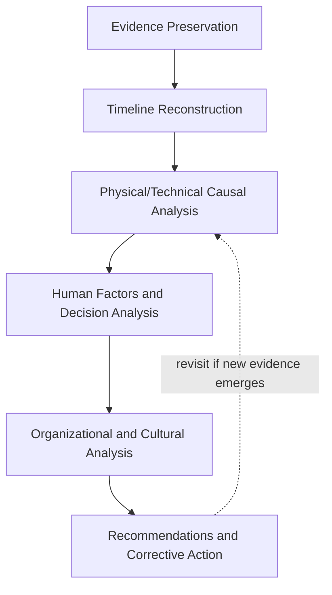
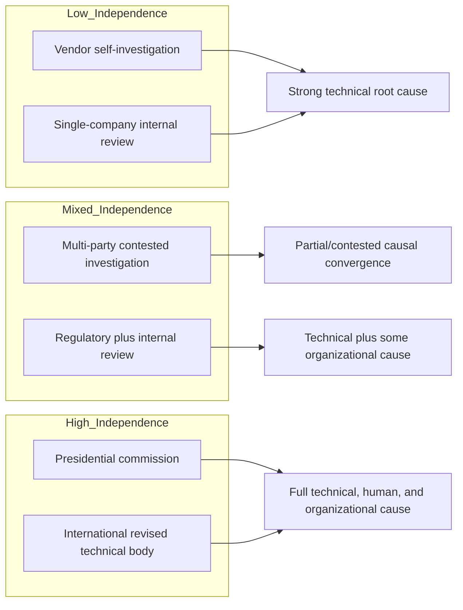

## Cross Case Comparison of Investigative Methodology

### Overview

This synthesis compares the investigative methodologies used across the historical RCA cases in this chapter—Space Shuttle Challenger, Chernobyl, Bhopal, Three Mile Island, major cloud/software outage postmortems, and notable product recalls—to extract transferable lessons about *how* root cause investigations should be structured, regardless of domain. Rather than examining what caused each incident, this section examines **how each investigation was conducted, what methodological choices shaped its conclusions, and where investigative approaches succeeded or fell short**. This meta-level comparison is itself a core RCA competency: the quality of a root cause analysis depends as much on investigative methodology as on the underlying facts.

### Investigative Bodies and Structures Compared

| Case | Investigating Body | Structure Type |
| --- | --- | --- |
| Challenger | Rogers Commission | Independent presidential commission, mixed expert/public composition |
| Chernobyl | INSAG (IAEA), Soviet State Commission | Multi-phase: initial state-controlled review, later independent international revision |
| Bhopal | Government of India inquiry, Union Carbide internal review, independent experts | Multiple parallel, partially conflicting investigations |
| Three Mile Island | Kemeny Commission, NRC | Independent presidential commission plus regulatory technical investigation |
| Cloud/software outages | Internal vendor engineering teams | Self-investigation, published as public postmortem/RCA documents |
| Product recalls | Internal QA/engineering, regulators (NHTSA, CPSC), sometimes DOJ | Mixed internal and regulatory/legal investigation |

**Key Points**

- Investigations range along a spectrum from fully **independent** (Rogers Commission, Kemeny Commission) to fully **self-investigated** (most cloud outage postmortems, initial CrowdStrike RCA) to **contested/multi-party** (Bhopal, where Union Carbide's and Indian government's conclusions diverged)
- Independence generally correlates with greater willingness to assign root cause to organizational/managerial failures rather than stopping at the technical/proximate layer—both the Rogers Commission and Kemeny Commission explicitly extended their scope into decision-making culture, while single-organization self-investigations (software postmortems) tend to concentrate on technical/process root causes within their own controllable scope
- Multi-party investigations (Bhopal) illustrate a persistent methodological challenge: when investigating and investigated parties have divergent incentives, causal conclusions on contested details (e.g., water-entry mechanism) may never fully converge

### Common Investigative Phases Across Cases

**Key Points**

- **Evidence preservation and reconstruction**: physical evidence collection (Challenger's SRB debris recovery and photographic/telemetry review; TMI's instrumentation logs; Chernobyl's on-site radiological survey once feasible; CrowdStrike/AWS's system logs and deployment records)
- **Timeline reconstruction**: establishing a precise sequence of events, often to the level of seconds (Challenger's frame-by-frame launch footage analysis; TMI's minute-by-minute control room log; cloud outages' second-by-second service health metrics)
- **Physical/technical causal analysis**: identifying the proximate mechanical, chemical, or software failure (O-ring resiliency testing, RBMK reactivity modeling, MIC reaction chemistry, PORV valve behavior, Content Interpreter parameter mismatch)
- **Human factors and decision-process analysis**: examining how personnel made decisions under the information available to them at the time (Rogers Commission's examination of the Thiokol teleconference; Kemeny Commission's control room interface analysis)
- **Organizational and cultural analysis**: the deepest and most methodologically challenging layer, examining incentive structures, communication pathways, and cultural norms (normalization of deviance in Challenger; Soviet institutional secrecy in Chernobyl; cost-cutting pressure in Bhopal)
- **Recommendation formulation and validation**: translating causal findings into specific, actionable, and ideally verifiable corrective measures

**Investigative Depth Progression Diagram**

### Methodological Strengths and Weaknesses by Case

**Rogers Commission (Challenger)**

- Strength: combined rigorous physical testing (including independent verification, exemplified by Feynman's ice-water demonstration) with formal organizational-culture investigation
- Weakness/limitation: relied significantly on retrospective testimony about internal NASA/Thiokol communications, which can be subject to memory and self-interest effects; later sociological analysis (Vaughan) argued the Commission's own framing still somewhat understated the depth of cultural normalization

**INSAG process (Chernobyl)**

- Strength: explicitly revised its own conclusions (INSAG-1 to INSAG-7) as more technical evidence became available, a methodologically valuable example of **investigative self-correction** rather than treating an initial report as final
- Weakness/limitation: the initial investigation operated under significant political and informational constraints of the Soviet system, illustrating how the political context surrounding an investigation can shape and limit its findings, independent of investigator competence

**Bhopal investigations**

- Weakness/limitation: this case is the clearest illustration in the chapter of an investigation that **did not converge to a single accepted causal narrative**—Union Carbide's internal investigation and Indian government/independent investigations reached different conclusions on the water-entry mechanism, and this divergence itself became a significant, unresolved feature of the case's legacy
- Methodological lesson: when investigator and investigated are not independent, findings on contested details should be presented with attributed uncertainty rather than false resolution

**Kemeny Commission (TMI)**

- Strength: notably reframed the investigation away from an initial "operator error" framing toward systemic human-factors and interface-design causes, demonstrating methodological discipline in not accepting the most immediately available explanation
- Strength: directly incorporated human factors engineering as a formal investigative discipline, ahead of its being standard practice in many other safety-critical industries at the time

**Vendor self-investigations (cloud/software outages)**

- Strength: typically fast (preliminary reports within days) and highly detailed at the technical/code level (e.g., CrowdStrike's parameter-mismatch identification down to the specific field count)
- Weakness/limitation: self-investigation creates an inherent scope-narrowing incentive—organizational and cultural root causes (e.g., "why was this deployed globally without staged rollout") are less consistently explored to the same depth as the immediate technical defect, and transparency varies widely by vendor (as seen in the sparse historical AWS public postmortem record compared to GCP's more frequent detailed publications)

**Recall investigations (Takata, Samsung, Ford Pinto)**

- Strength: often benefit from **regulatory subpoena power and legal discovery** (e.g., Takata, DOJ involvement), which can surface internal documents self-investigation might not disclose
- Weakness/limitation: regulatory/legal investigations can take years, during which the affected product may remain in use, illustrating a methodological tension between investigative thoroughness and time-sensitive public safety response

### Comparative Table: Investigative Independence vs. Causal Depth Reached

| Case | Investigator Independence | Reached Organizational/Cultural Root Cause? |
| --- | --- | --- |
| Challenger | High (presidential commission) | Yes — explicit focus |
| Chernobyl | Initially low, later high (INSAG-7) | Yes — significantly revised toward this over time |
| Bhopal | Mixed/contested | Partially — disputed and incomplete convergence |
| Three Mile Island | High (presidential commission) | Yes — explicit focus, pioneered human factors emphasis |
| Cloud/software outages | Low (self-investigation) | Partially — technical root cause strong; organizational depth varies by vendor |
| Product recalls | Mixed (self + regulatory) | Yes, when regulatory/legal discovery involved (e.g., Takata) |

**Key Points**

- A consistent pattern emerges: **investigative independence correlates with willingness and ability to reach organizational/cultural root causes**, while investigations lacking independence or investigative power (subpoena, discovery) tend to plateau at the technical/proximate layer
- This is not necessarily a criticism of self-investigation as a category — vendor postmortems provide valuable, fast, highly detailed technical analysis — but it is a methodological limitation that RCA practitioners should account for when evaluating how much weight to place on the deepest causal layers of a self-published report

### Transferable Methodological Principles

**Key Points**

- **Don't stop at the first plausible explanation.** Every case in this chapter that initially converged on operator/human error (TMI, and early Bhopal narratives) required continued investigation to surface deeper design or organizational causes
- **Preserve and separately examine each causal layer.** The clearest investigations (Rogers Commission, Kemeny Commission) explicitly distinguished proximate technical cause from human decision-making from organizational/cultural cause, rather than blending them into a single narrative
- **Revisit conclusions as new evidence emerges.** INSAG's multi-decade revision process for Chernobyl is the strongest example of methodological humility in this chapter
- **Account for investigator independence and incentive structure when weighing conclusions.** Bhopal's unresolved causal disputes and the narrower scope typical of vendor self-investigations both illustrate why the *source* of an RCA conclusion matters as much as its content
- **Use independent, first-principles verification where possible.** Feynman's ice-water O-ring test exemplifies the value of direct physical verification over reliance on institutional assurance alone
- **Formalize human factors and interface analysis as a standard investigative discipline**, not an afterthought — TMI's investigation was pivotal in establishing this as standard practice across safety-critical industries
- **Distinguish disputed facts from established facts explicitly in the final report**, rather than presenting a single resolved narrative when investigating and investigated parties disagree

### Methodology Comparison Diagram

### Why This Comparison Matters for RCA Practice

**Key Points**

- Demonstrates that **methodology shapes findings**: the same underlying event could plausibly yield a narrower or broader causal narrative depending on investigator independence, access to evidence, and willingness to revise
- Reinforces that a well-constructed RCA process should explicitly plan for **multiple causal layers** (technical, human/decision, organizational/cultural) from the outset, rather than treating deeper layers as optional extensions only pursued if the first explanation proves unsatisfying
- Highlights that **investigative self-correction is a strength, not a weakness** — treating an initial finding as provisional and revisable (as INSAG did) produces more durable conclusions than defending an initial narrative
- Encourages RCA practitioners to **assess and disclose the independence and scope limitations of any investigation**, including their own, so that conclusions are weighted appropriately by those who rely on them
- Provides a practical checklist for structuring future investigations: preserve evidence, reconstruct timeline, analyze technical cause, analyze human/decision factors, analyze organizational/cultural factors, formulate verifiable corrective action, and remain open to revision

### Related Topics

- Space Shuttle Challenger disaster investigation
- Chernobyl nuclear accident causal analysis
- Bhopal gas tragedy root cause findings
- Three Mile Island accident investigation
- Major public cloud and software outage postmortems
- Notable product recall root causes
- Blameless postmortem culture and psychological safety in investigations
- Root cause taxonomy: proximate, contributing, and systemic/root causes