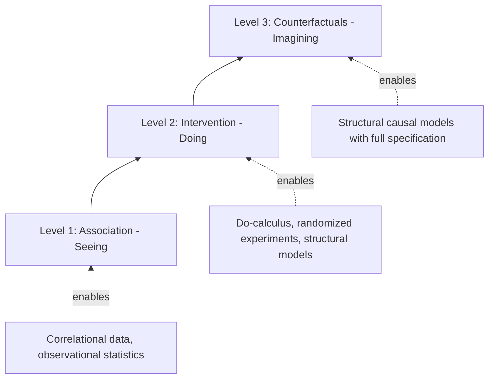
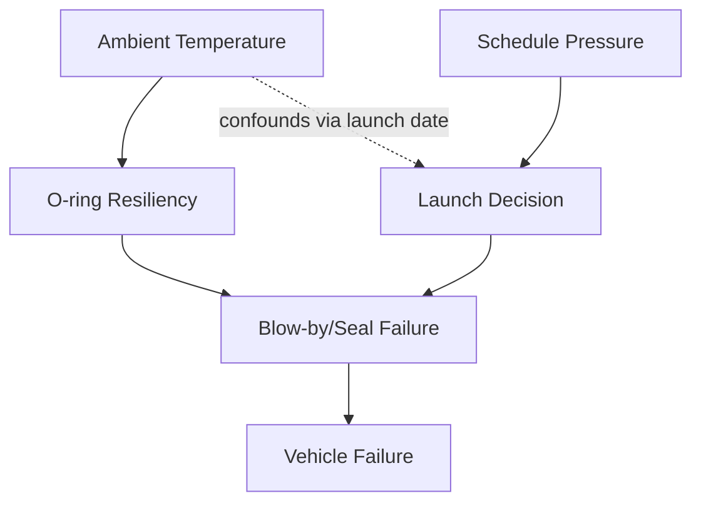

## Formal Causal Inference and Do Calculus Foundations

### Overview

Formal causal inference provides the mathematical foundation for distinguishing genuine causal relationships from mere statistical correlation—a distinction that sits at the theoretical core of root cause analysis, even though traditional RCA techniques (5 Whys, fishbone diagrams, fault trees) are applied informally. Judea Pearl's causal framework, built around **structural causal models (SCMs)**, **causal graphs (DAGs)**, and the **do-calculus**, gives RCA a rigorous language for expressing what "root cause" formally means, when a causal claim is identifiable from available data, and how to reason about interventions and counterfactuals. This topic connects the intuitive, narrative-driven case studies elsewhere in this curriculum to a precise mathematical framework that can, in principle, validate or formalize the causal chains those cases describe informally.

### Why Formal Causal Inference Matters for RCA

**Key Points**

- Traditional RCA methods (5 Whys, Ishikawa diagrams) are **heuristic and narrative-based**: they rely on domain expert judgment to assert that "A causes B," without a formal test for whether the data actually supports that claim over alternative explanations (confounding, reverse causation, selection bias)
- Formal causal inference provides tools to ask precise questions such as: *Given the data I have, can I even estimate this causal effect? What assumptions am I implicitly making? Would a different (but equally consistent) causal structure explain the same data?*
- This matters directly for RCA because many historical failures (this chapter's case studies) involved **contested causal claims**—for example, Bhopal's disputed water-entry mechanism, or industry debates over whether schedule pressure "caused" the Challenger launch decision. Formal causal inference gives a vocabulary for precisely stating what would need to be true, and what evidence would be required, to justify such a claim

### Structural Causal Models (SCMs)

**Key Points**

- An SCM formally represents a system as a set of variables and a set of structural equations describing how each variable is generated from its direct causes plus an independent noise/error term
- Formally, for variables $X_1, \dots, X_n$, each variable $X_i$ is generated by a function $X_i = f_i(\text{PA}_i, U_i)$, where $\text{PA}_i$ denotes the parents (direct causes) of $X_i$ in the causal graph, and $U_i$ is an exogenous noise term
- The SCM induces a **causal directed acyclic graph (DAG)**: nodes are variables, and a directed edge from $X_j$ to $X_i$ exists if $X_j \in \text{PA}_i$
- Critically, an SCM encodes more information than a purely statistical/probabilistic model of the same variables: two different SCMs can produce identical observational probability distributions while implying different causal consequences of intervention — this is precisely why correlation alone cannot determine causation, and why RCA requires either causal assumptions, experimental intervention, or specific identifiability conditions

### The Ladder of Causation

Pearl's "Ladder of Causation" organizes causal reasoning into three progressively more powerful levels, which map naturally onto the depth of analysis seen across this chapter's case studies.

| Level | Name | Typical Question | RCA Chapter Example |
| --- | --- | --- | --- |
| 1 | Association | What is correlated with what? | "O-ring erosion co-occurred with low launch temperatures across prior flights" |
| 2 | Intervention | What happens if we *do* X? | "If we had launched at 53°F or above, would the O-rings have sealed?" |
| 3 | Counterfactual | What would have happened, had X been different, given what actually occurred? | "Given this specific launch did fail, would it have succeeded had the joint been redesigned?" |

**Key Points**

- Level 1 (association) is what raw incident data and correlational analysis provide — it is necessary but never sufficient to establish root cause
- Level 2 (intervention) is what the do-calculus formally enables reasoning about, even without literally performing the intervention, given sufficient structural assumptions
- Level 3 (counterfactuals) is the level implicitly invoked whenever an RCA report states something like "if the operators had not throttled back the ECCS pumps, the TMI core would not have been damaged" — a claim about a specific, already-occurred event under a hypothetical alternate action

**Ladder of Causation Diagram**

### The Do-Operator and Do-Calculus

**Key Points**

- The **do-operator**, written $do(X = x)$, formally represents an *intervention*: forcibly setting variable $X$ to value $x$, which severs $X$ from its normal causes in the causal graph, as opposed to merely *observing* that $X = x$ occurred naturally
- This distinction is foundational: $P(Y \mid X = x)$ (observing $X=x$) and $P(Y \mid do(X = x))$ (intervening to set $X=x$) are generally **not equal** when confounding is present, because observing $X=x$ carries information about whatever else caused $X$ to take that value, while intervening removes that dependency
- The **do-calculus** is a set of three formal inference rules (established by Pearl) that allow an analyst, given a causal DAG, to determine whether and how an interventional quantity $P(Y \mid do(X))$ can be re-expressed purely in terms of observational (non-interventional) probabilities — this property is called **identifiability**
- The three rules of do-calculus govern:
  1. **Insertion/deletion of observations**: when a conditioning variable can be added or removed without changing the expression, based on graphical independence conditions
  2. **Action/observation exchange**: when an intervention $do(Z=z)$ can be replaced by simple conditioning on $Z=z$, and vice versa, under certain graphical conditions
  3. **Insertion/deletion of actions**: when a $do(Z=z)$ term can be removed entirely because $Z$ has no causal effect on the outcome given the rest of the model
- If a query is not identifiable using do-calculus given a graph, this is itself a meaningful and rigorous conclusion: it formally demonstrates that **no amount of purely observational data, however large, can resolve that particular causal question** without either additional assumptions or an actual experimental intervention

### Confounding and Backdoor Paths

**Key Points**

- A **confounder** is a variable that causally influences both a purported cause and its purported effect, creating a spurious association that can be mistaken for direct causation if not properly accounted for
- A **backdoor path** is any path in the causal DAG between treatment $X$ and outcome $Y$ that begins with an arrow pointing into $X$ — such paths, if left "open," create confounding bias
- The **backdoor criterion** provides a graphical test: a set of variables $Z$ satisfies the backdoor criterion relative to $(X, Y)$ if $Z$ blocks every backdoor path between $X$ and $Y$, and $Z$ contains no descendants of $X$; if satisfied, the causal effect is identifiable via the **backdoor adjustment formula**:

$$P(Y \mid do(X=x)) = \sum_{z} P(Y \mid X=x, Z=z) \, P(Z=z)$$

- Applied to RCA: this formalizes the common practitioner instinct to "control for" plausible confounding variables before concluding a causal relationship — the backdoor criterion gives a precise, graph-based justification for *which* variables need to be controlled for and confirms whether controlling for them is actually sufficient

### Simplified Causal DAG Example (Illustrative RCA Application)

The following illustrates, in simplified form, how a causal DAG might formalize part of the Challenger causal narrative discussed elsewhere in this chapter — as a **methodological illustration only**, not a formally validated causal model of the actual event.

**Key Points**

- In this simplified illustration, *Temperature* affects *O-ring Resiliency* directly (a physical causal path), while *Schedule Pressure* affects the *Launch Decision* (an organizational causal path) which in turn gates whether the failure mode can occur at all
- Formal causal inference would ask: is the effect of *Launch Decision* on *Vehicle Failure* identifiable from historical flight data alone, given the graph structure and any confounding paths (such as temperature independently influencing both launch scheduling patterns and O-ring performance)?
- This illustrates why purely statistical analysis of "prior successful launches at similar temperatures" is causally weaker than a structural analysis that accounts for the full graph, echoing the actual historical critique that pre-Challenger risk assessments improperly used "no failure yet" as evidence of safety rather than modeling the underlying physical relationship

### Counterfactual Reasoning in Practice

**Key Points**

- A **counterfactual query** takes the form: "Given that we observed $X=x$ and $Y=y$ actually occurred, what would $Y$ have been if $X$ had instead been $x'$?"
- Formal counterfactual computation (via the SCM's "abduction-action-prediction" procedure) requires: (1) updating the exogenous noise terms to be consistent with what was actually observed, (2) applying the hypothetical intervention $do(X=x')$, and (3) predicting the resulting value of $Y$ under the updated model
- This is a strictly stronger requirement than interventional reasoning (Level 2), since it requires the *fully specified* structural equations, not merely the graph structure — in most real-world RCA contexts, full counterfactual precision is unattainable, and practitioners instead reason informally about counterfactuals ("if X had been different, Y probably would not have happened") without rigorous structural justification
- This gap between what informal RCA narratives implicitly claim (Level 3 counterfactual statements) and what the available evidence can formally support (often only Level 1 association) is a key methodological caution: RCA reports should be explicit about which rung of the ladder their conclusions actually rest on

### Relationship to Traditional RCA Techniques

| Traditional RCA Technique | Formal Causal Inference Correspondence |
| --- | --- |
| 5 Whys | Informal traversal of a causal chain; does not formally test identifiability or rule out confounding at each step |
| Fishbone/Ishikawa diagram | Structurally resembles a causal DAG with multiple parent categories feeding a single effect node, but without formal edge semantics or identifiability analysis |
| Fault Tree Analysis | Closer to a formal Boolean/probabilistic causal structure, but typically models logical AND/OR combination of failure events rather than full interventional/counterfactual semantics |
| Bayesian root cause diagnosis | Directly related — Bayesian networks are the probabilistic backbone underlying SCMs, though a Bayesian network alone (without causal/interventional semantics) supports only Level 1 association-based inference |

**Key Points**

- Formal causal inference does not replace these traditional techniques but provides a rigorous framework that can, in well-instrumented domains (e.g., software systems with extensive telemetry, controlled manufacturing environments), validate or challenge conclusions reached informally
- In domains with rich observational or experimental data — such as modern cloud/software systems, where deployment changes can sometimes be treated as quasi-experimental interventions — do-calculus and identifiability analysis offer a genuinely actionable upgrade over purely narrative RCA
- In domains with singular, non-repeatable events (a single reactor accident, a single shuttle disaster), formal identifiability is often unattainable in the strict statistical sense, since these methods generally require either repeated observations or explicit prior structural knowledge; in such cases, causal DAGs are still valuable as an **explicit assumption-documentation tool**, even without full statistical identifiability

### Behavioral and Practical Caveats

**Key Points**

- Do-calculus identifiability results are only as valid as the assumed causal graph — an incorrect or incomplete DAG (e.g., an unmodeled confounder) can produce a confidently "identified" but incorrect causal estimate [Inference: sensitivity of conclusions to graph misspecification is a well-established property of the framework, though the practical severity in any specific application depends on domain-specific unmodeled factors, which is inherently difficult to bound with certainty]
- Applying these methods in real organizational RCA contexts requires substantial statistical and causal modeling expertise; misapplication (e.g., naively controlling for a collider variable, which can *induce* rather than remove bias) can produce misleading conclusions that appear rigorous
- Behavior of specific causal discovery algorithms (methods that attempt to learn the DAG structure itself from data) can vary significantly depending on data volume, noise characteristics, and violation of underlying assumptions such as faithfulness or causal sufficiency; results should be treated as hypotheses for further investigation rather than confirmed causal conclusions

### Next Steps

- Structural Causal Models (SCMs) and the abduction-action-prediction counterfactual algorithm in depth
- Causal discovery algorithms (PC algorithm, FCI, score-based methods) for learning DAG structure from data
- Bayesian networks and probabilistic graphical models as a foundation for causal reasoning
- Instrumental variables and natural experiments as identification strategies outside do-calculus
- Applying causal inference to software/cloud incident data (quasi-experimental deployment analysis)
- Fault Tree Analysis and formal Boolean causal modeling in reliability engineering
- Collider bias and selection bias in observational RCA data