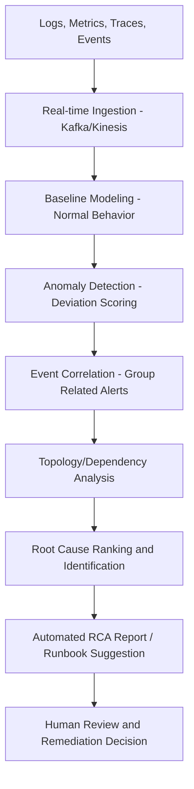

## Machine Learning Assisted Anomaly and Root Cause Detection


### Overview

Machine learning assisted anomaly and root cause detection—commonly operationalized under the umbrella term **AIOps** (Artificial Intelligence for IT Operations)—applies statistical and machine learning techniques to observability data (logs, metrics, traces, events) to automatically detect anomalies, correlate related signals, and surface probable root causes at a speed and scale beyond manual investigation. This represents a significant evolution from the manual, narrative-driven RCA techniques (5 Whys, fishbone diagrams) covered elsewhere in this curriculum, applying quantitative pattern recognition to complex, high-volume, distributed systems where human investigators would otherwise be overwhelmed by data volume and alert noise.

### Why ML-Assisted RCA Emerged

**Key Points**

- Modern distributed systems generate telemetry volumes far exceeding human analytical capacity: thousands of metrics, millions of log entries, and hundreds of alerts per day are typical for large cloud infrastructure
- Traditional static-threshold alerting produces excessive noise; intelligent event correlation can filter the majority of redundant alerts, reducing operator workload from thousands of raw alerts to a much smaller number of genuinely distinct incidents
- Automated root cause analysis has been reported to meaningfully accelerate problem resolution compared to manual analysis, with organizations reporting reductions in mean time to resolution (MTTR) through AIOps adoption [Unverified: specific percentage figures for MTTR reduction and alert-filtering rates vary by vendor and reporting methodology and should be treated as vendor-reported benchmarks rather than universally validated figures]
- Analyst firms have projected substantial continued enterprise adoption of AIOps platforms, with increasing incorporation of agentic AI capabilities capable of autonomously resolving common incidents [Unverified: forward-looking adoption percentages are analyst projections, not observed outcomes, and actual adoption trajectories may differ]

### Core Pipeline Stages

**Key Points**

- **Data ingestion and aggregation**: real-time event streaming platforms (e.g., Apache Kafka, AWS Kinesis) aggregate logs, metrics, and traces across distributed systems into a unified observability data layer
- **Anomaly detection**: ML models establish a baseline of normal system behavior and flag deviations, replacing static thresholds with adaptive, learned baselines that account for seasonal and cyclical patterns
- **Event correlation**: related alerts across services are grouped into a single incident rather than presented as many independent alerts, reducing duplicate signal and noise
- **Root cause identification**: correlated signals across the observability stack (logs, metrics, traces, topology/service dependency maps) are analyzed to identify the most probable originating cause
- **Automated reporting and remediation guidance**: modern platforms increasingly draft natural-language root cause analysis reports with contributing factors and remediation steps, and some generate runbooks or automation scripts based on historical incident resolution data

**Pipeline Diagram**



### Anomaly Detection Techniques

**Key Points**

- **Supervised learning**: models trained on historical, labeled incident data to recognize known failure signatures; effective for recurring, previously-seen failure modes but limited for novel failure types
- **Unsupervised learning**: models establish normal behavior baselines without labeled failure examples, flagging statistically significant deviations; well suited to detecting previously unseen anomaly types but more prone to false positives without careful tuning
- **Hidden Markov Models (HMMs) and Gaussian Mixture Models (GMMs)**: used to detect temporal patterns and state transitions in sequential log or metric data
- **Transformer-based anomaly detection models**: deep learning architectures adapted from NLP to model long-range dependencies and complex temporal patterns in log sequences, generally improving detection accuracy over simpler statistical baselines for complex, high-dimensional telemetry
- **Natural Language Processing (NLP) for log analysis**: used to extract structured meaning from unstructured log text, enabling pattern matching and semantic clustering of log messages across large-scale, heterogeneous log formats

### Root Cause Ranking Approaches

**Key Points**

- **Topology/dependency-based correlation**: uses a known or inferred service dependency graph to trace an anomaly backward through the chain of services it depends on, narrowing the search space to the most likely originating component
- **Deterministic fault-tree-based approaches**: some platforms apply deterministic, reproducible fault-tree reasoning (a formalized, Boolean-logic-based methodology historically used in aerospace and safety-critical engineering, including by NASA and the FAA) to produce root cause conclusions that are reproducible and traceable down to a specific code-level change, in contrast to purely statistical/probabilistic correlation approaches
- **Statistical correlation across signals**: identifying which metrics or log patterns changed in a statistically significant way immediately prior to or concurrent with the observed failure, then ranking candidate causes by correlation strength and temporal proximity
- **Causal graph-informed correlation**: increasingly, platforms incorporate formal causal reasoning concepts (see the related topic on causal inference and do-calculus) to move beyond pure correlation toward structurally justified causal candidate ranking, though full formal identifiability is rarely achieved in production observability contexts given the complexity and non-repeatability of many real-world incidents

### Representative Platform Landscape

**Key Points**

- Commercial observability platforms (Datadog, Dynatrace, Elastic Observability, New Relic, PagerDuty, Moogsoft) have incorporated ML-based anomaly detection and automated RCA as core features, with some offering context-aware generative AI assistants that interpret log messages, suggest runbooks, and support interactive incident investigation
- Specialized AIOps-focused vendors (e.g., BigPanda, Last9) emphasize alert correlation and noise reduction as their primary differentiator, alongside root cause surfacing
- Open-source options include ML-based anomaly detection plugins for existing observability stacks (e.g., Grafana), and distributed-tracing-integrated root cause analysis tools (e.g., Apache SkyWalking) that combine trace-level detail with ML-based causal correlation
- Newer open-source AIOps platforms have emerged with bi-directional integrations across incident and alerting providers, focused on automatic alert correlation

  [Unverified: this vendor landscape reflects publicly available marketing and product documentation as of recent search results; specific feature sets, accuracy claims, and competitive positioning should be independently verified against current vendor documentation before being relied upon for a purchasing or architecture decision, as this space evolves rapidly]

### Example: Simplified Anomaly Scoring Logic

The following illustrates, in simplified pseudocode form, a common pattern for adaptive-threshold anomaly scoring based on a rolling statistical baseline:

```python
def anomaly_score(current_value, historical_window):
    mean = historical_window.mean()
    std_dev = historical_window.std()
    # Standard z-score based deviation measure
    z_score = (current_value - mean) / std_dev if std_dev > 0 else 0
    return abs(z_score)

def is_anomalous(current_value, historical_window, threshold=3.0):
    return anomaly_score(current_value, historical_window) > threshold
```

**Key Points**

- This example uses a simple z-score approach; production systems typically use more sophisticated adaptive models that account for seasonality, trend, and multivariate correlation across many simultaneous signals rather than a single-variable rolling baseline
- The choice of threshold (e.g., $3.0$ standard deviations) directly trades off false positive rate against detection sensitivity, and is frequently tuned per-metric rather than applied uniformly

### Strengths and Limitations

**Key Points**

- **Strength**: ML-assisted detection scales to data volumes and correlation complexity far beyond manual human analysis, and can surface subtle, multivariate patterns that static thresholds or manual review would miss
- **Strength**: automated correlation significantly reduces alert fatigue, allowing human responders to focus attention on genuinely distinct incidents
- **Limitation**: AIOps does not replace solid underlying monitoring instrumentation, clear runbooks, or competent site reliability engineering practice; it accelerates diagnosis but does not compensate for missing observability fundamentals or poor system design
- **Limitation**: most production anomaly/RCA correlation techniques remain fundamentally statistical/correlational rather than formally causal (see the related do-calculus topic), meaning that surfaced "root causes" are frequently strong correlates or topologically plausible candidates rather than rigorously validated causal mechanisms; human review remains important before treating an ML-surfaced root cause as final
- **Limitation**: model performance depends heavily on data quality and completeness; early AIOps implementations that operated on incomplete or sampled telemetry data have historically underperformed compared to those working from full-fidelity observability data
- Behavior of any specific ML-based anomaly detection or RCA system may vary significantly based on the training data distribution, the specific architecture, and the operational environment it is deployed in; conclusions about accuracy or effectiveness should be validated against the specific tool and context in use rather than assumed from general industry claims

### Relationship to Traditional and Formal RCA Approaches

| Approach | Strength | Best Fit |
| --- | --- | --- |
| Manual 5 Whys / fishbone | Deep domain reasoning, flexible, no data requirements | Novel, rare, or highly organizational-context incidents |
| Statistical ML anomaly/correlation | Scales to high-volume distributed telemetry | Recurring or pattern-based operational incidents |
| Deterministic fault-tree AI | Reproducible, code-level traceability | Environments requiring auditable, explainable root cause conclusions |
| Formal causal inference (do-calculus) | Rigorous identifiability and confounding control | Well-instrumented systems with quasi-experimental data availability |

**Key Points**

- These approaches are complementary rather than mutually exclusive: mature incident response processes typically use ML-assisted detection and correlation to rapidly narrow the search space, then apply human-led structured RCA techniques (5 Whys, blameless postmortem review) to validate and contextualize the ML-surfaced candidate causes before finalizing conclusions and corrective actions

### Related Topics

- Formal causal inference and do calculus foundations
- Major public cloud and software outage postmortems
- Site Reliability Engineering (SRE) and blameless postmortem culture
- Observability fundamentals: logs, metrics, traces, and distributed tracing
- Fault Tree Analysis and deterministic reliability engineering methods
- Alert correlation and noise reduction architecture patterns
- Time-series forecasting for predictive incident prevention