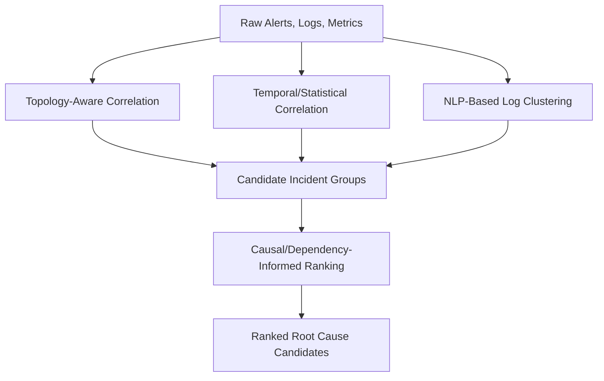
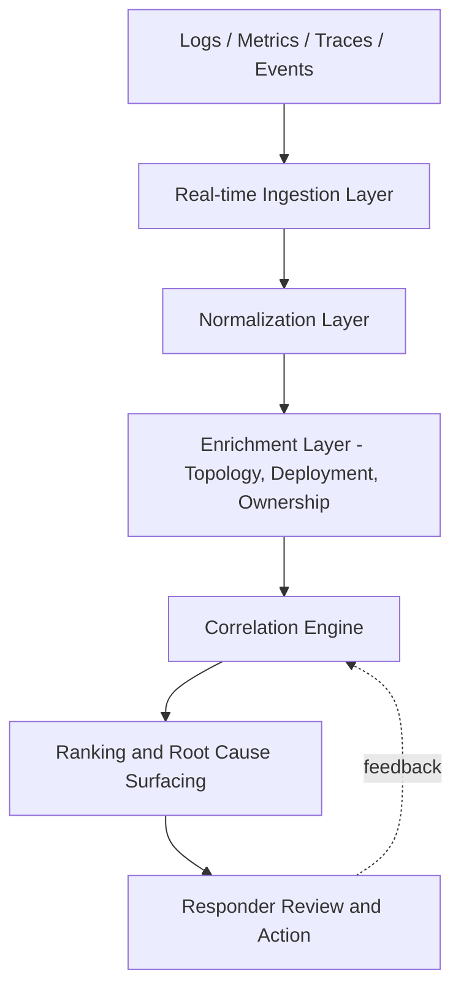

## Automated Log Correlation and AIOps Approaches


### Overview

Automated log correlation is the specific AIOps discipline of linking related log entries, alerts, and events—generated across distributed, multi-service systems—into coherent incident narratives without manual triage. While the related topic on ML-assisted anomaly and root cause detection covers the broader AIOps pipeline, this topic focuses specifically on **correlation techniques**: the algorithms, architectures, and design patterns used to determine that a burst of seemingly unrelated log lines, metric spikes, and alerts across dozens or hundreds of services actually represent a single underlying incident, and to identify which signal most likely represents the originating cause versus a downstream symptom.

### The Core Problem: Alert and Log Fragmentation

**Key Points**

- In modern microservice and distributed architectures, a single root-cause failure typically produces a **cascade of downstream symptoms**: a database connectivity issue in one service can trigger timeout alerts, retry-storm logs, circuit-breaker trips, and elevated error rates across dozens of dependent services simultaneously
- Without correlation, on-call engineers face what is often described as an alert storm: potentially thousands of individual alerts for what is, structurally, a single incident
- Effective correlation can filter the large majority of this redundant signal, allowing teams to handle a much smaller number of distinct, correlated incidents rather than triaging each alert independently
- The central technical challenge is distinguishing **causally related signals** (genuinely stemming from the same root event) from **coincidentally concurrent signals** (unrelated issues that happen to occur in the same time window)

### Correlation Technique Categories

**Rule-Based / Topology-Aware Correlation**

**Key Points**

- Uses an explicit or discovered **service dependency graph** (topology map) to group alerts that occur along a known dependency chain
- When Service A depends on Service B, and both fire alerts within a defined time window, topology-aware correlation groups them as a single incident with Service B (the upstream dependency) treated as the more likely root
- Requires accurate, up-to-date topology data, which can be manually maintained, automatically discovered via distributed tracing, or inferred from network/service-mesh telemetry
- Strength: highly interpretable and explainable, since the grouping logic follows a known architectural structure
- Limitation: topology maps can become stale in fast-changing environments, and hidden or undocumented dependencies (a recurring theme across major cloud outage postmortems) can cause the topology model to miss real causal links

**Temporal/Statistical Correlation**

**Key Points**

- Groups events based on statistical co-occurrence within defined time windows, without requiring an explicit topology model
- Techniques include sliding-window event clustering, cross-correlation of time-series metrics, and change-point detection to identify when multiple signals shifted behavior simultaneously
- Strength: does not depend on maintaining an accurate topology map; can surface correlations even across undocumented or unexpected dependencies
- Limitation: purely statistical co-occurrence can produce false correlations (coincidental timing) without a structural or causal justification; more prone to spurious grouping than topology-aware methods

**NLP-Based Log Clustering**

**Key Points**

- Applies natural language processing techniques to unstructured log text to extract **log templates** (the static structural pattern of a log line, with variable fields like timestamps, IDs, and values abstracted out)
- Clusters log entries by semantic similarity, allowing correlation of conceptually related error messages even when their exact text differs
- Supports downstream tasks like anomaly detection on log *pattern frequency* (e.g., detecting that a normally rare log template has suddenly become frequent) rather than requiring exact string matching
- Increasingly implemented using transformer-based language models, which better capture semantic relationships between log messages than earlier regex- or edit-distance-based clustering approaches

**Causal Graph / Dependency-Informed Correlation**

**Key Points**

- Extends topology-aware correlation by incorporating formal or semi-formal causal reasoning (see the related topic on formal causal inference) to rank candidate root causes, not just group related alerts
- Some platforms apply deterministic, fault-tree-style reasoning to produce reproducible, auditable root-cause conclusions traceable to a specific service or code-level change, as opposed to a purely probabilistic best-guess ranking
- Represents the most mature end of the correlation spectrum, moving from "these alerts are related" toward "this specific upstream event most likely caused the others"

**Correlation Technique Comparison Diagram**



### AIOps Reference Architecture

**Key Points**

- **Ingestion layer**: real-time streaming platforms (e.g., Apache Kafka, AWS Kinesis) aggregate logs, metrics, traces, and events from across distributed infrastructure into a common pipeline
- **Normalization layer**: heterogeneous log formats and metric schemas from different services are parsed and normalized into a consistent structure to enable cross-service correlation
- **Enrichment layer**: raw events are enriched with topology/service metadata, deployment history, and ownership information, providing context needed for accurate correlation
- **Correlation engine**: applies one or more of the techniques above (topology, temporal, NLP-based, causal) to group related signals into candidate incidents
- **Ranking and root cause surfacing**: candidate incidents are ranked by confidence, and the most likely originating signal is surfaced to responders, often alongside a natural-language summary
- **Feedback loop**: responder actions (confirming, dismissing, or correcting a suggested root cause) feed back into the model to improve future correlation accuracy

**Reference Architecture Diagram**



### Illustrative Correlation Logic (Simplified)

The following illustrates a simplified pattern for grouping alerts using a time-window and topology-aware approach:

```python
def correlate_alerts(alerts, topology_graph, time_window_seconds=300):
    incidents = []
    sorted_alerts = sorted(alerts, key=lambda a: a.timestamp)

    for alert in sorted_alerts:
        matched_incident = None
        for incident in incidents:
            time_diff = abs(alert.timestamp - incident.last_alert_time)
            is_related = topology_graph.are_connected(
                alert.service, incident.services
            )
            if time_diff <= time_window_seconds and is_related:
                matched_incident = incident
                break

        if matched_incident:
            matched_incident.add_alert(alert)
        else:
            incidents.append(Incident(alert))

    return incidents
```

**Key Points**

- This example combines a simple temporal window with a topology-adjacency check; production correlation engines typically layer multiple signal types (statistical, semantic, topological) with confidence-weighted scoring rather than binary matching logic
- The `time_window_seconds` parameter directly trades off correlation completeness (larger windows catch more genuinely related but delayed signals) against false-positive grouping risk (larger windows also increase the chance of grouping unrelated, coincidentally timed events)

### Representative Approaches Across the Industry

**Key Points**

- Alert-correlation-focused platforms emphasize reducing raw alert volume into a much smaller number of distinct, actionable incidents through intelligent event correlation
- Some observability vendors have introduced intelligent correlation engines that automatically group related alerts into unified cases, combined with generative AI assistants for interactive log interpretation and runbook execution
- Deterministic, fault-tree-based correlation approaches—modeled on methodologies used in aerospace and safety-critical engineering—aim to provide reproducible, code-level-granular root cause conclusions rather than purely probabilistic correlation
- Distributed-tracing-integrated platforms combine trace-level causal chains (which naturally encode call/dependency relationships) with ML-based correlation to identify root causes within request-level execution paths
- Open-source and emerging platforms increasingly focus on bi-directional integrations across multiple alerting and incident-management providers, enabling correlation across an organization's full toolchain rather than a single vendor's data silo

  [Unverified: this reflects publicly available product positioning as of recent sources; specific accuracy claims, feature availability, and competitive comparisons should be verified against current vendor documentation, as this space changes rapidly and vendor capabilities are frequently updated]

### Design Considerations and Trade-offs

| Design Choice | Trade-off |
| --- | --- |
| Wide time-correlation window | Higher recall for delayed/cascading effects, but more false-positive groupings |
| Topology-dependent correlation | High interpretability, but blind to undocumented/hidden dependencies |
| Purely statistical correlation | Captures unexpected dependencies, but weaker causal justification |
| Fully automated remediation | Faster resolution, but higher risk if root cause ranking is incorrect |
| Human-in-the-loop confirmation | Lower risk of incorrect auto-remediation, but slower response time |

**Key Points**

- Most mature AIOps deployments favor human-in-the-loop designs for actual remediation actions, using automated correlation and root cause surfacing to accelerate investigation while reserving final remediation decisions for human responders, particularly for high-impact production systems
- The specific behavior, accuracy, and false-positive rate of any given correlation engine will vary meaningfully based on the quality and completeness of topology data, the volume and cleanliness of underlying telemetry, and the specific tuning of temporal/statistical thresholds in that environment—claims of general accuracy from any single deployment should not be assumed to transfer directly to a different environment without validation

### Limitations and Failure Modes

**Key Points**

- **Hidden dependency blind spots**: correlation engines relying on topology maps can miss genuinely causal relationships through undocumented dependencies—directly mirroring the hidden-dependency root causes identified in real-world cloud outage postmortems (e.g., internal services silently depending on a shared component)
- **Correlation-causation conflation**: statistical/temporal correlation techniques can produce confident-looking but spurious groupings when unrelated issues coincide in time; ranked root cause suggestions should be treated as hypotheses for human validation rather than confirmed conclusions
- **Alert fatigue from over-correlation**: overly aggressive grouping can obscure genuinely distinct concurrent incidents by merging them into a single (incorrect) incident narrative, delaying recognition that multiple separate problems are occurring
- **Feedback loop quality dependency**: correlation and ranking models that learn from responder feedback are only as good as the quality and consistency of that feedback; inconsistent labeling by different responders can degrade model performance over time

### Why This Matters for RCA Practice

**Key Points**

- Automated log correlation operationalizes, at machine scale, the same fundamental RCA principle seen throughout this curriculum: **distinguishing proximate/downstream symptoms from the originating cause**—the same distinction central to the Challenger, Chernobyl, and cloud outage case studies, now applied to real-time distributed telemetry rather than post-incident historical reconstruction
- Reinforces the recurring lesson from the cross-case methodology comparison: automated correlation accelerates and scales investigation, but does not replace the deeper human-led analysis needed to validate causal claims and extract organizational/systemic lessons
- Highlights that **topology and dependency mapping quality is itself a safety-critical investment**, since gaps in this mapping directly limit the accuracy of automated root cause correlation, paralleling how hidden service dependencies have repeatedly been identified as root causes in real cloud outage postmortems

### Related Topics

- Machine learning assisted anomaly and root cause detection
- Major public cloud and software outage postmortems
- Formal causal inference and do calculus foundations
- Distributed tracing and service dependency mapping
- Site Reliability Engineering (SRE) incident response practices
- Alert fatigue and on-call engineering workload management
- Blameless postmortem culture and feedback loop design