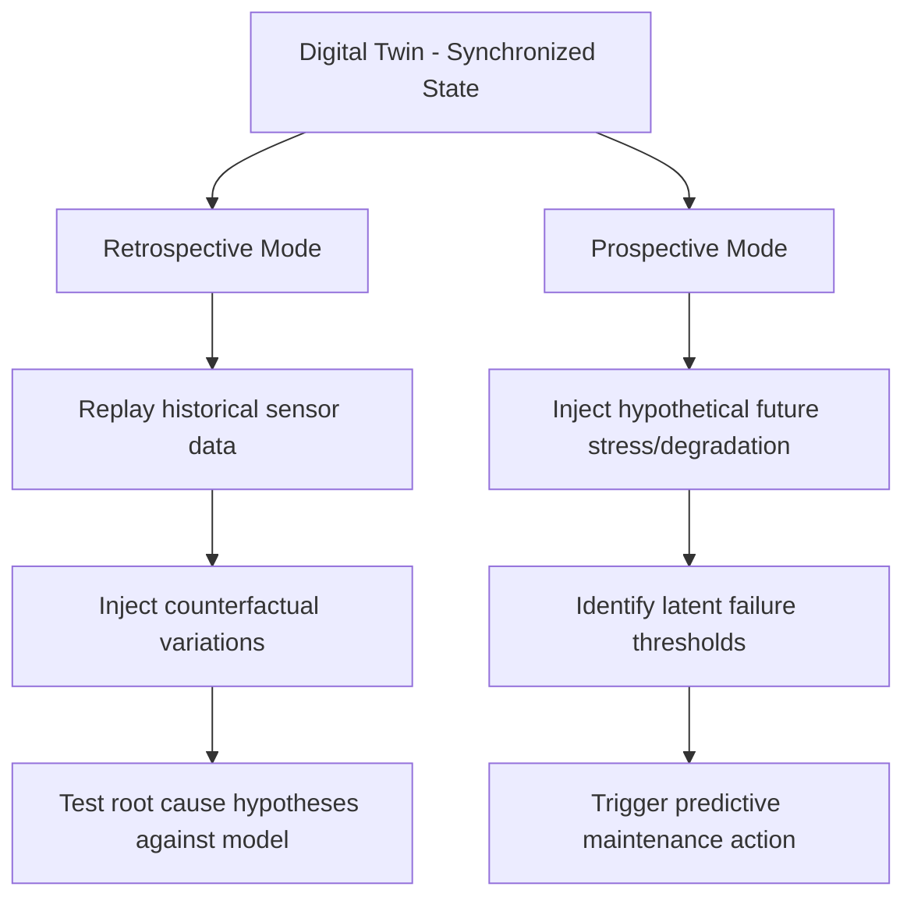

## Digital Twins for Failure Simulation

### Overview

A digital twin is a virtual, continuously updated representation of a physical asset, process, or system, synchronized with its real-world counterpart through sensor data and models. In the context of root cause analysis, digital twins extend beyond passive monitoring into **failure simulation**: using the virtual model to reproduce, stress-test, and explore failure scenarios computationally, either to investigate the root cause of an incident that already occurred or to proactively identify latent failure modes before they manifest in the physical system. This represents a shift from reactive, post-incident RCA (as in the historical case studies in this curriculum) toward a proactive, simulation-driven RCA capability.

### Core Concept and Distinction from Simulation Alone

**Key Points**

- A digital twin differs from a conventional simulation model in that it maintains **live, bidirectional synchronization** with the physical asset via real-time sensor telemetry, rather than being a static or offline-only model
- This live linkage allows the twin's state to reflect the *actual current condition* of the physical system (including degradation, wear, or configuration drift) rather than only an idealized design-time model
- Failure simulation leverages this synchronized state as the starting point for "what-if" scenario exploration: given the system's actual current condition, what happens if a specific component degrades further, a specific load is applied, or a specific environmental condition changes?
- This distinguishes digital-twin-based failure simulation from purely theoretical simulation (which models an idealized or generic system) and from purely historical RCA (which reconstructs what happened in retrospect using recorded data alone)

### Architecture of a Failure-Simulation-Capable Digital Twin

**Key Points**

- **Physical asset layer**: the real-world system instrumented with sensors capturing relevant physical, operational, or environmental parameters
- **Data ingestion and synchronization layer**: real-time telemetry pipelines (often built on the same streaming infrastructure used in AIOps architectures, e.g., Kafka-style event streaming) feed sensor data into the twin's state model
- **Model layer**: a computational representation of the system's physical, chemical, mechanical, or logical behavior—ranging from physics-based first-principles models (finite element analysis, thermodynamic models) to data-driven/ML-based surrogate models trained on historical operational data, or hybrid combinations of both
- **Simulation/scenario engine**: the component that executes "what-if" scenarios against the model, applying hypothetical interventions (component degradation, load changes, environmental shifts) and computing predicted outcomes
- **Validation/calibration loop**: ongoing comparison between the twin's predictions and actual observed physical system behavior, used to recalibrate model parameters and maintain fidelity over time
- **Visualization and analysis interface**: tools allowing engineers to inspect simulated failure propagation, compare scenarios, and extract root cause hypotheses

**Digital Twin Failure Simulation Architecture (svg_diagram)**

<svg xmlns="http://www.w3.org/2000/svg" viewBox="0 0 800 480">
<rect x="0" y="0" width="800" height="480" fill="#0f172a" />
<text x="400" y="30" font-size="18" fill="#e2e8f0" text-anchor="middle" font-family="sans-serif" font-weight="bold">Digital Twin Failure Simulation Architecture (svg_diagram)</text>
<rect x="30" y="60" width="180" height="80" rx="8" fill="#1e40af" stroke="#93c5fd" stroke-width="2" />
<text x="120" y="95" font-size="13" fill="#ffffff" text-anchor="middle" font-family="sans-serif">Physical Asset</text>
<text x="120" y="115" font-size="11" fill="#cbd5e1" text-anchor="middle" font-family="sans-serif">Sensors / Instrumentation</text>
<rect x="30" y="180" width="180" height="80" rx="8" fill="#0e7490" stroke="#67e8f9" stroke-width="2" />
<text x="120" y="215" font-size="13" fill="#ffffff" text-anchor="middle" font-family="sans-serif">Ingestion Layer</text>
<text x="120" y="235" font-size="11" fill="#cbd5e1" text-anchor="middle" font-family="sans-serif">Real-time Telemetry Stream</text>
<rect x="310" y="180" width="180" height="80" rx="8" fill="#166534" stroke="#86efac" stroke-width="2" />
<text x="400" y="215" font-size="13" fill="#ffffff" text-anchor="middle" font-family="sans-serif">Model Layer</text>
<text x="400" y="235" font-size="11" fill="#cbd5e1" text-anchor="middle" font-family="sans-serif">Physics-based / ML Surrogate</text>
<rect x="310" y="60" width="180" height="80" rx="8" fill="#7c2d12" stroke="#fdba74" stroke-width="2" />
<text x="400" y="95" font-size="13" fill="#ffffff" text-anchor="middle" font-family="sans-serif">Validation Loop</text>
<text x="400" y="115" font-size="11" fill="#cbd5e1" text-anchor="middle" font-family="sans-serif">Calibrate vs Real Behavior</text>
<rect x="590" y="180" width="180" height="80" rx="8" fill="#6b21a8" stroke="#d8b4fe" stroke-width="2" />
<text x="680" y="215" font-size="13" fill="#ffffff" text-anchor="middle" font-family="sans-serif">Scenario Engine</text>
<text x="680" y="235" font-size="11" fill="#cbd5e1" text-anchor="middle" font-family="sans-serif">What-if Failure Injection</text>
<rect x="310" y="320" width="180" height="80" rx="8" fill="#854d0e" stroke="#fde68a" stroke-width="2" />
<text x="400" y="355" font-size="13" fill="#ffffff" text-anchor="middle" font-family="sans-serif">Analysis Interface</text>
<text x="400" y="375" font-size="11" fill="#cbd5e1" text-anchor="middle" font-family="sans-serif">Root Cause Hypotheses</text>
<line x1="120" y1="140" x2="120" y2="180" stroke="#94a3b8" stroke-width="2" marker-end="url(#arrow)" />
<line x1="210" y1="220" x2="310" y2="220" stroke="#94a3b8" stroke-width="2" marker-end="url(#arrow)" />
<line x1="400" y1="180" x2="400" y2="140" stroke="#94a3b8" stroke-width="2" marker-end="url(#arrow)" />
<line x1="400" y1="100" x2="120" y2="100" stroke="#94a3b8" stroke-width="2" stroke-dasharray="4" marker-end="url(#arrow)" />
<line x1="490" y1="220" x2="590" y2="220" stroke="#94a3b8" stroke-width="2" marker-end="url(#arrow)" />
<line x1="400" y1="260" x2="400" y2="320" stroke="#94a3b8" stroke-width="2" marker-end="url(#arrow)" />
<line x1="680" y1="260" x2="490" y2="360" stroke="#94a3b8" stroke-width="2" marker-end="url(#arrow)" />
</svg>

### Failure Simulation Modes

**Retrospective (Post-Incident) Root Cause Reconstruction**

**Key Points**

- Uses the digital twin, loaded with historical sensor data leading up to an actual incident, to replay and explore the failure sequence computationally
- Allows investigators to test specific causal hypotheses by modifying the simulated conditions (e.g., "if the cooling system had activated 30 seconds earlier, would the failure have been prevented?") and observing the model's predicted outcome
- Functionally extends the traditional RCA "5 Whys" chain with quantitative, model-based evidence at each causal step, rather than relying solely on domain-expert judgment

**Prospective (Predictive) Failure Discovery**

**Key Points**

- Proactively stress-tests the model with hypothetical degradation, load, or environmental scenarios that have not yet occurred in the physical system, to identify latent failure modes before they manifest
- Supports predictive maintenance strategies: identifying which components are approaching failure-relevant thresholds under simulated future operating conditions, enabling intervention before an actual failure occurs
- Can be used to test the robustness of proposed corrective actions (from a prior RCA) against a range of future operating scenarios before physically implementing a design change

**Simulation Mode Comparison Diagram**

### Illustrative Application: Reframing the TMI Case as a Digital Twin Scenario

The following illustrates, as a methodological example only, how a digital twin failure-simulation approach could in principle have been applied to explore the Three Mile Island causal chain discussed elsewhere in this curriculum — this is a **hypothetical illustration of the methodology**, not a claim that such a digital twin existed or was used in the actual 1979 investigation.

**Key Points**

- A reactor thermal-hydraulic digital twin, given the actual sequence of sensor readings from the incident (pressurizer level, PORV command signal, coolant temperature), could be used to test the counterfactual: "if the control room had displayed direct PORV position rather than command state, would the operators' simulated decision path have led to a different outcome?"
- This illustrates the conceptual bridge between digital twin failure simulation and the formal counterfactual reasoning covered in the causal inference topic—the twin acts as an executable stand-in for the structural causal model's equations, allowing counterfactual queries to be computed rather than only reasoned about qualitatively

### Industrial Applications

**Key Points**

- **Aerospace and manufacturing**: digital twins of jet engines, turbines, and production lines are used to simulate component fatigue and failure propagation under varying operational loads, informing maintenance scheduling and design revisions
- **Power generation and energy infrastructure**: twins of power plants, grid components, and industrial process equipment support both predictive maintenance and post-incident forensic reconstruction
- **Process and chemical manufacturing**: twins of reactors and process equipment can simulate the propagation of a process deviation (analogous to the runaway reaction dynamics discussed in the Bhopal case) to evaluate safety system adequacy under hypothetical fault conditions
- **Software/cloud infrastructure**: an emerging application area extends the digital twin concept to distributed software systems, creating executable models of service topology and dependency behavior to simulate the propagation of a service failure before it is tested in production—conceptually related to chaos engineering, but using a model-based simulation rather than direct fault injection into the live system [Inference: this software-systems framing is a natural extension of digital twin concepts into IT/cloud domains, but the maturity and standardization of "digital twin" terminology specifically (as opposed to related concepts like simulation-based chaos engineering) in the software reliability field is less established than in industrial/physical asset contexts]

### Strengths and Limitations

**Key Points**

- **Strength**: enables safe, cost-effective exploration of failure scenarios that would be dangerous, expensive, or impossible to physically induce in the real system (e.g., simulating a reactor excursion or a structural failure without physically risking the asset)
- **Strength**: bridges historical/retrospective RCA and proactive/predictive RCA within a single modeling framework, supporting both incident investigation and prevention
- **Limitation**: model fidelity is fundamentally bounded by how well the underlying physics-based or data-driven model captures the real system's true behavior; a digital twin built on an incomplete or inaccurate model can produce confident but incorrect failure predictions—directly analogous to how an incorrect causal graph can produce a confidently "identified" but wrong causal estimate in formal causal inference
- **Limitation**: maintaining synchronization fidelity between the twin and the physical asset requires ongoing sensor data quality, calibration discipline, and model validation investment; degraded synchronization silently reduces simulation trustworthiness without necessarily being obvious to users
- **Limitation**: for genuinely novel or unprecedented failure modes (a mechanism the model was never designed to represent), a digital twin cannot surface a root cause it has no representational capacity to model—an important caveat paralleling how none of the historical case studies in this curriculum involved a digital twin, and their root causes involved genuinely novel failure interactions (e.g., the specific control rod "positive scram" effect in Chernobyl) that a pre-existing model might not have anticipated
- Digital twin predictions and simulated failure behavior may vary in reliability depending on model type, calibration recency, and the degree to which the simulated scenario departs from previously validated operating conditions; predictions further from validated historical conditions should be treated with correspondingly greater uncertainty

### Why This Matters for RCA Practice

**Key Points**

- Represents a methodological evolution from the exclusively retrospective, narrative-based investigation seen across this chapter's historical cases toward a **proactive, simulation-validated RCA capability**
- Provides a practical mechanism for testing counterfactual causal hypotheses (Level 3 of the Ladder of Causation, covered in the formal causal inference topic) with quantitative rigor, rather than relying solely on expert judgment about what "would have happened"
- Extends naturally from ML-assisted anomaly detection and automated log correlation: while those techniques operate on data the system has already generated, digital twins allow investigators and engineers to generate synthetic "what-if" data proactively, closing a significant capability gap in traditional RCA
- Reinforces a recurring caution from across this curriculum: any model-based or simulation-based causal conclusion is only as trustworthy as the model's fidelity and validation rigor, and should be treated as a hypothesis-generation and hypothesis-testing tool that complements, rather than replaces, physical evidence and human investigative judgment

### Next Steps

- Formal causal inference and do calculus foundations (counterfactual reasoning connection)
- Machine learning assisted anomaly and root cause detection
- Chaos engineering and fault injection testing in software systems
- Predictive maintenance strategies using sensor telemetry
- Physics-based vs. data-driven surrogate modeling techniques
- Model validation and calibration methodologies for simulation fidelity
- Industrial IoT (IIoT) sensor architecture for real-time asset monitoring