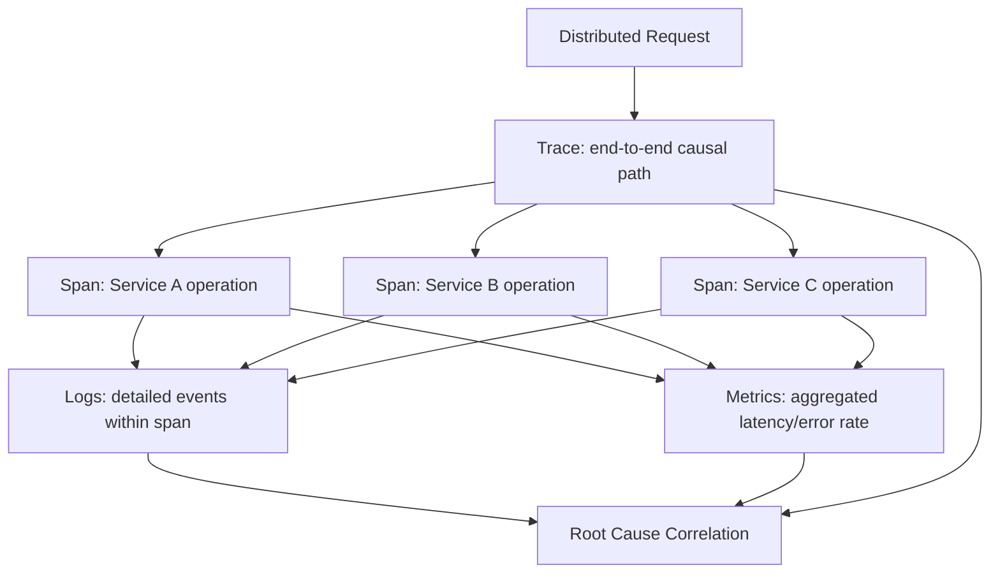
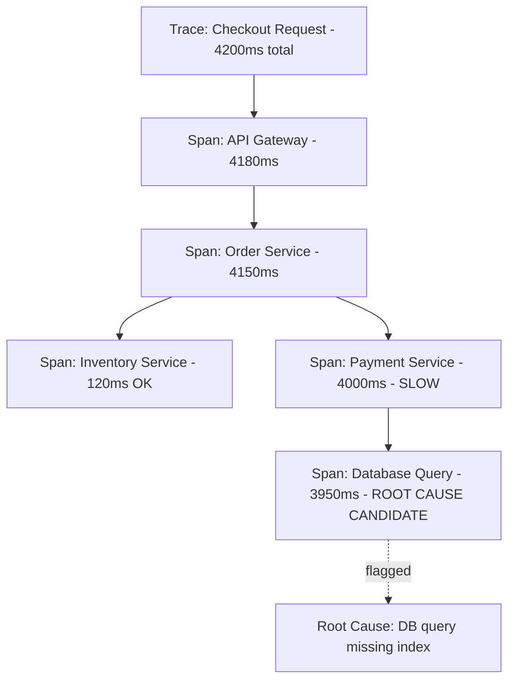
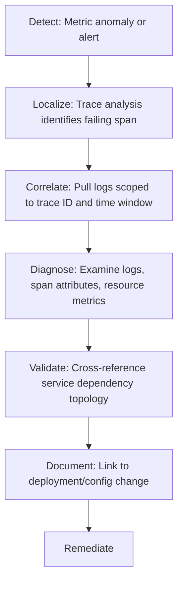

## Observability Driven Root Cause Analysis in Distributed Systems

### Overview

Observability-driven root cause analysis is the practice of diagnosing failures in distributed systems by reasoning over the **three foundational telemetry pillars**—logs, metrics, and traces—combined with the system's topology, to reconstruct causal chains across many independently deployed, interdependent services. Unlike monolithic systems where a stack trace often points directly to a fault, distributed systems distribute both the *execution* of a request and the *evidence* of a failure across many services, processes, and machines, making root cause analysis fundamentally an exercise in correlating fragmented, asynchronous signals. This topic builds directly on the automated log correlation and ML-assisted anomaly detection topics, focusing specifically on the observability data model and instrumentation practices that make distributed RCA tractable in the first place.

### The Three Pillars of Observability

**Metrics**

**Key Points**

- Numeric, time-series measurements aggregated over time (request rate, error rate, latency percentiles, resource utilization)
- Efficient to store and query at scale, well suited to dashboards, alerting thresholds, and trend detection
- Limitation for RCA: metrics are aggregated and lose individual request-level detail, so they can indicate *that* something is wrong and *roughly where*, but rarely explain precisely *why* a specific request failed

**Logs**

**Key Points**

- Discrete, timestamped event records emitted by application and infrastructure components, capturing specific occurrences with contextual detail
- Provide the richest level of individual detail of the three pillars, but at high volume and often inconsistent structure across services, making cross-service correlation difficult without structured logging and correlation identifiers
- **Structured logging** (emitting logs as consistently-keyed structured data, e.g., JSON, rather than free-form text) is a foundational practice that makes automated parsing, correlation, and NLP-based clustering (as covered in the automated log correlation topic) significantly more effective

**Traces**

**Key Points**

- Capture the end-to-end path of an individual request as it propagates across multiple services, represented as a tree or directed graph of **spans**, where each span records the work done by one service (or one operation within a service) for that specific request
- A trace directly encodes the **causal execution structure** of a request: which service called which, how long each step took, and where in the chain an error or elevated latency originated
- Distributed tracing standards (e.g., OpenTelemetry) define how trace context (trace ID, span ID, parent span ID) is propagated across service boundaries via request headers, enabling reconstruction of the full causal path even across independently deployed services
- Of the three pillars, traces are the most directly useful for RCA in distributed systems specifically because they preserve **causal ordering and parent-child relationships** between operations, rather than requiring that ordering to be inferred after the fact

**Three Pillars Relationship Diagram**

### Why Distributed Systems Make RCA Structurally Harder

**Key Points**

- **Fault propagation across service boundaries**: a single root-cause failure in one service frequently manifests as symptoms (timeouts, retries, elevated error rates) in many dependent services, exactly the alert-fragmentation problem covered in the automated log correlation topic
- **Asynchronous and eventually-consistent behavior**: message queues, event-driven architectures, and eventual consistency mean that cause and effect may be separated by significant, variable time delays, complicating simple temporal-window correlation
- **Ephemeral infrastructure**: containers, serverless functions, and auto-scaled instances may no longer exist by the time an investigation begins, meaning some direct evidence (host-level state, in-memory data) may be unrecoverable unless captured in exported telemetry at the time of failure
- **Partial failure and cascading degradation**: unlike a monolithic crash, distributed systems can exhibit partial failure, where some fraction of requests fail while others succeed, requiring statistical rather than binary reasoning about failure presence and scope
- **Polyglot and heterogeneous instrumentation**: different services, often written in different languages and frameworks by different teams, may have inconsistent logging formats, metric naming conventions, and instrumentation coverage, directly limiting cross-service correlation quality

### Distributed Tracing Deep Dive

**Key Points**

- A **trace** represents one logical request/transaction; a **span** represents one unit of work within that trace, with a start time, duration, and set of key-value attributes/tags
- Spans are linked via **parent-child relationships**, forming a tree (or more generally a directed acyclic graph for fan-out/fan-in patterns) that directly represents the causal call structure of the request
- **Context propagation** is the mechanism by which trace/span identifiers are passed across service boundaries (typically via HTTP headers or message metadata), allowing spans generated by different services to be correctly assembled into a single trace after the fact
- **Sampling** is a critical practical consideration: capturing traces for every single request at scale is often cost-prohibitive, so systems apply sampling strategies (head-based sampling at request start, tail-based sampling that retains traces based on outcome, e.g., retaining all traces containing an error) to balance visibility against storage/processing cost
- Tail-based sampling is particularly valuable for RCA specifically, since it can be configured to preferentially retain traces associated with errors or anomalous latency, ensuring the traces most useful for root cause investigation are not discarded by generic sampling

### Illustrative Example: Trace-Based Root Cause Localization

The following illustrates, in simplified form, how a trace tree can localize a root cause to a specific span rather than requiring investigators to manually correlate logs across services.

**Key Points**

- In this simplified example, the elevated total request latency (4200ms) is not itself the root cause but the symptom; trace analysis localizes the delay to a single database query span within the Payment Service, which is where the actual investigation should focus
- Without distributed tracing, an investigator would need to manually correlate elevated latency alerts across the API Gateway, Order Service, and Payment Service logs to reach the same conclusion—tracing makes this localization structural and near-automatic rather than requiring manual cross-service log correlation

### Reference Observability-Driven RCA Workflow

**Key Points**

- **Detect**: an anomaly or alert fires, typically from metrics (elevated error rate, latency SLO breach) or an explicit failure signal
- **Localize**: using distributed traces, identify which service and which specific span within that service's execution path is associated with the anomaly, narrowing the investigation scope from "the whole system" to a specific component
- **Correlate**: pull logs scoped to the identified span's time window and service/instance, using structured logging fields (ideally including the trace ID itself) to retrieve only logs relevant to the specific failing requests rather than the full service log volume
- **Diagnose**: examine the correlated logs, span attributes, and relevant metrics (resource utilization, dependency health) to identify the proximate technical cause
- **Validate against topology**: cross-reference the finding against the service dependency graph to confirm the causal direction (is this service the originator, or itself a downstream victim of a further upstream cause?)
- **Document and remediate**: capture the causal chain, ideally linking back to a specific deployment, configuration change, or infrastructure event that introduced the fault, consistent with the change-management root cause patterns identified in the major cloud outage postmortems topic

**Workflow Diagram**

### Instrumentation Practices That Enable Effective RCA

**Key Points**

- **Consistent trace context propagation** across all services, including asynchronous boundaries (message queues, event buses), not just synchronous HTTP calls—gaps in propagation create blind spots where causal chains cannot be reconstructed
- **Structured logging with correlation identifiers**: including trace ID and span ID as standard fields in every log line enables direct, exact-match correlation between logs and traces, rather than relying on approximate timestamp-based matching
- **Consistent span naming and tagging conventions** across teams and services, since inconsistent naming directly degrades the effectiveness of automated correlation and NLP-based clustering techniques
- **Service-level objective (SLO) instrumentation**: defining and measuring explicit reliability targets (latency percentiles, error budgets) provides the quantitative baseline against which anomaly detection and alerting operate
- **Topology/dependency metadata**: maintaining accurate service ownership, dependency, and criticality metadata, ideally auto-discovered from tracing data rather than manually maintained, directly supports the topology-aware correlation techniques covered in the automated log correlation topic

### Strengths and Limitations

**Key Points**

- **Strength**: distributed tracing directly encodes causal execution structure, making it structurally superior to log/metric correlation alone for localizing root cause within a distributed request path
- **Strength**: the combination of all three pillars provides complementary evidence—metrics for detection and trend, traces for localization, logs for detailed diagnosis—covering weaknesses inherent in any single pillar alone
- **Limitation**: observability infrastructure itself requires significant engineering investment (consistent instrumentation across all services, sampling strategy design, storage/retention cost management); incomplete instrumentation coverage creates blind spots that no amount of downstream analysis can compensate for
- **Limitation**: sampling strategies, if not carefully designed (particularly for tail-based sampling), can inadvertently discard exactly the traces most relevant to a rare or novel failure mode
- **Limitation**: observability data reveals *what happened and where*, but connecting that to *why it was allowed to happen* (organizational, process, or change-management root causes, as emphasized throughout this curriculum's historical case studies) still requires human-led investigation beyond what telemetry alone can surface
- The specific effectiveness of any observability-driven RCA workflow depends heavily on instrumentation completeness and consistency in the specific environment; claims of diagnostic speed or accuracy from one system's observability setup should not be assumed to transfer to an environment with different instrumentation maturity

### Why This Matters for RCA Practice

**Key Points**

- Provides the underlying data model and instrumentation foundation that makes the automated log correlation and ML-assisted anomaly detection techniques (covered elsewhere in this chapter) possible in the first place—those techniques operate *on* observability data, and their effectiveness is bounded by the quality of that data
- Directly operationalizes the proximate-cause localization step of traditional RCA (the early "Whys" in a 5 Whys chain) at machine speed and scale for distributed systems, while still requiring human judgment for the deeper organizational/systemic layers
- Reinforces a recurring theme from the major cloud outage postmortems: hidden or undocumented service dependencies are a repeated root cause pattern, and mature observability practice (accurate topology data, comprehensive trace propagation) is a direct, practical mitigation against that specific systemic risk

### Related Topics

- Automated log correlation and AIOps approaches
- Machine learning assisted anomaly and root cause detection
- Major public cloud and software outage postmortems
- Digital twins for failure simulation
- OpenTelemetry and distributed tracing standards
- Service Level Objectives (SLOs) and error budgets
- Chaos engineering and fault injection testing