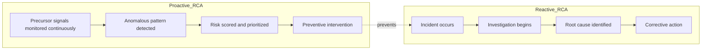
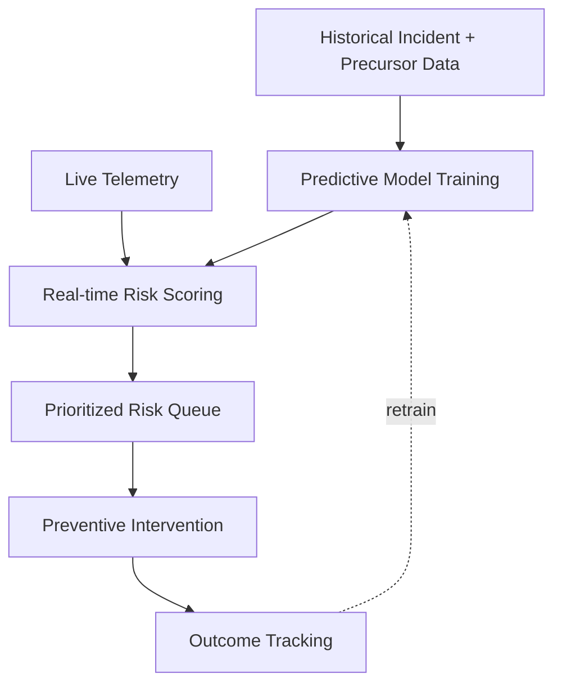

## Predictive and Preventive Analytics as RCA Extensions


### Overview

Predictive and preventive analytics extend root cause analysis from a purely retrospective discipline—explaining why a failure already occurred—into a forward-looking practice that identifies latent risk conditions before they produce a failure. Where traditional RCA (5 Whys, fishbone diagrams, formal investigation commissions) answers "what caused this incident," predictive and preventive analytics ask "what conditions, patterns, or precursors indicate that a similar or novel incident is likely to occur, and how can we intervene before it does." This topic synthesizes the forward-looking implications of the ML-assisted detection, observability, and digital twin topics covered elsewhere in this chapter, framing them specifically as RCA extensions rather than standalone capabilities.

### From Reactive to Proactive RCA: A Conceptual Shift

**Key Points**

- Traditional RCA is inherently reactive: it requires an incident to have already occurred before an investigation begins, as seen in every historical case study in this curriculum (Challenger, Chernobyl, Bhopal, TMI)
- Predictive and preventive analytics shift the trigger point earlier in the causal chain: rather than waiting for the terminal failure event, these techniques monitor for **precursor conditions**—the same kind of early warning signs that, in hindsight, were present before each historical disaster but were not acted upon in time
- This reframes a core lesson from the historical case studies (the normalization of deviance in Challenger, the ignored O-ring erosion warnings, the disabled safety systems at Bhopal) as a *data problem*: could systematic, quantitative monitoring of precursor signals have surfaced these warning patterns with enough confidence and urgency to trigger intervention before the disaster occurred?

**Reactive vs. Proactive RCA Diagram**



### Core Techniques

**Predictive Maintenance**

**Key Points**

- Uses sensor telemetry and historical failure data to estimate the **remaining useful life (RUL)** of a component or system, enabling maintenance to be scheduled based on actual degradation state rather than fixed time intervals (preventive maintenance) or after failure occurs (reactive maintenance)
- Commonly implemented using regression models, survival analysis techniques, or deep learning approaches trained on sensor time-series data correlated with historical failure events
- Directly connects to the digital twin failure simulation topic: a digital twin's prospective/predictive mode is a specific implementation pathway for predictive maintenance, using simulated stress scenarios to estimate failure proximity rather than relying solely on historical failure-pattern matching

**Leading Indicator and Precursor Monitoring**

**Key Points**

- Identifies **leading indicators**: metrics or conditions that historically precede a failure by a meaningful margin, as opposed to **lagging indicators**, which only confirm a failure has already occurred
- Requires historical incident data with sufficiently detailed precursor telemetry to establish which signals reliably preceded past failures, then monitoring live systems for recurrence of those patterns
- Methodologically connects to the formal causal inference topic: distinguishing a genuine leading indicator (a signal causally upstream of the failure) from a merely correlated coincidental signal is precisely the kind of confounding-control problem that do-calculus and backdoor-criterion analysis are designed to address; naive leading-indicator monitoring without causal validation risks alerting on spurious correlations

**Risk Scoring and Prioritization Models**

**Key Points**

- Combines multiple precursor signals, historical failure base rates, and consequence severity into a composite risk score used to prioritize which detected anomalies warrant investigation or intervention
- Often implemented using ensemble machine learning models or Bayesian risk-scoring frameworks that can incorporate both real-time telemetry and static risk factors (asset age, criticality, maintenance history)
- Analogous, at a technical level, to the kind of probabilistic risk assessment that investigators found NASA's own pre-Challenger risk models had significantly underestimated compared to engineering assessments—illustrating that risk-scoring model calibration itself is a recurring point of historical failure, not just a technical detail

**Trend and Drift Detection**

**Key Points**

- Monitors for gradual, statistically significant shifts in system behavior over time (concept drift in ML terms, or physical degradation trends in industrial contexts) that may not individually breach any single alert threshold but collectively indicate an emerging risk condition
- Particularly relevant to the "normalization of deviance" pattern seen across the historical case studies: a slow, incremental drift in accepted operating parameters (e.g., repeated O-ring erosion treated as increasingly acceptable) is structurally a drift-detection problem that static threshold-based alerting is poorly suited to catch, but explicit trend analysis is designed to surface

### Reference Architecture: Predictive/Preventive Analytics Pipeline

**Key Points**

- **Historical data layer**: curated repository of past incidents, their precursor telemetry, and their eventual outcomes, used to train predictive models and validate leading-indicator hypotheses
- **Live monitoring layer**: real-time ingestion of current telemetry (extending the observability architecture covered elsewhere in this chapter) scored continuously against trained predictive models
- **Risk scoring and prioritization engine**: aggregates multiple signals into actionable risk scores, filtering the large volume of monitored signals down to a prioritized set requiring attention
- **Intervention/action layer**: translates elevated risk scores into concrete preventive actions—scheduled maintenance, automated scaling, alerting a human reviewer, or triggering a digital twin simulation to further investigate the risk before committing to a physical intervention
- **Outcome feedback loop**: tracks whether flagged risk conditions did or did not lead to actual incidents, feeding back into model retraining to improve future precision and reduce false-positive rates over time

**Architecture Diagram**



### Illustrative Example: Simplified Risk Scoring Logic

```python
def compute_risk_score(leading_indicators, weights, base_rate):
    """
    leading_indicators: dict of {indicator_name: normalized_severity (0-1)}
    weights: dict of {indicator_name: causal_confidence_weight}
    base_rate: historical base failure rate for this asset class
    """
    weighted_sum = sum(
        leading_indicators[k] * weights.get(k, 0.0)
        for k in leading_indicators
    )
    # Combine weighted signal strength with historical base rate
    risk_score = base_rate + (1 - base_rate) * weighted_sum
    return min(risk_score, 1.0)

def prioritize_for_intervention(assets, threshold=0.7):
    return [a for a in assets if a.risk_score >= threshold]
```

**Key Points**

- The `weights` parameter deliberately represents "causal confidence," underscoring the methodological point that leading indicators should ideally be weighted by validated causal relevance, not merely raw correlation strength
- `threshold` tuning directly trades off preventive-action cost (intervening on false positives) against risk of missed early warning (a false negative that, per the historical pattern seen in Challenger and Takata, may only become visible after a serious incident occurs)

### The Precursor-Signal Lesson from Historical Case Studies

Predictive and preventive analytics can be understood as a systematic, quantitative response to a repeated pattern across this curriculum's case studies: **precursor signals existed but were not acted upon with sufficient urgency**.

| Case | Precursor Signal That Existed | Predictive/Preventive Analytics Parallel |
| --- | --- | --- |
| Challenger | Repeated O-ring erosion on prior flights, documented by engineers | Trend/drift detection on a degrading-but-not-yet-failing safety margin |
| Chernobyl | Reactor's positive void coefficient behavior at low power, known in the engineering community but not broadly disseminated | Leading indicator monitoring requiring cross-organizational knowledge sharing to be effective |
| Bhopal | Refrigeration and flare tower systems degraded/disabled over time before the incident | Predictive maintenance and safety-system-readiness monitoring |
| Takata airbags | Internal test data irregularities observed for years before public disclosure | Risk scoring and escalation pathway for anomalous internal test results |
| Cloud/software outages | Latent code paths untested (CrowdStrike), hidden service dependencies (AWS) | Drift/precursor monitoring combined with dependency mapping (see observability topic) |

**Key Points**

- This table illustrates that predictive and preventive analytics do not represent a fundamentally new causal insight so much as a **systematic, less-fallible mechanism for acting on precursor information that, historically, has often been available but under-escalated** due to organizational, cultural, or cognitive factors
- This reframes the deepest lesson from the cross-case methodology comparison topic — that organizational and cultural root causes are the hardest and most important layer to address — as a design target for predictive analytics systems: an effective system must not only detect a precursor signal statistically, but ensure it is escalated and acted upon organizationally, or it will fail in the same way the historical human processes did

### Strengths and Limitations

**Key Points**

- **Strength**: shifts intervention earlier in the causal chain, potentially preventing incidents rather than only explaining them after the fact, directly addressing the core motivation behind every historical case study's remediation recommendations
- **Strength**: quantitative risk scoring can help counter organizational normalization of deviance by providing an objective, harder-to-dismiss signal than an individual engineer's qualitative concern — though this depends entirely on the organization's willingness to act on the signal, a cultural and governance factor the analytics system itself cannot guarantee
- **Limitation**: predictive models trained on historical failure data are structurally limited in detecting genuinely novel failure modes that have no historical precedent — directly analogous to how a digital twin cannot model a failure mechanism it was never designed to represent, and a caution equally applicable here
- **Limitation**: false positive rates in predictive/preventive systems carry real organizational cost (alert fatigue, wasted intervention resources), which can itself lead to the same normalization-of-deviance dynamic if warnings are frequently wrong and therefore increasingly ignored over time — a risk that must be actively managed through careful threshold calibration and model validation
- **Limitation**: as with leading-indicator identification generally, distinguishing a genuinely causal precursor from a spuriously correlated one requires the kind of rigor covered in the formal causal inference topic; without it, predictive systems risk optimizing for statistically convenient but causally weak signals
- The reliability of any specific predictive or preventive analytics system depends substantially on the quality, volume, and representativeness of its historical training data, and its performance on genuinely novel scenarios outside that training distribution should be treated with appropriate caution rather than assumed

### Why This Matters for RCA Practice

**Key Points**

- Completes the arc of this chapter's advanced topics: formal causal inference provides the theoretical foundation for valid causal claims, ML-assisted detection and observability provide the data and correlation infrastructure, digital twins provide simulation-based scenario testing, and predictive/preventive analytics closes the loop by converting all of the above into proactive, forward-looking intervention
- Reinforces, at a systems-design level, the central lesson repeated across every historical case study in this curriculum: **the technical capability to detect a problem is necessary but not sufficient — organizational processes must be designed to ensure detected risk signals are actually escalated, believed, and acted upon**, or predictive analytics simply produces a faster, more quantitative version of the same warnings that were historically ignored
- Encourages RCA practitioners extending into predictive/preventive analytics to treat model calibration, false-positive management, and organizational escalation pathway design as first-class parts of the system, not secondary implementation details

### Related Topics

- Digital twins for failure simulation
- Machine learning assisted anomaly and root cause detection
- Formal causal inference and do calculus foundations
- Observability driven root cause analysis in distributed systems
- Cross case comparison of investigative methodology
- Normalization of deviance in organizational safety culture
- Predictive maintenance and remaining useful life estimation