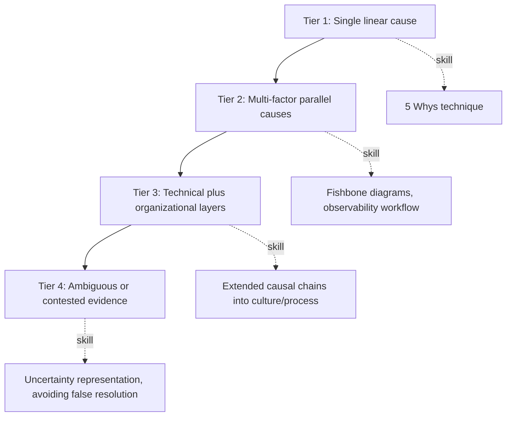

## Practice Problems of Increasing Investigative Complexity

### Overview

This section provides a structured sequence of RCA practice problems, arranged by increasing investigative complexity, to build practitioner skill progressively from single-cause technical scenarios through multi-layered organizational failures to ambiguous, contested-evidence investigations. Each problem includes context, the investigative task, and guidance on the RCA techniques most applicable, drawing on methodologies and case patterns established throughout this curriculum (5 Whys, fishbone diagrams, causal chain analysis, and the investigative methodology principles from the cross-case comparison).

### Complexity Tier 1: Single-Cause Technical Scenarios

These problems have a single, identifiable proximate cause with minimal ambiguity, suitable for practicing basic 5 Whys technique.

**Problem 1.1 — Manufacturing Line Stoppage**

A bottling line stops unexpectedly. Investigation shows a conveyor motor overheated and tripped a thermal cutoff.

- **Task**: Apply the 5 Whys technique to trace from the stoppage to a root cause.
- **Guidance**: Expect the chain to move from motor overheating → insufficient lubrication → missed maintenance interval → maintenance scheduling system did not flag the interval → root cause likely in maintenance tracking process design, not the motor itself.

**Problem 1.2 — Web Application 500 Error Spike**

A web application begins returning HTTP 500 errors for 15 minutes, then recovers without intervention.

- **Task**: Using log and metric data (hypothetical: memory usage spiked to 98% during the window), identify the proximate cause and propose one deeper "why."
- **Guidance**: A memory spike is a proximate cause; the deeper why should probe whether this reflects a memory leak, an unexpected traffic pattern, or a missing resource limit/auto-scaling configuration.

**Skill focus**: linear causal chain construction; distinguishing proximate cause from root cause at a shallow depth.

### Complexity Tier 2: Multi-Factor Technical Scenarios

These problems require identifying multiple contributing factors that combine to produce an outcome, suitable for practicing fishbone/Ishikawa diagram construction.

**Problem 2.1 — Intermittent Sensor Failures in a Manufacturing Cell**

A robotic assembly cell experiences intermittent positioning errors, occurring roughly 3% of cycles, with no single reproducible trigger.

- **Task**: Construct a fishbone diagram covering at least four categories (e.g., Equipment, Environment, Procedure, Materials) and propose an investigative test for each candidate cause.
- **Guidance**: Intermittent, low-frequency failures typically require multi-factor analysis rather than a single linear chain; consider electromagnetic interference, thermal drift, calibration schedule adequacy, and part tolerance variation as parallel candidate branches.

**Problem 2.2 — Regional Cloud Service Degradation**

A cloud-hosted service experiences elevated latency (not full outage) affecting roughly 20% of requests in one region for two hours, then self-resolves.

- **Task**: Using the observability-driven RCA workflow (detect → localize → correlate → diagnose → validate against topology), construct a plausible investigative path. Identify what trace, log, and metric evidence would be needed at each stage.
- **Guidance**: Consider partial failure patterns (a single unhealthy instance behind a load balancer, a degraded but not fully failed downstream dependency) as more consistent with the symptom profile than a full systemic failure.

**Skill focus**: parallel/multi-branch causal reasoning; applying observability data pillars to distributed system diagnosis.

### Complexity Tier 3: Organizational and Decision-Process Scenarios

These problems require extending the causal chain beyond the technical layer into organizational decision-making, directly practicing the deeper "Whys" pattern seen in the Challenger and TMI case studies.

**Problem 3.1 — Recurring Near-Miss Pattern**

A workplace safety audit reveals that a specific type of near-miss incident (a forklift-pedestrian close call) has occurred 12 times in the past year, none resulting in injury, and none triggering a formal incident investigation because no injury occurred.

- **Task**: Apply 5 Whys to explain not just the near-misses themselves, but why the pattern was allowed to continue unaddressed. Explicitly identify where in the chain the analysis shifts from a technical/physical cause to an organizational/cultural cause.
- **Guidance**: Expect the deeper Whys to surface a reporting threshold problem (only injury-triggering events require investigation) — directly analogous to the "normalization of deviance" pattern from the Challenger case study, where repeated non-catastrophic anomalies were not treated as actionable warning signs.

**Problem 3.2 — Delayed Escalation of a Known Defect**

A product engineering team identifies a potential defect in internal testing eight months before a customer-reported failure triggers a public recall. Internal records show the defect was documented but categorized as "low priority" and not escalated to leadership.

- **Task**: Construct a causal chain that addresses both (a) why the original defect occurred technically, and (b) why the internal escalation process failed to surface it in time. Identify what specific process or cultural change would address the root cause versus merely the proximate technical defect.
- **Guidance**: This problem is structurally modeled on the pattern seen in the Takata airbag and general product recall case studies; a technically correct fix to the defect alone would not address the deeper root cause of the escalation failure, and a complete answer must address both layers explicitly.

**Skill focus**: extending causal chains into organizational/cultural layers; distinguishing technical fixes from systemic fixes.

### Complexity Tier 4: Ambiguous or Contested-Evidence Scenarios

These problems intentionally include incomplete, conflicting, or disputed evidence, practicing the methodological caution emphasized in the cross-case investigative methodology comparison — particularly the lesson from the Bhopal case that not all investigations converge to a single, fully resolved causal narrative.

**Problem 4.1 — Conflicting Root Cause Attribution**

Following a data center outage, the infrastructure team's internal review attributes the cause to a firmware bug in networking hardware. The hardware vendor's independent analysis attributes it to an out-of-specification configuration applied by the infrastructure team. Both parties have partial supporting evidence; neither has been able to reproduce the failure in a controlled test environment.

- **Task**: Rather than resolving the dispute, write an RCA summary section that accurately represents the state of contested evidence, following the methodological principle (from the cross-case comparison topic) that disputed facts should be explicitly flagged as such rather than presented with false resolution. Identify what additional evidence, if obtained, would most efficiently resolve the ambiguity.
- **Guidance**: A strong answer avoids picking a "winner" between the two narratives without sufficient evidence, and instead focuses on identifying the specific missing evidence (e.g., firmware logs at the exact configuration-application timestamp) that would be most diagnostic.

**Problem 4.2 — Multi-Incident Pattern with Divergent Individual Causes**

Three unrelated production incidents occur within one month, each initially investigated and closed with a different immediate technical cause (a database index issue, a third-party API timeout, and a deployment configuration error). A retrospective review is requested to determine if there is a common underlying root cause across all three.

- **Task**: Practice recognizing when incidents genuinely share a systemic root cause (e.g., all three trace back to inadequate pre-production testing rigor) versus when apparent pattern-matching would be a spurious, overreaching conclusion not supported by the specific evidence of each case.
- **Guidance**: This problem specifically practices the causal inference caution from the formal causal inference topic — correlation across incidents (three incidents in one month) does not by itself establish a shared causal root; each individual causal chain must be independently and rigorously traced before a shared systemic cause can be justifiably claimed.

**Skill focus**: representing uncertainty and disputed evidence accurately; avoiding both premature causal closure and spurious pattern-matching.

### Investigative Complexity Progression Diagram

### Recommended Practice Method

**Key Points**

- Work each problem in writing before consulting the provided guidance; the value of these exercises comes primarily from independently constructing the causal chain or fishbone diagram, not from reading the suggested approach
- For Tier 3 and 4 problems specifically, practice explicitly labeling each step of a causal chain by category (technical, procedural, organizational/cultural) as demonstrated in the historical case study breakdowns elsewhere in this curriculum — this labeling discipline is itself a key investigative skill being practiced
- Revisit Tier 4 problems after completing the full curriculum's historical case studies and cross-case methodology comparison, since the value of those problems depends on internalizing the lesson that not every investigation reaches full causal certainty, and a mature RCA practitioner represents that honestly rather than forcing false closure

### Self-Assessment Questions

- For each Tier 1–2 problem: did your answer distinguish proximate cause from at least one deeper contributing or root cause, or did it stop at the first plausible technical explanation?
- For each Tier 3 problem: did your answer explicitly identify the point in the causal chain where the analysis shifts from technical to organizational, and did you propose a corrective action addressing the organizational layer specifically (not only the technical defect)?
- For each Tier 4 problem: did your answer avoid asserting a single resolved conclusion where the evidence does not support one, and did you identify what specific additional evidence would be needed to resolve the ambiguity?

### Next Steps

- Cross case comparison of investigative methodology (review before attempting Tier 4 problems)
- Formal causal inference and do calculus foundations (relevant to Problem 4.2's pattern-matching caution)
- Observability driven root cause analysis in distributed systems (relevant to Problem 2.2)
- Certification-style comprehensive case scenario assessment
- Facilitated group practice: assign different practitioners to argue each side of a Tier 4 contested-evidence problem
- Building a personal fishbone/5 Whys template library from Tier 2 practice