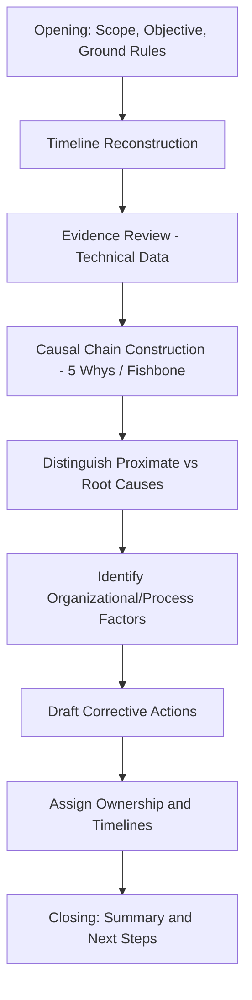

## Running Mock RCA Facilitation Sessions

### Overview

Mock RCA facilitation sessions are structured practice exercises where a practitioner leads a simulated root cause analysis investigation with a group, developing the distinct skill of **facilitating** an RCA process rather than conducting one alone. Facilitation is a materially different competency from individual analytical technique: it requires managing group dynamics, eliciting honest input (particularly about human and organizational factors), keeping the group anchored to evidence rather than blame, and driving the session toward an actionable, well-supported conclusion within a bounded time. This section provides a structured approach for designing, running, and evaluating mock facilitation sessions as a capstone practice activity.

### Why Facilitation Is a Distinct Skill from Analysis

**Key Points**

- An individual conducting RCA alone controls the entire analytical process; a facilitator must extract accurate information from multiple participants who may have incomplete views, conflicting incentives, or reluctance to disclose their own errors
- The historical case studies in this curriculum repeatedly show that **information withholding or filtering** was itself a root-level failure (engineers' concerns not reaching NASA leadership before Challenger; Thiokol's internal reversal under management pressure) — a skilled facilitator's core value is designing a process that surfaces this kind of information rather than allowing it to be filtered out
- Facilitation additionally requires managing the psychological dynamics of an investigation: participants may fear blame, career consequences, or reputational damage, and how the facilitator frames the session directly affects whether they speak candidly

### Pre-Session Design

**Defining Scope and Objective**

**Key Points**

- State the precise incident or problem being investigated, with a bounded time window and system/process scope — an unbounded scope ("why do we have quality problems") produces an unfocused session, while an overly narrow scope may miss systemic factors
- Distinguish explicitly, before the session, whether the objective is technical root cause identification, organizational/process root cause identification, or both — this affects who should be invited and how much time to allocate to each phase

**Selecting Participants**

**Key Points**

- Include representatives from every stage of the causal chain under investigation: those who designed the system/process, those who operate it, those who maintain it, and those who observed or responded to the incident
- Deliberately include participants across the organizational hierarchy relevant to the incident, since organizational root causes (as in the Challenger and TMI cases) frequently involve information or decision-making gaps *between* levels of an organization, which a single-level group cannot fully surface
- Keep the group small enough for genuine participation (typically 5–10 participants for a focused technical RCA; larger for a cross-organizational review) while ensuring no critical perspective is excluded

**Establishing Psychological Safety Ground Rules**

**Key Points**

- Explicitly state, at the start of the session, that the goal is process and system improvement, not individual blame — this is the foundational principle of **blameless postmortem** practice, directly informed by the lesson that fear of blame suppresses the honest disclosure needed for effective RCA
- Ground rules should be stated explicitly rather than assumed, since participants' willingness to speak candidly about their own actions or their organization's decisions is highly sensitive to how safe they perceive the session to be

### Facilitation Structure and Phases

**Facilitation Session Flow Diagram**

**Phase 1 — Opening**

- State scope, objective, and ground rules explicitly (see above)
- Briefly review the facilitation process itself, so participants know what to expect and when their input will be needed

**Phase 2 — Timeline Reconstruction**

- Build a shared, agreed factual timeline of events before any causal discussion begins — mirroring the investigative phase structure established in the cross-case methodology comparison topic (evidence preservation and timeline reconstruction preceding causal analysis)
- A facilitator should actively resist the group's natural tendency to jump to causal conclusions during this phase; the goal here is only establishing "what happened, in what order," not "why"

**Phase 3 — Evidence Review**

- Walk through available technical evidence (logs, sensor data, physical evidence, documentation) as a shared reference point before causal discussion, ensuring the group's causal reasoning is anchored to actual evidence rather than assumption or speculation

**Phase 4 — Causal Chain Construction**

- Apply 5 Whys or fishbone diagram technique collaboratively, with the facilitator actively eliciting input from quieter participants and testing whether each proposed "why" is adequately supported by evidence reviewed in Phase 3
- A key facilitation skill here is **redirecting premature closure**: if the group converges quickly on a single explanation (particularly one attributing failure to an individual's error), the facilitator should explicitly probe whether this is the deepest identifiable cause or a proximate one, echoing the "don't stop at the first plausible explanation" principle from the cross-case comparison topic

**Phase 5 — Distinguishing Proximate from Root Causes**

- Explicitly separate, on a visible shared artifact (whiteboard, shared document), what the group has identified as proximate/technical cause versus deeper organizational/process cause
- This phase is where facilitation skill is most tested: participants are often more comfortable stopping at a technical explanation than surfacing organizational or cultural factors, particularly if those factors implicate leadership decisions or their own team's practices

**Phase 6 — Corrective Action Drafting**

- For each identified root cause, draft a specific, assignable corrective action — vague actions ("improve communication") should be pushed by the facilitator toward specific, verifiable commitments ("implement a documented escalation path with a defined response SLA for safety-relevant test anomalies")
- Cross-reference each corrective action against the root cause it addresses, explicitly checking whether the action addresses the *root* cause identified or only the proximate symptom — a discipline directly informed by the recall and cloud-outage case studies, where corrective actions addressing only the first-identified cause proved insufficient (e.g., the Samsung Note 7's incomplete first corrective action)

**Phase 7 — Closing**

- Summarize the agreed causal chain and corrective actions, confirm ownership and timelines, and explicitly note any unresolved or disputed points rather than forcing false consensus — consistent with the methodological principle that disputed facts should be flagged rather than resolved prematurely

### Common Facilitation Challenges and Techniques

| Challenge | Facilitation Technique |
| --- | --- |
| Group jumps to blame an individual | Redirect to the ground rules; ask "what about the process or system allowed this individual action to have this consequence?" |
| Premature convergence on first explanation | Explicitly ask "is this the deepest cause we can identify, or is there a further why?" before closing a causal branch |
| Senior participant dominates discussion | Structure explicit round-robin input during causal chain construction; solicit input from junior/quieter participants directly by name |
| Participant reluctant to disclose their own error | Reinforce blameless framing; consider gathering sensitive input via anonymous pre-session written input, synthesized by the facilitator |
| Group disagrees on root cause | Do not force resolution; document the disagreement explicitly and identify what additional evidence would resolve it |
| Session runs over time without reaching corrective actions | Timebox each phase explicitly at the outset; if a phase runs long, note open items and schedule a focused follow-up rather than rushing corrective action drafting |

### Mock Session Exercise Design for Practice

**Key Points**

- For skill-building purposes, mock sessions should be run using a **pre-scripted scenario with assigned participant roles**, including at least one role holding information the others do not have (simulating the real-world information-asymmetry pattern seen across the historical case studies)
- Include at least one "planted" facilitation challenge from the table above (e.g., a scripted participant who repeatedly jumps to blaming an individual) so the practicing facilitator must actively apply redirection technique, not just execute a smooth session
- Debrief after each mock session using a structured review, separate from the mock RCA content itself, focused specifically on facilitation technique: did the facilitator maintain psychological safety, resist premature closure, and successfully extract input from all participants?

### Mock Session Debrief Checklist

**Key Points**

- Did the facilitator establish clear scope and ground rules before beginning causal discussion?
- Was a shared factual timeline established before causal analysis began, or did the group conflate timeline reconstruction with causal reasoning?
- Did the facilitator distinguish proximate from root causes explicitly and visibly, rather than leaving the distinction implicit?
- Were quieter or lower-hierarchy participants actively drawn into the discussion, particularly during the organizational-cause phase?
- Were corrective actions specific and assignable, and explicitly cross-checked against the root cause they were meant to address?
- Were any points of disagreement or unresolved evidence documented honestly, rather than forced into false consensus?

### Why This Matters for RCA Practice

**Key Points**

- Individual analytical skill (the focus of the practice problems topic) is necessary but not sufficient for real-world RCA impact, since most consequential investigations — as seen in every historical case study in this curriculum — are conducted by groups, not individuals, and their quality depends heavily on how well the group process surfaces accurate, complete information
- Reinforces the deepest recurring lesson of this curriculum at a practical, applied level: organizational and cultural root causes are the hardest to surface, and a facilitator's process design and in-session technique directly determine whether those causes are actually identified or remain hidden behind a comfortable technical explanation
- Provides the natural bridge from individual technique mastery (5 Whys, fishbone diagrams, formal causal reasoning) to the applied, real-world context in which RCA is most often actually practiced: a live, group-based investigative session under time pressure and social dynamics

### Next Steps

- Practice problems of increasing investigative complexity (use as source material for mock session scenarios)
- Cross case comparison of investigative methodology (informs facilitation phase design)
- Blameless postmortem culture and psychological safety frameworks
- Certification-style comprehensive case scenario assessment
- Peer-reviewed facilitation practice with rotating facilitator roles
- Building a personal library of scripted mock scenarios with planted facilitation challenges