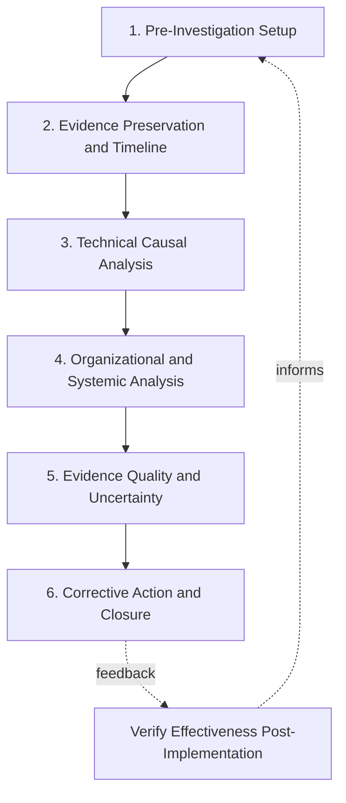

## Building a Personal Root Cause Investigation Checklist

### Overview

A personal root cause investigation checklist is a practitioner-built, reusable reference tool that consolidates the analytical disciplines, methodological cautions, and process steps covered throughout this curriculum into a single, actionable artifact for use during real investigations. Unlike a generic organizational RCA template, a personal checklist is refined through individual practice and reflects the specific failure patterns, cautions, and techniques a practitioner has found most valuable — synthesized here from the historical case studies, formal methodology comparisons, and advanced analytical techniques covered in this curriculum. This section provides a structured framework for building, testing, and maintaining such a checklist.

### Why a Personal Checklist Matters

**Key Points**

- Even experienced investigators are susceptible to the same failure patterns documented across this curriculum's historical cases: premature causal closure (stopping at the first plausible explanation), scope-narrowing under self-investigation incentives, and treating correlation as causation
- A checklist externalizes discipline that is difficult to maintain purely through memory or intention, particularly under the time pressure and organizational dynamics present in real investigations — directly mirroring the aviation and medical industries' use of checklists to counteract exactly this kind of predictable human lapse under pressure
- A well-built personal checklist should function as a **synthesis artifact**: each item should trace back to a specific lesson or technique from this curriculum, not be adopted as generic best practice without understanding its origin and justification

### Checklist Section 1: Pre-Investigation Setup

**Key Points**

- [ ] Have I defined a bounded scope (specific system, time window, and incident) rather than an open-ended problem statement?
- [ ] Have I identified whether this investigation requires technical root cause only, organizational/process root cause only, or both?
- [ ] Have I identified all stakeholders who hold relevant information, including those at different organizational levels (echoing the lesson that information gaps *between* levels were central to Challenger and TMI)?
- [ ] Have I established, explicitly, a blameless framing for any group involvement, consistent with the facilitation session principles covered elsewhere in this chapter?
- [ ] Have I assessed my own independence and potential scope-narrowing incentives, per the investigative methodology comparison — am I self-investigating, and if so, what safeguard will I use to avoid stopping at a conveniently narrow technical explanation?

### Checklist Section 2: Evidence Preservation and Timeline Reconstruction

**Key Points**

- [ ] Have I preserved raw evidence (logs, sensor data, physical artifacts, documentation) before it can be altered, overwritten, or lost — particularly relevant for ephemeral distributed-system evidence (per the observability topic) that may not persist after the incident
- [ ] Have I constructed a factual, agreed timeline of events *before* beginning causal analysis, resisting the temptation to conflate sequencing with causation prematurely?
- [ ] Have I checked for precursor signals or near-miss history related to this failure mode, consistent with the precursor-signal lesson from predictive/preventive analytics — was this pattern seen before, and if so, was it escalated?

### Checklist Section 3: Technical Causal Analysis

**Key Points**

- [ ] Have I applied 5 Whys (or fishbone diagram, if multiple parallel contributing factors are plausible) to trace from the observed symptom toward deeper causes?
- [ ] At each "why," have I asked whether this is genuinely the deepest identifiable cause, or the first plausible explanation I encountered?
- [ ] For distributed/technical systems, have I used available trace, log, and metric data to localize the failure to a specific component before broadly speculating about cause (per the observability-driven RCA workflow)?
- [ ] Have I explicitly distinguished correlation from causation at each step — would a formal causal framing (backdoor paths, confounders) change my confidence in any specific causal claim (per the formal causal inference topic)?
- [ ] If ML-assisted or automated correlation tools surfaced a candidate root cause, have I treated it as a hypothesis for validation rather than a confirmed conclusion (per the ML-assisted detection topic's caveats)?

### Checklist Section 4: Organizational and Systemic Analysis

**Key Points**

- [ ] Have I continued the causal chain past the first technical explanation into organizational, procedural, or cultural factors, rather than stopping once a technical cause is found?
- [ ] Have I checked whether this failure reflects a known-but-unescalated risk (a "normalization of deviance" pattern), by reviewing prior incident history, near-misses, or documented-but-deprioritized concerns?
- [ ] Have I examined whether schedule, cost, or production pressure plausibly influenced any relevant decision, given how frequently this factor recurs across the historical case studies in this curriculum?
- [ ] Have I checked whether corrective action from a *previous, related* incident was incomplete or narrowly scoped, given the lesson from the Samsung Note 7 case that a first corrective action can address only part of a systemic problem?

### Checklist Section 5: Evidence Quality and Uncertainty

**Key Points**

- [ ] Where evidence is incomplete, contested, or conflicting (as in the Bhopal case), have I represented that honestly rather than forcing a single resolved narrative?
- [ ] Have I identified what specific additional evidence, if obtained, would most efficiently resolve any remaining ambiguity?
- [ ] Have I clearly labeled inferences, speculation, or unverified claims as distinct from established facts throughout my findings?
- [ ] If multiple incidents show a superficially similar pattern, have I independently validated the causal chain for each rather than assuming a shared root cause from pattern-matching alone (per the causal inference caution)?

### Checklist Section 6: Corrective Action and Closure

**Key Points**

- [ ] Does each proposed corrective action map explicitly to a specific identified root cause, rather than only addressing the most visible symptom?
- [ ] Are corrective actions specific, assignable, and verifiable, rather than vague aspirational statements?
- [ ] Have I checked corrective actions against the full causal scope of the defect — could a similar defect exist elsewhere in the system (other suppliers, other services, other components) that this action does not address?
- [ ] Have I documented the investigation's own methodology and independence level, so future readers can appropriately weight its conclusions (per the cross-case methodology comparison's lesson that investigator independence affects causal depth reached)?
- [ ] Have I built in a mechanism to verify, after implementation, that the corrective action actually prevented recurrence — closing the feedback loop rather than assuming the fix worked?

### Checklist Structure Diagram

### Customization Guidance

**Key Points**

- A checklist built for software/distributed-systems RCA should weight Section 3 heavily toward observability and tracing-specific items (localizing via trace spans, checking for hidden dependencies, per the automated log correlation and observability topics), while a checklist for physical/industrial RCA should weight Section 2 toward physical evidence preservation and Section 4 toward maintenance/safety-system-readiness checks (per the Bhopal and Takata patterns)
- Practitioners should treat their checklist as a living document, adding new items when a real investigation reveals a gap the checklist did not cover, and removing or consolidating items that prove redundant in practice — the checklist's value comes from continued refinement against real use, not from being complete on first construction
- When adapting this checklist for organizational (rather than purely personal) use, explicitly separate items that require group facilitation (Section 4's organizational analysis, in particular) from items an individual investigator can complete alone, since the facilitation-specific techniques covered elsewhere in this chapter apply specifically to the group-dependent items

### Testing the Checklist

**Key Points**

- Apply the checklist retrospectively against one or more of this curriculum's historical case studies as a validation exercise: would following this checklist, as an investigator at the time, have plausibly surfaced the same root causes the actual investigation eventually reached (e.g., would Section 4's "normalization of deviance" check have flagged the pre-Challenger O-ring erosion pattern earlier)?
- Apply the checklist against the practice problems of increasing investigative complexity covered elsewhere in this chapter, particularly the Tier 3 and Tier 4 problems, to confirm the checklist's organizational-analysis and uncertainty-representation sections hold up under deliberately ambiguous conditions
- Revise any checklist item that, in practice, proves too vague to act on (e.g., "consider organizational factors" is weaker than the specific, falsifiable prompts given in Section 4 above) — specificity is what makes a checklist item actually useful under real investigative time pressure

### Why This Matters for RCA Practice

**Key Points**

- Serves as the practical, personal-mastery capstone of this curriculum: rather than requiring a practitioner to consciously recall every lesson from every historical case and advanced technique during a live, time-pressured investigation, a well-built checklist encodes that accumulated knowledge into an immediately actionable reference
- Directly operationalizes the recurring meta-lesson of this entire curriculum — that premature causal closure and organizational information-filtering are the most common and consequential investigative failure modes — into concrete, checkable prompts rather than leaving that lesson as abstract awareness
- Provides a natural transition into the facilitation and certification-level practice covered elsewhere in this chapter, since a strong personal checklist can also serve as the backbone for structuring group facilitation sessions and for self-assessment during certification-style practice scenarios

### Next Steps

- Practice problems of increasing investigative complexity (use to test-drive the checklist)
- Running mock RCA facilitation sessions (adapt Section 4 items for group use)
- Cross case comparison of investigative methodology (source for Sections 1 and 5)
- Certification-style comprehensive case scenario assessment
- Periodic checklist review and revision practice
- Building a team or organizational RCA template from this personal checklist foundation