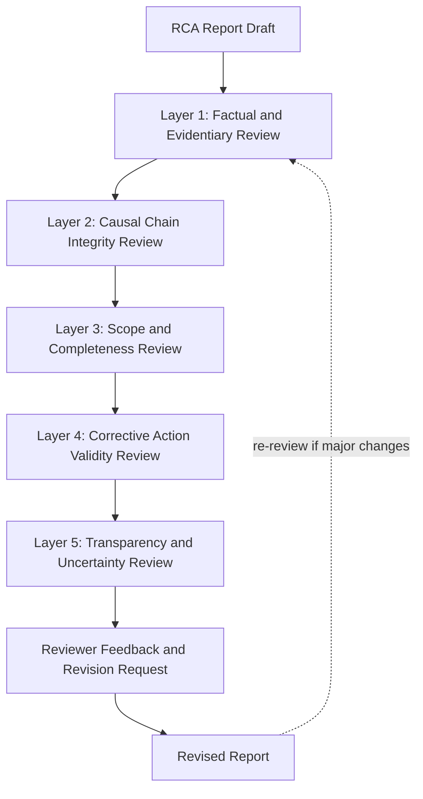

## Peer Review and Critique of RCA Reports

### Overview

Peer review of RCA reports is the practice of having a qualified colleague or reviewer critically evaluate a completed root cause analysis before it is finalized, applied, or published, in order to catch analytical gaps, unsupported conclusions, and premature closure that the original investigator—having built the narrative incrementally—may no longer be able to see objectively. This section provides a structured framework for conducting rigorous peer review, drawing on the investigative methodology principles, causal reasoning cautions, and historical case patterns established throughout this curriculum, and is intended as a capstone mastery activity that develops critical evaluation skill as a complement to investigative skill.

### Why Peer Review Is a Distinct and Necessary Skill

**Key Points**

- An investigator who has spent significant time constructing a causal narrative develops **narrative commitment**: once a plausible explanation is found, there is a natural cognitive tendency to interpret further evidence as confirming it rather than testing it, making self-review alone insufficient
- The cross-case investigative methodology comparison established that investigative independence correlates strongly with the depth of causal analysis reached; peer review is a practical mechanism for introducing a degree of independence into even a single-investigator or single-organization RCA process
- Several historical cases in this curriculum illustrate the cost of inadequate review: Bhopal's disputed causal narrative might have benefited from earlier independent cross-examination of evidence, and the Rogers Commission's willingness to formally challenge NASA's own risk assessments is a clear example of external review surfacing conclusions an internal-only process had not reached

### Structured Review Framework

**Layer 1: Factual and Evidentiary Review**

**Key Points**

- Is every factual claim in the report traceable to specific, cited evidence (logs, sensor data, testimony, documentation), or are any claims asserted without a clear evidentiary basis?
- Is the timeline internally consistent, and does it precede rather than follow from the causal narrative (per the investigative phase discipline of reconstructing timeline before causal analysis)?
- Are any claims labeled as fact that should more accurately be labeled as inference, speculation, or unverified, consistent with the accuracy standards applied throughout this curriculum's historical case studies?

**Layer 2: Causal Chain Integrity Review**

**Key Points**

- Does the report's causal chain (5 Whys or equivalent) show clear logical progression from each step to the next, or are there unexplained jumps where a "why" answer does not actually follow from the evidence presented for the prior step?
- Did the investigation stop at the first plausible explanation, or does the chain extend to a genuinely deeper, more systemic cause? A reviewer should actively ask, for each terminal cause in the report: "is there a further why that has not been asked?"
- Are correlation and causation clearly distinguished throughout, or does the report imply causal relationships (particularly between organizational factors and outcomes) with only correlational support? This is the specific caution formalized in the formal causal inference topic and directly relevant to reviewing any RCA report's strongest claims
- If the report addresses a pattern across multiple incidents, has each individual incident's causal chain been independently validated, or does the report assume a shared root cause based on superficial pattern similarity alone (the specific caution practiced in Tier 4 practice problems)?

**Layer 3: Scope and Completeness Review**

**Key Points**

- Does the report address organizational/cultural root causes where relevant, or does it stop at a technical explanation that is more comfortable but less complete — the specific gap the Kemeny Commission's TMI investigation explicitly worked to close beyond an initial "operator error" framing?
- If the investigation was conducted by a party with a potential incentive to narrow scope (e.g., self-investigation by the organization responsible for the failure), has the reviewer specifically checked whether the report's conclusions plausibly stop short of implicating the investigating organization's own decisions or incentives?
- Does the report check whether the identified defect or failure mode could exist elsewhere in the system (other suppliers, other services, other components), consistent with the lesson from the Samsung Note 7 case that a first corrective action addressed only the first-identified defect?

**Layer 4: Corrective Action Validity Review**

**Key Points**

- Does each proposed corrective action map explicitly and specifically to an identified root cause, or are some actions vague, aspirational, or addressing only a symptom rather than the root cause identified earlier in the same report?
- Are corrective actions assignable, verifiable, and time-bound, or are they stated in a way that cannot be objectively confirmed as complete?
- Does the report include, or at least propose, a mechanism to verify that the corrective action actually prevents recurrence, closing the feedback loop rather than assuming effectiveness?

**Layer 5: Transparency and Uncertainty Review**

**Key Points**

- Where evidence is genuinely incomplete or contested, does the report represent that honestly, or does it present a single resolved narrative that overstates the certainty actually supported by the evidence?
- Does the report disclose its own investigative independence and methodology, so a reader can appropriately weight its conclusions, consistent with the cross-case methodology comparison's emphasis on this disclosure?

**Review Framework Diagram**

### Common Findings in Peer Review

| Common Finding | Underlying Issue |
| --- | --- |
| "This conclusion doesn't follow from the evidence cited" | Weak or missing evidentiary support for a causal claim |
| "This stops at a technical cause but doesn't ask why the process allowed it" | Premature causal closure, missing organizational layer |
| "This correlation is presented as if it were causal" | Confounding not addressed; correlation-causation conflation |
| "This corrective action doesn't address the root cause identified above" | Mismatch between diagnosis and corrective action |
| "This assumes all three incidents share a cause without validating each independently" | Spurious pattern-matching across incidents |
| "This report doesn't acknowledge the disputed/unresolved evidence" | False resolution presented where uncertainty should be disclosed |
| "The investigating team had an incentive to narrow scope here, and the report doesn't address that" | Insufficient independence or self-investigation scope-narrowing |

### Delivering Effective Peer Review Feedback

**Key Points**

- Frame feedback around the evidence and logical structure of the report, not the competence of the investigator — this mirrors the blameless framing principle from mock facilitation sessions, and is equally important in peer review, since defensive reactions to feedback reduce the likelihood that legitimate gaps get addressed
- Be specific: "this conclusion needs stronger support" is less actionable than "the claim that schedule pressure caused this decision is supported only by a single retrospective interview; consider what contemporaneous evidence, if any, could strengthen or weaken this claim"
- Distinguish between feedback that identifies a genuine gap (missing evidence, unaddressed alternative explanation, incomplete corrective action) and feedback that reflects a difference of interpretation where the original author's conclusion is reasonably supported — not every disagreement is a defect in the report
- When flagging a potential premature closure (Layer 2), propose the specific further "why" question the reviewer believes should be asked, rather than only stating that the chain feels incomplete

### Self-Review Practice (When a Peer Reviewer Is Unavailable)

**Key Points**

- Apply the five-layer framework above to one's own report after a deliberate time gap (ideally at least a day) from when it was drafted, to reduce narrative commitment bias
- Read the report specifically looking for the terminal cause in each causal branch and ask, explicitly and in writing, "what would the next why be, and why did I stop here?" — if the honest answer is "because this was a sufficient and comfortable explanation" rather than "because further investigation confirms no deeper systemic cause exists," this is a signal of premature closure
- Cross-reference the report against the personal root cause investigation checklist covered elsewhere in this chapter, treating any unchecked item as a specific, actionable gap to address before finalizing

### Practice Exercise: Reviewing a Deliberately Flawed Report

**Key Points**

- As a structured practice exercise, review a report deliberately constructed to contain at least one flaw from each of the five layers above (e.g., an unsupported factual claim, a premature causal closure, a missing organizational layer, a mismatched corrective action, and an overstated certainty on contested evidence)
- Compare identified flaws against an answer key, and specifically assess whether flaws in Layer 3 (organizational scope) were caught as readily as flaws in Layer 1 (factual/evidentiary) — reviewers, like original investigators, often find technical/factual review more comfortable and thorough than organizational/cultural scope review, and this practice exercise is designed to surface that asymmetry
- Repeat with reports modeled on different domains (technical/software, industrial/physical, organizational/procedural) to build reviewing fluency across the range of case types covered in this curriculum

### Why This Matters for RCA Practice

**Key Points**

- Completes the mastery arc of this curriculum by developing critical evaluation skill as a distinct complement to investigative and facilitation skill — a practitioner who can conduct and facilitate RCA but cannot rigorously critique a report (their own or another's) remains vulnerable to the same premature-closure and scope-narrowing failures documented throughout the historical case studies
- Operationalizes the cross-case methodology comparison's central lesson — that investigative independence correlates with causal depth reached — into a concrete, repeatable practice: structured peer review is a practical, lower-cost substitute for full external independence when a formal independent commission is not feasible
- Reinforces that a high-quality RCA report is not simply one that reaches *a* conclusion, but one whose conclusions are evidentially supported, causally rigorous, appropriately scoped into organizational factors, matched by valid corrective actions, and honest about remaining uncertainty — the same standard this curriculum has applied throughout in evaluating the historical cases themselves

### Next Steps

- Building a personal root cause investigation checklist (use as a review reference)
- Running mock RCA facilitation sessions
- Cross case comparison of investigative methodology
- Formal causal inference and do calculus foundations (Layer 2 causal rigor)
- Certification-style comprehensive case scenario assessment
- Structured group practice: exchange and review reports with a peer, then compare independent findings