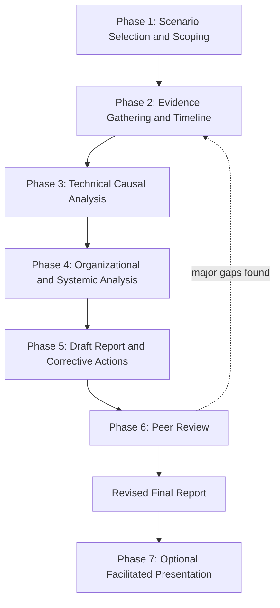

## Capstone Project: End to End Root Cause Investigation

### Overview

The capstone project synthesizes every skill and methodology developed across this curriculum into a single, self-directed, end-to-end root cause investigation. Where earlier practice problems isolated individual skills at increasing complexity tiers, this capstone requires the practitioner to execute a complete investigation—from initial scoping through evidence gathering, causal analysis, organizational-layer investigation, peer review, and final corrective-action reporting—against a single substantial scenario, mirroring the full lifecycle of a real-world professional RCA engagement.

### Capstone Objectives

**Key Points**

- Demonstrate independent application of structured causal analysis techniques (5 Whys, fishbone diagrams, or formal causal reasoning as appropriate to the scenario) without step-by-step guidance
- Demonstrate the ability to extend a causal chain beyond the proximate technical cause into organizational, procedural, or cultural root causes, consistent with the deepest recurring lesson of this curriculum's historical case studies
- Demonstrate investigative methodology awareness: appropriately scoping the investigation, preserving and citing evidence, and disclosing the investigation's own independence and any resulting limitations
- Demonstrate the ability to produce a complete, professional-quality RCA report that would withstand structured peer review, using the five-layer review framework covered elsewhere in this chapter
- Demonstrate honest representation of uncertainty where evidence is genuinely incomplete, rather than forcing false resolution

### Capstone Project Structure

**Phase 1: Scenario Selection and Scoping**

**Key Points**

- Select or receive a substantial investigation scenario — ideally one combining a technical failure with plausible organizational contributing factors, similar in structure (though smaller in scale) to the historical case studies covered in this curriculum
- Acceptable scenario sources include: a real incident from the practitioner's own professional context (with appropriate confidentiality handling), a detailed hypothetical scenario constructed to include multiple causal layers, or an assigned scenario from an instructor or certification body
- Define and document explicit scope: system/process boundaries, time window, and whether the investigation will address technical cause only or extend into organizational/process cause — applying the scoping discipline from the personal investigation checklist's Section 1

**Phase 2: Evidence Gathering and Timeline Reconstruction**

**Key Points**

- Collect and document all available evidence relevant to the scenario: technical data (logs, sensor readings, physical evidence, or their scenario-appropriate equivalents), documentation, and, where the scenario includes human/organizational elements, interview notes or documented statements
- Construct a factual, evidence-cited timeline of events before beginning causal analysis, explicitly separating this phase from causal reasoning per the investigative phase discipline established in the cross-case methodology comparison
- Where the scenario includes deliberately incomplete or ambiguous evidence (as recommended for realism), document explicitly what is known, what is inferred, and what remains genuinely uncertain

**Phase 3: Technical Causal Analysis**

**Key Points**

- Apply 5 Whys or fishbone diagram technique (selecting the appropriate tool based on whether the scenario presents a single linear cause or multiple parallel contributing factors, per the practice problem complexity tiers) to trace from the observed failure to its proximate technical cause
- Explicitly test each causal step against available evidence, and note where a proposed cause is well-supported versus only plausible
- Where relevant, apply observability-driven analysis techniques (trace/log/metric correlation) if the scenario involves a distributed technical system, or physical/chemical/mechanical analysis if the scenario is industrial in nature

**Phase 4: Organizational and Systemic Analysis**

**Key Points**

- Extend the causal chain explicitly past the technical layer, asking why the technical failure was possible, why it was not caught earlier, and why any relevant warning signs (if present in the scenario) were not escalated
- Explicitly check the scenario for a "normalization of deviance" pattern (a known-but-tolerated risk) and for schedule/cost/production pressure as a plausible contributing factor, consistent with the recurring patterns identified across the Challenger, Chernobyl, Bhopal, and product recall case studies
- Label each identified cause explicitly by category (technical, procedural, organizational/cultural), following the discipline established in the practice problems and checklist topics

**Phase 5: Draft Report and Corrective Actions**

**Key Points**

- Produce a complete written RCA report including: scope statement, timeline, evidence summary, causal chain (clearly distinguishing proximate from root causes), and corrective actions
- Ensure each corrective action maps explicitly to a specific identified root cause, is specific and assignable, and includes a proposed method for verifying effectiveness — applying the corrective-action validity discipline from the peer review topic
- Explicitly document the investigation's own scope limitations, independence level, and any evidence that remains disputed or unresolved, rather than presenting artificial certainty

**Phase 6: Peer Review**

**Key Points**

- Submit the draft report to a peer reviewer (or, if working independently, conduct a rigorous self-review after a deliberate time gap) using the five-layer review framework: factual/evidentiary review, causal chain integrity review, scope and completeness review, corrective action validity review, and transparency/uncertainty review
- Incorporate reviewer feedback into a revised report, explicitly noting what changed and why — this step deliberately mirrors the professional practice of iterative report revision following genuine critique, rather than treating the first draft as final

**Phase 7: Facilitated Presentation (Optional Extension)**

**Key Points**

- For practitioners also completing the facilitation practice topic, optionally present the capstone investigation's findings to a small group in a facilitated session format, practicing the presentation and question-handling skills relevant to real-world RCA delivery to stakeholders or leadership
- This phase specifically tests whether the practitioner can defend the causal chain and corrective actions under questioning, without retreating to overstated certainty or conceding well-supported conclusions under social pressure

### Capstone Workflow Diagram

### Evaluation Rubric

| Criterion | What Strong Work Demonstrates |
| --- | --- |
| Scoping | Clear, bounded, appropriately justified scope statement |
| Evidence Handling | All claims traceable to cited evidence; inference/speculation explicitly labeled |
| Timeline Discipline | Factual timeline constructed and reviewed before causal analysis began |
| Causal Chain Depth | Chain extends beyond first plausible explanation into genuine root cause; each step evidence-supported |
| Organizational Layer | Explicit identification of procedural/cultural factors, not only technical cause |
| Correlation vs. Causation | Confounding and spurious correlation explicitly considered and addressed |
| Corrective Action Quality | Actions specific, assignable, mapped to root causes, with verification method proposed |
| Uncertainty Representation | Disputed or incomplete evidence honestly disclosed, not forced into false resolution |
| Independence Disclosure | Investigation's own scope limitations and independence level explicitly stated |
| Report Clarity | Report would be comprehensible and actionable to a reader unfamiliar with the investigation process |

**Key Points**

- A capstone submission should be evaluated holistically against this rubric rather than scored as a checklist — the rubric criteria mirror the five-layer peer review framework directly, so a report prepared with that framework in mind from the outset should naturally satisfy most evaluation criteria
- The organizational layer and uncertainty representation criteria are typically where capstone submissions show the widest quality variance, consistent with the pattern noted in the peer review topic that technical/factual review tends to be more thorough than organizational-scope review by default — capstone evaluators should weight these criteria deliberately rather than letting strong technical analysis compensate for a shallow organizational layer

### Illustrative Capstone Scenario Sketch

**Key Points**

- A representative capstone scenario might combine elements across domains: a manufacturing quality defect (technical layer, similar in structure to the product recall case studies) that was identified in internal testing months before it caused a customer-facing failure (organizational escalation-failure layer, similar to the Takata pattern), compounded by a corrective action from a *prior*, superficially similar incident that had addressed only part of the underlying defect (incomplete-corrective-action layer, similar to the Samsung Note 7 pattern)
- Such a composite scenario deliberately forces the practitioner to apply multiple techniques from across this curriculum within a single investigation — 5 Whys for the technical chain, organizational analysis for the escalation failure, and corrective-action-scope checking for the prior-incident pattern — rather than practicing each skill in isolation as in the tiered practice problems

### Common Capstone Pitfalls

**Key Points**

- **Stopping at the technical cause**: producing a technically rigorous but organizationally shallow report, the single most common gap identified in peer review practice across this curriculum
- **Overstating certainty**: presenting a fully resolved causal narrative when the scenario's evidence genuinely supports only a partial or contested conclusion — a failure to apply the Bhopal-case lesson about honestly representing disputed evidence
- **Mismatched corrective actions**: proposing corrective actions that address a proximate symptom rather than the deepest identified root cause, repeating the specific failure pattern seen in the Samsung Note 7 case study's first, incomplete corrective action
- **Skipping timeline reconstruction**: moving directly into causal reasoning without first establishing an agreed, evidence-based timeline, leading to a report where sequencing and causation become conflated
- **Treating peer review as a formality**: submitting a draft for review without genuine openness to revision, then making only superficial changes rather than substantively addressing identified gaps

### Why This Matters as a Capstone

**Key Points**

- Integrates, in a single sustained exercise, every methodological layer this curriculum has built individually: historical pattern recognition, formal causal reasoning caution, technical and organizational analysis, facilitation awareness, peer review discipline, and professional reporting standards
- Most closely approximates the actual professional practice of RCA, which in real organizational contexts is never a single isolated skill applied in a vacuum but an integrated process spanning scoping, evidence handling, multi-layer causal analysis, review, and communication under real constraints of time, incomplete information, and organizational dynamics
- Provides a concrete, evaluable artifact — the completed and peer-reviewed capstone report — that can itself serve as a portfolio piece demonstrating RCA competency, complementing the external validation provided by the professional certifications covered elsewhere in this chapter

### Next Steps

- Building a personal root cause investigation checklist (use throughout all capstone phases)
- Peer review and critique of RCA reports (apply directly in Phase 6)
- Running mock RCA facilitation sessions (relevant to optional Phase 7)
- Relevant professional certifications and bodies (consider pursuing after capstone completion)
- Cross case comparison of investigative methodology (review before finalizing independence disclosure)
- Seeking a second, independent peer reviewer for a more rigorous evaluation of the final report