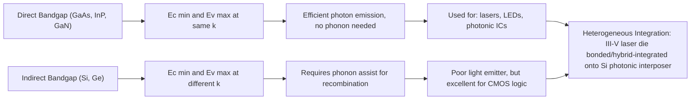

## Semiconductor Band Theory and Carrier Transport Fundamentals

### Overview

Semiconductor band theory describes how electrons occupy discrete energy bands within a crystalline solid, and carrier transport theory describes how electrons and holes move through that solid under electric fields, concentration gradients, and thermal gradients. For advanced packaging and heterogeneous integration engineers, this foundation governs device self-heating, interconnect resistivity, thermal budget constraints during bonding and reflow, electromigration in redistribution layers (RDL), and the electrical behavior of through-silicon vias (TSVs), micro-bumps, and hybrid bonding interfaces.

### Energy Band Formation

**Key Points**

- Isolated atoms have discrete electron energy levels. When $N$ atoms are brought into a crystal lattice, the Pauli exclusion principle forces each discrete level to split into $N$ closely spaced levels, forming a quasi-continuous energy band.
- The two bands most relevant to electrical behavior are the **valence band** (highest energy band that is normally fully occupied at 0 K) and the **conduction band** (next higher band, normally empty at 0 K).
- The **band gap** $E_g$ is the forbidden energy range between the top of the valence band ($E_v$) and the bottom of the conduction band ($E_c$): $E_g = E_c - E_v$.
- Materials are classified by $E_g$:
  - Conductors: bands overlap, $E_g \approx 0$
  - Semiconductors: $E_g$ typically 0.1–3.5 eV (Si: 1.12 eV, Ge: 0.66 eV, GaAs: 1.42 eV, GaN: 3.4 eV, SiC: 3.26 eV)
  - Insulators: $E_g > 4$ eV (SiO₂: ~9 eV)

**Band Diagram (svg_diagram)**

<svg xmlns="http://www.w3.org/2000/svg" viewBox="0 0 600 340">
\<style\>
.lbl{font-family:sans-serif;font-size:14px;fill:#1a1a1a;}
.small{font-family:sans-serif;font-size:12px;fill:#333;}
.title{font-family:sans-serif;font-size:16px;font-weight:bold;fill:#000;}
\</style\>
<text x="300" y="24" text-anchor="middle" class="title">Energy Band Diagrams (svg_diagram)</text>

<text x="80" y="55" text-anchor="middle" class="lbl">Conductor</text>

<rect x="30" y="70" width="100" height="60" fill="`#a8d5a2`" stroke="#333" />

<rect x="30" y="130" width="100" height="90" fill="`#f4c47a`" stroke="#333" />

<text x="80" y="105" text-anchor="middle" class="small">Conduction</text>

<text x="80" y="180" text-anchor="middle" class="small">Valence</text>

<text x="80" y="245" text-anchor="middle" class="small">Overlap, Eg = 0</text>

<text x="300" y="55" text-anchor="middle" class="lbl">Semiconductor</text>

<rect x="250" y="70" width="100" height="55" fill="`#a8d5a2`" stroke="#333" />

<rect x="250" y="125" width="100" height="30" fill="`#ffffff`" stroke="#333" stroke-dasharray="4,3" />

<rect x="250" y="155" width="100" height="65" fill="`#f4c47a`" stroke="#333" />

<text x="300" y="102" text-anchor="middle" class="small">Ec (Conduction)</text>

<text x="300" y="143" text-anchor="middle" class="small">Eg ~ 0.1-3.5 eV</text>

<text x="300" y="192" text-anchor="middle" class="small">Ev (Valence)</text>

<text x="300" y="245" text-anchor="middle" class="small">e.g. Si: 1.12 eV</text>

<text x="520" y="55" text-anchor="middle" class="lbl">Insulator</text>

<rect x="470" y="70" width="100" height="40" fill="`#a8d5a2`" stroke="#333" />

<rect x="470" y="110" width="100" height="80" fill="`#ffffff`" stroke="#333" stroke-dasharray="4,3" />

<rect x="470" y="190" width="100" height="30" fill="`#f4c47a`" stroke="#333" />

<text x="520" y="93" text-anchor="middle" class="small">Ec</text>

<text x="520" y="153" text-anchor="middle" class="small">Eg &gt; 4 eV</text>

<text x="520" y="208" text-anchor="middle" class="small">Ev</text>

<text x="520" y="245" text-anchor="middle" class="small">e.g. SiO2: ~9 eV</text>

<line x1="20" y1="230" x2="580" y2="230" stroke="#999" stroke-width="1" />
<text x="300" y="270" text-anchor="middle" class="small">Green = filled at 0K, Orange = empty at 0K, White = forbidden gap</text>
<text x="300" y="295" text-anchor="middle" class="small">Fermi level (Ef) position within/near gap determines carrier statistics</text>
</svg>

### Direct vs. Indirect Band Gap

**Key Points**

- Band structure is plotted as energy $E$ vs. crystal momentum $k$ (E-k diagram) within the first Brillouin zone.
- **Direct band gap**: the conduction band minimum and valence band maximum occur at the same $k$-value (e.g., GaAs, InP, GaN). Electron-hole recombination can emit a photon directly without a phonon, since momentum is conserved.
- **Indirect band gap**: the conduction band minimum and valence band maximum occur at different $k$-values (e.g., Si, Ge). Recombination requires a phonon to conserve momentum, making radiative recombination inefficient.
- Packaging relevance: this is why silicon photonics for optical interposers/co-packaged optics typically requires heterogeneous integration of III-V direct-bandgap lasers (InP, GaAs) bonded onto Si waveguide platforms — Si itself cannot efficiently lase.

### Carrier Statistics

**Key Points**

- **Intrinsic carrier concentration** $n_i$: in pure semiconductor, electrons in conduction band ($n$) equal holes in valence band ($p$):

$$n_i^2 = n \cdot p$$

- Temperature dependence:

$$n_i = \sqrt{N_c N_v} \, e^{-E_g / 2k_B T}$$

where $N_c$ and $N_v$ are effective densities of states in the conduction and valence bands, $k_B$ is Boltzmann's constant, $T$ is absolute temperature.

- $n_i$ (Si, 300 K) ≈ $1.5 \times 10^{10}$ cm⁻³; this rises exponentially with temperature — a critical concern during reflow/bonding thermal excursions (200–400°C) where leakage current can increase by orders of magnitude.
- **Fermi-Dirac distribution** gives the probability an energy state $E$ is occupied by an electron:

$$f(E) = \frac{1}{1 + e^{(E - E_f)/k_B T}}$$

- At $E = E_f$ (Fermi level), $f(E) = 0.5$ regardless of temperature.
- For non-degenerate semiconductors, the Boltzmann approximation applies when $E - E_f \gg k_B T$:

$$n = N_c \, e^{-(E_c - E_f)/k_B T}, \quad p = N_v \, e^{-(E_f - E_v)/k_B T}$$

### Doping and Extrinsic Semiconductors

**Key Points**

- **n-type**: donor impurities (Group V in Si — P, As, Sb) contribute extra electrons; donor level $E_d$ sits just below $E_c$. $E_f$ shifts toward $E_c$.
- **p-type**: acceptor impurities (Group III — B, Al, Ga, In) create holes; acceptor level $E_a$ sits just above $E_v$. $E_f$ shifts toward $E_v$.
- Charge neutrality condition (fully ionized dopants, no compensation):

$$n + N_a^- = p + N_d^+$$

- For n-type with $N_d \gg n_i$: $n \approx N_d$, and $p = n_i^2 / N_d$ (mass-action law holds even in extrinsic material).
- Doping concentration directly sets resistivity:

$$\rho = \frac{1}{q(n\mu_n + p\mu_p)}$$

where $q$ is elementary charge, $\mu_n$ and $\mu_p$ are electron and hole mobilities.

- Packaging relevance: doping profiles near TSV sidewalls and under micro-bumps must be controlled to avoid parasitic leakage paths; thermal budget from packaging processes (annealing, solder reflow) can cause dopant diffusion (especially B, which diffuses faster than As/P), shifting junction depths — a key reliability concern in 3D-IC stacking with fine-pitch TSVs.

### Carrier Transport: Drift

**Key Points**

- **Drift current** arises from carrier motion under an applied electric field $\mathcal{E}$.
- Drift velocity: $v_d = \mu \mathcal{E}$ (linear regime, low field).
- Drift current density:

$$J_{drift} = q(n\mu_n + p\mu_p)\mathcal{E} = \sigma \mathcal{E}$$

- **Mobility** $\mu$ depends on scattering mechanisms:
  - Phonon (lattice) scattering: dominates at higher temperature, $\mu \propto T^{-3/2}$ (approximate)
  - Ionized impurity scattering: dominates at high doping/low temperature, $\mu \propto T^{3/2}/N_{impurity}$
  - Surface/interface roughness scattering: significant in thin films, ultra-thin-body devices, and at bonded interfaces
- **Velocity saturation**: at high field ($\mathcal{E} > 10^4$ V/cm in Si), $v_d$ saturates near $10^7$ cm/s regardless of further field increase — relevant for short-channel and high-current-density interconnects (RDL traces, micro-bumps) where local field crowding occurs.
- [Inference] In advanced packaging RDL traces with sub-2 µm line/space, localized current crowding at via transitions can push effective field strengths into regimes where mobility degradation becomes non-negligible, though this is typically dominated by electromigration and Joule heating effects rather than pure velocity saturation in the metal itself (metals are degenerate conductors, not semiconductors, so band transport formalism applies differently there — see Note below).

**Note on metals vs. semiconductors in interconnects**: RDL traces, TSVs, and micro-bumps are metallic (Cu, Al, solder alloys), where conduction is governed by free-electron/Drude theory rather than semiconductor band transport. However, the semiconductor die itself (active transistor layers) remains governed by the band theory above, and metal-semiconductor contacts (Ohmic vs. Schottky) at the bump-under-pad and TSV-to-device interfaces are directly governed by band alignment — see Metal-Semiconductor Junctions below.

### Carrier Transport: Diffusion

**Key Points**

- **Diffusion current** arises from carrier concentration gradients, independent of electric field, driven by random thermal motion (Fick's law analog).
- Diffusion current density:

$$J_{n,diff} = qD_n \frac{dn}{dx}, \quad J_{p,diff} = -qD_p \frac{dp}{dx}$$

- **Einstein relation** links diffusion coefficient $D$ and mobility $\mu$:

$$\frac{D}{\mu} = \frac{k_B T}{q} = V_T$$

where $V_T$ is the thermal voltage (≈ 0.0259 V at 300 K).

- **Total current** (drift + diffusion) forms the basis of the drift-diffusion transport model used in device/TCAD simulation:

$$J_n = qn\mu_n\mathcal{E} + qD_n\frac{dn}{dx}$$

$$J_p = qp\mu_p\mathcal{E} - qD_p\frac{dp}{dx}$$

### Continuity Equations and Generation-Recombination

**Key Points**

- Carrier continuity (1D, including generation $G$ and recombination $R$):

$$\frac{\partial n}{\partial t} = \frac{1}{q}\frac{\partial J_n}{\partial x} + G_n - R_n$$

- **Recombination mechanisms**:
  - Radiative (band-to-band): dominant in direct-bandgap materials
  - Shockley-Read-Hall (SRH): via trap/defect states within the gap, dominant in indirect-gap Si, strongly affected by defect density
  - Auger: three-particle process, dominant at high carrier density
- **Minority carrier lifetime** $\tau$ and diffusion length $L_D = \sqrt{D\tau}$ govern how far minority carriers travel before recombining — critical for bipolar device performance and for photodiode/image-sensor die used in heterogeneously integrated sensor packages.
- Packaging relevance: thermal and mechanical stress from bonding processes (CTE mismatch, TSV-induced stress) creates dislocations and traps that increase SRH recombination, degrading minority carrier lifetime — a known mechanism for performance shift in stacked image sensors and power devices after packaging.

### Metal-Semiconductor Junctions (Ohmic and Schottky Contacts)

**Key Points**

- When a metal contacts a semiconductor, band bending occurs to align Fermi levels at equilibrium.
- **Schottky barrier height** (metal on n-type, simple Schottky-Mott model):

$$\phi_B = \phi_m - \chi$$

where $\phi_m$ is metal work function and $\chi$ is semiconductor electron affinity. [Inference] Real barrier heights frequently deviate from this simple model due to Fermi-level pinning from interface states, particularly pronounced in III-V and Ge contacts.

- **Ohmic contact** (low resistance, desired for interconnects/bumps): achieved via heavy doping ($N_d$ or $N_a > 10^{19}$ cm⁻³) at the contact to enable tunneling through a thin barrier, rather than thermionic emission over it.
- **Specific contact resistivity** $\rho_c$ (Ω·cm²) is a key figure of merit for under-bump-metallization (UBM), micro-bump landing pads, and TSV-to-device contacts; scales exponentially with barrier height and inversely with doping concentration.
- Packaging relevance: UBM stacks (e.g., Ti/Cu, Ti/Ni/Cu) are engineered specifically to form low-resistance Ohmic contacts to the device's heavily doped contact regions while acting as diffusion barriers against solder/Cu interdiffusion (preventing Cu or Sn spiking into the active silicon).

### Temperature Dependence Summary Relevant to Packaging Thermal Budgets

**Key Points**

- $E_g(T)$ decreases with increasing temperature (Varshni equation):

$$E_g(T) = E_g(0) - \frac{\alpha T^2}{T + \beta}$$

- Mobility generally decreases with temperature above ~100 K (phonon scattering dominates).
- $n_i$ increases exponentially with temperature — this drives leakage current increases during high-temperature packaging steps (solder reflow: 220–260°C for SAC alloys; thermocompression bonding: 300–400°C; wafer-level annealing).
- These effects underlie why **known-good-die (KGD) testing** and **thermal budget management** are first-order concerns in 2.5D/3D heterogeneous integration flows — repeated thermal excursions during multi-die stacking can cumulatively shift dopant profiles and degrade previously-qualified device characteristics.

### Worked Example

**Example**

For silicon at 300 K, doped n-type with $N_d = 10^{16}$ cm⁻³ (fully ionized, $N_d \gg n_i$):

1. Majority carrier electron concentration: $n \approx N_d = 10^{16}$ cm⁻³
2. Minority carrier hole concentration: $p = n_i^2/n = (1.5\times10^{10})^2 / 10^{16} = 2.25\times10^{4}$ cm⁻³
3. Using $\mu_n \approx 1350$ cm²/V·s (low-doping limit at 300 K) and $q = 1.6\times10^{-19}$ C:

$$\sigma \approx qn\mu_n = (1.6\times10^{-19})(10^{16})(1350) \approx 2.16 \ \Omega^{-1}\text{cm}^{-1}$$

$$\rho = 1/\sigma \approx 0.46 \ \Omega\cdot\text{cm}$$

4. Diffusion coefficient via Einstein relation: $D_n = \mu_n V_T = 1350 \times 0.0259 \approx 35 \ \text{cm}^2/\text{s}$

**Related Topics**

- Crystal structure and defects in semiconductor substrates (dislocations, stacking faults, point defects)
- Silicon vs. compound semiconductor (GaAs, GaN, SiC, InP) material properties for heterogeneous integration
- Metal-Oxide-Semiconductor (MOS) capacitor physics and band bending
- p-n junction physics, depletion region, and diode equation
- Electromigration and Black's equation for RDL/TSV reliability
- Coefficient of thermal expansion (CTE) mismatch and its effect on band structure via strain
- Wide-bandgap device thermal management in power packaging (GaN-on-Si, SiC modules)
- TCAD drift-diffusion simulation methodology
- Schottky vs. Ohmic contact engineering for micro-bump/UBM stacks
- Minority carrier lifetime degradation from thermomechanical stress during 3D stacking