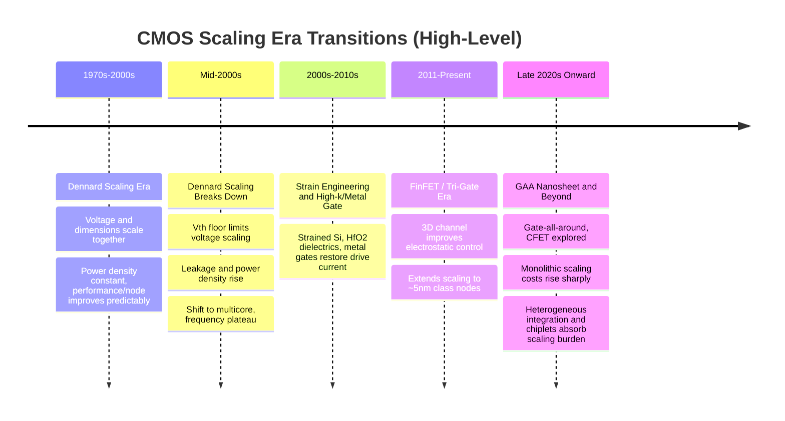
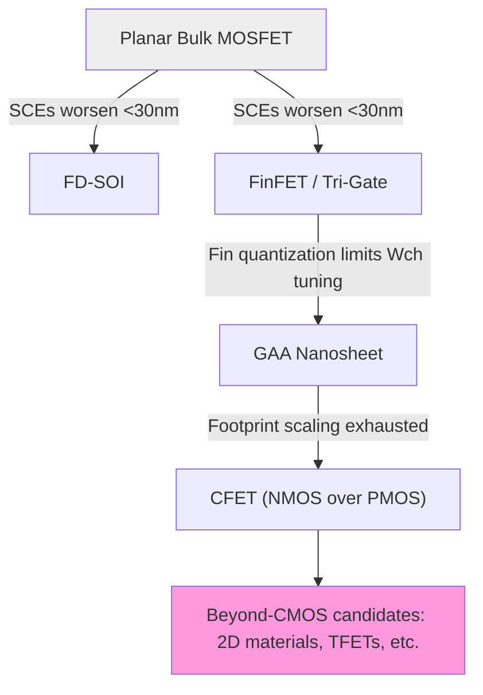

## CMOS Device Structure and Scaling Trends

### Overview

CMOS (Complementary Metal-Oxide-Semiconductor) technology pairs NMOS and PMOS transistors to build logic gates with near-zero static power dissipation. Understanding CMOS device structure and scaling is foundational for advanced packaging engineers because die-level design rules, power delivery requirements, thermal density, and interconnect parasitics all originate from the front-end transistor architecture that packaging must accommodate — and because scaling limits at the device level are a primary driver of the industry's shift toward heterogeneous integration (chiplets, 3D stacking) as an alternative to monolithic scaling.

### Basic MOSFET Structure

**Key Points**

- A MOSFET consists of four terminals: **Source**, **Drain**, **Gate**, and **Body/Substrate**.
- The gate is separated from the channel by a thin **gate dielectric** (historically SiO₂, now high-k materials like HfO₂ in advanced nodes).
- **NMOS**: n+ source/drain in a p-type body; channel formed by electrons (inversion layer) when $V_{GS} > V_{th}$.
- **PMOS**: p+ source/drain in an n-type body (n-well); channel formed by holes when $V_{GS} < V_{th}$ (negative threshold).
- **CMOS inverter**: NMOS pull-down + PMOS pull-up sharing gate input; only one device conducts in steady state for either logic level, giving near-zero static current (aside from leakage).

**Cross-Section Diagram (svg_diagram)**

<svg xmlns="http://www.w3.org/2000/svg" viewBox="0 0 620 320">
\<style\>
.lbl{font-family:sans-serif;font-size:13px;fill:#1a1a1a;}
.title{font-family:sans-serif;font-size:16px;font-weight:bold;fill:#000;}
.small{font-family:sans-serif;font-size:11px;fill:#333;}
\</style\>
<text x="310" y="22" text-anchor="middle" class="title">Bulk CMOS Inverter Cross-Section (svg_diagram)</text>

<rect x="30" y="200" width="560" height="80" fill="#d9c9a3" stroke="#333" />
<text x="310" y="290" text-anchor="middle" class="small">p-type Substrate</text>

<rect x="30" y="150" width="230" height="50" fill="#e3d3ad" stroke="#333" />
<text x="145" y="215" text-anchor="middle" class="small">(p-substrate = NMOS body)</text>

<rect x="320" y="150" width="270" height="50" fill="#cfe3f7" stroke="#333" />
<text x="455" y="180" text-anchor="middle" class="small">n-well (PMOS body)</text>

<rect x="55" y="165" width="35" height="35" fill="#8fb8e0" stroke="#333" />
<rect x="185" y="165" width="35" height="35" fill="#8fb8e0" stroke="#333" />
<text x="72" y="190" text-anchor="middle" class="small" fill="#fff">n+</text>
<text x="202" y="190" text-anchor="middle" class="small" fill="#fff">n+</text>
<text x="140" y="150" text-anchor="middle" class="small">NMOS</text>

<rect x="105" y="130" width="60" height="20" fill="#888" stroke="#333" />
<rect x="100" y="120" width="70" height="10" fill="#333" />
<text x="135" y="115" text-anchor="middle" class="small">Gate (poly/metal)</text>

<rect x="345" y="165" width="35" height="35" fill="#e0a3a3" stroke="#333" />
<rect x="475" y="165" width="35" height="35" fill="#e0a3a3" stroke="#333" />
<text x="362" y="190" text-anchor="middle" class="small">p+</text>
<text x="492" y="190" text-anchor="middle" class="small">p+</text>
<text x="430" y="150" text-anchor="middle" class="small">PMOS</text>

<rect x="395" y="130" width="60" height="20" fill="#888" stroke="#333" />
<rect x="390" y="120" width="70" height="10" fill="#333" />
<text x="425" y="115" text-anchor="middle" class="small">Gate</text>

<rect x="270" y="150" width="40" height="50" fill="#fff" stroke="#333" stroke-dasharray="3,2" />
<text x="290" y="230" text-anchor="middle" class="small">STI</text>
<line x1="30" y1="200" x2="590" y2="200" stroke="#333" stroke-width="1.5" />
<text x="310" y="310" text-anchor="middle" class="small">STI = Shallow Trench Isolation; interconnect stack (BEOL) sits above this, connecting to package bumps/RDL</text>
</svg>

### Threshold Voltage and I-V Characteristics

**Key Points**

- Threshold voltage (long-channel approximation):

$$V_{th} = V_{FB} + 2\phi_F + \frac{\sqrt{4q\epsilon_s N_a \phi_F}}{C_{ox}}$$

where $V_{FB}$ is flat-band voltage, $\phi_F$ is Fermi potential, $N_a$ is body doping, $C_{ox}$ is gate oxide capacitance per unit area.

- **Linear (triode) region** ($V_{DS} < V_{GS} - V_{th}$):

$$I_D = \mu_n C_{ox}\frac{W}{L}\left[(V_{GS}-V_{th})V_{DS} - \frac{V_{DS}^2}{2}\right]$$

- **Saturation region** ($V_{DS} \geq V_{GS} - V_{th}$):

$$I_D = \frac{1}{2}\mu_n C_{ox}\frac{W}{L}(V_{GS}-V_{th})^2(1+\lambda V_{DS})$$

where $\lambda$ is the channel-length modulation parameter.

- Gate oxide capacitance: $C_{ox} = \epsilon_{ox}/t_{ox}$ — thinner oxide increases drive current but increases gate leakage via tunneling.

### Classical Scaling (Dennard Scaling)

**Key Points**

- Dennard scaling (1974) proposed that if all dimensions and voltage scale by factor $1/\kappa$, key figures of merit improve predictably:

| Parameter | Scaling Factor |
| --- | --- |
| Dimensions (L, W, $t_{ox}$) | $1/\kappa$ |
| Voltage (V) | $1/\kappa$ |
| Doping concentration | $\kappa$ |
| Current per device | $1/\kappa$ |
| Capacitance | $1/\kappa$ |
| Delay ($\tau = CV/I$) | $1/\kappa$ |
| Power per device | $1/\kappa^2$ |
| Power density | Constant |

- This scaling law held reasonably well through roughly the mid-2000s, delivering simultaneous improvements in speed, density, and power without increasing power density.
- **Breakdown of Dennard scaling** (~90nm–65nm node, mid-2000s): supply voltage could no longer scale proportionally because threshold voltage could not scale down further without exponentially increasing subthreshold leakage. This caused power density to rise with each node rather than stay constant — the root cause of the industry's shift from frequency scaling to multicore/parallelism, and later a key driver toward heterogeneous integration.

### Short-Channel Effects

**Key Points**

- As channel length $L$ shrinks, gate control over the channel weakens relative to source/drain field influence, producing several short-channel effects (SCEs):
  - **Threshold voltage roll-off**: $V_{th}$ decreases as $L$ decreases, due to charge sharing between source/drain depletion regions and the channel.
  - **Drain-Induced Barrier Lowering (DIBL)**: increasing $V_{DS}$ lowers the source-side potential barrier, further reducing $V_{th}$ and increasing off-state leakage.
  - **Subthreshold swing (SS) degradation**: ideal SS is $\approx 60$ mV/decade at 300 K ($SS = \ln(10) \cdot k_BT/q \cdot (1 + C_{dep}/C_{ox})$); short-channel effects push SS above this ideal, increasing $I_{off}$ for a given $V_{th}$.
  - **Velocity saturation**: at high lateral fields, carrier velocity saturates rather than scaling linearly with field, reducing drive current below the classical square-law prediction — quasi-linear $I_D$-$V_{GS}$ behavior results instead.
  - **Punch-through**: source and drain depletion regions merge, causing uncontrolled current flow independent of gate bias.
- These effects collectively define the practical limits of planar bulk MOSFET scaling below ~30nm gate length, motivating the transition to 3D device architectures.

### Device Architecture Evolution

**Key Points**

**Planar Bulk MOSFET** (>28nm generation)

- Simplest structure; channel control from a single gate on top of a planar body.
- Limited electrostatic control at short channel lengths → severe SCEs.

**Planar FD-SOI (Fully Depleted Silicon-on-Insulator)**

- Thin silicon body sits on a buried oxide (BOX) layer, fully depleted (no body doping needed in channel).
- Improves electrostatic control via the thin body and enables back-gate biasing for dynamic $V_{th}$ tuning.
- Used by some foundries (e.g., GlobalFoundries, STMicroelectronics) as an alternative scaling path, notably relevant for RF/analog and low-power IoT chiplets in heterogeneous packages.

**FinFET (Tri-Gate)**

- Channel is a vertical silicon "fin"; gate wraps around three sides (top + two sidewalls), dramatically improving electrostatic control ($C_{gate}$ effectively triples per unit footprint vs. planar).
- Introduced at 22nm (Intel, 2011) and became the mainstream architecture through roughly the 5nm/3nm generation across major foundries.
- Fin height, width, and pitch become critical scaling parameters instead of just gate length.

**Gate-All-Around (GAA) / Nanosheet**

- Channel consists of stacked horizontal silicon nanosheets (or nanowires), with gate material wrapping fully around each sheet on all four sides.
- Provides the best electrostatic control of any planar-compatible architecture, enabling continued $V_{th}$ and leakage control at 3nm and below.
- Nanosheet width becomes a tunable parameter for drive current independent of pitch (unlike FinFET, where fin height/count are quantized).
- Adopted industry-wide starting around the 3nm/2nm generation (e.g., Samsung MBCFET, and foundry equivalents).
- [Unverified] Exact commercial timelines and naming conventions vary by foundry and are subject to change; consult current foundry PDK documentation for node-specific specifications.

**CFET (Complementary FET) — Emerging**

- Stacks NMOS directly on top of PMOS in the same footprint, sharing a vertical gate stack, to reduce cell area beyond what side-by-side nanosheet placement allows.
- [Speculation] Widely discussed as a candidate architecture for sub-2nm/1nm-class nodes in industry roadmaps, but not yet in high-volume production as of the most recent public roadmap disclosures; requires significant process innovation in vertical isolation and contact formation.

### Interconnect (BEOL) Scaling and Packaging Interface

**Key Points**

- As transistor density increases, Back-End-Of-Line (BEOL) metal pitch must also shrink, increasing wire resistance (due to smaller cross-section and increased surface/grain-boundary scattering in Cu at nanoscale dimensions) and RC delay, which can dominate over gate delay at advanced nodes.
- This RC bottleneck is a primary motivator for **die disaggregation**: instead of scaling one large monolithic die (with worsening yield and RC-dominated long-distance communication), designs are split into smaller chiplets connected via short, low-parasitic package-level interconnects (RDL, silicon interposers, hybrid bonding).
- **Middle-of-Line (MOL)** contact resistance (source/drain contact to first metal layer) has become a comparable or larger bottleneck than BEOL wire resistance at advanced nodes, directly affecting achievable drive current regardless of transistor intrinsic performance.
- Power delivery network (PDN) design at the package level (TSVs for power, backside power delivery schemes) is now co-optimized with front-end scaling because on-die IR drop budgets have tightened as supply voltages scale down toward ~0.6–0.7V while current density rises.

### Backside Power Delivery (Emerging Scaling Booster)

**Key Points**

- Traditional CMOS delivers power and signal routing from the same side (front side, above the transistors) — power and signal wires compete for BEOL routing resources.
- **Backside Power Delivery Network (BSPDN)**: power rails are moved to the wafer backside (after wafer flip and substrate thinning/TSV formation), freeing front-side BEOL layers entirely for signal routing and reducing IR drop by shortening the power delivery path.
- [Inference] This is generally regarded as one of the most significant near-term scaling boosters because it addresses PDN resistance/IR-drop limitations independent of further transistor-level shrink, though implementation details (nano-TSV process, wafer bonding/thinning flow) vary across foundry roadmaps and are evolving.
- Directly relevant to packaging: BSPDN requires wafer thinning, nano-TSV formation, and temporary/permanent wafer bonding — process steps that originate in what is traditionally "packaging" domain expertise, illustrating the ongoing convergence of front-end and back-end/packaging process technology.

### Why This Drives Heterogeneous Integration

**Key Points**

- Monolithic scaling faces compounding economic and physical constraints:
  1. Lithography cost per transistor is no longer reliably decreasing at advanced nodes (breakdown of classical Moore's Law cost scaling).
  2. Reticle size limits (~858 mm² max reticle field) cap monolithic die size, while larger die increases defect-limited yield loss.
  3. RC interconnect delay increasingly dominates over gate delay as wires shrink.
  4. Power density and thermal dissipation per unit area continue rising even as Dennard scaling no longer offsets it.
- **Heterogeneous integration response**: disaggregate a large SoC into smaller chiplets, each fabricated at the process node best suited to its function (e.g., logic at leading-edge node, analog/RF/SRAM at a trailing or specialized node), then reassemble via advanced packaging (2.5D interposer, 3D stacking, hybrid bonding, fan-out RDL).
- This shifts a substantial share of the performance/power/cost roadmap burden from front-end transistor scaling onto packaging and interconnect innovation — which is the central premise underlying modern advanced packaging as a discipline.

**Related Topics**

- Strain engineering and mobility enhancement (strained Si, SiGe source/drain)
- High-k/metal gate stack engineering and gate leakage mechanisms
- FinFET vs. GAA nanosheet process integration flows
- Contact resistance scaling and Middle-of-Line (MOL) engineering
- Backside power delivery network (BSPDN) process flow and packaging implications
- Chiplet disaggregation strategy and die-to-die interconnect (UCIe, BoW)
- 2.5D silicon interposer and 3D hybrid bonding architectures
- Reticle-limited die size and multi-die reticle stitching
- Power delivery network (PDN) co-design across die and package
- Moore's Law economics and node cost scaling trends