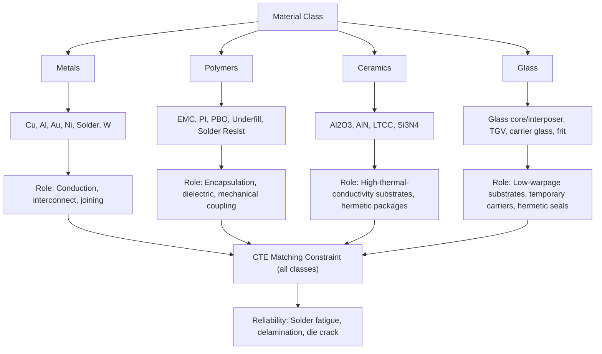

## Materials Science of Metals, Polymers, Ceramics, and Glass Used in Packaging

### Overview

Advanced packaging and heterogeneous integration draw on four major material classes — metals, polymers, ceramics, and glass — each selected for a specific combination of electrical conductivity, thermal conductivity, coefficient of thermal expansion (CTE), mechanical compliance, dielectric performance, and process compatibility. Package reliability failures overwhelmingly originate at material interfaces and CTE mismatches, making materials selection a first-order engineering decision rather than an afterthought.

### Metals in Packaging

**Key Points**

**Copper (Cu)**

- Primary interconnect metal for RDL, TSVs, and hybrid bonding pads.
- Bulk resistivity: ~1.68 µΩ·cm at 20°C; increases at nanoscale dimensions due to surface and grain-boundary scattering (relevant for fine-pitch RDL below ~2 µm).
- Electroplated via damascene or semi-additive process (SAP) methods.
- Electromigration resistance is superior to Al but still a key reliability concern at high current density (TSVs, micro-bumps), governed by Black's equation:

$$MTTF = A \cdot J^{-n} \cdot e^{E_a/k_BT}$$

where $J$ is current density, $E_a$ is activation energy (~0.7–0.9 eV for Cu), $n$ is typically 1–2.

**Aluminum (Al)**

- Legacy interconnect and bond pad metal; still used for final passivation-level pads in many processes due to good adhesion and established wire-bond compatibility.
- Lower conductivity than Cu (~2.65 µΩ·cm) and worse electromigration resistance, but avoids Cu diffusion-barrier requirements.

**Gold (Au)**

- Used in wire bonding (ball bonding), stud bumps, and as a surface finish (ENIG — Electroless Nickel Immersion Gold) for oxidation resistance and solderability.
- Excellent corrosion resistance but high cost limits use to fine-pitch/high-reliability applications.

**Solder Alloys (SAC, SnPb, etc.)**

- **SAC (Sn-Ag-Cu)**, e.g., SAC305 (96.5Sn/3.0Ag/0.5Cu): standard Pb-free solder for BGA balls, C4 bumps, reflow at ~230–260°C peak.
- **Eutectic SnPb** (63Sn/37Pb, melts at 183°C): still used in some high-reliability/aerospace/legacy applications where RoHS exemptions apply; lower reflow temperature reduces thermal stress on sensitive die.
- **Solder joint reliability** governed by intermetallic compound (IMC) growth (e.g., Cu₆Sn₅, Cu₃Sn) at the interface — excessive IMC thickness embrittles the joint; controlled by reflow profile and UBM design.
- **Micro-bumps** (Cu-pillar with SnAg cap): used for fine-pitch (<40 µm) die-to-die or die-to-interposer interconnect in 2.5D/3D stacking.

**Nickel (Ni)**

- Diffusion barrier layer in UBM stacks (prevents Cu-Sn or Au-Sn intermetallic runaway into the die); also used in ENEPIG (Electroless Nickel Electroless Palladium Immersion Gold) surface finishes.

**Tungsten (W)**

- High melting point, used for TSV fill in some processes (particularly mid-process/via-middle TSVs) and as a barrier/liner material; higher resistivity than Cu but better thermomechanical stability in certain integration schemes.

**Comparison Table**

| Metal | Resistivity (µΩ·cm) | CTE (ppm/°C) | Primary Packaging Role |
| --- | --- | --- | --- |
| Cu | 1.68 | 16.5 | RDL, TSV, hybrid bonding, micro-bump pillar |
| Al | 2.65 | 23.1 | Legacy bond pads, passivation-level metal |
| Au | 2.44 | 14.2 | Wire bonds, stud bumps, surface finish |
| Ni | 6.99 | 13.4 | UBM diffusion barrier |
| SAC305 solder | ~13 | ~21–25 | BGA balls, C4 bumps |
| W | 5.6 | 4.5 | TSV fill (via-middle), barrier layer |

### Polymers in Packaging

**Key Points**

**Epoxy Molding Compounds (EMC)**

- Primary encapsulant for fan-out wafer-level packaging (FOWLP) and standard plastic packages (QFN, BGA).
- Composed of epoxy resin + silica filler (typically 70–90 wt% filler loading) to reduce CTE toward silicon's value (~2.6 ppm/°C) and improve thermal conductivity.
- Key properties: CTE (often specified as $\alpha_1$ below $T_g$ and $\alpha_2$ above $T_g$), glass transition temperature $T_g$ (typically 120–180°C), moisture absorption (critical for "popcorn cracking" risk during reflow — see JEDEC MSL classification), flexural modulus.

**Polyimide (PI)**

- Widely used as a redistribution layer (RDL) dielectric and passivation/buffer coat.
- High thermal stability (decomposition >400°C), good electrical insulation, moderate CTE (~3–20 ppm/°C depending on formulation, chemistry, and cure — photosensitive vs. non-photosensitive grades differ significantly).
- Photosensitive polyimide (PSPI) enables direct lithographic patterning without a separate photoresist step, simplifying RDL build-up.

**Polybenzoxazole (PBO)**

- Increasingly preferred over polyimide for fine-pitch RDL dielectric due to lower moisture absorption, lower dielectric constant/loss, and better mechanical properties at advanced fan-out pitches.

**Underfill**

- Capillary or molded underfill dispensed between flip-chip die and substrate (or between stacked die) to mechanically couple the die and substrate, redistributing solder joint stress across the underfill rather than concentrating it at individual bumps — critical for solder joint fatigue life under thermal cycling.
- **Capillary underfill (CUF)**: dispensed after die attach, flows via capillary action; requires flow-optimized viscosity and filler particle size relative to bump pitch/gap.
- **Non-conductive film/paste (NCF/NCP)**: pre-applied underfill material used in thermocompression bonding (TCB) processes for fine-pitch 3D stacking, avoiding flow-related void risks of CUF at very fine pitch.
- **Molded underfill (MUF)**: underfill and mold encapsulation combined in a single molding step for cost/throughput efficiency.

**Solder Resist / Solder Mask**

- Patterned polymer layer defining solder-wettable pad openings on substrates/PCBs, preventing solder bridging.

**Adhesives (Die Attach Film, DAF)**

- Film or paste adhesives bonding die to substrate or die-to-die in stacked configurations; must balance thermal conductivity, cure temperature/time, and outgassing behavior.

### Ceramics in Packaging

**Key Points**

**Alumina (Al₂O₃)**

- Traditional ceramic substrate material for hybrid/multichip modules and high-reliability packages (military, automotive, RF).
- High thermal conductivity relative to organics (~20–30 W/m·K), excellent electrical insulation, good CTE match to some die materials, but higher dielectric constant than desired for high-frequency signal integrity and more brittle/costlier to process than organic laminates.

**Aluminum Nitride (AlN)**

- Very high thermal conductivity (~170–200 W/m·K, approaching some metals), used as substrate/heat-spreader material for power electronics packages (e.g., SiC/GaN power modules) where thermal dissipation dominates the design.
- CTE (~4.5 ppm/°C) reasonably matched to Si/SiC, reducing thermal cycling stress.

**Low-Temperature Co-fired Ceramic (LTCC)**

- Multilayer ceramic tape system co-fired at relatively low temperature (~850–900°C, compatible with Ag/Au internal conductors), enabling embedded passives (inductors, capacitors, filters) within the substrate — common in RF module packaging.

**Silicon Nitride (Si₃N₄)**

- High thermal conductivity, high mechanical strength, used as substrate for high-power modules (e.g., automotive/traction inverter power packages) where thermal cycling durability is critical.

**Glass-Ceramics**

- Hybrid materials combining ceramic filler in a glass matrix, used to tune CTE and dielectric properties for specific substrate applications.

### Glass in Packaging

**Key Points**

**Glass Core Substrates / Glass Interposers**

- Emerging alternative to organic (build-up film) and silicon interposers for 2.5D packaging; offers a CTE tunable via composition (can be matched closely to Si), very high dimensional stability/flatness (important for large-panel processing and warpage control), and excellent electrical insulation enabling low-loss high-frequency routing.
- **Through-Glass Vias (TGV)**: analogous to TSVs but formed in glass, typically via laser-induced modification followed by etching, or laser drilling followed by metallization (Cu fill or seed + plate).
- [Inference] Glass substrates are widely regarded as a promising path for large-panel, high-density, low-warpage 2.5D/3D packaging (notably discussed for large AI accelerator packages), though commercial high-volume manufacturing maturity, panel-level yield, and TGV aspect-ratio process windows are still developing industry-wide as of the most recent public roadmap disclosures — specifics vary by supplier (Corning, AGC, SCHOTT, and others each pursue different glass compositions and TGV processes).

**Borosilicate and Fused Silica Glass**

- Used for glass carrier wafers in temporary bonding/debonding processes (supporting thin wafers during backside processing), and as cover glass/lids in MEMS and optical packages.

**Glass Frit / Sealing Glass**

- Low-melting glass compositions used for hermetic sealing of MEMS, sensors, and optoelectronic packages, forming a hermetic bond between substrate and lid at moderate temperatures without organic outgassing concerns.

### CTE Matching: The Central Materials Design Constraint

**Key Points**

- CTE mismatch between joined materials generates stress during any thermal excursion (reflow, thermal cycling in the field, thermocompression bonding); this stress accumulates as fatigue damage in solder joints, delamination at interfaces, or die cracking.

| Material | CTE (ppm/°C, approx.) |
| --- | --- |
| Silicon | 2.6 |
| Copper | 16.5 |
| FR-4 (organic PCB laminate) | 14–17 (x-y), 50–70 (z-axis) |
| Alumina | 6.5–7.0 |
| AlN | 4.5 |
| Glass (tunable) | 3–9 (composition dependent) |
| EMC (filled) | 6–14 (design dependent) |
| SAC305 solder | 21–25 |

- Package designers deliberately select filler loading in EMC, glass composition, or ceramic choice specifically to bring the composite CTE closer to silicon, minimizing the mismatch-driven stress at the die-to-package interface.
- [Inference] This is a primary reason glass and ceramic substrates are gaining renewed attention for large-die/large-package 2.5D and 3D integration: organic substrates' relatively high and often anisotropic CTE becomes increasingly difficult to manage as package/die area scales up, since absolute displacement from CTE mismatch scales with the distance from the neutral point.

### Reliability Testing Context

**Key Points**

- Materials selections are ultimately validated via standardized reliability tests: temperature cycling (TC, e.g., -40°C to 125°C), thermal shock, highly accelerated stress test (HAST) and unbiased-HAST for moisture/corrosion resistance, and moisture sensitivity level (MSL) classification per JEDEC J-STD-020 for reflow-induced popcorn cracking risk.
- Material datasheet values (CTE, modulus, $T_g$, moisture uptake) feed directly into finite-element thermomechanical simulation used to predict solder joint fatigue life and warpage before physical qualification.

**Related Topics**

- Warpage prediction and control in multi-material stacks (Suhir/Stoney equation applications)
- Underfill flow simulation and void-free fine-pitch dispensing
- Through-Glass Via (TGV) formation processes (laser-induced etching, laser drilling)
- JEDEC moisture sensitivity level (MSL) classification and popcorn cracking mechanism
- Solder joint fatigue modeling (Coffin-Manson, Engelmaier equations)
- Electromigration and Black's equation for metal interconnect reliability
- UBM (Under-Bump Metallization) stack design and diffusion barrier engineering
- High-k/low-k dielectric selection for RDL and interposer routing
- Hermetic packaging and glass frit sealing processes for MEMS/optoelectronics
- CTE-driven design-for-reliability (DFR) methodology in 2.5D/3D package design