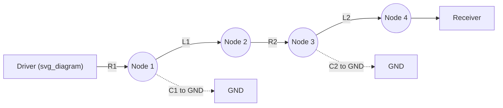

## Electrical Fundamentals: Resistance, Capacitance, and Inductance in Interconnects

### Overview

Interconnects in advanced packaging — redistribution layers (RDL), through-silicon vias (TSVs), micro-bumps, hybrid bonds, and package traces — behave as distributed electrical networks rather than ideal wires. As feature sizes shrink and interconnect density rises with 2.5D/3D integration, parasitic resistance (R), capacitance (C), and inductance (L) increasingly dominate signal integrity, power delivery, and thermal-electrical co-design. Understanding RLC behavior at the interconnect level is foundational to chiplet architectures, HBM stacking, and fan-out packaging.

### Resistance in Interconnects

**Bulk Resistance**

The DC resistance of a conductor segment is:

$$R = \rho \frac{L}{A}$$

where $\rho$ is resistivity, $L$ is length, and $A$ is cross-sectional area. In interconnects, $A$ shrinks aggressively with scaling while $L$ (routing distance) often stays constant or grows, driving resistance up.

**Key Points**

- Copper ($\rho \approx 1.68\times10^{-8}\ \Omega \cdot m$) is the dominant interconnect metal due to low resistivity and electromigration resistance versus aluminum.
- TSV resistance depends on via diameter, depth (aspect ratio), and liner/barrier thickness (Ta/TaN barriers add series resistance without contributing to conduction).
- Micro-bump and hybrid-bond interfaces introduce contact resistance at the metal-metal interface, sensitive to surface roughness, oxide residue, and bonding temperature/pressure.

**Skin Effect and Frequency-Dependent Resistance**

At high frequencies, current crowds toward the conductor surface, reducing effective cross-sectional area and increasing AC resistance:

$$\delta = \sqrt{\frac{2\rho}{\omega \mu}}$$

where $\delta$ is skin depth, $\omega$ is angular frequency, and $\mu$ is permeability. For copper, $\delta \approx 2\ \mu m$ at 1 GHz. Interconnect traces with cross-sections comparable to or larger than $\delta$ show significant AC resistance rise above DC values — relevant for high-speed SerDes channels and RF packaging.

**Resistivity Size Effects**

At advanced nodes and thin RDL traces, resistivity increases above bulk values due to:

- **Surface scattering** (Fuchs-Sondheimer model): electrons scatter off conductor boundaries when line width/thickness approaches the electron mean free path (~39 nm for Cu).
- **Grain boundary scattering** (Mayadas-Shatzkes model): smaller grains in thin films increase scattering events.

[Inference] These size effects become significant for RDL line widths below approximately 2 µm, though exact thresholds are process- and grain-structure-dependent.

**Electromigration Considerations**

Current density in fine-pitch interconnects (especially micro-bumps and TSVs) can approach electromigration failure thresholds, where sustained current flow causes metal atom migration, void formation, and eventual open-circuit failure. This is a reliability constraint tightly coupled to resistance/current-density design margins.

### Capacitance in Interconnects

**Parallel-Plate and Fringing Capacitance**

Basic parallel-plate capacitance:

$$C = \varepsilon \frac{A}{d}$$

where $\varepsilon = \varepsilon_0 \varepsilon_r$ is the permittivity of the dielectric, $A$ is overlap area, and $d$ is separation. Real interconnect geometries (adjacent traces, via-to-via, trace-to-plane) require field-solver or empirical models because fringing fields contribute significantly at fine pitch.

**Capacitance Components in Package Interconnects**

- **Line-to-ground (vertical) capacitance**: trace to reference plane, scales inversely with dielectric thickness.
- **Line-to-line (lateral/coupling) capacitance**: dominant at fine pitch; scales roughly inversely with spacing, driving crosstalk.
- **TSV capacitance**: MOS-like structure (via metal / liner oxide / silicon substrate) exhibiting bias-dependent (nonlinear) C-V behavior due to depletion region modulation in the silicon, distinct from simple dielectric capacitors.
- **Bump/pad capacitance**: parasitic capacitance from bump pad to substrate, relevant in RF and high-speed digital I/O.

**Dielectric Material Impact**

Low-$\varepsilon_r$ dielectrics (polyimide, PBO, low-k SiOC) reduce capacitance and improve signal speed and crosstalk margins. Typical relative permittivities:

| Material | $\varepsilon_r$ (approximate) |
| --- | --- |
| SiO₂ | 3.9–4.2 |
| Polyimide | 3.0–3.5 |
| PBO | 2.9–3.2 |
| Low-k SiOC | 2.5–3.0 |
| Air/vacuum | 1.0 |

[Unverified] Exact $\varepsilon_r$ values vary by formulation, cure conditions, and frequency; consult supplier datasheets for design-grade values.

**Crosstalk**

Coupling capacitance between adjacent signal lines induces crosstalk noise proportional to $C_{mutual} \frac{dV}{dt}$. In dense RDL and micro-bump arrays, crosstalk management drives design rules for minimum spacing, shielding traces, and differential routing.

### Inductance in Interconnects

**Self and Mutual (Partial) Inductance**

Unlike R and C, inductance is inherently a loop property, but package/interconnect analysis uses **partial inductance** to assign inductance contributions to individual segments (Rosa's partial inductance formulation), enabling per-segment modeling that sums correctly when loops are reconstructed.

Approximate self-inductance of a straight round wire segment:

$$L \approx \frac{\mu_0 l}{2\pi}\left[\ln\left(\frac{2l}{r}\right) - \frac{3}{4}\right]$$

where $l$ is length and $r$ is radius — illustrating the logarithmic, geometry-dependent nature of inductance (exact formulas vary by conductor cross-section).

**Sources of Inductance in Packaging**

- **Bond wires**: historically the largest inductance contributor (~0.5–1 nH/mm) due to long, thin, high-aspect-ratio geometry — a key driver behind the shift to flip-chip and wirebond-free architectures.
- **TSVs**: much lower inductance than bond wires due to short vertical length (tens to hundreds of µm), a major motivation for 3D stacking in power-sensitive designs.
- **Micro-bumps and hybrid bonds**: minimal inductance given very short interconnect length, beneficial for high-frequency signal integrity.
- **Package traces and power/ground planes**: inductance depends on current loop area; wide planes with tight signal-return coupling minimize loop inductance.

**Mutual Inductance and Loop Behavior**

Adjacent current-carrying paths induce mutual inductance, affecting simultaneous switching noise (SSN) and return-path design. Minimizing loop area (signal trace tightly coupled to a return/ground plane) is the primary design lever for reducing effective loop inductance.

**Power Delivery Network (PDN) Impact**

Inductance in power/ground interconnects (TSVs, bumps, planes) causes voltage droop under transient current demand:

$$\Delta V = L \frac{di}{dt}$$

This "$Ldi/dt$ noise" is a critical constraint in high-performance chiplet designs with fast switching currents, motivating low-inductance TSV-based power delivery and on-die/in-package decoupling capacitors.

### Distributed RLC Modeling

At the frequencies and geometries relevant to advanced packaging, interconnects are modeled as **distributed RLC (or RLGC, including conductance $G$ for dielectric loss) transmission lines** rather than lumped elements once electrical length becomes a non-negligible fraction of signal wavelength — a threshold commonly (though loosely) associated with trace lengths exceeding roughly one-tenth of the signal's rise-time-equivalent wavelength.

**Lumped vs. Distributed Regime**

A simple rule of thumb: if the interconnect delay ($t_{delay} = l/v$) is small relative to the signal rise time ($t_r$), lumped RC/RLC modeling suffices; otherwise, transmission-line (distributed) analysis is required.

$$t_{delay} \ll t_r \Rightarrow \text{lumped model valid}$$

**Characteristic Impedance**

For a distributed line:

$$Z_0 = \sqrt{\frac{R + j\omega L}{G + j\omega C}}$$

approaching $\sqrt{L/C}$ at high frequency (low-loss limit). Impedance matching between die, interposer, and package interconnects minimizes reflections — critical in HBM and SerDes channel design.

**Elmore Delay Model**

For RC-dominated on-chip/RDL interconnects, the Elmore delay approximates propagation delay through a resistive-capacitive network:

$$t_{Elmore} = \sum_i R_i \sum_{j \geq i} C_j$$

This model, widely used in interconnect timing analysis, illustrates how distributed resistance and capacitance jointly determine signal delay — motivating repeater insertion and buffer placement strategies for long RDL/interposer routes.

### Diagram: RLC Interconnect Segment Model (svg_diagram)

### Worked Example: Micro-bump Interconnect Estimation

**Example**

Consider a copper micro-bump, diameter 20 µm, height 15 µm, connecting a chiplet to an interposer.

- **Resistance**: Using $R = \rho L/A$ with $\rho_{Cu} = 1.68\times10^{-8}\ \Omega\cdot m$, $L = 15\ \mu m$, $A = \pi (10\ \mu m)^2 \approx 3.14\times10^{-10}\ m^2$:

$$R \approx \frac{1.68\times10^{-8} \times 15\times10^{-6}}{3.14\times10^{-10}} \approx 0.8\ m\Omega$$

- **Inductance**: [Inference] For such short, wide interconnects, partial self-inductance is typically in the low tens of picohenries or less, making micro-bump inductance a minor contributor relative to bond-wire alternatives (~nH-scale).
- **Capacitance**: Dominated by bump-to-substrate and adjacent-bump coupling terms, typically in the low femtofarad range per bump, requiring extraction tools (field solvers) for accurate values rather than closed-form estimation given complex fringing geometry.

[Unverified] Exact values depend heavily on process stack-up, underfill dielectric, and neighboring bump pitch; production designs rely on parasitic extraction (PEX) tools calibrated to measured silicon.

### Design Implications for Advanced Packaging

- **Fine-pitch scaling** increases resistance and capacitance per unit length, requiring co-optimization of pitch, metal thickness, and dielectric selection.
- **3D integration (TSV, hybrid bonding)** substantially reduces R, L, and C relative to 2D wirebond/flip-chip paths, improving bandwidth density and power efficiency — a primary driver for HBM and chiplet stacking.
- **Power delivery network design** prioritizes minimizing series R and L in vertical interconnects to limit IR drop and $Ldi/dt$ noise under high transient current demands from AI/HPC dies.
- **Signal integrity** for high-speed I/O (SerDes, HBM PHY) requires impedance-controlled routing, crosstalk-aware spacing, and return-path continuity across die-interposer-substrate transitions.

### Related Topics

- Transmission line theory and S-parameter characterization for package interconnects
- TSV electrical modeling (MOS C-V behavior, liner oxide effects)
- Power delivery network (PDN) design and decoupling capacitor placement
- Signal integrity: crosstalk, reflections, and eye-diagram analysis in 2.5D/3D packages
- Electromigration and reliability limits in fine-pitch interconnects
- Skin effect and proximity effect in high-frequency package routing
- Parasitic extraction (PEX) methodologies for advanced packaging
- Low-k/low-$\varepsilon_r$ dielectric materials for RDL and interposer layers