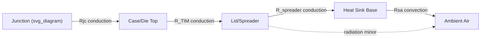

## Thermal Engineering Fundamentals: Conduction, Convection, and Radiation

### Overview

Thermal management is a first-order constraint in advanced packaging, where 2.5D/3D integration, chiplet stacking, and increasing power density create localized hot spots that limit performance, reliability, and lifetime. Heat transfer occurs through three fundamental mechanisms — conduction, convection, and radiation — each governing different stages of the thermal path from silicon junction to ambient. Understanding these mechanisms quantitatively is essential for thermal-aware package design, material selection, and system-level cooling architecture.

### Conduction

**Fourier's Law**

Conduction is heat transfer through a solid (or stationary fluid) via molecular/lattice vibration and electron transport, without bulk material motion. The governing relation is Fourier's Law:

$$q = -k \nabla T$$

For 1D steady-state conduction through a slab:

$$Q = k A \frac{\Delta T}{L}$$

where $Q$ is heat flow (W), $k$ is thermal conductivity (W/m·K), $A$ is cross-sectional area, $\Delta T$ is temperature difference, and $L$ is conduction path length.

**Thermal Resistance (Conduction)**

Analogous to electrical resistance:

$$R_{th} = \frac{L}{kA}$$

with units K/W. This electrical-thermal analogy allows thermal networks to be analyzed using circuit techniques (series/parallel resistance combination, thermal RC networks for transient analysis).

**Key Points**

- Silicon: $k \approx 130$–$150\ W/m\cdot K$ (decreases with temperature and doping).
- Copper: $k \approx 385$–$400\ W/m\cdot K$, widely used for heat spreaders and TSV thermal vias.
- Silicon dioxide (interlayer dielectric): $k \approx 1.4\ W/m\cdot K$ — a significant thermal bottleneck in BEOL stacks.
- Mold compounds (EMC): $k \approx 0.5$–$1\ W/m\cdot K$, thermally resistive relative to metals.
- Thermal interface materials (TIMs): $k \approx 1$–$80\ W/m\cdot K$ depending on formulation (greases, gels, sintered metal, liquid metal TIMs at the high end).

**Interfacial (Contact) Thermal Resistance**

Real interfaces between mating surfaces (die-to-TIM, TIM-to-lid, bump-to-substrate) introduce additional resistance due to microscopic air gaps from surface roughness:

$$R_{contact} = \frac{1}{h_c A}$$

where $h_c$ is contact conductance. TIM selection and bond-line thickness (BLT) minimization directly reduce this resistance — a critical lever in package thermal design.

**Anisotropic Conduction in Packaging Stacks**

Many package materials (laminates, mold compounds with fillers, TSV arrays) exhibit direction-dependent thermal conductivity — higher in-plane vs. through-plane, or vice versa depending on filler orientation and via density. [Inference] TSV arrays generally enhance vertical (through-silicon) conduction significantly relative to bulk dielectric fill, since copper's conductivity exceeds silicon dioxide by roughly two orders of magnitude, though the effective enhancement depends on via density, pitch, and aspect ratio.

**Thermal Vias and Heat Spreading**

In 2.5D/3D packages, dedicated thermal TSVs (distinct from signal/power TSVs) and copper heat spreaders provide low-resistance vertical and lateral conduction paths to move heat from hot dies (e.g., logic) toward the package lid or heat sink, bypassing lower-conductivity dielectric and mold layers.

### Convection

**Newton's Law of Cooling**

Convection transfers heat between a solid surface and a moving fluid (air, liquid coolant):

$$Q = h A (T_s - T_\infty)$$

where $h$ is the convective heat transfer coefficient (W/m²·K), $A$ is surface area, $T_s$ is surface temperature, and $T_\infty$ is fluid ambient temperature.

**Natural vs. Forced Convection**

- **Natural (free) convection**: fluid motion driven by buoyancy from density gradients (heated air rising). Typical $h \approx 5$–$25\ W/m^2\cdot K$ for air.
- **Forced convection**: fluid motion driven externally (fans, pumps). Typical $h \approx 25$–$250\ W/m^2\cdot K$ for air-cooled heat sinks; $h \approx 100$–$20{,}000\ W/m^2\cdot K$ for liquid cooling, depending on flow regime and channel geometry.

**Key Points**

- Heat sink design (fin geometry, fin density, airflow rate) directly governs effective $h$ and total convective surface area.
- Liquid cooling (cold plates, microchannel coolers, immersion cooling) is increasingly used in high-power AI/HPC packages where air cooling cannot dissipate sufficient heat flux.
- Convective thermal resistance: $R_{conv} = \frac{1}{hA}$, combined in series with conduction resistances to form the full junction-to-ambient thermal path.

**Fluid Flow Regime Impact**

Convective heat transfer coefficient depends on flow characteristics captured by dimensionless numbers:

- **Reynolds number** ($Re$): laminar vs. turbulent flow — turbulent flow generally increases $h$ due to enhanced mixing.
- **Prandtl number** ($Pr$): ratio of momentum to thermal diffusivity, fluid-property dependent.
- **Nusselt number** ($Nu$): dimensionless convective heat transfer, empirically correlated to $Re$ and $Pr$ for specific geometries (e.g., $Nu = 0.023\,Re^{0.8}Pr^{0.4}$ for turbulent flow in tubes, Dittus-Boelter correlation).

[Unverified] Specific correlation coefficients vary by flow geometry, surface roughness, and channel configuration; microchannel cold-plate designs for package-level liquid cooling typically require CFD simulation or empirical characterization rather than closed-form correlations alone.

### Radiation

**Stefan-Boltzmann Law**

Radiative heat transfer occurs via electromagnetic emission, requiring no medium:

$$Q = \varepsilon \sigma A (T_s^4 - T_{surr}^4)$$

where $\varepsilon$ is surface emissivity (0 to 1), $\sigma = 5.67\times10^{-8}\ W/m^2 K^4$ is the Stefan-Boltzmann constant, and $T$ values are in Kelvin.

**Relevance to Package-Level Thermal Design**

[Inference] Radiation is generally a minor contributor to total heat dissipation in typical package-level and board-level thermal budgets, because temperature differentials in electronics cooling are modest and radiation scales with the fourth power of absolute temperature — making it small relative to conduction and forced convection except in vacuum or low-airflow natural-convection-dominated environments (e.g., space-qualified electronics, certain natural-convection enclosures).

**Key Points**

- Emissivity depends on surface finish and material: polished metals have low $\varepsilon$ (~0.02–0.1), while oxidized or coated surfaces have higher $\varepsilon$ (~0.8–0.95).
- Radiation becomes proportionally more significant in low-airflow or vacuum environments (e.g., satellite electronics), where convection is absent or minimal.

### Combined Thermal Resistance Network (Junction-to-Ambient)

The total thermal path from die junction to ambient combines conduction and convection resistances in series (and sometimes parallel, for multiple heat paths):

$$R_{ja} = R_{jc} + R_{c-TIM} + R_{TIM} + R_{TIM-lid} + R_{spreader} + R_{sa}$$

where $R_{jc}$ is junction-to-case, and $R_{sa}$ is sink-to-ambient (convective). This series-resistance model is the standard first-order framework for package thermal budgeting, though 3D/2.5D stacks with multiple dies require full 3D thermal simulation due to lateral heat spreading and multi-path conduction.

**Junction Temperature Estimation**

$$T_j = T_a + Q \times R_{ja}$$

where $Q$ is total power dissipation. This relation drives package-level power budgets and cooling solution selection.

### Diagram: Junction-to-Ambient Thermal Resistance Network (svg_diagram)

### Worked Example: Junction-to-Ambient Thermal Budget

**Example**

A chiplet dissipates 15 W. Given:

- $R_{jc} = 0.15\ K/W$ (die to lid, through TIM1)
- $R_{TIM,lid-sink} = 0.10\ K/W$ (TIM2, lid to heat sink)
- $R_{sa} = 0.5\ K/W$ (heat sink to ambient, forced convection)

Total: $R_{ja} = 0.15 + 0.10 + 0.5 = 0.75\ K/W$

With ambient $T_a = 45\,^{\circ}C$:

$$T_j = 45 + (15 \times 0.75) = 56.25\,^{\circ}C$$

If the junction temperature limit is $105\,^{\circ}C$, this design has significant thermal margin. [Inference] In practice, multi-die 3D stacks with buried or middle-tier dies face substantially tighter margins because heat must traverse additional layers before reaching the ambient-facing convective path, often requiring dedicated thermal vias or backside cooling solutions for the buried die.

### Design Implications for Advanced Packaging

- **3D stacking thermal bottleneck**: dies buried within a stack (e.g., logic-on-logic, HBM-on-logic) have longer, higher-resistance conduction paths to the package exterior, motivating thermal TSV insertion, backside heat spreaders, or liquid cooling integration directly into the stack.
- **TIM selection and bond-line control**: minimizing BLT and selecting high-$k$ TIMs (including emerging liquid-metal and sintered-silver TIMs) directly reduces interfacial resistance, often a dominant term in the total thermal budget.
- **Power density trends**: AI/HPC chiplets increasingly exceed 1000 W per package, pushing designs toward liquid cooling (cold plates, microchannels) and, in extreme cases, immersion cooling, since air-cooled convective resistance cannot meet junction temperature targets.
- **Co-design with electrical and mechanical domains**: thermal vias compete for routing space with electrical TSVs; CTE mismatches from thermal gradients drive mechanical stress (see thermo-mechanical reliability), requiring integrated multi-physics design rather than isolated thermal analysis.

### Related Topics

- Thermal interface materials (TIMs): types, selection criteria, and reliability
- Thermal via and heat spreader design in 2.5D/3D packages
- Liquid cooling architectures: cold plates, microchannels, immersion cooling
- Thermo-mechanical stress and CTE mismatch in stacked die
- Chip-package interaction (CPI) and thermal-induced warpage
- Transient thermal analysis and thermal RC network modeling
- Power density trends in AI/HPC chiplet packaging
- Electrical-thermal co-design and thermal-aware floorplanning