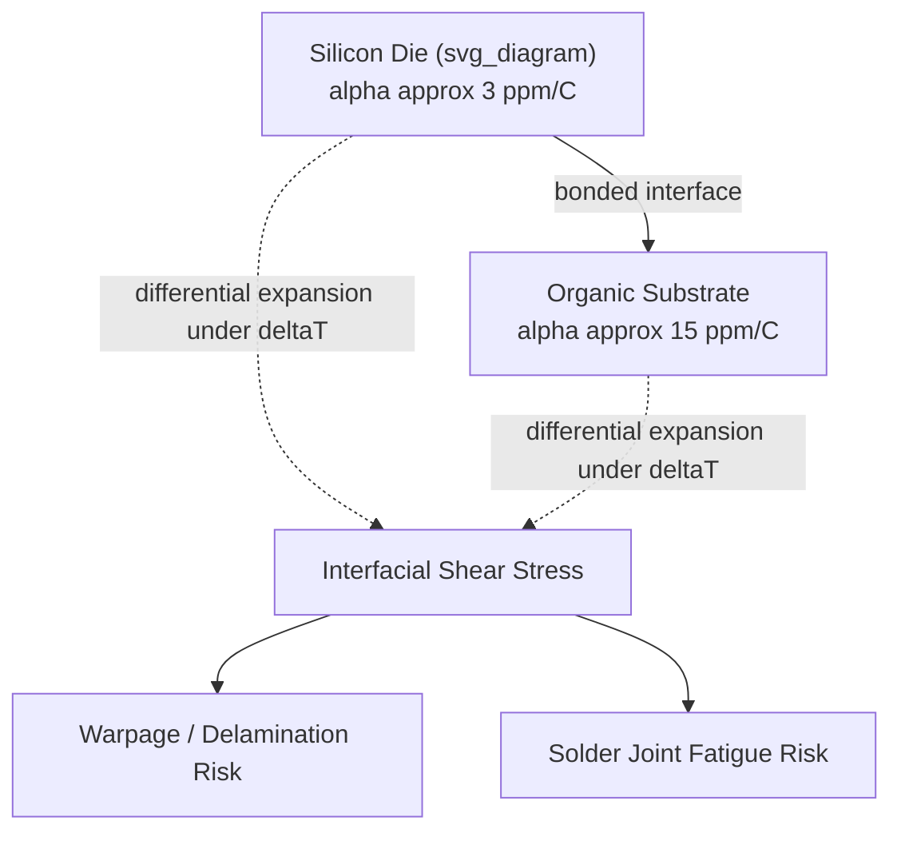

## Mechanical Engineering Fundamentals: Stress, Strain, and CTE Mismatch

### Overview

Mechanical reliability is a central constraint in advanced packaging, where dissimilar materials — silicon, copper, mold compound, laminate substrates, solder, dielectrics — are bonded together and subjected to thermal cycling, assembly processes, and operational loads. Stress and strain arising from mechanical loading and coefficient of thermal expansion (CTE) mismatch drive warpage, delamination, cracking, and interconnect fatigue failures. Quantitative understanding of these mechanics underpins material selection, stack-up design, and reliability qualification in 2.5D/3D heterogeneous integration.

### Stress and Strain Fundamentals

**Stress**

Stress is force per unit area within a material:

$$\sigma = \frac{F}{A}$$

with units Pa (or MPa/GPa in practice). Stress types relevant to packaging include:

- **Normal (tensile/compressive) stress**: acts perpendicular to a cross-section.
- **Shear stress**: acts parallel to a cross-section, critical at bonded interfaces (die-to-substrate, TIM interfaces, solder joints).

**Strain**

Strain is the fractional deformation of a material under load:

$$\varepsilon = \frac{\Delta L}{L_0}$$

a dimensionless quantity (often expressed as %, or ppm for small thermal strains).

**Hooke's Law and Elastic Modulus**

Within the elastic regime, stress and strain relate linearly via Young's modulus $E$:

$$\sigma = E \varepsilon$$

**Key Points**

- Silicon: $E \approx 130$–$188\ GPa$ (anisotropic, crystal-orientation-dependent).
- Copper: $E \approx 110$–$130\ GPa$.
- Mold compound (EMC): $E \approx 15$–$25\ GPa$ (filler-content-dependent).
- Organic substrate/laminate: $E \approx 20$–$30\ GPa$ (in-plane, resin-and-fiber-dependent).
- Solder (SAC alloys): $E \approx 40$–$50\ GPa$, with strongly temperature- and strain-rate-dependent (viscoplastic) behavior beyond the elastic regime.

**Shear Modulus and Poisson's Ratio**

Shear stress-strain relation:

$$\tau = G \gamma$$

where $G$ is shear modulus, related to $E$ and Poisson's ratio $\nu$ (the ratio of transverse to axial strain) by:

$$G = \frac{E}{2(1+\nu)}$$

Poisson's ratio for silicon is approximately 0.27–0.28; for copper, approximately 0.34.

**Beyond Elastic Behavior: Plasticity and Viscoplasticity**

Solder joints and some polymeric materials exhibit plastic (permanent) deformation and time/temperature-dependent creep beyond a yield point, particularly relevant under thermal cycling where solder experiences cyclic inelastic strain. [Inference] Solder joint fatigue life is generally governed more by accumulated inelastic (plastic + creep) strain per thermal cycle than by peak elastic stress alone, which is why fatigue models such as Coffin-Manson relate cycles-to-failure to plastic strain range rather than stress amplitude.

### Coefficient of Thermal Expansion (CTE)

**Definition**

CTE quantifies how a material's dimensions change with temperature:

$$\alpha = \frac{1}{L_0}\frac{dL}{dT}$$

with units ppm/°C (or 1/K). For a temperature change $\Delta T$, unconstrained linear thermal strain is:

$$\varepsilon_{th} = \alpha \Delta T$$

**Key Points — Typical CTE Values**

| Material | CTE (ppm/°C, approximate) |
| --- | --- |
| Silicon | 2.6–3.0 |
| Copper | 16.5–17 |
| Mold compound (EMC) | 7–12 (filler-dependent) |
| Organic substrate (BT/FR4-type) | 12–17 (in-plane), higher out-of-plane |
| Solder (SAC305) | 21–23 |
| Silicon dioxide | ~0.5 |
| Glass core substrate | ~3–7 (engineered) |

[Unverified] Exact CTE values vary with filler loading, cure state, fiber orientation, and manufacturer formulation; datasheet values should be confirmed for specific materials used in a given stack-up.

### CTE Mismatch and Induced Stress

**Origin of CTE Mismatch Stress**

When two bonded materials with different CTEs experience a temperature change, their unconstrained thermal expansions differ, but bonding forces them to deform together — generating internal stress at the interface and within each layer:

$$\Delta \varepsilon = (\alpha_1 - \alpha_2)\Delta T$$

For a simplified bimaterial system where one layer is much stiffer/thicker (approximating a rigid constraint), the induced stress in the more compliant or thinner layer approximates:

$$\sigma \approx E \cdot (\alpha_1 - \alpha_2)\Delta T$$

[Inference] This simplified relation assumes idealized boundary conditions (full constraint, uniform temperature); real package structures require finite element analysis (FEA) to capture geometry-dependent stress distribution, since actual interfaces rarely behave as perfectly rigid constraints.

**Key Points — Where CTE Mismatch Drives Failure**

- **Die-to-substrate CTE mismatch** (Si: ~2.6–3 ppm/°C vs. organic substrate: ~12–17 ppm/°C): a classic large mismatch driving warpage and solder joint fatigue, historically addressed with underfill materials that mechanically couple die and substrate to distribute stress.
- **Cu-filled TSV to silicon mismatch** (Cu: ~17 ppm/°C vs. Si: ~3 ppm/°C): drives localized stress ("keep-out zones") around TSVs that can affect nearby transistor performance (stress-induced mobility shifts) and cause via protrusion/pumping during thermal cycling.
- **Mold compound to die mismatch**: contributes to package-level warpage, particularly in thin fan-out packages where mold shrinkage during cure adds residual stress beyond thermal-cycling-induced stress.
- **Multi-die 3D stacks**: cumulative CTE mismatches across many bonded layers (logic die, memory die, interposer, substrate) compound to create complex, layer-dependent stress states requiring full-stack thermo-mechanical simulation.

### Warpage

**Bimetallic Strip Analogy**

CTE mismatch between bonded layers causes bending/curvature, analogous to a bimetallic strip. Stoney's formula provides a simplified estimate of curvature from thin-film stress:

$$\kappa = \frac{6 \sigma_f t_f}{E_s t_s^2}$$

where $\kappa$ is curvature, $\sigma_f$ and $t_f$ are film stress and thickness, and $E_s$, $t_s$ are substrate modulus and thickness. [Inference] Stoney's formula assumes a thin film on a much thicker substrate and is a simplification; full package warpage prediction (especially for multi-layer, finite-size packages) typically requires FEA due to edge effects, non-uniform layer properties, and temperature-dependent material behavior.

**Warpage Across Process Temperatures**

Package warpage varies with temperature and process step (reflow, cure, room temperature), often characterized via shadow moiré or digital image correlation across a temperature profile. Excessive warpage at reflow temperatures can cause solder joint non-wetting or "head-in-pillow" defects during SMT assembly; excessive room-temperature warpage affects downstream handling and system-level integration.

### Diagram: CTE Mismatch-Induced Stress at a Bonded Interface (svg_diagram)

### Worked Example: Estimating CTE Mismatch Stress

**Example**

Estimate the approximate stress induced in a copper TSV embedded in silicon during a temperature excursion from 25°C (bonding temperature) to 125°C (operating temperature), $\Delta T = 100\,^{\circ}C$.

Given:

- $\alpha_{Cu} = 17\ ppm/^{\circ}C$, $\alpha_{Si} = 3\ ppm/^{\circ}C$
- $E_{Cu} \approx 120\ GPa$ (simplified, ignoring constraint geometry)

Differential strain:

$$\Delta\varepsilon = (17-3)\times10^{-6} \times 100 = 1.4\times10^{-3}$$

Approximate stress (idealized, fully constrained):

$$\sigma \approx E \times \Delta\varepsilon = 120\times10^9 \times 1.4\times10^{-3} \approx 168\ MPa$$

[Inference] This idealized estimate significantly overstates actual stress in a real TSV structure, because the surrounding silicon and liner oxide provide partial (not full) constraint, and actual TSV stress fields are three-dimensional and radially varying — accurate values require FEA calibrated against measured wafer curvature or X-ray diffraction stress data. The example illustrates order-of-magnitude reasoning, not a design-grade stress figure.

### Design Implications for Advanced Packaging

- **Material selection for CTE matching**: engineered substrates (e.g., glass core, low-CTE laminates) and underfill formulations are chosen to minimize CTE mismatch between die and substrate, reducing solder joint and interconnect fatigue risk.
- **TSV keep-out zone design**: stress fields around Cu-filled TSVs require exclusion zones for sensitive transistor placement, a direct layout consequence of CTE-mismatch-induced stress.
- **Warpage control in thin packages**: fan-out and panel-level packaging with thin die and large package footprints are especially warpage-sensitive, requiring balanced stack-ups (symmetric layer construction) and mold compound CTE tuning.
- **Reliability qualification**: thermal cycling tests (e.g., JEDEC JESD22-A104) directly stress-test CTE-mismatch-driven failure modes, with Coffin-Manson-type models used to predict solder joint fatigue life from cyclic strain range.
- **Co-design with electrical and thermal domains**: mechanical stress from CTE mismatch can alter transistor mobility (piezoresistive effects) and interacts with thermal gradients that themselves drive the stress — necessitating multi-physics (electrical-thermal-mechanical) simulation for advanced 2.5D/3D packages.

### Related Topics

- Underfill materials: capillary, molded, and non-conductive paste (NCP) underfill
- Solder joint fatigue and Coffin-Manson lifetime modeling
- TSV-induced stress and keep-out zone design rules
- Warpage measurement techniques: shadow moiré, digital image correlation
- Chip-package interaction (CPI) and low-k dielectric cracking risk
- Finite element analysis (FEA) methodologies for package thermo-mechanical simulation
- JEDEC reliability qualification standards for thermal cycling and mechanical stress
- Engineered low-CTE substrate materials (glass core, ultra-low-CTE laminates)