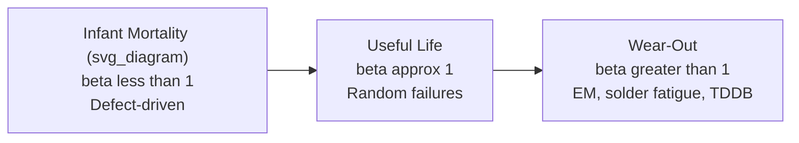

## Reliability Physics Fundamentals: Failure Modes and Acceleration Factors

### Overview

Reliability physics provides the quantitative framework for predicting how, when, and why packaged semiconductor devices fail under operational and environmental stress. In advanced packaging, reliability is governed by an expanded set of failure mechanisms beyond die-level effects — including interconnect fatigue, interfacial delamination, and electromigration in fine-pitch structures — compounded by heterogeneous material stacks with mismatched properties. Acceleration factor models allow reliability engineers to compress years of field life into practical qualification test durations, forming the statistical basis for JEDEC-style qualification standards.

### Failure Mode Categories

**Electrical Failure Mechanisms**

- **Electromigration (EM)**: current-driven mass transport of metal atoms in interconnects (bumps, TSVs, RDL traces), causing voids (opens) or hillocks (shorts) over time. Governed by Black's Equation (see below).
- **Time-Dependent Dielectric Breakdown (TDDB)**: progressive degradation of dielectric layers under sustained electric field, eventually causing conductive breakdown paths. Relevant to gate oxides and interlayer dielectrics.
- **Stress Migration (SM)**: metal atom migration driven by mechanical stress gradients (rather than current), relevant in fine interconnects under CTE-mismatch-induced stress.
- **Bias Temperature Instability (BTI)**: threshold voltage shift in MOSFETs under sustained gate bias and elevated temperature (NBTI for PMOS, PBTI for NMOS) — a die-level mechanism with package-level thermal implications.

**Mechanical/Thermo-Mechanical Failure Mechanisms**

- **Solder joint fatigue**: cyclic plastic/creep strain from thermal cycling accumulates damage in solder interconnects (C4 bumps, BGA balls) until crack initiation and propagation cause electrical open.
- **Delamination**: interfacial separation between bonded layers (die-to-mold, die-to-substrate, TIM interfaces) due to CTE mismatch stress, moisture-driven adhesion loss, or insufficient surface preparation.
- **Die cracking**: brittle fracture of silicon under excessive mechanical stress, often initiated at pre-existing defects (saw damage, thin-die handling stress).
- **Warpage-induced failures**: excessive package curvature causing solder non-wetting, head-in-pillow defects, or board-level connection failures.

**Moisture-Related Failure Mechanisms**

- **Popcorn cracking**: moisture absorbed by mold compound or substrate vaporizes rapidly during solder reflow, generating internal pressure that causes package delamination or cracking — addressed via moisture sensitivity level (MSL) classification and dry-pack handling.
- **Conductive Anodic Filament (CAF) growth**: moisture-driven electrochemical migration forming conductive filaments along fiber-resin interfaces in laminate substrates, causing leakage or shorts between adjacent conductors.

**Advanced Packaging-Specific Mechanisms**

- **Micro-bump/hybrid bond voiding**: incomplete bonding or intermetallic compound (IMC) voids at fine-pitch interconnects, degrading electrical and thermal performance.
- **TSV-related failures**: via protrusion (Cu pumping) from CTE mismatch during thermal cycling, liner cracking, and TSV-induced keep-out zone stress effects on nearby transistors.
- **Kirkendall voiding**: void formation at IMC interfaces (e.g., Cu-Sn) due to asymmetric diffusion rates between metals — relevant to micro-bump and solder joint reliability.

### Electromigration and Black's Equation

**Black's Equation**

The median time-to-failure for electromigration is modeled by:

$$MTTF = A \cdot J^{-n} \cdot e^{\frac{E_a}{kT}}$$

where $A$ is a process-dependent constant, $J$ is current density, $n$ is the current density exponent (typically ~1–2), $E_a$ is activation energy (typically ~0.6–0.9 eV for Cu interconnects), $k$ is Boltzmann's constant, and $T$ is absolute temperature.

**Key Points**

- Higher current density and higher temperature both accelerate electromigration failure — the basis for EM-focused accelerated life testing.
- $n$ and $E_a$ are extracted empirically from accelerated test data via regression, and are specific to the metallization system (Cu dual-damascene, Cu TSV, Al bond pad, etc.).
- [Unverified] Exact $E_a$ and $n$ values are process- and geometry-specific; published literature values should be treated as reference ranges rather than universal constants applicable to a specific fab process.

### Time-Dependent Dielectric Breakdown (TDDB)

TDDB lifetime models commonly follow a power-law or exponential field-dependence form:

$$TTF = A \cdot E^{-n} \cdot e^{\frac{E_a}{kT}}$$

or, alternatively, an exponential field model (E-model):

$$TTF = A \cdot e^{-\gamma E} \cdot e^{\frac{E_a}{kT}}$$

where $E$ is electric field across the dielectric. [Inference] The choice between power-law and exponential field models remains an area of ongoing debate in the reliability physics literature for ultra-thin dielectrics, and model selection significantly affects extrapolated lifetime at use-condition fields — a known source of uncertainty in TDDB-based lifetime projection.

### Acceleration Factors

**General Concept**

Acceleration factor (AF) quantifies how much faster a failure mechanism progresses under elevated stress (test) conditions versus use conditions:

$$AF = \frac{TTF_{use}}{TTF_{stress}}$$

Test duration is compressed by testing at AF times faster than field conditions, allowing qualification within practical timeframes (weeks to months rather than years).

**Temperature Acceleration — Arrhenius Model**

The most common acceleration model, based on activation energy:

$$AF_T = e^{\frac{E_a}{k}\left(\frac{1}{T_{use}} - \frac{1}{T_{stress}}\right)}$$

**Key Points**

- Higher $E_a$ mechanisms are more strongly accelerated by temperature — meaning a given temperature increase compresses test time more for high-$E_a$ mechanisms (e.g., TDDB) than low-$E_a$ mechanisms.
- Typical qualification stress temperatures (e.g., 125°C, 150°C) are chosen to achieve practical AF values (often targeting AF in the range of 10×–1000×) while remaining below temperatures that would introduce non-representative failure modes.

**Combined Temperature-Humidity Acceleration — Peck's Model**

For moisture-driven mechanisms:

$$AF = \left(\frac{RH_{stress}}{RH_{use}}\right)^n \cdot e^{\frac{E_a}{k}\left(\frac{1}{T_{use}} - \frac{1}{T_{stress}}\right)}$$

where $n$ is a humidity exponent (commonly cited in the range of ~2.5–3 for many moisture-driven mechanisms, though [Unverified] this value varies by failure mechanism and should be confirmed against mechanism-specific literature or qualification data).

**Thermal Cycling Acceleration — Coffin-Manson / Norris-Landzberg Model**

For solder joint fatigue under thermal cycling, the Norris-Landzberg extension of Coffin-Manson incorporates temperature range, maximum temperature, and cycling frequency:

$$AF = \left(\frac{\Delta T_{stress}}{\Delta T_{use}}\right)^m \left(\frac{f_{use}}{f_{stress}}\right)^{1/3} e^{\frac{E_a}{k}\left(\frac{1}{T_{max,use}} - \frac{1}{T_{max,stress}}\right)}$$

where $\Delta T$ is the thermal cycle range, $f$ is cycling frequency, and $m$ is a material/mechanism-dependent exponent (commonly cited around 1.9–2.5 for SAC solder alloys, though [Unverified] the precise value depends on solder composition and joint geometry).

### Weibull Distribution and Failure Rate Modeling

**Weibull Reliability Function**

Time-to-failure distributions for many semiconductor and packaging failure mechanisms follow a Weibull distribution:

$$R(t) = e^{-(t/\eta)^\beta}$$

where $\eta$ is the characteristic life (scale parameter) and $\beta$ is the shape parameter, which indicates failure mode behavior:

- $\beta < 1$: decreasing failure rate (infant mortality) — associated with manufacturing defects.
- $\beta = 1$: constant failure rate (random failures) — reduces to exponential distribution.
- $\beta > 1$: increasing failure rate (wear-out) — associated with fatigue and wear-out mechanisms like EM and solder fatigue.

**The Bathtub Curve**

Combining these regimes produces the classic reliability "bathtub curve": high early failure rate (infant mortality, $\beta<1$), a low, relatively constant rate during useful life ($\beta \approx 1$), followed by rising failure rate during wear-out ($\beta>1$). Burn-in testing targets removal of infant-mortality failures before field deployment.

### Diagram: Bathtub Curve and Weibull Shape Regimes (svg_diagram)

### Worked Example: Arrhenius Acceleration Factor Calculation

**Example**

Calculate the acceleration factor for an electromigration mechanism with $E_a = 0.8\ eV$, tested at $T_{stress} = 150\,^{\circ}C$ (423 K) versus field-use temperature $T_{use} = 55\,^{\circ}C$ (328 K).

$$AF_T = \exp\left[\frac{0.8}{8.617\times10^{-5}}\left(\frac{1}{328} - \frac{1}{423}\right)\right]$$

Computing the bracketed term:

$$\frac{1}{328} - \frac{1}{423} \approx 0.003049 - 0.002364 = 0.000685\ K^{-1}$$

$$AF_T = \exp\left[9285 \times 0.000685\right] = \exp[6.36] \approx 580$$

This means 1 hour of stress testing at 150°C corresponds to approximately 580 hours of field use at 55°C for this mechanism — illustrating why elevated-temperature stress testing enables practical qualification timelines. [Inference] This calculation assumes the failure mechanism and its activation energy remain constant across the temperature range tested, which should be verified experimentally since some mechanisms exhibit different behavior or competing failure modes at very high stress temperatures.

### JEDEC Qualification Standards Context

Standard qualification tests apply these acceleration models to establish pass/fail criteria for package reliability:

- **HTOL (High Temperature Operating Life)**: JESD22-A108, electrical bias + elevated temperature, targets EM/TDDB-type mechanisms.
- **TC (Temperature Cycling)**: JESD22-A104, targets solder joint and CTE-mismatch-driven fatigue.
- **THB/HAST (Temperature-Humidity-Bias / Highly Accelerated Stress Test)**: JESD22-A101/A110, targets moisture-driven mechanisms (CAF, corrosion).
- **uHAST (unbiased HAST)**: moisture ingress and delamination without applied bias.

[Unverified] Specific test conditions, durations, and sample sizes vary by qualification standard revision and product application (automotive, consumer, high-reliability); current JEDEC standard documents should be consulted for design-grade qualification planning.

### Design Implications for Advanced Packaging

- **Fine-pitch interconnect EM risk**: micro-bumps and hybrid bonds carry high current density in small cross-sections, requiring EM-aware current budgeting per Black's Equation parameters specific to the bonding metallurgy.
- **Multi-mechanism qualification**: 2.5D/3D packages must be qualified against an expanded failure mode set (TSV-specific mechanisms, hybrid bond voiding) beyond traditional single-die package qualification suites.
- **Acceleration model selection**: applying an inappropriate acceleration model (e.g., using Arrhenius for a mechanism that is not thermally activated) leads to inaccurate lifetime extrapolation — mechanism identification via failure analysis should precede AF model selection.
- **Design margin trade-offs**: reliability targets (e.g., FIT rate, useful life years) are translated into design constraints (current density limits, stress margins, moisture barrier requirements) via these acceleration models during the design phase, not only at post-fabrication qualification.

### Related Topics

- Electromigration mitigation techniques in fine-pitch interconnects
- Failure analysis methodologies: cross-sectioning, SEM/EDX, X-ray inspection
- JEDEC qualification standards for 2.5D/3D advanced packages
- Moisture sensitivity level (MSL) classification and dry-pack handling
- Burn-in testing and infant mortality screening
- Solder joint fatigue modeling and board-level reliability
- Hybrid bonding and TSV-specific reliability mechanisms
- Statistical reliability analysis: Weibull parameter estimation from test data