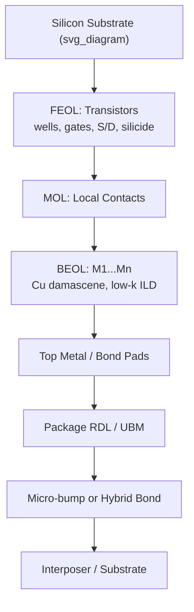

## Front-End-of-Line and Back-End-of-Line Process Overview

### Overview

Semiconductor wafer fabrication is conventionally divided into Front-End-of-Line (FEOL) and Back-End-of-Line (BEOL) process stages, distinguished by what they build: FEOL constructs active transistor devices in the silicon substrate, while BEOL constructs the metal interconnect wiring that links those devices into functional circuits. Understanding this division is foundational to advanced packaging, since the interfaces between die (FEOL+BEOL output), package interconnects, and 3D integration schemes (TSVs, hybrid bonding) all interact directly with BEOL topology, materials, and process constraints.

### Front-End-of-Line (FEOL)

**Definition and Scope**

FEOL encompasses all wafer processing steps up to and including formation of the active device layer — transistors — but before metal interconnect wiring begins. This includes substrate preparation, transistor formation, and (in modern processes) local contact formation.

**Key Process Steps**

- **Wafer preparation**: starting with a bare silicon (or SOI, or other substrate) wafer, including surface cleaning and, in some processes, epitaxial layer growth.
- **Well formation**: ion implantation to create n-well and p-well regions defining transistor polarity zones (CMOS).
- **Isolation formation**: shallow trench isolation (STI) etched and filled with dielectric to electrically separate adjacent transistors.
- **Gate stack formation**: deposition and patterning of gate dielectric (high-$k$ materials like HfO₂ in advanced nodes) and gate electrode (polysilicon or metal gate).
- **Source/drain formation**: ion implantation and annealing to create doped source/drain regions; may include epitaxial source/drain growth (e.g., SiGe for strain engineering in advanced nodes).
- **Silicidation**: formation of low-resistance metal silicide (e.g., NiSi, CoSi₂) contacts on source/drain and gate regions.
- **Contact formation**: local interconnect (tungsten contacts, "MOL" — middle-of-line, sometimes classified separately) connecting transistor terminals to the first metal layer.

**Key Points**

- FEOL defines transistor electrical characteristics: threshold voltage, drive current, leakage — directly governed by channel doping, gate stack materials, and geometry.
- Advanced FEOL structures include FinFET (tri-gate) and gate-all-around (GAA) nanosheet transistors, which increase gate control over the channel to manage short-channel effects at scaled dimensions.
- [Unverified] Specific transistor architecture adoption (FinFET vs. GAA) and node-specific process details vary by foundry and technology generation; current foundry process design kits (PDKs) should be consulted for design-specific parameters.
- FEOL process temperatures are typically high (implant anneals, oxidation, epitaxy can exceed 1000°C), which constrains process ordering relative to temperature-sensitive materials introduced later.

### Back-End-of-Line (BEOL)

**Definition and Scope**

BEOL encompasses the multilevel metal interconnect stack that wires transistors together into functional circuits, built on top of the FEOL device layer. BEOL typically comprises many stacked metal layers (commonly ranging from roughly 10 to 15+ layers in modern logic processes), separated by interlayer dielectrics (ILD).

**Key Process Steps**

- **Dielectric deposition**: interlayer dielectric (traditionally SiO₂, now often low-$k$ materials like SiOC or porous low-$k$ films to reduce parasitic capacitance) deposited between metal layers.
- **Damascene patterning**: trenches and vias etched into the dielectric define the metal wiring pattern (subtractive metal etch, historically used for Al, has largely been replaced by damascene for Cu).
- **Barrier/seed deposition**: thin diffusion barrier layers (Ta/TaN for Cu) deposited to prevent copper diffusion into the dielectric, followed by a copper seed layer for electroplating.
- **Copper electroplating**: bulk copper fill of trenches and vias via electrochemical deposition.
- **Chemical-Mechanical Planarization (CMP)**: excess copper and barrier material polished away, leaving planarized copper wiring flush with the dielectric surface — repeated at every metal layer.
- **Via formation**: connects adjacent metal layers vertically; dual-damascene processes form trench and via in combined or sequential steps.

**Key Points**

- Lower BEOL metal layers (M1, M2) use fine pitch for local, dense routing; upper layers use progressively wider pitch for global routing and power distribution, reflecting a hierarchical interconnect structure.
- Low-$k$ dielectric adoption reduces interconnect capacitance (see electrical fundamentals: RC delay) but introduces mechanical fragility concerns (low-$k$ films are often more brittle and prone to cracking than SiO₂) — directly relevant to chip-package interaction (CPI) risk during packaging assembly.
- Top BEOL layers often include thicker "redistribution-adjacent" metal (sometimes called RDL0 or top metal) that interfaces with subsequent packaging-level redistribution layers (RDL) and bump/pillar formation.
- BEOL process temperatures are generally lower than FEOL (constrained by copper electromigration/diffusion concerns and low-$k$ dielectric thermal stability), typically below approximately 400°C for back-end steps.

### FEOL-BEOL-Packaging Interface

**Why This Distinction Matters for Advanced Packaging**

The FEOL/BEOL boundary is not merely a fab process distinction — it directly shapes what packaging technologies can achieve:

- **TSV integration timing**: TSVs are classified as "via-first" (etched before FEOL transistor formation), "via-middle" (etched after FEOL, before or during BEOL), or "via-last" (etched after full BEOL completion, from the wafer backside or front side) — each timing choice has different thermal budget, keep-out zone, and integration complexity implications.
- **RDL and bump formation build directly on top BEOL metal**: the final BEOL metal layer (often passivation-opened bond pads) serves as the electrical and mechanical foundation for redistribution layers, under-bump metallization (UBM), and micro-bump/hybrid-bond structures.
- **Low-$k$ dielectric fragility interacts with packaging stress**: since low-$k$ BEOL dielectrics are mechanically weaker than oxide, packaging-induced stress (CTE mismatch, bump formation, underfill cure shrinkage) can propagate cracks into BEOL layers if not carefully managed — a central CPI reliability concern.
- **Hybrid bonding directly interfaces with top BEOL/RDL copper pads**: die-to-die or die-to-wafer hybrid bonding requires ultra-planar, ultra-clean copper surfaces at the top of the BEOL/RDL stack, making BEOL CMP quality directly relevant to bonding yield.

### Diagram: FEOL-BEOL-Package Stack Relationship (svg_diagram)

### FEOL vs. BEOL Comparison

| Aspect | FEOL | BEOL |
| --- | --- | --- |
| Function | Active device formation | Interconnect wiring |
| Key structures | Transistors, wells, isolation | Metal layers, vias, ILD |
| Dominant materials | Si, high-$k$ dielectrics, silicides | Cu, low-$k$ dielectrics, barriers |
| Process temperature | High (often >1000°C for anneals) | Lower (typically <400°C) |
| Primary reliability concerns | Threshold voltage stability, BTI | Electromigration, TDDB, low-$k$ cracking |
| Packaging interface | Indirect (via BEOL) | Direct (RDL, bumps, hybrid bonds) |

### Design Implications for Advanced Packaging

- **TSV integration strategy selection** (via-first/middle/last) must account for FEOL thermal budget constraints and BEOL keep-out zone requirements, directly affecting 3D stacking architecture choices.
- **CPI risk management**: packaging processes (bump reflow, underfill cure, molding) must respect BEOL low-$k$ dielectric mechanical limits to avoid crack propagation — driving design rules for bump placement relative to active circuitry and BEOL stress-sensitive regions.
- **Hybrid bonding surface preparation**: die-to-wafer and wafer-to-wafer hybrid bonding yield depends critically on BEOL/RDL CMP planarity and cleanliness, linking fab-level BEOL process control to packaging-level bonding success.
- **Heterogeneous integration co-design**: chiplet-based architectures require BEOL top-metal and pad layouts to be compatible with target packaging technology (micro-bump pitch, hybrid bond pitch) established early in the FEOL/BEOL process flow, not retrofitted afterward.

### Related Topics

- TSV integration strategies: via-first, via-middle, via-last
- Low-$k$ dielectric materials and chip-package interaction (CPI) risk
- Copper damascene process and chemical-mechanical planarization (CMP)
- Redistribution layer (RDL) and under-bump metallization (UBM) formation
- Hybrid bonding surface preparation and bonding yield
- FinFET and gate-all-around (GAA) transistor architectures
- Wafer-level packaging process flow integration with fab BEOL output
- Bond pad and top-metal design rules for packaging interfaces