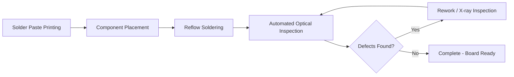

## Surface-Mount Technology and Leadframe Packages

### Definition and Scope

Surface-mount technology (SMT) refers to the assembly methodology in which electronic components are mounted directly onto the surface of a printed circuit board (PCB), with terminations soldered to pads on that surface rather than inserted through drilled holes. Leadframe packages are a specific package family—predominantly used from the 1970s through today for discrete devices and low-to-medium pin-count integrated circuits—built around a stamped or etched metal frame that simultaneously provides the die-attach platform, electrical interconnect paths, and external terminals.

This item sits at the intersection of two developments: the shift in PCB assembly methodology from through-hole to surface mount, and the package architecture (leadframe-based) that enabled and co-evolved with that shift. Both are foundational to essentially all subsequent advanced packaging evolution, since leadframe packages represent the baseline architecture against which laminate/substrate-based BGAs, CSPs, and heterogeneous integration formats are later contrasted.

### Historical Context

**Through-hole predecessor.** Prior to SMT, dual in-line packages (DIPs) with leaded leadframes were inserted into plated through-holes (PTH) and wave-soldered from the board underside. This method was mechanically robust but volumetrically inefficient: through-hole pins required drilled vias, occupied board area on both layers, and imposed a lower bound on pitch (~2.54 mm/0.1 in) driven by drill and insertion tooling.

**IBM and the origins of SMT.** Surface-mount assembly traces to IBM's work in the 1960s on hybrid circuits, but broad commercial adoption began in the late 1970s and accelerated through the 1980s as component manufacturers (particularly in Japan, driven by consumer electronics miniaturization) introduced small-outline and chip-scale leaded packages designed explicitly for solder-paste reflow rather than wave-solder insertion.

**Leadframe packages as the SMT enabler.** The leadframe package family—small-outline IC (SOIC), plastic leaded chip carrier (PLCC), quad flat pack (QFP), and later thin/shrink variants (TQFP, TSOP)—was the primary vehicle that made SMT practical for ICs. [Inference] The co-development was mutually reinforcing: leadframe manufacturing (stamping/etching copper alloy) was already mature from DIP production, so adapting the frame geometry to a gull-wing or J-lead surface-mount form was a comparatively low-risk evolution versus inventing an entirely new interconnect scheme.

**Timeline milestones:**

- **1960s**: Hybrid microelectronics use early surface-mount concepts for military/aerospace.
- **Late 1970s–1980s**: SOIC and PLCC packages commercialized; wave-solder-compatible leaded parts (resistors, capacitors) transition to chip form (0805, 0603 passives).
- **1980s–1990s**: QFP and its thin-profile derivatives (TQFP, LQFP) become dominant for higher pin-count logic and microcontrollers as pitch shrinks from 1.27 mm to 0.5 mm and below.
- **1990s onward**: Leadframe packages begin ceding high-pin-count, high-I/O territory to laminate-substrate BGAs, while remaining dominant for discretes, power devices, and moderate-pin-count logic/analog ICs—a role they retain today.

### Leadframe Package Architecture

**Core construction.** A leadframe package consists of:

1. **Die pad (die attach paddle)**: The central platform, often left exposed as a thermal path in modern variants, to which the die is attached via epoxy or eutectic solder.
2. **Leadframe fingers**: Metal traces stamped or etched from a continuous sheet (typically copper alloy, sometimes Alloy 42/Fe-Ni), extending from the die pad region outward to form the external leads.
3. **Bond wires**: Fine gold, copper, or silver-alloy wires connecting die bond pads to corresponding leadframe finger inner-lead bond sites (wire bonding is the dominant interconnect method for leadframe packages, though flip-chip-on-leadframe variants exist).
4. **Mold compound**: Epoxy molding compound (EMC) encapsulates the die, wires, and inner leadframe, providing mechanical and environmental protection while leaving the outer lead tips exposed for board attachment.
5. **External leads**: Formed into gull-wing (SOIC, QFP), J-lead (PLCC), or no-lead (QFN) geometries for board-level soldering.

**Manufacturing process flow:**

1. Leadframe fabrication (stamping for high volume/coarse pitch, chemical etching for fine pitch)
2. Die attach (epoxy or solder die-attach material dispensed/placed, then cured)
3. Wire bonding (thermosonic ball bonding for gold/copper wire, connecting die I/O to leadframe fingers)
4. Molding (transfer molding encapsulates the assembly, typically leaving die pad and lead tips exposed as needed)
5. Post-mold cure and deflashing
6. Lead finish plating (matte tin, or historically tin-lead alloy) for solderability and whisker mitigation
7. Trim and form (excising leads from the frame's tie bars and rails, then bending to final gull-wing/J-lead profile)
8. Marking, testing, and singulation

### Key Package Types

**SOIC (Small-Outline Integrated Circuit).** Gull-wing leads on two sides, typically 1.27 mm pitch, low pin counts (8–28 pins common). Direct SMT successor to the DIP for low-complexity logic and analog parts.

**PLCC (Plastic Leaded Chip Carrier).** J-leaded, leads on all four sides, historically used for moderate pin-count logic (20–84 pins); largely obsolete today, superseded by QFP and BGA.

**QFP / TQFP / LQFP (Quad Flat Pack family).** Gull-wing leads on all four sides; pin counts from ~32 up to 300+ in some variants; pitch scaling from 1.0 mm down to 0.4 mm. TQFP (thin) and LQFP (low-profile) address board Z-height constraints in portable electronics.

**QFN (Quad Flat No-lead) / DFN (Dual Flat No-lead).** [Inference — chronologically later but architecturally part of the same leadframe lineage] No external formed leads; instead, the leadframe's bottom-side metal pads are exposed directly at the package perimeter and soldered flush to the board. This eliminates lead-forming defects, reduces package footprint and inductance, and improves thermal performance via the exposed die pad—making QFN the leadframe format of choice in space- and RF-sensitive designs today.

**Power leadframe packages (TO-220, TO-252/D-Pak, TO-263/D2-Pak, etc.).** Leadframe-based but optimized for high current/thermal dissipation rather than pin density; the leadframe itself often serves as a substantial heat-spreading element, sometimes soldered or clipped directly to a heatsink.

### SMT Assembly Process for Leadframe Packages

1. **Solder paste printing**: Stencil-applied solder paste (typically SAC alloy in Pb-free processes) deposited onto PCB pads matching the leadframe's lead pitch and footprint.
2. **Component placement**: Pick-and-place equipment positions the package with leads aligned to paste-printed pads, using vision-system fiducial alignment.
3. **Reflow soldering**: The assembly passes through a reflow oven with a controlled thermal profile (preheat, soak, reflow above solder liquidus ~217–221°C for SAC305, cooldown), melting the paste to form solder joints.
4. **Inspection**: Automated optical inspection (AOI) and, for leads hidden under the package body (as in QFN), X-ray inspection to verify joint integrity and detect voiding.

**Key SMT/leadframe interface parameters:**

- Lead coplanarity: all leads must lie within a specified tolerance (commonly ≤100 μm) of a common plane for reliable simultaneous solder wetting.
- Lead pitch and standoff: dictate stencil aperture design and paste volume.
- Thermal mass mismatch: leadframe packages, having a metal core, exhibit different thermal response during reflow than laminate packages, requiring profile tuning.

### Advantages and Limitations

**Key Points:**

- **Advantages**: Mature, low-cost, high-yield manufacturing infrastructure (decades of process refinement); excellent thermal performance via metal leadframe/exposed pad; mechanically robust; well-suited to high-volume, cost-sensitive applications (discretes, power devices, automotive, moderate-complexity logic).
- **Limitations**: Pin-count and I/O density fundamentally constrained by perimeter-only lead placement (leads can only be arrayed around the package edge, not in an area array), practically capping most leadframe packages below a few hundred I/Os; fine-pitch lead forming becomes mechanically fragile below ~0.4 mm; wire-bond parasitic inductance limits high-frequency performance relative to flip-chip alternatives.
- [Inference] This I/O density ceiling is the primary architectural reason ball grid array (BGA) and area-array substrate packages emerged as the dominant format for high-pin-count devices (memory, processors, ASICs) from the 1990s onward—BGAs relocate interconnects to an area array beneath the package rather than the package perimeter.

### Comparison: Leadframe (Perimeter) vs. Area-Array Packaging

| Attribute | Leadframe (QFP/SOIC/QFN) | Area-Array (BGA/CSP) |
| --- | --- | --- |
| Interconnect layout | Perimeter only | Full-area array |
| Max practical I/O | Low–moderate (tens to a few hundred) | High (hundreds to thousands) |
| Substrate | Stamped/etched metal | Laminate or wafer-level redistribution |
| Cost structure | Very low at volume | Moderate to high |
| Thermal path | Often excellent (metal die pad) | Requires thermal vias/balls |
| Typical use today | Discretes, power, low-pin-count logic, automotive/RF | Memory, processors, high-I/O ASICs, SiPs |

### Diagram: Leadframe Package Cross-Section (svg_diagram)

<svg xmlns="http://www.w3.org/2000/svg" viewBox="0 0 700 380">
<text x="350" y="25" font-size="16" font-weight="bold" text-anchor="middle" fill="#1a1a1a">Leadframe Package Cross-Section (svg_diagram)</text>

<path d="M 150 100 L 550 100 L 550 220 L 500 250 L 200 250 L 150 220 Z" fill="#3a3a3a" stroke="#000" stroke-width="1.5" />
<text x="350" y="90" font-size="12" text-anchor="middle" fill="#333">Epoxy Mold Compound</text>

<rect x="280" y="180" width="140" height="20" fill="#c9a227" stroke="#000" stroke-width="1" />
<text x="350" y="215" font-size="11" text-anchor="middle" fill="#fff">Die Pad</text>

<rect x="300" y="150" width="100" height="30" fill="#4a6fa5" stroke="#000" stroke-width="1" />
<text x="350" y="169" font-size="11" text-anchor="middle" fill="#fff">Die</text>

<path d="M 300 155 Q 250 130 220 110" fill="none" stroke="#e0c060" stroke-width="2" />
<path d="M 400 155 Q 450 130 480 110" fill="none" stroke="#e0c060" stroke-width="2" />
<text x="180" y="105" font-size="10" text-anchor="middle" fill="#333">Bond Wire</text>

<rect x="195" y="102" width="30" height="10" fill="#b87333" stroke="#000" stroke-width="1" />
<rect x="475" y="102" width="30" height="10" fill="#b87333" stroke="#000" stroke-width="1" />

<path d="M 150 220 L 100 220 L 100 260 L 130 260 L 130 300" fill="none" stroke="#b87333" stroke-width="6" stroke-linecap="round" />
<path d="M 550 220 L 600 220 L 600 260 L 570 260 L 570 300" fill="none" stroke="#b87333" stroke-width="6" stroke-linecap="round" />
<text x="95" y="320" font-size="11" text-anchor="middle" fill="#333">Gull-Wing Lead</text>
<text x="605" y="320" font-size="11" text-anchor="middle" fill="#333">Gull-Wing Lead</text>

<rect x="50" y="300" width="600" height="25" fill="#2d5a2d" stroke="#000" stroke-width="1" />
<text x="350" y="317" font-size="12" text-anchor="middle" fill="#fff">Printed Circuit Board (PCB)</text>

<ellipse cx="130" cy="302" rx="12" ry="6" fill="#c0c0c0" stroke="#000" stroke-width="1" />
<ellipse cx="570" cy="302" rx="12" ry="6" fill="#c0c0c0" stroke="#000" stroke-width="1" />
<text x="350" y="360" font-size="10" text-anchor="middle" fill="#555">Solder joints form at gull-wing lead tips during reflow</text>
</svg>

### Diagram: SMT Reflow Process Flow

### Relevance to Advanced Packaging and Heterogeneous Integration

Leadframe/SMT technology remains directly relevant to modern advanced packaging in several ways:

- **QFN/DFN packages** are widely used today as the outer-tier package for embedded and system-in-package (SiP) modules where a die (or multiple stacked dies) is integrated inside what is architecturally still a leadframe-based outline.
- **Leadframe-based SiP**: Multiple dies can be attached to a single leadframe (multi-die leadframe assembly), wire-bonded, and molded together—an early and still-used form of heterogeneous integration predating laminate-substrate multi-chip modules.
- **Cost/performance baseline**: Leadframe packaging remains the cost and thermal-performance benchmark against which newer formats (fan-out wafer-level packaging, embedded die, 2.5D/3D substrates) are evaluated for applications not requiring extreme I/O density.
- **Power and RF heterogeneous modules**: Leadframe packages with exposed thermal pads continue to serve power management ICs, discrete power devices, and RF front-end modules where thermal dissipation and low parasitic inductance matter more than raw I/O count.

**Next Steps:**

- Ball grid array (BGA) architecture and the transition to area-array interconnects
- Wire bonding vs. flip-chip interconnect methods
- Quad flat no-lead (QFN) and its role in modern SiP modules
- Epoxy molding compound (EMC) material properties and reliability
- Reflow soldering profiles and Pb-free (SAC alloy) transition
- Package-on-package (PoP) and stacked die architectures
- Fan-out wafer-level packaging as the successor paradigm for high-density I/O