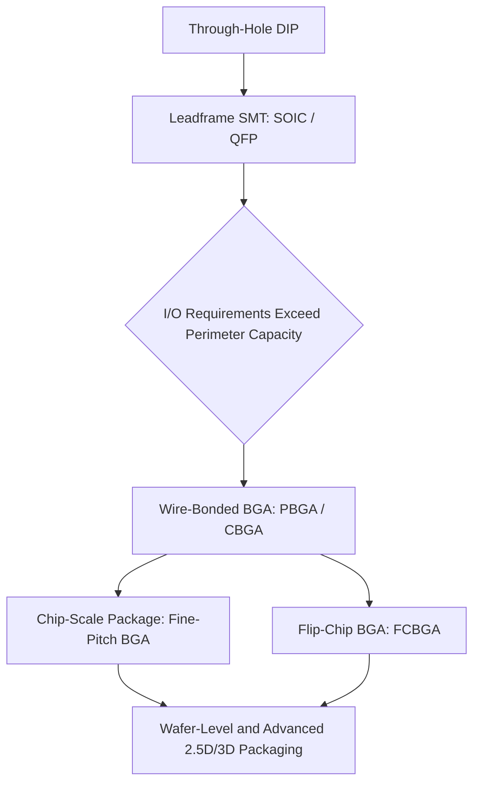

## Wire Bonding Era and Ball Grid Array Packages

### Definition and Scope

This topic covers two closely linked developments in IC packaging history: (1) the maturation of wire bonding as the dominant die-to-package interconnect method, and (2) the emergence of ball grid array (BGA) packages as the solution to the I/O density limitations inherent in perimeter-leaded leadframe packages. Together, these mark the transition from perimeter-limited interconnect (SOIC, QFP) to area-array interconnect, a shift that fundamentally reshaped package architecture from the late 1980s onward and remains foundational to virtually all high-pin-count packaging today.

### Wire Bonding Fundamentals

**Process overview.** Wire bonding forms electrical connections between bond pads on the die and corresponding lead fingers or substrate traces using fine metallic wire, typically 15–50 μm in diameter. The wire is fed through a capillary tool, bonded first to the die pad, looped, and then bonded to the destination lead/substrate pad.

**Bonding methods:**

- **Thermosonic ball bonding**: The dominant method for gold and copper wire. A ball is formed at the wire tip via electronic flame-off (EFO), then bonded to the die pad using a combination of heat (~150–220°C), ultrasonic energy, and pressure ("thermosonic" bonding). The wire is looped to the second bond site (stitch/wedge bond) and cut.
- **Wedge bonding**: Used primarily for aluminum wire and heavier-gauge applications (power devices); both first and second bonds are wedge (stitch) bonds, without a ball, and typically performed at lower temperature ("cold" or ultrasonic wedge bonding) since aluminum wire is compatible with aluminum bond pads without requiring the intermetallic-forming heat of gold-to-aluminum bonds.

**Wire materials:**

- **Gold (Au)**: Historically dominant due to excellent oxidation resistance, ductility, and compatibility with ball bonding; remains common in high-reliability applications.
- **Copper (Cu)**: Adopted broadly from the mid-2000s onward as a lower-cost alternative to gold, driven by gold price volatility; offers better electrical/thermal conductivity but requires tighter process control due to higher hardness (risk of pad cratering) and oxidation sensitivity, often requiring inert gas (N₂/H₂) shielding during bonding.
- **Aluminum (Al)**: Used mainly for wedge bonding in power and RF devices.
- **Silver (Ag) alloys**: [Inference] Emerged as a cost-performance compromise between gold and copper in some applications, offering better oxidation resistance than pure copper at lower cost than gold.

**Key reliability considerations:**

- **Gold-aluminum intermetallics**: When gold wire bonds to an aluminum die pad, intermetallic compounds (Au-Al) form at the interface. Under thermal stress, differential growth of these intermetallics (particularly the "purple plague" Au-Al₂ phase) combined with Kirkendall voiding can degrade bond integrity over time. [Inference] This is a well-documented, though largely mitigated-by-process-control, failure mechanism.
- **Wire sweep**: During molding, the pressure of injected mold compound can displace bond wire loops, potentially causing shorts between adjacent wires; loop height and molding parameters are tuned to manage this.
- **Bond pad pitch limits**: Wire bonding requires sufficient pad pitch (historically ~60–80 μm minimum, now finer with advanced capillary tooling) to avoid wire-to-wire shorting, which becomes a constraining factor as die shrink and I/O count increase.

### The I/O Density Problem and Motivation for BGA

Leadframe packages (QFP, SOIC, PLCC) place leads only around the package perimeter. As die complexity grew through the 1980s, required I/O counts scaled faster than package perimeter could accommodate at manufacturable lead pitch:

- **Perimeter scaling limit**: I/O count for a perimeter package scales linearly with package edge length, while die transistor count (and often I/O requirements) scales with area. This mismatch meant perimeter packages would need increasingly large bodies or increasingly fine lead pitch to keep up with I/O demand.
- **Fine-pitch QFP limits**: QFP pitch scaling below ~0.4 mm ran into practical limits—lead coplanarity, mechanical fragility of thin gull-wing leads, and handling damage during shipping/assembly.
- [Inference] The area-array solution was a logical architectural response: by placing interconnects under the entire package footprint rather than only around its edge, I/O count could scale with package area instead of perimeter, dramatically increasing achievable I/O density at a given package size and interconnect pitch.

### Ball Grid Array Package Architecture

**Core construction.** A BGA replaces the leadframe's formed metal leads with an array of solder balls attached to pads on the underside of a substrate:

1. **Substrate**: Typically an organic laminate (BT resin or similar) with multiple copper routing layers, analogous in concept to a miniature PCB, though ceramic substrates are used in CBGA (ceramic BGA) for high-reliability applications.
2. **Die attach**: Die is attached to the substrate's top surface (die-up) using epoxy or similar adhesive.
3. **Wire bonds**: Connect die bond pads to substrate bond fingers (in wire-bonded BGA variants; flip-chip BGA, discussed separately in the broader curriculum, instead uses solder bumps directly under the die).
4. **Encapsulation**: Mold compound covers the die and wire bonds on the top side.
5. **Solder balls**: An array of solder spheres (commonly eutectic Sn-Pb historically, now SAC alloys in Pb-free processes) attached to the substrate's bottom-side pads, typically on pitches from 1.5 mm down to 0.5 mm or finer in chip-scale variants.

**Manufacturing process flow:**

1. Substrate fabrication (multilayer laminate with plated through-holes/vias and surface pads)
2. Die attach onto substrate
3. Wire bonding (die pads to substrate bond fingers)
4. Molding/encapsulation (glob-top or transfer molding over the die/wire area)
5. Ball attach (solder balls placed onto bottom-side pads and reflowed to form permanent attachment)
6. Marking, singulation (if array-molded), test

### BGA Package Variants

**PBGA (Plastic BGA).** Organic laminate substrate, most common and cost-effective BGA variant; used broadly across consumer, computing, and networking applications.

**CBGA (Ceramic BGA).** Ceramic (typically alumina) substrate offering superior thermal conductivity and hermeticity; historically used for high-reliability, aerospace, and high-power applications, though largely displaced by organic variants for cost reasons in most markets.

**TBGA (Tape BGA).** Uses a flexible tape (polyimide-based) substrate instead of rigid laminate; offers thinner profile.

**CSP (Chip-Scale Package) / fine-pitch BGA.** A BGA variant where package area approaches die area (conventionally defined as package footprint ≤1.2× die area), using finer ball pitch (often 0.5 mm or less) for space-constrained applications like mobile devices.

**Flip-chip BGA (FCBGA).** [Inference — noted here for architectural completeness, though flip-chip interconnect itself is typically covered as a separate curriculum item] Replaces wire bonding with direct solder-bump attachment of the die face-down onto the substrate, eliminating bond-wire parasitic inductance and enabling higher I/O density than wire-bonded BGA; became the dominant high-performance BGA format for processors and high-speed ASICs.

### Comparison: Wire-Bonded Leadframe vs. Wire-Bonded BGA

| Attribute | Leadframe (QFP) | Wire-Bonded BGA (PBGA) |
| --- | --- | --- |
| Interconnect layout | Perimeter | Area array |
| Substrate | Stamped/etched metal | Multilayer laminate |
| Die-to-package interconnect | Wire bond | Wire bond |
| Board attachment | Formed gull-wing leads | Solder ball array |
| Typical I/O range | Tens to ~300 | Hundreds to 1000+ |
| Lead/ball pitch | 0.4–1.27 mm | 0.5–1.5 mm (standard), finer in CSP |
| Electrical parasitics | Higher (longer lead path) | Lower (shorter interconnect, better ground/power planes) |
| Cost | Lower | Moderate |

### Diagram: Wire-Bonded BGA Cross-Section (svg_diagram)

<svg xmlns="http://www.w3.org/2000/svg" viewBox="0 0 700 400">
<text x="350" y="25" font-size="16" font-weight="bold" text-anchor="middle" fill="#1a1a1a">Wire-Bonded BGA Cross-Section (svg_diagram)</text>

<path d="M 200 90 Q 200 70 220 70 L 480 70 Q 500 70 500 90 L 500 170 L 200 170 Z" fill="#3a3a3a" stroke="#000" stroke-width="1.5" />
<text x="350" y="60" font-size="12" text-anchor="middle" fill="#333">Mold Compound</text>

<rect x="280" y="120" width="140" height="35" fill="#4a6fa5" stroke="#000" stroke-width="1" />
<text x="350" y="141" font-size="11" text-anchor="middle" fill="#fff">Die</text>

<path d="M 285 122 Q 240 100 230 172" fill="none" stroke="#e0c060" stroke-width="2" />
<path d="M 415 122 Q 460 100 470 172" fill="none" stroke="#e0c060" stroke-width="2" />
<text x="180" y="105" font-size="10" text-anchor="middle" fill="#333">Bond Wires</text>

<rect x="150" y="170" width="400" height="30" fill="#8b6f3e" stroke="#000" stroke-width="1" />
<text x="350" y="190" font-size="11" text-anchor="middle" fill="#fff">Multilayer Laminate Substrate</text>

<line x1="230" y1="200" x2="230" y2="230" stroke="#555" stroke-width="3" />
<line x1="350" y1="200" x2="350" y2="230" stroke="#555" stroke-width="3" />
<line x1="470" y1="200" x2="470" y2="230" stroke="#555" stroke-width="3" />

<circle cx="190" cy="245" r="12" fill="#c0c0c0" stroke="#000" stroke-width="1" />
<circle cx="230" cy="245" r="12" fill="#c0c0c0" stroke="#000" stroke-width="1" />
<circle cx="270" cy="245" r="12" fill="#c0c0c0" stroke="#000" stroke-width="1" />
<circle cx="310" cy="245" r="12" fill="#c0c0c0" stroke="#000" stroke-width="1" />
<circle cx="350" cy="245" r="12" fill="#c0c0c0" stroke="#000" stroke-width="1" />
<circle cx="390" cy="245" r="12" fill="#c0c0c0" stroke="#000" stroke-width="1" />
<circle cx="430" cy="245" r="12" fill="#c0c0c0" stroke="#000" stroke-width="1" />
<circle cx="470" cy="245" r="12" fill="#c0c0c0" stroke="#000" stroke-width="1" />
<circle cx="510" cy="245" r="12" fill="#c0c0c0" stroke="#000" stroke-width="1" />
<text x="600" y="249" font-size="11" text-anchor="start" fill="#333">Solder Ball Array</text>

<rect x="100" y="270" width="500" height="25" fill="#2d5a2d" stroke="#000" stroke-width="1" />
<text x="350" y="287" font-size="12" text-anchor="middle" fill="#fff">Printed Circuit Board</text>

<text x="350" y="340" font-size="10" text-anchor="middle" fill="#555">I/O distributed across full package area, not just perimeter</text>

</svg>

### Diagram: Evolution from Perimeter to Area-Array Interconnect

### Reliability and Assembly Considerations

- **Solder joint reliability**: BGA solder joints are hidden beneath the package, making visual inspection impossible; X-ray inspection is standard for verifying ball formation, voiding, and bridging.
- **Head-in-pillow defects**: A reflow defect where the solder ball fails to fully coalesce with the paste on the board pad, often due to oxidation or coplanarity issues, leaving a weak mechanical/electrical joint that can pass initial test but fail in the field.
- **Warpage**: Differential coefficient of thermal expansion (CTE) between substrate, mold compound, and die can cause package warpage during reflow, contributing to non-coplanar balls and open joints—an increasingly significant concern as package size grows and profiles thin.
- **Rework**: BGA rework requires specialized equipment (hot air/IR rework stations) to selectively reflow and remove/replace a single component without disturbing neighboring parts, more complex than leaded-component rework.

### Relevance to Advanced Packaging and Heterogeneous Integration

The wire-bonding/BGA era established several architectural principles that persist in modern advanced packaging:

- **Area-array interconnect** is now the default assumption for any high-I/O package, extended further in flip-chip, 2.5D interposer, and fan-out formats.
- **Substrate-based packaging** (multilayer laminate as an interconnect redistribution layer between fine-pitch die and coarser board-level pitch) is the direct conceptual ancestor of today's interposers and redistribution layers (RDL) in fan-out wafer-level packaging.
- **Wire bonding itself remains in active use** today for cost-sensitive and moderate-performance applications, and in stacked-die/3D packages (e.g., wire-bonded memory stacks) where its flexibility in connecting multiple die at different heights is advantageous over flip-chip.
- **Package-on-package (PoP)**, a widely used heterogeneous integration format, builds directly on BGA ball-array concepts, stacking a memory BGA atop a logic BGA using an intermediate ball/via interconnect.

**Related Topics:**

- Flip-chip interconnect and controlled collapse chip connection (C4)
- Chip-scale packaging (CSP) and fine-pitch ball attach
- Package-on-package (PoP) architecture
- Solder joint reliability and thermal cycling fatigue
- Substrate technology: laminate buildup, core vs. coreless designs
- X-ray and acoustic microscopy inspection methods for hidden interconnects
- Copper wire bonding process control and pad cratering mitigation