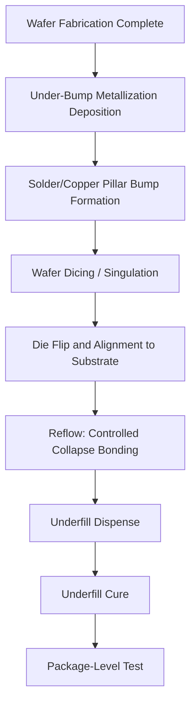

## Rise of Flip Chip and Controlled Collapse Chip Connection

### Definition and Scope

Flip-chip interconnect is a die-attach method in which the die is mounted face-down (flipped) onto the substrate or package, with electrical connections made through an array of solder bumps or metal interconnects distributed across the active die surface, rather than through peripheral wire bonds. Controlled Collapse Chip Connection (C4) is IBM's original and now-generic name for the specific solder-bump flip-chip process, referring to the controlled, self-aligning collapse of molten solder bumps during reflow that determines the final standoff height between die and substrate.

This topic traces the origin, mechanics, and adoption trajectory of flip-chip/C4 technology as the interconnect method that broke the wire-bond perimeter/loop-inductance limitations discussed in the prior item, and that underlies nearly all subsequent high-performance and advanced (2.5D/3D) packaging architectures.

### Historical Origin

**IBM's C4 development.** Flip-chip technology, in the C4 form, was developed by IBM beginning in the early 1960s for its Solid Logic Technology (SLT) hybrid modules, with broader deployment in IBM mainframe systems through the 1960s–1970s. [Inference] IBM's motivation was driven by mainframe reliability and performance requirements that wire bonding could not satisfy at the density and speed IBM needed, making IBM an early and long-standing outlier in adopting area-array die interconnect decades before it became an industry-wide standard.

**Slow broader industry adoption.** Despite IBM's early development, flip-chip/C4 remained largely proprietary to IBM and a small number of high-end/military applications through the 1970s–1980s, while the rest of the industry continued to rely on wire bonding (as covered in the prior wire-bonding/BGA item) due to lower infrastructure cost and adequate performance for prevailing die complexity and I/O counts.

**Broader commercialization.** From the 1990s onward, flip-chip technology proliferated beyond IBM as I/O counts, clock speeds, and power requirements of mainstream logic (microprocessors, ASICs, FPGAs) grew to the point where wire-bond parasitic inductance and I/O density limits became bottlenecks for the broader industry, not just mainframes. [Inference] This adoption curve tracked the broader shift toward flip-chip BGA (FCBGA) as the default high-performance package architecture, effectively merging flip-chip die attach with the BGA area-array board interconnect discussed in the previous item.

### C4 Process Mechanics

**Core principle.** Rather than wire-bonding individual peripheral pads sequentially, C4 forms a bump on every I/O pad across the die's active face simultaneously (via wafer-level bumping), then flips the die and reflows all bumps at once to bond to matching substrate pads.

**Bump formation (wafer-level, prior to die singulation):**

1. **Under-bump metallization (UBM)**: A multilayer metal stack (commonly including adhesion, barrier, and wettable layers such as Ti/Cu/Ni/Au or similar) is deposited over the die's aluminum or copper bond pads to provide a solderable, diffusion-barrier interface.
2. **Solder deposition**: Solder is deposited onto the UBM via evaporation (original IBM process), electroplating, solder paste printing/stencil, or solder ball placement/drop, depending on bump pitch and volume requirements.
3. **Reflow (bump formation)**: The deposited solder is melted, and surface tension pulls it into a hemispherical bump shape on each pad—this is the origin of the "controlled collapse" concept, since the final bump geometry is governed by solder volume, pad size, and surface tension rather than mechanical forming.

**Die attach (flip-chip bonding):**

1. **Flip and align**: The die is inverted and precisely aligned, using vision systems, to matching pads on the substrate or interposer.
2. **Reflow bonding**: The assembly is heated to melt the solder bumps simultaneously; each bump self-aligns via solder surface tension (a self-centering effect that provides some tolerance for placement misalignment) and "collapses" in a controlled manner as it wets both the die pad and substrate pad, setting the final die-to-substrate standoff height.
3. **Underfill dispense and cure**: An epoxy underfill material is dispensed around the die perimeter and drawn by capillary action into the gap between die and substrate, then thermally cured. Underfill is essential in most C4/flip-chip applications because it mechanically couples the die and substrate, redistributing thermally induced stress (arising from CTE mismatch between silicon die and organic/ceramic substrate) away from the solder bumps, which would otherwise be the sole and highly stress-concentrated mechanical connection.

**Key materials evolution:**

- **High-lead C4 (original)**: IBM's original process used high-lead solder (~97Pb/3Sn), chosen for its high melting point relative to the eutectic Sn-Pb assembly solder used downstream, allowing the C4 bumps to survive subsequent board-level assembly reflow without remelting.
- **Eutectic and Pb-free transition**: As RoHS and industry-wide lead-free mandates took hold (particularly through the 2000s), C4 bump materials transitioned toward SAC (Sn-Ag-Cu) alloys and other Pb-free formulations, requiring re-qualification of reflow profiles and reliability behavior.
- **Copper pillar bumps**: [Inference] As pitch requirements tightened beyond what solder-only bumps could reliably achieve without bridging, copper pillar bump structures (a copper post capped with a smaller solder cap) became increasingly favored, offering finer pitch capability, better current-carrying capacity, and more consistent standoff height than solder-only bumps.

### Advantages Over Wire Bonding

**Key Points:**

- **Reduced electrical parasitics**: Bump interconnects are dramatically shorter than wire-bond loops (tens of micrometers vs. millimeters), substantially reducing parasitic inductance and resistance—critical for high-speed signal integrity and low-drop power delivery.
- **True area-array I/O on the die itself**: Unlike wire bonding, which is fundamentally constrained to the die perimeter (bond pads must be accessible to a bonding tool), flip-chip bumps can be placed anywhere across the die's active area, allowing I/O and power/ground connections to scale with die area rather than perimeter.
- **Improved power delivery**: Dense area-array power/ground bump placement directly beneath the die reduces power delivery network (PDN) impedance, important for high-current, low-voltage modern logic.
- **Smaller footprint and lower profile**: Eliminating wire loops allows thinner packages and enables tighter die-to-substrate spacing.
- **Simultaneous bonding**: All bumps reflow together in one thermal cycle rather than being formed sequentially, which can improve throughput at scale despite higher up-front bumping infrastructure cost.

### Trade-offs and Reliability Challenges

- **CTE mismatch and thermomechanical stress**: Because die (silicon, CTE ~2.6 ppm/°C) and substrate (organic laminate, CTE ~15–20 ppm/°C) expand at very different rates, thermal cycling induces significant shear stress on the small-area solder bump joints—far more concentrated than the compliant wire-bond loop could absorb. This makes underfill essentially mandatory for flip-chip-on-organic-substrate reliability.
- **Bump pitch and bridging risk**: As bump pitch decreases to accommodate higher I/O density, solder bridging between adjacent bumps during reflow becomes a greater risk, driving the shift toward copper pillar structures with more controlled, less volume-dependent geometry.
- **Wafer-level bumping infrastructure cost**: Bumping requires additional wafer-level process steps (UBM deposition, bump plating/reflow) beyond standard front-end wafer fabrication, representing a capital and process-complexity investment not required for wire-bond-only flows.
- **Known good die (KGD) requirement**: Because flip-chip die are typically committed to more complex, higher-value assemblies (and increasingly to multi-die packages), pre-assembly die testing to ensure "known good die" status becomes more economically important than in simpler single-die wire-bond packages, since a defective die discovered post-assembly is costlier to isolate and rework.
- **Underfill process control**: Underfill dispense, capillary flow, and cure must be tightly controlled to avoid voids, which act as stress concentrators and moisture ingress points, degrading long-term reliability.

### Comparison: Wire Bonding vs. Flip-Chip/C4

| Attribute | Wire Bonding | Flip-Chip / C4 |
| --- | --- | --- |
| I/O placement on die | Perimeter only | Full area array |
| Interconnect length | Millimeters (looped wire) | Tens of micrometers (bump) |
| Parasitic inductance | Higher | Lower |
| Die orientation | Face-up | Face-down |
| Additional process needs | Capillary wire bonding | Wafer bumping, underfill |
| Mechanical stress handling | Wire loop compliance | Requires underfill for stress redistribution |
| Typical use today | Cost-sensitive, moderate I/O, memory stacks | High-performance logic, processors, 2.5D/3D integration |

### Diagram: C4 Flip-Chip Bump Cross-Section (svg_diagram)

<svg xmlns="http://www.w3.org/2000/svg" viewBox="0 0 700 400">
<text x="350" y="25" font-size="16" font-weight="bold" text-anchor="middle" fill="#1a1a1a">C4 Flip-Chip Bump Cross-Section (svg_diagram)</text>

<rect x="180" y="80" width="340" height="60" fill="#4a6fa5" stroke="#000" stroke-width="1.5" />
<text x="350" y="115" font-size="12" text-anchor="middle" fill="#fff">Die (Active Face Down)</text>

<rect x="220" y="140" width="16" height="8" fill="#999" stroke="#000" stroke-width="0.5" />
<rect x="290" y="140" width="16" height="8" fill="#999" stroke="#000" stroke-width="0.5" />
<rect x="342" y="140" width="16" height="8" fill="#999" stroke="#000" stroke-width="0.5" />
<rect x="394" y="140" width="16" height="8" fill="#999" stroke="#000" stroke-width="0.5" />
<rect x="464" y="140" width="16" height="8" fill="#999" stroke="#000" stroke-width="0.5" />

<circle cx="228" cy="165" r="14" fill="#c0c0c0" stroke="#000" stroke-width="1" />
<circle cx="298" cy="165" r="14" fill="#c0c0c0" stroke="#000" stroke-width="1" />
<circle cx="350" cy="165" r="14" fill="#c0c0c0" stroke="#000" stroke-width="1" />
<circle cx="402" cy="165" r="14" fill="#c0c0c0" stroke="#000" stroke-width="1" />
<circle cx="472" cy="165" r="14" fill="#c0c0c0" stroke="#000" stroke-width="1" />
<text x="600" y="169" font-size="11" text-anchor="start" fill="#333">C4 Solder Bumps</text>

<path d="M 180 150 L 520 150 L 520 190 L 180 190 Z" fill="#d4a373" fill-opacity="0.5" stroke="#a0642f" stroke-width="1" stroke-dasharray="4,2" />
<text x="600" y="200" font-size="11" text-anchor="start" fill="#a0642f">Underfill Epoxy</text>

<rect x="220" y="188" width="16" height="8" fill="#999" stroke="#000" stroke-width="0.5" />
<rect x="290" y="188" width="16" height="8" fill="#999" stroke="#000" stroke-width="0.5" />
<rect x="342" y="188" width="16" height="8" fill="#999" stroke="#000" stroke-width="0.5" />
<rect x="394" y="188" width="16" height="8" fill="#999" stroke="#000" stroke-width="0.5" />
<rect x="464" y="188" width="16" height="8" fill="#999" stroke="#000" stroke-width="0.5" />

<rect x="150" y="196" width="400" height="40" fill="#8b6f3e" stroke="#000" stroke-width="1" />
<text x="350" y="220" font-size="11" text-anchor="middle" fill="#fff">Organic Substrate</text>

<circle cx="230" cy="255" r="12" fill="#c0c0c0" stroke="#000" stroke-width="1" />
<circle cx="310" cy="255" r="12" fill="#c0c0c0" stroke="#000" stroke-width="1" />
<circle cx="390" cy="255" r="12" fill="#c0c0c0" stroke="#000" stroke-width="1" />
<circle cx="470" cy="255" r="12" fill="#c0c0c0" stroke="#000" stroke-width="1" />

<rect x="100" y="270" width="500" height="25" fill="#2d5a2d" stroke="#000" stroke-width="1" />
<text x="350" y="287" font-size="12" text-anchor="middle" fill="#fff">Printed Circuit Board</text>

<text x="350" y="340" font-size="10" text-anchor="middle" fill="#555">Bumps distributed across full die area, not just perimeter</text>

</svg>

### Diagram: Flip-Chip/C4 Assembly Flow

### Relevance to Advanced Packaging and Heterogeneous Integration

Flip-chip/C4 is the direct technological ancestor of nearly all modern advanced and heterogeneous packaging approaches:

- **Flip-chip BGA (FCBGA)** merged C4 die attach with BGA board-level interconnect to become the default architecture for high-performance processors, GPUs, and ASICs.
- **2.5D interposer packaging** (e.g., silicon interposer-based multi-die integration) relies directly on flip-chip bump attach of multiple die onto a shared interposer, using the same controlled-collapse bonding principle at finer pitch.
- **Copper pillar and hybrid bonding** technologies used in today's 3D-stacked die and chiplet architectures represent a direct evolutionary refinement of C4's core insight: moving interconnect off the perimeter and onto the full die face.
- **Known-good-die (KGD) testing practices**, developed out of necessity for flip-chip and multi-die assembly economics, remain central to chiplet-based heterogeneous integration today, where pre-assembly yield of each die is critical to overall module yield.
- **Underfill material science**, first matured for C4 reliability, extends directly into today's capillary underfill, molded underfill, and no-flow underfill variants used across flip-chip, chiplet, and fan-out packaging.

**Next Steps:**

- Copper pillar bump technology and fine-pitch bumping
- Underfill materials: capillary, no-flow, and molded underfill
- Known good die (KGD) testing and wafer-level test strategies
- 2.5D silicon interposer packaging
- Wafer-level bumping equipment and UBM material stacks
- Thermal cycling reliability and solder joint fatigue modeling (e.g., Coffin-Manson)
- Transition to hybrid bonding for sub-10 μm interconnect pitch