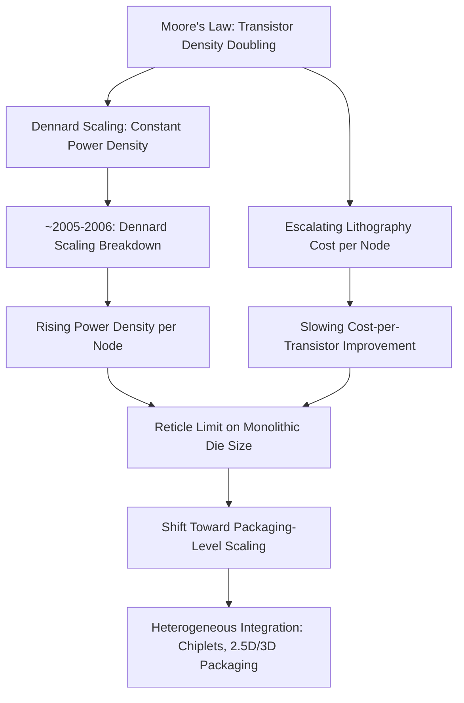

## Moore's Law Scaling Limits and the Shift to Heterogeneous Integration

### Definition and Scope

This topic addresses the technical and economic forces behind the semiconductor industry's inflection point from relying primarily on transistor-level scaling (Moore's Law) to relying increasingly on advanced packaging and heterogeneous integration as the mechanism for continued system-level performance, density, and cost improvement. It explains why packaging—historically a secondary, "back-end" cost center—became a primary axis of innovation from roughly the mid-2000s onward.

### Moore's Law: Definition and Historical Trajectory

**Original formulation.** Moore's Law, articulated by Gordon Moore in 1965 and revised in 1975, observed that the number of transistors on an integrated circuit tends to double at a regular cadence (originally annually, later revised to roughly every two years), driven by continued lithographic and process scaling.

**Dennard scaling as the companion principle.** Robert Dennard's 1974 scaling theory observed that as transistor dimensions shrink, voltage and current scale proportionally such that power density remains roughly constant—meaning smaller transistors could run faster without a proportional increase in power consumption. [Inference] Dennard scaling was arguably as important as raw transistor density scaling for decades of clock-speed and performance improvement, and its breakdown is a distinct but related contributor to the pressures discussed here.

**Historical cadence.** For approximately four decades (1970s–2000s), each new process node reliably delivered a combination of higher transistor density, lower cost per transistor, and improved switching speed/power, allowing system performance gains to be achieved largely through silicon scaling alone, with packaging serving a comparatively passive protective and interconnect role (as covered in the leadframe, wire-bond, and early BGA/flip-chip history).

### The Breakdown of Traditional Scaling

**Dennard scaling breakdown (mid-2000s).** Around 2005–2006, Dennard scaling broke down: as transistors continued shrinking, leakage current and threshold voltage limits prevented supply voltage from scaling down proportionally, causing power density to rise with each node rather than remain constant. [Inference] This breakdown is widely cited as the proximate cause of the industry's shift away from raw clock-frequency scaling and toward multi-core architectures in the mid-to-late 2000s, since simply shrinking transistors no longer yielded proportionally "free" performance without a power penalty.

**Escalating lithography cost and complexity.** Each successive process node beyond roughly the 28 nm/20 nm generation required increasingly expensive lithography techniques (multi-patterning, and later EUV) and design complexity, causing the cost-per-transistor improvement historically associated with Moore's Law to slow and, at some nodes/foundries, effectively stall. [Inference] This economic pressure—rather than a pure physical limit—is often cited as the more immediate driver of the industry's search for alternative scaling paths, since even where further transistor scaling remained technically feasible, it became progressively less economically attractive on a cost-per-function basis.

**Physical/quantum-effect limits.** As gate dimensions approached atomic scale (sub-10 nm and below), quantum tunneling effects, short-channel effects, and variability in dopant placement began to constrain further planar scaling, motivating architectural transistor changes (FinFET, and later gate-all-around/nanosheet transistors) to sustain scaling—innovations that themselves added significant process cost and complexity.

**Reticle limit.** Even where transistor density continues improving, the maximum die size manufacturable in a single lithographic exposure (the reticle field, historically around 858 mm²) caps how much logic can be integrated onto one monolithic die, regardless of transistor density—a hard architectural ceiling that pure process scaling cannot overcome.

### Diagram: Historical Drivers of the Shift to Packaging-Led Scaling

### From Monolithic Scaling to System-Level (Heterogeneous) Integration

**The "More than Moore" concept.** Industry roadmaps (notably articulated in the International Technology Roadmap for Semiconductors, ITRS, and its successor, the IEEE International Roadmap for Devices and Systems, IRDS) began distinguishing "More Moore" (continued transistor scaling) from "More than Moore" (functional diversification and system-level integration achieved through packaging rather than transistor shrinkage alone)—for example, integrating RF, analog, sensors, and power management alongside digital logic without requiring all functions to scale at the same lithographic node.

**Heterogeneous integration defined.** Heterogeneous integration refers to the assembly of multiple, separately manufactured components—which may differ in process node, material system (silicon, compound semiconductor, MEMS), or function (logic, memory, analog, RF)—into a single package or system, using advanced interconnect (flip-chip, 2.5D interposers, 3D stacking, fan-out redistribution) to achieve performance and density comparable to, or exceeding, what monolithic integration could deliver.

**Key economic and technical rationale:**

- **Yield economics of chiplets**: Splitting a large monolithic die into smaller "chiplets" and integrating them in-package can substantially improve overall yield, since defect probability scales with die area—smaller die are statistically more likely to be defect-free, and a single bad chiplet does not scrap an entire large, expensive die.
- **Heterogeneous process optimization**: Different functional blocks (high-speed logic, I/O, analog/RF, memory) have different optimal process nodes; monolithic integration forces all blocks onto the same node, often wasting cost on blocks that do not benefit from the most advanced (and most expensive) node. Chiplet-based heterogeneous integration allows each function to be fabricated at its most cost/performance-appropriate node and then combined in package.
- **Reuse and modularity**: Chiplet-based design allows reuse of validated IP blocks (e.g., I/O dies, memory controllers) across multiple product generations or product lines, reducing design and validation cost relative to redesigning a full monolithic die each generation.
- **Bypassing the reticle limit**: By distributing functionality across multiple die within a package (via 2.5D interposers or fan-out redistribution), total system transistor count and function can exceed what a single reticle-limited monolithic die could achieve.

### Enabling Packaging Technologies for Heterogeneous Integration

[Inference — this section connects to interconnect and architecture topics covered as separate curriculum items] The shift to heterogeneous integration was only possible because of packaging technology developments that this curriculum treats individually but that operate together as a stack:

- **Flip-chip/C4 interconnect** (prior item) provided the area-array, low-parasitic die attach method that made dense multi-die interconnection feasible.
- **2.5D silicon interposers** use a passive silicon (or, more recently, organic/glass) interposer with fine-pitch redistribution wiring to interconnect multiple die side-by-side at much finer pitch than an organic substrate alone could support, effectively acting as a bridge between die-level and board-level interconnect density.
- **Through-silicon vias (TSVs)** enable vertical electrical connections through a silicon die or interposer, essential for 2.5D interposer routing and for true 3D die stacking (e.g., high-bandwidth memory, HBM).
- **Fan-out wafer-level packaging (FOWLP)** redistributes die I/O outward into a molded "fan-out" region, enabling higher I/O density than the die's native footprint would otherwise support without requiring a separate interposer.
- **Hybrid bonding** enables direct copper-to-copper (and dielectric-to-dielectric) bonding between die at sub-10 μm pitch, without solder, supporting the very high interconnect density and low parasitic requirements of tightly stacked 3D chiplet architectures.

### Comparison: Monolithic Scaling vs. Heterogeneous Integration Approach

| Attribute | Monolithic (Pure Moore's Law) Scaling | Heterogeneous Integration |
| --- | --- | --- |
| Performance/density driver | Transistor shrink at single node | Multi-die assembly, potentially mixed nodes |
| Yield behavior | Falls sharply with die area at leading node | Improved via smaller chiplet die |
| Cost driver | Leading-edge node cost (rising per node) | Mix of node costs + packaging/interconnect cost |
| Design reuse | Full redesign per node typically required | Chiplet IP reuse across generations possible |
| Functional diversity | All functions forced to same node | Each function can use optimal node/material |
| Physical ceiling | Reticle limit on monolithic die size | Bypassed via multi-die in-package integration |

### Industry Roadmap Context

**IRDS "More than Moore" framing.** [Inference] Industry roadmaps have increasingly framed continued system performance scaling as requiring coordinated progress across both "More Moore" (continued transistor-level scaling, including FinFET/gate-all-around transitions) and "More than Moore" (heterogeneous integration, packaging-level scaling), rather than treating packaging as a secondary concern to device scaling.

**Industry commitment signals.** Major foundries and IDMs (e.g., TSMC's CoWoS and InFO platforms, Intel's Foveros and EMIB, Samsung's I-Cube and X-Cube) have made substantial, sustained capital investment in advanced packaging technology platforms since roughly the mid-2010s onward, reflecting an industry-wide strategic shift treating packaging as a primary performance lever rather than a commodity back-end process. [Inference] The consistency and scale of this investment across multiple major manufacturers is generally read as strong evidence that the shift toward packaging-led scaling reflects a structural, industry-wide response rather than an isolated strategy by any single company.

### Relevance to Advanced Packaging and Heterogeneous Integration

This topic is the conceptual hinge point of the entire course: it explains *why* the packaging technologies covered in earlier historical items (leadframe SMT, wire bonding, BGA, flip-chip/C4) evolved into the advanced packaging technologies (2.5D interposers, 3D stacking, chiplets, fan-out, hybrid bonding) that later chapters will cover in technical depth. Every subsequent architecture in this curriculum can be understood as a specific engineering response to one or more of the scaling-limit pressures described here: yield economics driving chiplet decomposition, reticle limits driving multi-die integration, power density driving 3D stacking with careful thermal design, and process-node cost driving heterogeneous (mixed-node) assembly.

**Related Topics:**

- Chiplet architecture and standardized die-to-die interfaces (e.g., UCIe)
- 2.5D silicon interposer design and through-silicon vias (TSVs)
- 3D die stacking and high-bandwidth memory (HBM) integration
- Fan-out wafer-level packaging (FOWLP) architectures
- Hybrid bonding: copper-to-copper direct bonding
- Thermal management challenges in 3D-stacked heterogeneous packages
- Foundry advanced packaging platforms (CoWoS, Foveros, EMIB, I-Cube/X-Cube)
- Known-good-die testing and chiplet yield economics