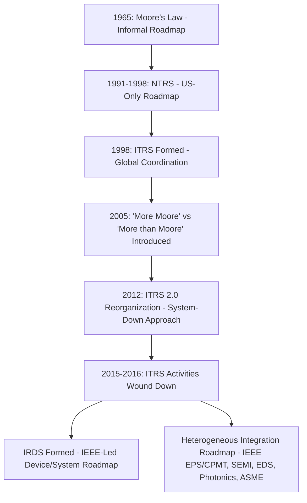

## From ITRS to IRDS and the Origins of the Heterogeneous Integration Roadmap

### Definition and Scope

This topic traces the institutional and organizational history of semiconductor industry roadmapping—from the original National Technology Roadmap for Semiconductors (NTRS) and its successor, the International Technology Roadmap for Semiconductors (ITRS), through ITRS's 2015–2016 wind-down, its bifurcation into the IEEE-led International Roadmap for Devices and Systems (IRDS) and the separately sponsored Heterogeneous Integration Roadmap (HIR). This organizational split is directly significant to advanced packaging because it marks the point at which packaging and heterogeneous integration roadmapping became formally institutionally independent from device/transistor roadmapping, reflecting the same "More than Moore" shift in industry priorities discussed in the prior item.

### From Moore's Law to Formal Roadmapping (1965–1998)

**Origin.** Gordon Moore's 1965 observation on transistor density doubling functioned as an informal industry roadmap for decades before any formal, coordinated roadmapping document existed. Gordon Moore mapped the future of the semiconductor industry in 1965, before the industry as it would become even existed. [ieee](https://irds.ieee.org/)

**NTRS (1991–1998).** It was not until 1991 that the US semiconductor community formulated a detailed roadmap document, and as the semiconductor community expanded internationally, it became clear that a broader worldwide approach to roadmapping was needed. This U.S.-only effort, the National Technology Roadmap for Semiconductors (NTRS), was produced by the Semiconductor Industry Association (SIA). [ieee](https://irds.ieee.org/)

**Formation of ITRS (1998).** In 1998, the SIA became closer to its European, Japanese, Korean, and Taiwanese counterparts, creating the first global roadmap: the International Technology Roadmap for Semiconductors. The ITRS was produced annually by a team of semiconductor industry experts from Europe, Japan, Korea, Taiwan, and the US between 1998 and 2015. [Wikipedia](https://en.wikipedia.org/wiki/International_Technology_Roadmap_for_Semiconductors)[ieee](https://irds.ieee.org/)

### ITRS Structure and Scope

The ITRS was coordinated and organized by the Semiconductor Research Corporation, with sponsoring organizations including the Semiconductor Industry Associations of Taiwan, South Korea, the United States, Europe, Japan, and China. The roadmap deliberately carried a disclaimer establishing its pre-competitive, non-commercial nature: it was "devised and intended for technology assessment only and is without regard to any commercial considerations pertaining to individual products or equipment." [Wikipedia](https://en.wikipedia.org/wiki/International_Technology_Roadmap_for_Semiconductors)[Wikipedia](https://en.wikipedia.org/wiki/International_Technology_Roadmap_for_Semiconductors)

The documents covered system drivers/design, test and test equipment, front-end processes, process integration/devices/structures, RF and analog/mixed-signal technologies, MEMS, photolithography, IC interconnects, factory integration, assembly and packaging, and environment/safety/health, projecting roughly 15 years into the future. Notably, **assembly and packaging** was already a distinct ITRS working group from the outset—meaning packaging roadmapping predates the "More than Moore" reorganization discussed below, though it operated as one subordinate track among many device-centric tracks. [Wikipedia](https://en.wikipedia.org/wiki/International_Technology_Roadmap_for_Semiconductors)

### The "More than Moore" Inflection (2005–2012)

In 2005, the ITRS published the first white paper introducing the terms "More than Moore" (MtM) and "More Moore" (MM") for the first time. This terminology formalized the distinction, discussed in the prior curriculum item, between continued transistor-level scaling (More Moore) and functional/system-level diversification achieved through packaging and integration (More than Moore). [ieee](https://irds.ieee.org/)

In December 2012, during the annual meeting held in Taiwan, the ITRS decided to reorganize to address the reality that traditional node-based scaling could no longer serve as the roadmap's sole organizing principle—a reorganization that led to what the industry termed "ITRS 2.0." As one industry account describes it: the focus of ITRS was dramatically changed, shifting from being primarily focused on manufacturing challenges required to sustain scaling, to a new goal in the relabeled "ITRS 2.0"—starting with a system-level approach and then determining what was required at the chip and transistor level. [Inference] This reversal of analytical direction (system-down rather than transistor-up) reflects the same recognition, discussed in the prior item, that system performance could no longer be assumed to follow automatically from transistor scaling alone. [ieee](https://irds.ieee.org/)[semiconductor-digest](https://sst.semiconductor-digest.com/?p=72222)

### The End of ITRS and the Fork into IRDS and HIR (2015–2016)

**ITRS wind-down.** In the winter of 2015, SIA announced that it would bring ITRS activities to a close, with the publication of the 2015 edition in the spring of 2016. As of 2017, ITRS was no longer being updated. After many delays, the last-ever ITRS was published; with only a few companies remaining in the world developing new fab technologies in each of the CMOS logic and memory spaces, each leading-edge company had developed a secret internal roadmap with little motivation to compare directions within fiercely competitive commercial markets. [Inference] This consolidation of leading-edge fabrication to a small number of companies (effectively down to a handful of foundries/IDMs at the bleeding edge) is generally cited as an important structural reason a shared, pre-competitive device roadmap became less necessary or sustainable at the transistor level specifically. [www.semi.org +2](https://www.semi.org/en/communities/hir)

**Formation of IRDS.** The IEEE Rebooting Computing Initiative, Standards Association, and Computer Society announced a new International Roadmap for Devices and Systems (IRDS) on May 4th of that year, led by long-time ITRS roadmapper Paolo Gargini, with the aspiration to build "a comprehensive end-to-end view of the computing ecosystem, including devices, components, systems, architecture, and software." The methods of governance, reports, and strategic roadmaps developed by ITRS and ITRS 2.0 were intended to inform IRDS within the IEEE-SA IC program. [semiconductor-digest](https://semiconductor-digest.com/?p=2376)[semiconductor-digest](https://sst.semiconductor-digest.com/?p=72222)

**Parallel formation of the Heterogeneous Integration Roadmap.** Critically for this curriculum, packaging-specific roadmapping did *not* simply fold into IRDS—it split off as an independently sponsored effort. In parallel to the IRDS efforts, the Heterogeneous Integration Roadmap activities continued, sponsored by the IEEE Components, Packaging and Manufacturing Technology Society (CPMT), SEMI, and the IEEE Electron Devices Society (EDS), with Bill Bottoms leading the collaboration. In 2015, a memorandum of understanding was signed between the Heterogeneous Integration Focus Team and IEEE EPS, with SIA's approval, to ensure the collaboration was sustainable. [semiconductor-digest](https://semiconductor-digest.com/?p=2376)[semi](https://www.semi.org/en/communities/hir)

[Inference] This organizational fork—separating device/transistor roadmapping (IRDS) from packaging/heterogeneous integration roadmapping (HIR) into two distinct, independently sponsored efforts rather than merging them into a single successor body—can itself be read as an institutional acknowledgment that packaging had become a sufficiently distinct and significant discipline to warrant its own dedicated, pre-competitive roadmap rather than remaining a subordinate working group within a device-centric roadmap.

### Diagram: Roadmap Lineage from Moore's Law to HIR/IRDS

### Heterogeneous Integration Roadmap: Structure and Sponsorship

**Current sponsorship.** The Heterogeneous Integration Roadmap is sponsored by the IEEE Electronics Packaging Society (EPS), SEMI, the IEEE Electron Devices Society (EDS), the IEEE Photonics Society, and the ASME EPPD Division. [Inference] Note that the specific sponsoring IEEE society shifted from CPMT (cited in the initial 2015 announcement) to EPS in later HIR materials—this reflects CPMT's renaming to the IEEE Electronics Packaging Society (EPS) rather than a change in the underlying sponsoring organization. [ieee](https://eps.ieee.org/technology/heterogeneous-integration-roadmap)

**Institutional lineage acknowledged by HIR itself.** The background material explicitly notes that the ITRS Assembly and Packaging Working Group had many years of history collaborating with IEEE Societies in holding workshops and work sessions at IEEE-sponsored conferences and events worldwide, directly connecting HIR's origins to the assembly/packaging track that had existed within ITRS from 1998 onward. [ieee](https://eps.ieee.org/technology/heterogeneous-integration-roadmap)

**Scope and working groups.** The HIR team comprises 22 Technical Working Groups representing the electronics ecosystem. The roadmap provides a comprehensive and strategic forecast of technology over 15 years, with a 25-year R&D outlook for heterogeneous integration of emerging devices and materials. [3dincites](https://www.3dincites.com/2019/12/iftle-435-the-heterogeneous-integration-roadmap-hir/)[microwavejournal](https://microwavejournal.com/articles/32981-ieee-2019-hir-identifies-long-term-tech-requirements-to-inspire-collaboration-in-electronics)

**Definition of heterogeneous integration used by HIR.** Heterogeneous Integration refers to the integration of separately manufactured components into a higher-level assembly (system-in-package, SiP) that, in aggregate, provides enhanced functionality and improved operating characteristics, where "components" means any unit—individual die, MEMS device, passive component, or assembled package/sub-system—integrated into a single package, and "operating characteristics" is understood broadly to include system-level performance and cost of ownership. This is the same conceptual definition introduced in the prior curriculum item on heterogeneous integration, now anchored to its formal roadmap-body source. [ieee](https://ieeetv.ieee.org/technology/heterogeneous-integrationroadmap)

**First published edition.** The IEEE published the 2019 edition of the HIR, discussing technology requirements and potential solutions for the future of electronics, intended to accelerate technology and industry progress through pre-competitive collaboration among industry, academia, and government. The 2019 edition included 22 chapters. [Unverified] Sources reviewed here do not clearly establish whether an HIR edition predates 2019 versus 2019 being the first formally chaptered public release; this would benefit from direct confirmation against the HIR's own published edition history if precise first-edition dating is required. [microwavejournal](https://microwavejournal.com/articles/32981-ieee-2019-hir-identifies-long-term-tech-requirements-to-inspire-collaboration-in-electronics)[embeddedcomputing](https://dev007.embeddedcomputing.com/application/networking-5g/semi-releases-2019-heterogeneous-integration-roadmap)

### Comparison: ITRS vs. Its Successor Bodies

| Attribute | ITRS (1998–2015/16) | IRDS (2016–present) | HIR (2015/19–present) |
| --- | --- | --- | --- |
| Primary coordinating body | SIA / Semiconductor Research Corp. | IEEE (Rebooting Computing, SA, Computer Society) | IEEE EPS, SEMI, IEEE EDS, IEEE Photonics, ASME |
| Primary focus | Device/transistor scaling + subordinate packaging track | End-to-end computing ecosystem: devices, systems, architecture, software | Heterogeneous integration and advanced packaging specifically |
| Approach | Historically process/node-driven, later system-down (ITRS 2.0) | System-level, end-to-end | Application- and packaging-technology-driven |
| Packaging's institutional status | One working group among many device-centric tracks | Packaging not the primary focus | Packaging/HI is the entire roadmap's subject |

### Significance for Advanced Packaging as a Discipline

[Inference] The ITRS-to-IRDS/HIR institutional split is significant to this curriculum for a structural reason: it marks the point at which "packaging roadmap" ceased to be a subordinate chapter within a device-scaling roadmap and became its own independently governed, pre-competitive planning body with dedicated sponsorship from packaging-specific professional societies (IEEE EPS/CPMT, ASME's electronic packaging division) rather than the general semiconductor device community. This mirrors, at the institutional/organizational level, the same shift described in the prior item at the technical/economic level—the movement of packaging from a passive, back-end concern to a primary, independently strategized axis of industry roadmapping and innovation investment.

### Relevance to Advanced Packaging and Heterogeneous Integration

The HIR is the direct successor document most closely aligned with the subject matter of this entire course, and its 22 technical working groups broadly correspond to the technology areas (2.5D/3D integration, chiplets, thermal management, testing, reliability, materials, specific application domains such as photonics and quantum) that later chapters will address individually. Understanding this roadmap lineage clarifies why much technical literature, foundry roadmap language, and industry terminology in advanced packaging cites "the HIR" as a primary reference framework, and explains its institutional distinction from IRDS despite both descending from the same ITRS lineage.

**Related Topics:**

- HIR chapter structure and the 22 Technical Working Groups
- IRDS device roadmap chapters and their intersection with packaging (e.g., heterogeneous integration chapter within IRDS itself)
- "More Moore" vs. "More than Moore" as competing/complementary roadmap philosophies
- SEMI and IEEE EPS as standards and roadmap governance bodies in packaging
- Application-driven roadmapping (5G, AI/HPC, automotive, medical) within HIR chapters
- Comparison of HIR projections to actual foundry advanced packaging platform introductions (CoWoS, Foveros, EMIB)