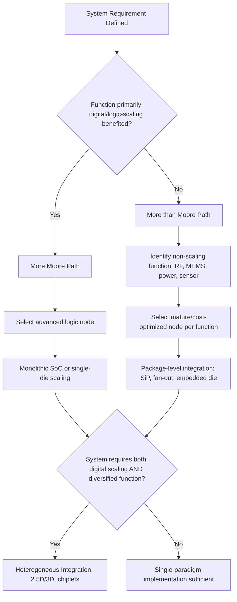

## More Moore versus More than Moore Paradigms

### Overview

**Key Points**

- "More Moore" (MM) and "More than Moore" (MtM) are two complementary roadmapping paradigms formalized primarily through the International Technology Roadmap for Semiconductors (ITRS) and its successor, the International Roadmap for Devices and Systems (IRDS)
- More Moore refers to continued transistor-level scaling following Moore's Law — shrinking feature sizes to increase density, speed, and reduce cost-per-transistor
- More than Moore refers to functional diversification — integrating non-digital, non-scaling functions (RF, sensors, power, analog, MEMS) into a package or system without requiring further lithographic shrink
- Advanced packaging and heterogeneous integration are the primary enabling technologies for the More than Moore paradigm, and increasingly serve as an extension mechanism for More Moore economics as well

---

### Historical Context

The MM/MtM distinction emerged in the mid-2000s as the semiconductor industry recognized that classical Dennard scaling was decelerating and that not all value creation depended on transistor shrink. The ITRS introduced a widely cited two-axis diagram plotting "miniaturization" (horizontal axis, digital scaling) against "functional diversification" (vertical axis, non-digital content) to illustrate that these were orthogonal, not competing, growth vectors.

[Inference] The formalization of this framework is often credited to consensus discussions within ITRS working groups circa 2005–2010, reflecting industry-wide recognition that SoC-only scaling could not economically serve emerging application domains like mobile RF front-ends, MEMS sensors, and power management.

---

### More Moore: Definition and Scope

**Key Points**

- Governed by geometric/lithographic scaling: gate length, contacted poly pitch (CPP), metal pitch, and cell height reduction
- Follows the classical node progression: 90nm → 65nm → 45/40nm → 32/28nm → 22/20nm → 16/14nm FinFET → 10/7nm → 5nm → 3nm → 2nm (gate-all-around)
- Value driver: cost-per-transistor reduction and performance/power improvement through device physics (shorter gates, lower capacitance, higher drive current)
- Primarily a front-end-of-line (FEOL) and middle-of-line (MOL) domain, historically requiring minimal packaging innovation beyond standard flip-chip or wire-bond

**Core scaling metrics tracked under More Moore:**

| Metric | Description |
| --- | --- |
| Gate length ($L_g$) | Physical/effective channel length |
| Contacted poly pitch (CPP) | Minimum repeatable transistor pitch |
| Metal pitch (Mx) | Minimum interconnect pitch, back-end-of-line |
| $V_{dd}$ scaling | Supply voltage reduction for power efficiency |
| Equivalent oxide thickness (EOT) | Gate dielectric scaling |

The classical Dennard scaling relationship is expressed as:

$$P = C \cdot V_{dd}^2 \cdot f$$

where $P$ is dynamic power, $C$ is capacitance, $V_{dd}$ is supply voltage, and $f$ is switching frequency. As $V_{dd}$ scaling stalled below roughly the 28nm–22nm generations due to leakage and reliability constraints, the power benefits of pure geometric scaling diminished, motivating architectural and packaging-level solutions.

---

### More than Moore: Definition and Scope

**Key Points**

- Encompasses non-digital or mixed-signal functionality that does not benefit proportionally from lithographic shrink: RF/analog circuits, passives, power devices, sensors, actuators, MEMS, and biochips
- Value driver: system-level functionality, form factor reduction, and cost optimization through integration rather than transistor scaling
- Enabled primarily through packaging-level integration: 2.5D/3D stacking, System-in-Package (SiP), fan-out wafer-level packaging (FOWLP), and heterogeneous integration
- Often described using the "SiP vs SoC" dichotomy — MtM favors SiP-style assembly of best-in-class dies over monolithic SoC integration

**Representative MtM functional domains:**

| Domain | Example Devices |
| --- | --- |
| RF/Analog | Power amplifiers, filters, RF switches |
| Power | DC-DC converters, power management ICs (PMICs) |
| Sensors/Actuators | MEMS accelerometers, gyroscopes, pressure sensors |
| Biochips | Lab-on-chip, DNA sequencing arrays |
| Passives | Integrated capacitors, inductors |

---

### The ITRS/IRDS Two-Axis Model

(svg_diagram)

<svg xmlns="http://www.w3.org/2000/svg" viewBox="0 0 720 460" font-family="Helvetica, Arial, sans-serif">
<text x="360" y="28" text-anchor="middle" font-size="18" font-weight="bold" fill="#1a1a1a">More Moore vs More than Moore (svg_diagram)</text>

<line x1="90" y1="400" x2="650" y2="400" stroke="#333" stroke-width="2" />
<line x1="90" y1="400" x2="90" y2="60" stroke="#333" stroke-width="2" />

<polygon points="650,400 640,395 640,405" fill="#333" />
<polygon points="90,60 85,70 95,70" fill="#333" />

<text x="370" y="430" text-anchor="middle" font-size="14" fill="#333">Miniaturization → (More Moore: Digital CMOS Scaling)</text>

<text x="55" y="230" text-anchor="middle" font-size="14" fill="#333" transform="rotate(-90 55 230)">Functional Diversification → (More than Moore)</text>

<text x="150" y="415" font-size="10" fill="#555">90nm</text>

<text x="230" y="415" font-size="10" fill="#555">28nm</text>

<text x="320" y="415" font-size="10" fill="#555">7nm</text>

<text x="420" y="415" font-size="10" fill="#555">3nm</text>

<text x="520" y="415" font-size="10" fill="#555">2nm/GAA</text>

<path d="M 90,390 Q 300,370 630,90" stroke="#2060c0" stroke-width="3" fill="none" />
<text x="480" y="140" font-size="13" fill="#2060c0" font-weight="bold">More Moore (SoC scaling)</text>

<path d="M 90,390 Q 250,300 400,140" stroke="#c04020" stroke-width="3" fill="none" />
<text x="270" y="220" font-size="13" fill="#c04020" font-weight="bold">More than Moore (SiP diversification)</text>

<ellipse cx="500" cy="150" rx="110" ry="55" fill="#e8f5e9" stroke="#2e7d32" stroke-width="2" opacity="0.85" />
<text x="500" y="145" text-anchor="middle" font-size="12" font-weight="bold" fill="#1b5e20">Heterogeneous</text>
<text x="500" y="162" text-anchor="middle" font-size="12" font-weight="bold" fill="#1b5e20">Integration (2.5D/3D)</text>

<circle cx="150" cy="385" r="4" fill="#2060c0" />
<circle cx="230" cy="360" r="4" fill="#2060c0" />
<circle cx="320" cy="280" r="4" fill="#2060c0" />
<circle cx="420" cy="180" r="4" fill="#2060c0" />
<circle cx="520" cy="110" r="4" fill="#2060c0" />

<rect x="440" y="380" width="14" height="14" fill="#2060c0" />
<text x="460" y="391" font-size="11" fill="#333">Digital scaling path</text>
<rect x="440" y="398" width="14" height="14" fill="#c04020" />
<text x="460" y="409" font-size="11" fill="#333">Functional diversification path</text>
</svg>

The diagram illustrates the classical ITRS framing: the horizontal (x) axis represents digital CMOS node scaling (More Moore), the vertical (y) axis represents non-digital functional content added via packaging (More than Moore), and the upper-right convergence region represents heterogeneous integration — where both paradigms are pursued simultaneously within a single package or module.

---

### Convergence: Heterogeneous Integration as the Bridge

**Key Points**

- As monolithic scaling costs rise (EUV lithography, multi-patterning), the industry increasingly disaggregates SoCs into chiplets — separately manufactured dies (potentially on different nodes) reassembled via advanced packaging
- This chiplet approach borrows MtM's integration philosophy to *extend* More Moore economics — i.e., using packaging to achieve system-level density/performance gains that monolithic scaling alone can no longer deliver cost-effectively
- 2.5D interposers (silicon, RDL-based fan-out) and 3D stacking (hybrid bonding, TSV) are the primary enabling packaging technologies
- Industry terminology increasingly frames this hybrid zone as "More Moore *through* packaging" — packaging as a scaling continuation mechanism rather than merely a diversification mechanism

**Illustrative comparison table:**

| Attribute | More Moore | More than Moore | Heterogeneous Integration (Convergence) |
| --- | --- | --- | --- |
| Primary lever | Transistor scaling | Functional diversification | Packaging-enabled disaggregation |
| Node dependency | High | Low/None | Mixed (multiple nodes per package) |
| Example technology | FinFET, GAA/nanosheet | MEMS, RF SiP | Chiplets, 2.5D interposer, 3D hybrid bonding |
| Cost driver | Lithography, EUV | Assembly, test | Interconnect density, yield of known-good-die |
| Representative packaging | Standard flip-chip | Wire-bond SiP, embedded die | CoWoS, EMIB, Foveros, hybrid bonding |

---

### Worked Example: Mobile SoC Evolution

**Example**

A smartphone application processor in the early 2010s (e.g., 28nm monolithic SoC) exemplified pure More Moore: CPU, GPU, and modem logic scaled together on a single die at a single node.

By the late 2010s/2020s, the same functional scope was frequently split: the digital compute die continued scaling under More Moore principles (e.g., 5nm/3nm), while RF transceivers, PMICs, and sensors remained on mature, cost-optimized nodes (e.g., 28nm–65nm) and were integrated via SiP or package-on-package (PoP) — a direct application of More than Moore. The overall module thus achieves system-level density improvement through the *combination* of both paradigms rather than either alone.

[Inference] Specific SoC-to-SiP partitioning details vary by vendor and generation and are not universally documented; the pattern described reflects an industry-general trend rather than a single verified product architecture.

---

### Roadmap Continuity: ITRS to IRDS

**Key Points**

- ITRS ceased publication after its 2015 edition; the roadmap function was transferred to IEEE's IRDS starting 2016
- IRDS retained and expanded the MM/MtM framework under its "Heterogeneous Integration" and "More Moore" focus teams (International Focus Teams, IFTs)
- The IRDS Heterogeneous Integration roadmap chapter explicitly documents packaging technologies (2.5D, 3D, fan-out, chiplets) as the operational toolkit for realizing More than Moore and convergence-zone objectives

[Unverified] Exact organizational names and chapter structures within current IRDS editions may have been revised since the assistant's training data; readers should consult the latest published IRDS roadmap for authoritative chapter titles and scope statements.

---

### Process Flow: Design Decision Between MM and MtM Paths

---

### Common Pitfalls and Misconceptions

- **Misconception:** More than Moore is a "fallback" for when More Moore scaling fails. In practice, MtM is a parallel value-creation strategy driven by application requirements (sensors, RF, power) that never benefited from lithographic scaling in the first place, independent of More Moore's trajectory.
- **Misconception:** Heterogeneous integration is synonymous with More than Moore. More precisely, heterogeneous integration is the packaging toolkit that can serve *both* paradigms — extending More Moore economics via chiplet disaggregation, and enabling More than Moore via functional SiP integration.
- **Pitfall:** Assuming all packaging is "More than Moore." Standard flip-chip or wire-bond packaging of a single monolithic SoC remains within the More Moore paradigm; only when packaging is used to combine functionally or process-technologically distinct dies does it enter More than Moore or convergence territory.

---

**Related Topics**

- ITRS/IRDS Roadmap Structure and Historical Editions
- Dennard Scaling and Its Breakdown
- Chiplet Architectures and Die Disaggregation
- System-in-Package (SiP) Design Methodology
- 2.5D Interposer Technology (Silicon, RDL, Glass)
- 3D IC Integration and TSV Fundamentals
- Fan-Out Wafer-Level Packaging (FOWLP)
- Known-Good-Die (KGD) Testing Challenges in Heterogeneous Integration
- Cost-per-Function vs Cost-per-Transistor Economic Models