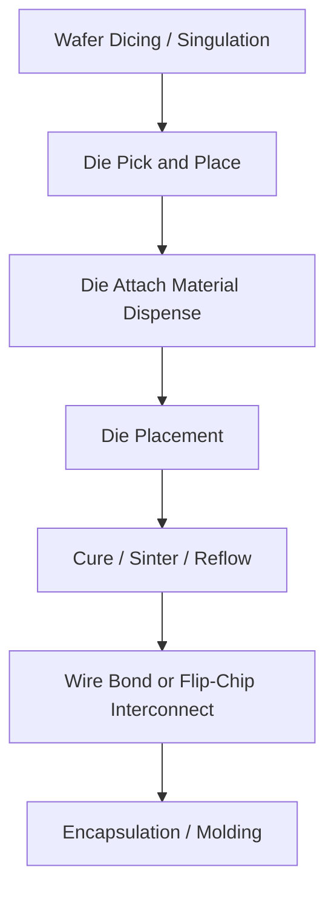

## Die Attach Materials and Processes

### Overview

Die attach is the process that mechanically and thermally bonds a die to a substrate, leadframe, or another die, forming the foundational mechanical interface upon which the first-level electrical interconnect (wire bond or flip-chip) is built. Die attach quality directly governs thermal resistance, mechanical reliability under thermal cycling, and — for stacked-die and 3D packages — the entire z-height and warpage budget of the assembly.

### Role in the Package Build Sequence

Die attach occurs after wafer dicing/singulation and before wire bonding or subsequent stacking, and it sits below the first-level interconnect (Level 1) in the die-to-board hierarchy:

### Die Attach Material Classes

**Epoxy Die Attach (Conductive and Non-Conductive Adhesives)**

- Silver-filled epoxy (Ag-epoxy): most common for wire-bond packages requiring electrical/thermal conductivity through the die attach layer
- Non-conductive adhesive (NCA/NCF): used where electrical isolation between die and paddle is required, or where underlying circuitry must not be shorted
- Cure: thermal cure typically 150-200°C for tens of minutes to a few hours, depending on formulation
- Thermal conductivity: ~2-8 W/m·K for Ag-filled epoxies — comparatively low versus metallic alternatives
- Widely used due to low process temperature, low cost, and compatibility with organic substrates

**Solder Die Attach**

- Materials: high-lead solders (Pb-5Sn), SAC alloys (SnAgCu), or Au-Sn eutectic (80Au-20Sn) for hermetic/high-reliability applications
- Provides higher thermal conductivity (~50-60 W/m·K) than epoxy, important for power devices
- Requires solderable die backside metallization (typically Ti/Ni/Ag or similar stack) and solderable substrate/leadframe finish
- Reflow temperatures vary by alloy: Au-Sn eutectic reflows near 280°C; SAC alloys near 217-260°C
- Common in RF power, automotive power modules, and optoelectronics where thermal dissipation is critical

**Sintered Silver (Ag Sintering)**

- Silver nanoparticle or micro-particle paste, bonded under pressure and moderate temperature (typically 200-280°C) without full melting — particles fuse via solid-state diffusion
- Delivers very high thermal conductivity (~150-250 W/m·K, approaching bulk silver) and excellent high-temperature reliability, since the resulting joint's melting point is essentially that of bulk silver (~961°C)
- Increasingly dominant in SiC and GaN power device packaging, EV inverter modules, and other high-temperature, high-reliability applications
- Two variants: pressure-assisted sintering (higher density, better performance, requires bonding press) and pressureless sintering (simpler process, somewhat lower density/conductivity)
- [Inference] Pressureless sintered-silver formulations continue to be an active area of formulation development, so achievable thermal conductivity for a given pressureless product should be verified against the current datasheet.

**Die Attach Film (DAF)**

- B-stage (partially cured) adhesive film laminated onto the wafer backside before or after dicing, eliminating liquid dispense
- Essential for thin-die and stacked-die (3D package) applications where dispense volume control and bleed-out are difficult to manage with liquid epoxy
- Enables very thin, uniform bondlines (down to a few micrometers), critical for multi-die stacks (e.g., NAND flash stacks, HBM-adjacent logic stacking)
- Applied via wafer-level lamination followed by dicing-through-film (DTF) processes

**Transient Liquid Phase (TLP) Bonding**

- Uses a low-melting-point metal (e.g., In, Sn) that diffuses into a higher-melting-point metal (e.g., Cu, Ag) during bonding, forming intermetallic compounds with a much higher remelt temperature than the original bonding temperature
- Attractive for applications needing low process temperature but high in-service temperature stability
- [Speculation] Broader production adoption outside specialized power/RF niches remains limited relative to sintered silver, though this may shift as intermetallic-forming pastes mature.

### Material Selection Comparison

| Material | Thermal Conductivity | Process Temp | Key Use Case | Key Limitation |
| --- | --- | --- | --- | --- |
| Ag-filled epoxy | 2-8 W/m·K | 150-200°C | General wire-bond packages | Lower thermal performance, epoxy degradation at high temp |
| Solder (SAC) | ~50-60 W/m·K | 217-260°C | Power devices, moderate reliability needs | Fatigue under thermal cycling |
| Au-Sn eutectic | ~57 W/m·K | ~280°C | Hermetic, RF, optoelectronic | High cost, brittle joint |
| Sintered Ag | 150-250 W/m·K | 200-280°C (no melt) | SiC/GaN power, EV inverters | Process cost, pressure equipment (for pressure-assisted) |
| DAF | Formulation-dependent, generally moderate | Lamination + cure | Stacked-die, thin packages | Requires precise film thickness control |

### Bondline Thickness (BLT) and Void Control

Bondline thickness directly impacts thermal resistance:

$$R_{th} = \frac{t_{BLT}}{k \cdot A}$$

where $t_{BLT}$ is bondline thickness, $k$ is the material's thermal conductivity, and $A$ is the bond area. Minimizing BLT while avoiding voids is a central process control objective.

- Void content is typically inspected via scanning acoustic microscopy (SAM/C-SAM); industry practice commonly targets less than roughly 5-10% void area for standard applications, though thresholds vary significantly by application criticality and specification
- Voids concentrate thermal and mechanical stress, and under thermal cycling can propagate into cracks, degrading long-term reliability
- [Unverified] Specific void-area acceptance criteria vary substantially by JEDEC/customer specification and package type; the figures above should be treated as general industry practice, not a universal standard.

### Process Flow Detail: Epoxy Die Attach

1. **Dispense**: Automated syringe or jet dispense deposits a controlled pattern (dot, cross, or dam-and-fill) of epoxy on the substrate/leadframe die pad
2. **Pick and place**: Die picked from wafer tape via ejector pins/vacuum collet and placed onto the epoxy with controlled placement force
3. **Bleed-out control**: Epoxy spreads under die weight and placement force; pattern design prevents excessive bleed onto bond pads or adjacent die
4. **Cure**: Batch oven or inline furnace cure, following a temperature ramp profile to fully cross-link the epoxy without generating excessive outgassing voids
5. **Inspection**: Visual/automated optical inspection (AOI) for die placement accuracy (shift, rotation, tilt) and C-SAM for void/delamination check

### Process Flow Detail: Sintered Silver (Pressure-Assisted)

1. Sinter paste printed or dispensed onto substrate (often requires Ag or Au surface finish for good wetting)
2. Die placed onto paste
3. Assembly loaded into a sintering press; heated under applied pressure (several MPa to tens of MPa) in a controlled atmosphere (often with formic acid vapor or N2/H2 to reduce silver oxide and promote sintering)
4. Silver particles densify and fuse via solid-state atomic diffusion, forming a porous but highly conductive metallic bond without a distinct melt/solidify step
5. Post-sinter inspection for void content and bond strength (die shear testing)

### Reliability and Failure Mechanisms

- **Die attach voiding**: Localized hotspots, thermal cycling fatigue initiation sites
- **Delamination**: Loss of adhesion at die-to-attach or attach-to-substrate interface, often from moisture absorption (epoxy) followed by vapor pressure buildup during reflow (the "popcorn effect" in moisture-sensitive packages)
- **CTE mismatch stress**: Die (CTE ~2.6 ppm/°C for Si), die attach material, and substrate/leadframe (CTE varies widely, e.g., Cu ~17 ppm/°C) expand at different rates; die attach must absorb some strain, or crack over thermal cycles
- **Die shear strength**: Standard mechanical qualification test (per MIL-STD-883 Method 2019 or JEDEC equivalents) measuring the force required to shear the die off the substrate, used as a proxy for bond integrity

### Example: Material Selection Decision for a SiC Power Module

A SiC MOSFET power module targeting 175°C+ continuous junction temperature and automotive-grade thermal cycling requirements (AEC-Q101) would typically favor sintered silver over standard Ag-epoxy or SAC solder, because:

- Epoxy's glass transition temperature and long-term thermal stability are generally insufficient at these junction temperatures
- SAC solder's melting point (~217°C) is too close to the operating range, risking remelt/fatigue
- Sintered silver's effective remelt temperature near bulk silver's melting point provides substantial margin above operating temperature, while its high thermal conductivity reduces junction-to-case thermal resistance

### Key Points

- Die attach material choice is primarily a trade-off between thermal conductivity, process temperature/cost, and reliability at target operating temperature
- Sintered silver has become the reference technology for high-power, high-temperature applications (SiC/GaN), displacing solder in many new designs
- Die attach film (DAF) is essential infrastructure for 3D stacked-die packaging where liquid dispense cannot achieve the required thin, uniform bondlines
- Void control and bondline thickness are the two central process metrics linking die attach quality to thermal and mechanical reliability

### Related Topics

- Die shear and pull testing methodologies (MIL-STD-883, JEDEC)
- Wire bonding processes (thermosonic, ball-wedge) as the interconnect step following die attach
- Flip-chip die attach and underfill processes
- Thermal interface materials (TIMs) at the package-to-heatsink level
- Moisture sensitivity levels (MSL) and popcorn cracking
- Stacked-die packaging and multi-die-per-package assembly flows
- Copper sintering as an emerging alternative to silver sintering