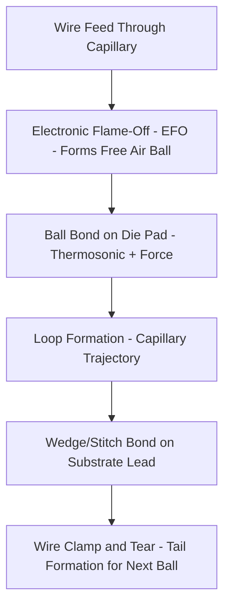
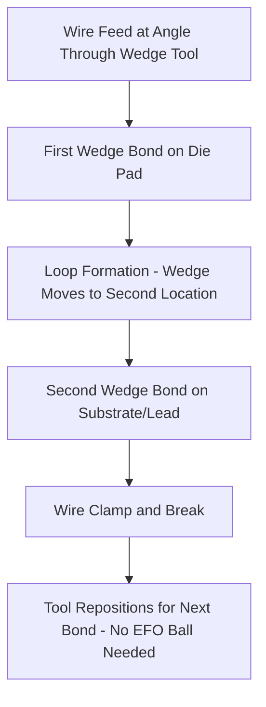

## Wire Bonding: Ball Bonding and Wedge Bonding Techniques

### Overview

Wire bonding remains the dominant first-level interconnect (Level 1) technology by unit volume across the semiconductor industry, connecting die bond pads to substrate/leadframe fingers via fine metal wire. Two principal techniques dominate: **thermosonic ball bonding** (also called ball-wedge or gold-wire bonding) and **wedge-wedge bonding** (ultrasonic wedge bonding). Each combines heat, pressure, and ultrasonic energy in different proportions to form a solid-state metallurgical bond without melting the wire or pad.

### Bonding Physics Fundamentals

Wire bonding forms a solid-state weld through a combination of:

- **Pressure**: Mechanical deformation that breaks up surface oxide layers and increases true contact area
- **Ultrasonic energy**: High-frequency (typically ~60-120 kHz) lateral scrubbing motion that disrupts oxide films and promotes atomic diffusion across the interface
- **Heat** (thermosonic only): Elevated substrate/stage temperature (100-220°C) that increases atomic mobility and accelerates interdiffusion

The bond strength arises from interdiffusion and intermetallic formation between the wire and pad metallurgies (e.g., Au-Al intermetallics in gold ball bonding to aluminum pads).

### Ball Bonding (Thermosonic)

**Process sequence:**

1. **Electronic flame-off (EFO)**: A spark discharge melts the wire tip, and surface tension forms a molten sphere that solidifies into a free-air ball (FAB), typically 1.5-2.5x the wire diameter
2. **First bond (ball bond)**: The capillary presses the ball onto the die bond pad; thermosonic energy and bond force form the primary ball bond, producing a characteristic "nailhead" deformed ball shape
3. **Wire loop formation**: The capillary rises and moves through a programmed trajectory (loop profile) to the second bond location, controlling loop height and shape to avoid wire sweep, sag, or shorting to adjacent wires
4. **Second bond (stitch/wedge bond)**: The capillary presses the wire onto the substrate lead/finger, forming a wedge-shaped stitch bond via ultrasonic scrub (typically without as much thermal input as the ball bond, since substrate is already at elevated temperature)
5. **Tail and clamp**: Wire clamps close, capillary rises and the wire tears at a controlled point above the stitch, leaving a tail for the next EFO cycle

**Materials:**

- Gold (Au) wire: traditional standard, excellent oxidation resistance, reliable ball formation, typically 99.99% purity with trace dopants (Be, Ca) for controlled mechanical properties
- Copper (Cu) wire: lower cost, higher electrical/thermal conductivity, but requires inert (N2/H2 forming gas) atmosphere during EFO to prevent oxidation, and is harder — requiring tighter process control and more pad-damage-resistant capillary/bonding parameters
- Palladium-coated copper (PCC) wire: intermediate option, combines copper's cost/conductivity with improved oxidation resistance and finer process latitude versus bare copper
- Silver (Ag) alloy wire: emerging alternative balancing cost and performance between Au and Cu

**Wire diameter range:** typically 15-50 μm for fine-pitch applications, with common values around 18-33 μm for standard IC wire bonding

**Pitch capability:** Modern fine-pitch ball bonding achieves pad pitches down to roughly 35-40 μm, with ultra-fine-pitch processes pushing toward 30 μm

### Wedge Bonding (Ultrasonic/Wedge-Wedge)

**Process sequence:**

1. **First bond**: Wire fed through a wedge-shaped tool at an angle (typically 30-60° to the bonding surface); ultrasonic energy and force form a flattened wedge bond directly on the die pad — no ball is formed
2. **Loop formation**: Because the wedge tool must maintain wire feed angle alignment, the bonding stage or tool must rotate/translate to align the second bond location along the wire feed axis — this is the key throughput limitation versus ball bonding
3. **Second bond**: Wedge bond formed at the destination pad/lead
4. **Wire break**: Clamps close and wire is torn, tool repositions for the next bond (no EFO step required between bonds)

**Materials:**

- Aluminum (Al) wire, typically alloyed with ~1% silicon or ~1% magnesium for improved fatigue resistance: dominant for power semiconductor and automotive applications due to compatibility with Al bond pads without requiring heat (room-temperature ultrasonic bonding is possible), avoiding thermal stress on temperature-sensitive die
- Gold wire wedge bonding: used for fine-pitch, low-loop, or hermetic applications where ball bonding's higher loop profile is undesirable
- Heavy Al wire (100-500 μm diameter): standard for power device source/gate bonding, carrying high current with correspondingly larger wedge bond footprints

**Key distinguishing characteristic**: wedge bonding requires the bonding tool to be oriented and moved along the wire axis between the two bond points (no rotational freedom around the vertical axis at the bond site), whereas ball bonding's spherical ball permits omnidirectional loop trajectories — this is why wedge bonding is generally slower for high-mix, high-density interconnect but excels at heavy-wire, high-current applications

### Ball Bonding vs. Wedge Bonding Comparison

| Attribute | Ball (Thermosonic) Bonding | Wedge (Ultrasonic) Bonding |
| --- | --- | --- |
| Typical wire material | Au, Cu, PCC | Al (Si or Mg alloy), Au |
| Process temperature | 100-220°C (thermosonic) | Room temp possible (pure ultrasonic) to moderate heat |
| Bond directionality | Omnidirectional (any XY loop path) | Unidirectional (must align tool to wire axis) |
| Typical wire diameter | 15-50 μm | 25 μm to 500+ μm (heavy wire for power) |
| Throughput | High (10-20+ wires/sec typical for fine pitch) | Lower, especially for high-mix rotation |
| Common applications | Logic, memory, general IC packaging | Power semiconductors, RF/microwave, hybrid modules, automotive |
| Loop height | Higher first-bond profile (ball + loop) | Lower profile achievable |
| First bond shape | Ball (nailhead after deformation) | Flattened wedge (no ball) |

### Bond Quality Inspection and Failure Modes

- **Pull test**: Mechanical hook pulls the wire loop to measure breaking force and failure mode location (per MIL-STD-883 Method 2011); failure at the bond interface (rather than mid-wire) indicates weak bond
- **Shear test**: Measures force to shear the ball bond off the pad, per MIL-STD-883 Method 2019
- **Common failure mechanisms**:
  - **Kirkendall voiding**: At Au-Al intermetallic interfaces under prolonged high-temperature exposure, differential diffusion rates create voids that weaken the bond over time — historically a major driver of the industry's caution around Au ball bonds on Al pads in high-temperature-life applications
  - **Wire sweep**: Wire displacement during mold compound encapsulation (transfer molding flow forces), causing shorts between adjacent wires
  - **Bond pad cratering**: Excessive bonding force/ultrasonic energy fractures the underlying low-k dielectric or silicon beneath the pad — a growing concern as low-k interlayer dielectrics in advanced nodes are more fragile than pad metal alone
  - **Non-stick on pad (NSOP) / non-stick on lead (NSOL)**: Contamination or process parameter drift preventing proper metallurgical bond formation

### Example: Selecting Between Ball and Wedge Bonding

For a standard mixed-signal SoC in a QFN package with 300+ I/Os at fine pad pitch, thermosonic gold or copper ball bonding is the standard choice — omnidirectional loop routing accommodates the dense, non-linear pad layout, and high per-second bond rates keep unit cost low.

For an IGBT power module requiring multiple parallel heavy aluminum wires to carry tens of amps from the die source pad to the substrate, aluminum wedge bonding (often with wire diameters of 250-500 μm, or ribbon bonding as a related heavy-interconnect variant) is standard — high current-carrying capacity per bond and room-temperature process (avoiding thermal stress on the die) are the priorities, not bond density or throughput.

### Key Points

- Ball bonding dominates high-volume, fine-pitch logic/memory packaging due to throughput and omnidirectional routing flexibility
- Wedge bonding dominates power, RF, and automotive applications where heavy wire, low loop height, or room-temperature processing are required
- Copper wire adoption has grown significantly as a cost-reduction measure relative to gold, but requires tighter process control and inert atmosphere handling
- Au-Al Kirkendall voiding is a well-documented long-term reliability consideration in gold ball bonding onto aluminum pads, particularly relevant for high-temperature-life qualification
- [Inference] Exact throughput figures (wires/second) and minimum achievable pitch continue to improve with equipment generations, so specific numbers should be checked against current bonder OEM specifications (e.g., ASMPT, Kulicke & Soffa) for a given process node.

### Related Topics

- Die attach materials and processes (precedes wire bonding in the assembly flow)
- Flip-chip interconnect as an alternative to wire bonding for I/O-dense die
- Copper wire bonding process control and reliability qualification
- Ribbon bonding for high-current power module interconnect
- Wire bond loop profiling and stitch-on-ball (SOB) / ball-stack techniques
- Mold compound encapsulation and wire sweep mitigation
- Bond pad design rules and pad cratering risk in low-k dielectric stacks