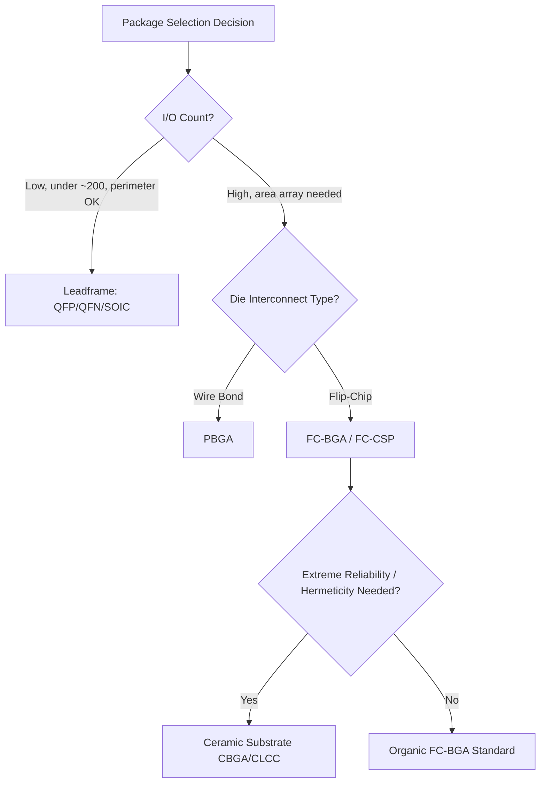
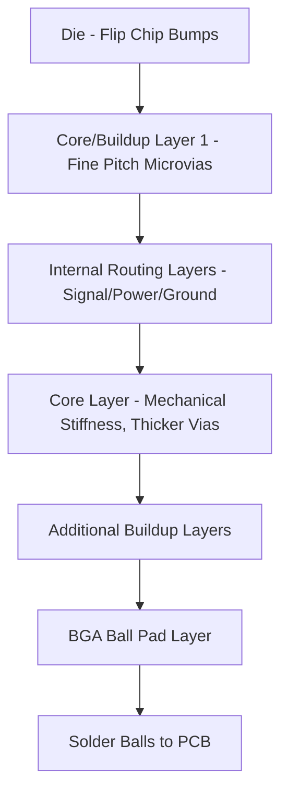

## Leadframe and Laminate Substrate Package Families

### Overview

Package families are broadly divided by their carrier structure: **leadframe-based packages**, which use a stamped or etched metal frame as both the die attach platform and external lead structure, and **laminate (substrate)-based packages**, which use a multilayer organic (or ceramic) substrate with internal routing layers and external solder ball/land arrays. This structural distinction drives fundamental differences in I/O density, cost, thermal performance, and electrical characteristics.

### Leadframe-Based Package Families

Leadframes are stamped or chemically etched from copper or copper-alloy (e.g., Alloy 42, C194) sheet metal, forming a die paddle, internal bond fingers, and external leads in a single planar structure.

**Through-Hole Leadframe Packages**

- **DIP (Dual In-line Package)**: Two parallel rows of through-hole pins; legacy technology, largely obsolete for new high-volume designs but persists in some discrete/simple ICs
- **TO (Transistor Outline) packages**: TO-220, TO-247, TO-92, etc. — used extensively for discrete transistors, power devices, and simple ICs requiring robust thermal/mechanical mounting

**Surface-Mount Leadframe Packages**

- **SOIC (Small Outline IC)**: Gull-wing leads on two sides, moderate pin count (8-28 typical)
- **QFP (Quad Flat Package)**: Gull-wing leads on all four sides, higher pin count (32-256+), lead pitch typically 0.4-0.8 mm
- **QFN (Quad Flat No-lead)**: No external leads; instead uses flat lands on the package bottom perimeter plus an exposed thermal pad, offering a smaller footprint and improved thermal/electrical performance versus QFP due to shorter lead length
- **SON (Small Outline No-lead)**: Two-sided no-lead variant, similar concept to QFN but fewer pins
- **DFN (Dual Flat No-lead)**: Two-row no-lead package, common for small discrete and analog ICs

**Leadframe Package Characteristics:**

- Pin count practically limited to roughly a few hundred (QFP) due to peripheral-only lead placement (I/Os arranged around the package perimeter, not in an area array)
- Lower cost per unit than substrate-based packages at moderate pin counts
- Exposed die paddle (in QFN/SON) enables direct thermal path to PCB, improving thermal resistance for power/analog applications
- Leadframe stamping/etching cost scales favorably at high volume but lacks the fine-pitch area-array routing flexibility of laminate substrates

### Laminate (Organic Substrate) Package Families

Laminate substrates are built from multiple layers of resin-impregnated glass fiber (typically BT resin or FR-4-like epoxy laminates for cost-sensitive parts, or higher-performance ABF — Ajinomoto Build-up Film — for high-layer-count, fine-pitch advanced packages), with copper routing layers connected by plated through-holes or microvias.

**Wire-Bond Laminate Packages**

- **PBGA (Plastic Ball Grid Array)**: Die wire-bonded to substrate, substrate routes to an area array of solder balls on the package bottom; enables much higher I/O counts than leadframe packages (hundreds to over a thousand) because balls populate the full package area, not just the perimeter
- **LGA (Land Grid Array)**: Similar to BGA but uses flat lands instead of solder balls, mating to a socket or requiring board-side solder paste

**Flip-Chip Laminate Packages**

- **FC-BGA (Flip-Chip BGA)**: Die flip-chip bonded directly to the substrate via C4 solder bumps or copper pillars, substrate then routes to a BGA ball array; dominant package family for high-performance CPUs, GPUs, and FPGAs due to superior electrical performance (shorter interconnect, lower inductance) versus wire bond
- **FC-CSP (Flip-Chip Chip-Scale Package)**: Smaller-form-factor flip-chip package, often used in mobile/consumer applications where package footprint must closely match die size

**Advanced Substrate Variants**

- **Substrate-based 2.5D packages**: FC-BGA substrates carrying a silicon interposer or embedded bridge (e.g., Intel EMIB) beneath the die, combining organic substrate cost-efficiency with silicon-level fine-pitch routing where needed
- High-layer-count ABF substrates (12+ layers) support the routing density required for large multi-die packages (server CPUs, AI accelerators)

### Ceramic Substrate Packages

- **CQFP, CLCC, CBGA**: Ceramic (alumina or aluminum nitride) substrate variants offering superior hermeticity, thermal conductivity, and high-temperature stability versus organic laminate
- Used in military/aerospace, high-reliability automotive, and RF/microwave applications where hermetic sealing or extreme thermal/environmental robustness is required
- Significantly higher cost than organic laminate, limiting use to niche high-reliability segments

### Comparative Summary

| Attribute | Leadframe (QFP/QFN) | Organic Laminate (PBGA/FC-BGA) | Ceramic |
| --- | --- | --- | --- |
| I/O arrangement | Perimeter only | Area array | Area array or perimeter |
| Max practical I/O count | ~200-300 | 1,000s+ | Application-dependent |
| Relative cost | Lower | Moderate-higher | Highest |
| Thermal performance | Good (exposed pad variants) | Moderate, improved with thermal vias/lids | Excellent |
| Electrical performance | Adequate for lower speed/pin count | Superior (especially FC-BGA) for high-speed I/O | Excellent |
| Typical applications | Discretes, analog, low-mid complexity ICs | CPUs, GPUs, SoCs, memory | Mil/aero, RF, extreme reliability |

### Package Family Selection Flow

### Substrate Buildup Structure (Laminate Example)

A typical high-layer-count FC-BGA substrate cross-section, from die side to board side:

### Example: Package Family Selection for a Mobile SoC vs. a Server CPU

A mobile application processor with moderate pin count (~500-800), tight thermal and cost budgets, and moderate I/O speed typically uses **FC-CSP** — flip-chip for electrical performance and compact size, on a moderately-layered organic substrate to control cost.

A server-class CPU with thousands of pins, very high-speed memory and I/O interfaces (DDR5, PCIe Gen5/6), and multiple chiplets requires **FC-BGA** on a high-layer-count ABF substrate, often incorporating an embedded silicon bridge or full interposer for the highest-bandwidth die-to-die links — leadframe and even standard PBGA packaging cannot support the required I/O density or electrical performance.

### Key Points

- The leadframe-vs-laminate choice is fundamentally about I/O density: leadframes are perimeter-limited, laminates enable area-array routing
- Flip-chip on laminate (FC-BGA) is the standard for high-performance computing packages and the platform onto which most 2.5D/3D advanced packaging techniques (interposers, bridges) are built
- QFN/SON exposed-pad leadframe designs remain highly competitive for cost- and thermal-sensitive moderate-I/O applications (power management, sensors, simple logic)
- Ceramic substrates are reserved for niche high-reliability/hermetic applications due to cost
- ABF buildup substrate technology is the key enabler of the fine-pitch, high-layer-count routing required for modern chiplet-based FC-BGA packages

### Related Topics

- Flip-chip bumping technologies (C4 solder bump, copper pillar)
- BGA/LGA second-level interconnect and board assembly reliability
- ABF substrate buildup process and fine-line lithography
- Package warpage and substrate core design
- QFN thermal pad design and PCB thermal via strategies
- Silicon interposer and embedded bridge integration onto organic substrates
- Substrate routing design rules and signal integrity for high-speed FC-BGA