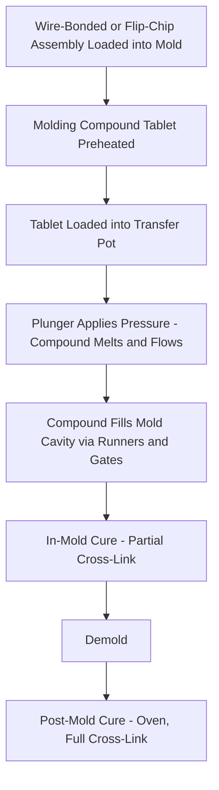
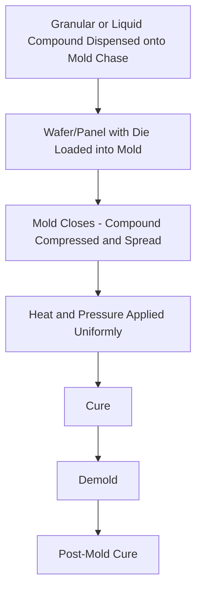

## Molding Compounds and Encapsulation Processes

### Overview

Encapsulation protects the die, wire bonds, and interconnect structures from mechanical damage, moisture ingress, and environmental contamination by enclosing them in a polymeric molding compound. The molding compound and its application process influence package thermal performance, warpage, moisture sensitivity, and mechanical reliability, making material and process selection a critical link between die attach/interconnect and final package qualification.

### Molding Compound Composition

Epoxy molding compounds (EMCs), the dominant material class, are composite formulations comprising:

- **Epoxy resin base**: Provides the polymer matrix; formulated for controlled cure kinetics and glass transition temperature ($T_g$)
- **Silica filler**: Typically 70-90% by weight fused silica particles, which reduce coefficient of thermal expansion (CTE), improve thermal conductivity, and reduce resin shrinkage/cost
- **Curing agent/hardener**: Phenolic or anhydride-based, controls cross-linking reaction
- **Flame retardant**: Historically brominated compounds; increasingly halogen-free formulations (phosphorus-based or metal hydroxide systems) driven by environmental regulation (RoHS-adjacent green package requirements)
- **Coupling agents**: Silane-based, improve filler-to-resin adhesion
- **Stress-relief additives**: Elastomeric modifiers to reduce internal stress and improve crack resistance
- **Colorant/carbon black**: For opacity and marking contrast (except in optical packages requiring transparency)

### Key Material Properties

| Property | Typical Range | Reliability Impact |
| --- | --- | --- |
| Glass transition temperature ($T_g$) | 120-180°C | Above $T_g$, CTE increases sharply, raising thermal stress during reflow |
| CTE (below $T_g$) | ~8-15 ppm/°C | Mismatch with die (Si, ~2.6 ppm/°C) drives warpage and stress |
| CTE (above $T_g$) | ~30-50 ppm/°C | Determines high-temperature excursion behavior |
| Flexural modulus | 15-25 GPa | Affects wire sweep resistance and stress transfer to die |
| Moisture absorption | 0.1-0.5% (varies by formulation) | Governs Moisture Sensitivity Level (MSL) classification |
| Thermal conductivity | 0.7-1.0 W/m·K (standard); higher in thermally-enhanced compounds | Affects package thermal resistance |

$$\Delta L = L_0 \cdot \alpha \cdot \Delta T$$

where $\alpha$ is CTE, illustrating why filler loading (which lowers $\alpha$) is central to warpage control across the die-mold compound-substrate stack.

### Encapsulation Process: Transfer Molding

The dominant process for standard leadframe and laminate packages.

1. **Tablet preparation**: Solid EMC tablets preheated to reduce viscosity and preheat time in-press
2. **Transfer**: Plunger forces molten compound from a transfer pot through runners and gates into the mold cavity (or cavities, for multi-cavity array molding)
3. **Cavity fill**: Compound flows around the die, wire bonds, and substrate; flow front velocity and viscosity profile are critical — excessive flow force causes wire sweep (bond wire displacement) or paddle shift
4. **In-mold cure**: Partial cross-linking occurs under heat (typically 150-180°C) and pressure within the mold, sufficient for demold strength
5. **Demold**: Parts ejected from mold cavities
6. **Post-mold cure (PMC)**: Full cross-linking completed in a separate oven cycle (typically several hours at similar temperature), achieving final $T_g$ and mechanical properties

### Encapsulation Process: Compression Molding

Increasingly used for large-area, thin, or warpage-sensitive packages (fan-out wafer-level packaging, large FC-BGA, panel-level packaging).

- Compound (often granular EMC or liquid compound) is metered directly onto the mold chase or wafer/panel carrier, then compressed rather than injected through runners
- Advantages over transfer molding: lower flow-induced stress (no long runner flow path, reducing wire sweep and die shift), better fill uniformity across large panels, reduced material waste (no runner/gate scrap)
- Standard process for fan-out wafer-level packaging (FOWLP) and fan-out panel-level packaging (FOPLP), where die are reconstituted on a carrier before molding

### Liquid Encapsulation and Glob Top

- **Glob top**: Localized liquid epoxy dispense over a die (often chip-on-board applications) without a full mold cavity; lower cost, used for simpler/lower-reliability applications
- **Liquid compression molding**: Liquid EMC dispensed and compression-molded, used in some advanced fan-out and panel processes as an alternative to granular compound

### Process-Induced Defects and Reliability Concerns

- **Wire sweep**: Flow-induced lateral displacement of bond wires during mold fill, risking shorts to adjacent wires or excessive wire elongation/breakage; mitigated via optimized gate design, flow simulation (mold flow analysis), and wire loop profile control
- **Voiding**: Trapped air or volatile outgassing creates voids within the molded body, concentrating stress and moisture ingress paths
- **Delamination**: Loss of adhesion between mold compound and die surface, leadframe, or substrate — often initiated at moisture-absorbed interfaces and exacerbated during reflow (moisture vaporizes and expands, a mechanism closely related to "popcorn cracking")
- **Warpage**: CTE mismatch across the mold compound/die/substrate stack causes bowing, especially problematic for large-body, thin packages (FC-BGA, fan-out) where warpage affects downstream SMT assembly yield
- **Flash**: Compound leakage into unintended areas (e.g., onto leads or exposed pads) due to insufficient mold clamp force or worn mold tooling, requiring deflash processes

### Moisture Sensitivity Level (MSL) Classification

Molded packages are classified per JEDEC J-STD-020/J-STD-033 into MSL 1 through 6 based on floor life (time exposed to factory ambient humidity before reflow) and required bake/dry-pack handling:

| MSL | Floor Life | Handling Implication |
| --- | --- | --- |
| MSL 1 | Unlimited at ≤30°C/85% RH | No dry-pack required |
| MSL 2 | 1 year | Moderate handling controls |
| MSL 3 | 168 hours | Dry-pack, bake-before-use if exceeded |
| MSL 4-5a | 72 hours down to 24 hours | Tighter handling |
| MSL 5 | 48 hours | Tighter handling |
| MSL 6 | Mandatory bake before use, use within specified time after bake | Strictest |

[Unverified] Exact floor-life hour values per MSL level should be cross-checked against the current J-STD-020 revision, as classification boundary conditions have been refined across standard revisions.

### Example: Encapsulation Process Selection for Fan-Out WLP

A fan-out wafer-level package reconstitutes known-good die on a temporary carrier at wafer scale before applying redistribution layers. Compression molding is the standard choice here rather than transfer molding, because:

- Large-area, thin-cavity molding requires uniform pressure distribution across the full reconstituted wafer to avoid die shift and warpage
- No long flow path exists (compound is applied locally over the die field), minimizing wire-sweep-equivalent die-shift risk
- Compression molding's lower injection pressure reduces the risk of disturbing die placement in the temporary reconstitution carrier before RDL formation

### Key Points

- Molding compound CTE and $T_g$ are the primary levers for managing package warpage and reflow reliability, controlled mainly through silica filler loading and resin chemistry
- Transfer molding remains standard for conventional leadframe/laminate packages; compression molding has become the standard for panel-scale fan-out and other warpage-sensitive advanced packages
- Wire sweep, voiding, and delamination are the three dominant process-induced defect categories, each traceable to specific compound rheology or process parameter choices
- MSL classification governs handling logistics between molding and board-level reflow, directly linking encapsulation material moisture behavior to manufacturing supply chain requirements

### Related Topics

- Fan-out wafer-level packaging (FOWLP) process flow
- Package warpage measurement (shadow moiré) and mitigation strategies
- Underfill materials for flip-chip packages (related but distinct from molding compound)
- JEDEC J-STD-020 moisture sensitivity classification and reflow profiles
- Mold flow simulation and gate/runner design optimization
- Halogen-free molding compound formulations and environmental compliance
- Thermally-enhanced molding compounds for power package applications