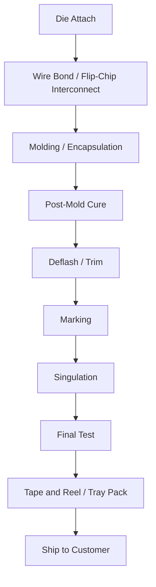
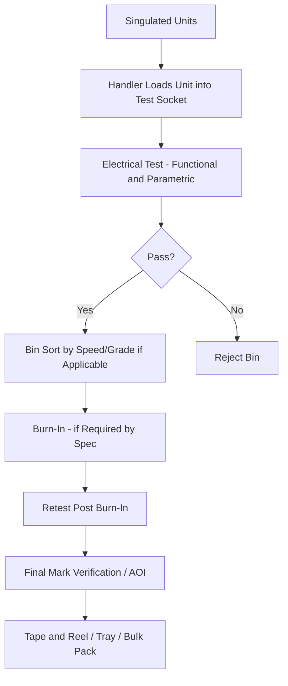

## Package Marking, Singulation, and Final Test Flow

### Overview

Marking, singulation, and final test constitute the back-end sequence that converts a fully molded array of packages into discrete, traceable, quality-verified units ready for shipment. These steps occur after encapsulation and are the last opportunities to catch defects before parts leave the assembly facility, making them a critical gate in overall package yield and field reliability.

### Position in the Overall Assembly Flow

### Deflash and Trim/Form (Leadframe Packages)

Before marking, leadframe-based packages typically undergo:

- **Deflash**: Removal of resin flash that leaked past mold parting lines during molding, via mechanical trimming, media blasting, or high-pressure water jet
- **Trim**: Excess leadframe tie bars and dam bars are cut away, separating individual package leads from the surrounding frame structure while units remain in the strip
- **Form**: Leads are bent into their final shape (gull-wing, J-lead, etc.) using precision forming tools; critical for coplanarity, since non-coplanar leads cause SMT solder joint defects at board assembly

### Marking Processes

Marking imprints traceability and identification information onto the package surface (top, and sometimes side/bottom).

**Laser Marking**

- Dominant modern method: a focused laser (typically YAG or CO2-based, though fiber lasers are increasingly common) ablates the mold compound surface to create permanent, high-contrast marks
- Advantages: no consumables, high resolution, capable of fine text/2D data matrix codes, environmentally robust (won't smear or wear)
- Process parameters (laser power, pulse frequency, scan speed) must be controlled to avoid excessive depth that could damage underlying structures, especially relevant for thin or advanced packages

**Ink Marking (Legacy)**

- Pad printing or ink-jet deposits permanent ink markings
- Largely superseded by laser marking in modern high-volume production due to lower resolution and durability, though still used in some cost-sensitive or specific substrate applications

**Marking Content (typical):**

- Manufacturer logo/identifier
- Part number
- Date code / lot code (traceability)
- Pin 1 indicator (dot, notch, or chamfer)
- Country of origin (where required)
- 2D data matrix code (increasingly standard for full traceability, machine-readable at all downstream stages)

### Singulation Processes

Singulation separates individual packages from the molded array/strip/panel into discrete units.

**Saw Singulation**

- Precision dicing saw with diamond-impregnated blade cuts through the molded array along pre-defined street lines
- Standard for most leadframe strip and laminate substrate array packages
- Blade wear, feed rate, and coolant flow must be controlled to avoid chipping, delamination at the cut edge, or excessive burr formation
- Multi-blade or step-cut processes sometimes used for mixed-material stacks (mold compound over substrate with different hardness)

**Punch Singulation**

- Mechanical punch/die set shears packages from the leadframe strip
- Faster than sawing for simple leadframe geometries, but generally limited to lower-precision, higher-tolerance applications due to mechanical stress on the package edge

**Laser Singulation**

- Used for fine-pitch, thin, or stress-sensitive packages (e.g., some fan-out WLP/PLP) where mechanical sawing risks chipping or delamination
- Stealth dicing (sub-surface laser modification followed by mechanical expansion) is common for wafer-level singulation contexts adjacent to packaging

**Panel/Array Considerations for Fan-Out Packaging**

- Fan-out wafer-level or panel-level packages are singulated from a reconstituted molded wafer/panel rather than a leadframe strip, using saw or laser dicing similar in principle to wafer dicing but through a mixed mold-compound/RDL/die stack

### Final Test Flow

Final test verifies electrical functionality, parametric performance, and (where applicable) mechanical/environmental screening before shipment.

**Test Stages:**

- **Functional test**: Verifies the device performs its intended logic/analog functions correctly against the test pattern set
- **Parametric test**: Measures DC parameters (leakage current, output drive, threshold voltages) and AC parameters (timing, frequency response) against datasheet limits
- **Speed binning**: Devices sorted into performance grades (e.g., different clock speed SKUs from the same die design) based on measured maximum operating frequency — a standard practice for CPUs/GPUs where a single design yields multiple market-segment products
- **Burn-in**: Elevated temperature/voltage stress test (commonly 125-150°C, above-nominal voltage) for a defined duration to accelerate infant mortality failures per the bathtub curve failure rate model, primarily used for high-reliability or automotive/industrial-grade parts rather than universally applied
- **Automated optical inspection (AOI)**: Post-test visual inspection of package marking legibility, lead coplanarity/damage, and surface defects

### Test Economics and the "Known Good Die" Concept

Final test cost is a significant portion of total package cost, particularly for complex SoCs with large test pattern sets. This economic pressure has driven:

- **Test time reduction** via built-in self-test (BIST) structures and scan-based test compression
- **Known Good Die (KGD)** requirements becoming more critical in multi-die packages (2.5D/3D, chiplets) — since a single bad die in a multi-die assembly can scrap the entire package, wafer-level test coverage and burn-in before assembly are increasingly emphasized to avoid costly post-assembly failures
- [Inference] The economic argument for KGD screening strengthens as die count per package and packaging cost-per-unit both increase, which is a key driver behind renewed industry investment in wafer-level test and burn-in infrastructure for chiplet-based products, though exact ROI thresholds are design- and volume-specific.

### Traceability and Lot Genealogy

Modern final test increasingly ties electrical test data to the 2D data matrix mark applied earlier in the flow, enabling full genealogy tracking from wafer lot and wafer map position through assembly lot, test data, and final shipment — critical for field failure analysis (tracing a returned unit back to its specific wafer/lot/assembly conditions) and increasingly required in automotive-grade (AEC-Q100) supply chains.

### Example: Final Test Flow for an Automotive-Grade Power Management IC

An AEC-Q100 Grade 1 automotive PMIC would typically undergo: full functional/parametric test at final test, 100% burn-in (given automotive reliability requirements), post-burn-in retest to catch any burn-in-induced failures, and full traceability marking (2D data matrix linked to wafer lot/assembly lot) — versus a consumer-grade equivalent part, which might skip burn-in entirely and rely on sample-based reliability qualification instead of 100% screening, reflecting the different reliability requirements and cost tolerances between market segments.

### Key Points

- Marking, singulation, and final test are sequential gates that each catch different defect classes: marking establishes traceability, singulation must avoid introducing new mechanical damage, and final test is the last electrical verification before shipment
- Laser marking with 2D data matrix codes is the modern standard, enabling full lot genealogy tracking
- Saw singulation remains dominant for most package types, with laser singulation gaining share for thin/stress-sensitive advanced packages
- Burn-in and speed binning are applied selectively based on reliability grade and product segmentation strategy, not universally
- Known Good Die screening importance scales with multi-die package complexity, directly connecting back-end test economics to advanced packaging architecture decisions

### Related Topics

- Wafer-level test and probe card technology (upstream of assembly)
- AEC-Q100 automotive qualification requirements
- Known Good Die (KGD) strategies for multi-die/chiplet packages
- Tape and reel packaging standards (JEDEC/EIA-481)
- Package-level reliability qualification (temperature cycling, HAST, autoclave)
- Test escape analysis and field return failure analysis flow
- Built-in self-test (BIST) and design-for-test (DFT) architectures