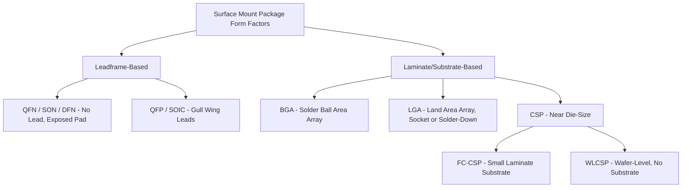

## Common Package Form Factors: QFN, BGA, LGA, and CSP

### Overview

QFN, BGA, LGA, and CSP represent four of the most widely used surface-mount package form factors in modern electronics, spanning a range of I/O counts, thermal requirements, and board assembly approaches. Understanding their structural differences clarifies why each remains relevant for specific application segments despite decades of packaging innovation.

### QFN (Quad Flat No-Lead)

**Structure:**

- Leadframe-based package with no protruding external leads; instead, flat metal lands are exposed on the package bottom perimeter
- Typically includes an exposed die attach pad (EPAD/thermal pad) at the package center, providing a direct low-resistance thermal and often electrical (ground) path to the PCB
- Die connected to leadframe fingers via wire bond (standard) or flip-chip (in some variants)
- Molded body encapsulates the top and sides, leaving only the bottom lands and thermal pad exposed

**Key characteristics:**

- Pin count: typically 8 to ~100 leads, limited by perimeter-only land placement
- Lead pitch: commonly 0.4-0.65 mm, with fine-pitch QFN variants down to 0.35-0.4 mm
- Thermal performance: excellent among leadframe packages due to the direct exposed thermal pad, often achieving junction-to-board thermal resistance in the low single digits (°C/W) for well-designed PCB thermal vias
- Assembly: standard SMT solder paste reflow; the no-lead structure requires good solder paste volume control and PCB land pattern design to ensure reliable solder joint formation at the lands and adequate thermal pad solder coverage/voiding control

**Typical applications:** power management ICs, RF front-end modules, sensors, discrete/simple logic, automotive control ICs — anywhere moderate I/O count with strong thermal/electrical grounding performance and small footprint are priorities

### BGA (Ball Grid Array)

**Structure:**

- Laminate substrate package with an area array of solder balls on the package bottom, rather than perimeter-only leads
- Balls typically composed of SAC (SnAgCu) alloy for lead-free assembly, historically eutectic SnPb for legacy/certain high-reliability applications
- Die attached via wire bond (PBGA) or flip-chip (FC-BGA), with substrate internal routing layers fanning signals from the die's fine pitch to the coarser ball pitch at the package periphery/bottom

**Key characteristics:**

- Pin count: hundreds to several thousand, since area-array placement scales I/O count with package area rather than perimeter alone
- Ball pitch: commonly 0.5-1.27 mm for standard BGA; finer pitches (0.3-0.5 mm) common in space-constrained variants
- Self-aligning solder reflow: molten solder ball surface tension pulls the package into alignment with PCB pads during reflow, improving placement tolerance versus fine-pitch leaded packages
- Rework: BGA rework (removal/replacement) requires specialized equipment (hot air/IR rework stations) since balls are hidden beneath the package body, unlike visually-inspectable leaded packages

**Typical applications:** CPUs, GPUs, chipsets, FPGAs, memory (DRAM/NAND packages), high-pin-count SoCs — essentially any device where I/O count exceeds what perimeter leadframe packages can support

### LGA (Land Grid Array)

**Structure:**

- Similar substrate construction to BGA, but the package bottom presents flat lands (pads) instead of solder balls
- Two implementation contexts: (1) socketed LGA, where the package mates with a spring-contact socket on the board (common for high-performance CPUs requiring field replaceability), and (2) solder-down LGA, where solder paste is printed on the PCB and the package is reflowed directly (similar to BGA assembly but without balls on the package itself)

**Key characteristics:**

- No solder balls means no self-alignment effect during reflow (for solder-down LGA), requiring tighter placement accuracy during pick-and-place
- Socketed LGA enables mechanical removability — critical for applications requiring field upgrade or replacement (desktop/server CPU sockets)
- Generally offers a lower profile than BGA since there is no ball standoff height
- Coplanarity of the land surface is critical for reliable contact in socketed applications, since spring contacts must engage every land uniformly

**Typical applications:** socketed CPUs (desktop/server), some RF/microwave modules requiring solder-down attachment with minimal standoff height, applications prioritizing low profile or field serviceability

### CSP (Chip-Scale Package)

**Structure:**

- Not a single structural family but a size-based classification: by common industry convention (JEDEC), a CSP's package area is no more than roughly 1.2x the die area
- Implemented via multiple underlying technologies: FC-CSP (flip-chip on a small laminate substrate), WLCSP (wafer-level CSP, where the entire redistribution and ball/bump formation occurs at the wafer level before singulation, eliminating a separate substrate entirely)

**Key characteristics:**

- WLCSP is the most aggressive size reduction: RDL (redistribution layer) and solder bumps are built directly on the wafer surface, and singulation yields packages essentially at die size — no separate substrate, no wire bonds, no mold compound in the traditional sense (though some WLCSP variants add a protective overmold)
- FC-CSP uses a small laminate substrate (similar in principle to FC-BGA but scaled down) to gain some routing/fan-out flexibility while remaining close to die size
- Because CSP is a form-factor/size classification rather than a specific interconnect technology, "CSP" can describe packages spanning multiple underlying constructions

**Typical applications:** mobile and wearable device ICs (power management, RF, sensors, memory) where board area is at an absolute premium; WLCSP in particular dominates in smartphone PMICs and small-footprint analog/mixed-signal ICs

### Comparative Summary

| Attribute | QFN | BGA (PBGA/FC-BGA) | LGA | CSP (WLCSP/FC-CSP) |
| --- | --- | --- | --- | --- |
| I/O arrangement | Perimeter (lands) | Area array (balls) | Area array (lands) | Area array, near die-size |
| Typical I/O range | 8-100 | Hundreds-thousands | Hundreds-thousands | Tens-hundreds |
| Board attach | SMT reflow (solder paste) | SMT reflow (self-aligning balls) | Socket contact OR solder-down reflow | SMT reflow |
| Reworkability | Difficult (no visible leads) | Difficult, specialized rework needed | Easy if socketed; difficult if solder-down | Very difficult |
| Profile height | Low | Moderate (ball standoff) | Very low | Very low (near wafer-level) |
| Thermal path | Excellent (exposed pad) | Moderate, improved with thermal balls/vias | Good | Limited (small package body) |
| Typical segment | Power/analog/RF, moderate pin count | High-performance compute, high pin count | Socketed CPUs, low-profile RF | Mobile/wearable, extreme space constraint |

### Package Family Relationship Diagram

### Example: Form Factor Selection Across a Product's Power Tree

Consider a smartphone motherboard: the applications processor (highest pin count, highest performance) uses **FC-BGA or FC-CSP**; a discrete power management IC for a specific rail uses **WLCSP** to minimize board area; an RF front-end module with moderate pin count and strong grounding needs uses **QFN**; and if a socketed test/development platform variant existed for prototyping, it might use **LGA** for repeated reflash/replacement during bring-up — illustrating how form factor selection follows directly from I/O count, thermal/electrical needs, board area budget, and serviceability requirements rather than a single "best" package existing across all use cases.

### Key Points

- QFN excels at moderate I/O count with strong thermal/electrical grounding via its exposed pad, at leadframe-level cost
- BGA is the default choice once I/O count exceeds perimeter-package practicality, with FC-BGA specifically dominating high-performance compute
- LGA trades away solder-ball self-alignment for a lower profile and, in socketed form, field serviceability
- CSP is fundamentally a size classification, most aggressively realized in WLCSP where the package essentially disappears into the die itself
- All four form factors coexist in modern electronics because they serve different points on the I/O count, thermal performance, board area, and cost trade-off space simultaneously

### Related Topics

- Leadframe and laminate substrate package families (structural foundation for these form factors)
- Wafer-level packaging (WLP) and redistribution layer (RDL) processes
- BGA/LGA board-level reliability: solder joint fatigue and drop test performance
- PCB land pattern design and solder paste stencil design for no-lead/area-array packages
- Package thermal resistance characterization (JEDEC JESD51 standards)
- Flip-chip bumping technologies underlying FC-BGA and FC-CSP
- Rework and repair processes for area-array packages