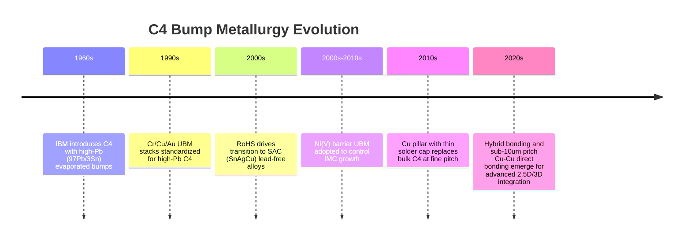

## C4 Solder Bump Metallurgy and Evolution

### Overview

Controlled Collapse Chip Connection (C4) technology, introduced by IBM in the 1960s for the Solid Logic Technology (SLT) modules, replaced wire bonding with an array of solder bumps deposited directly on chip bond pads, enabling area-array interconnection rather than perimeter-only connection. The metallurgy of these bumps has evolved substantially in response to reliability demands, environmental regulation, and the shrinking pitch requirements of modern heterogeneous integration.

### Original C4 Metallurgy: High-Lead (High-Pb) Solder

**Composition**

- Nominal alloy: 97Pb/3Sn (or similar high-lead compositions such as 95Pb/5Sn)
- Melting point: approximately 310–325°C
- Deposited historically via evaporation through a molybdenum mask, later via electroplating

**Key Points**

- High-Pb solder has a melting point well above eutectic SnPb, allowing a hierarchical reflow strategy: chip-level C4 joints remain solid while board-level eutectic SnPb (183°C) joints are reflowed, preventing collapse of the first-level interconnect during second-level assembly.
- The high melting point also provides better creep resistance and thermal fatigue performance at the die-to-substrate interface, where CTE (coefficient of thermal expansion) mismatch induces cyclic shear stress.
- Under-Bump Metallurgy (UBM) for these joints typically used a Cr/Cu/Au or Cr-Cu(phased)/Cu/Au stack, where chromium provided adhesion and diffusion barrier function, and gold protected against oxidation prior to reflow.

### Transition to Lead-Free Metallurgy

**Drivers**

- RoHS (Restriction of Hazardous Substances) directive (EU, effective 2006) and analogous global regulations restricted lead content in electronics, though certain high-lead solders retained exemptions for specific high-reliability applications for a period.
- Environmental and health concerns regarding lead toxicity in manufacturing and disposal.

**Common Lead-Free Alloy Families**

| Alloy System | Typical Composition | Melting Point | Notes |
| --- | --- | --- | --- |
| SAC (Sn-Ag-Cu) | Sn96.5Ag3.0Cu0.5 (SAC305) | ~217–220°C | Most widely adopted; good wetting and mechanical strength |
| SnCu | Sn99.3Cu0.7 | ~227°C | Lower cost, used in some wave-solder-compatible processes |
| SnAg | Sn96.5Ag3.5 | ~221°C | Simpler binary system, used in some bump applications |
| SnBi | Sn42Bi58 (eutectic) | ~138°C | Low-temperature option for thermally sensitive stacks |
| SAC-based with dopants (e.g., SAC-Ni, SAC-Bi) | SAC + minor additions (0.05–0.1% Ni, Mn, Bi) | Near SAC eutectic | Dopants refine microstructure, suppress voiding |

[Inference] The exact dopant levels and their effects vary by supplier formulation and are often proprietary; the general mechanism (grain refinement, intermetallic suppression) is well documented but specific performance figures should be verified against the qualifying foundry's process design kit (PDK).

**Metallurgical Challenges of SAC Alloys**

- SAC solders form large, anisotropic Ag3Sn intermetallic plates and can exhibit pronounced $\beta$-Sn dendritic grain structure, leading to anisotropic mechanical response and higher susceptibility to brittle fracture under high strain-rate loading (e.g., drop/shock events) compared to eutectic SnPb.
- Higher reflow temperatures (~245–260°C peak) relative to SnPb increase thermal stress on low-k dielectrics and other thermally sensitive die-side materials.
- Tin whisker growth is a known reliability concern in pure-Sn and high-Sn finishes; mitigations include alloying (e.g., with Bi or Cu), matte-Sn deposition control, and post-plating anneal.

### Under-Bump Metallurgy (UBM) Architecture

The UBM stack is metallurgically as important as the bump alloy itself, since it governs adhesion, electromigration resistance, and intermetallic compound (IMC) formation kinetics.

**Standard UBM Layer Functions**

1. **Adhesion layer** — Ti, TiW, or Cr; bonds to the passivation/pad and provides a diffusion barrier
2. **Diffusion barrier / wetting layer** — Ni, Ni(V), or Cu; controls IMC growth rate and prevents excessive Cu or Al consumption from the underlying pad
3. **Solder-wettable / oxidation-protection layer** — Cu or thin Au flash; ensures good solder wetting and prevents pre-reflow oxidation

**Common UBM Stacks**

- Ti/Cu/Cu (electroplated Cu pillar precursor)
- Ti/Ni(V)/Cu (sputtered, common in wafer-bumped C4)
- Al/Ni(V)/Cu (legacy IBM-style stack)

### Intermetallic Compound (IMC) Formation

At the solder/UBM interface, the dominant IMC for Sn-based solders on Cu UBM is Cu6Sn5 (scallop-shaped at the interface) with Cu3Sn forming closer to the Cu at longer aging times/higher temperatures.

$$\text{Cu} + \text{Sn} \rightarrow \text{Cu}_6\text{Sn}_5 \rightarrow \text{Cu}_3\text{Sn} \text{ (with continued thermal aging)}$$

**Key Points**

- A thin, uniform IMC layer (typically sub-micron to a few microns) is necessary for mechanical bonding, but excessive IMC growth during aging or multiple reflow cycles embrittles the joint, since IMCs are intrinsically brittle relative to the bulk solder.
- Ni-based UBM (Ni(V) or electroless Ni) forms (Cu,Ni)6Sn5 or Ni3Sn4 depending on composition, generally at a slower growth rate than Cu3Sn/Cu, which is why Ni barriers are favored to extend joint life under prolonged thermal aging.
- Kirkendall voiding can occur at the Cu3Sn/Cu interface due to unequal diffusion rates of Cu and Sn, a known failure mechanism under long-term thermal cycling. [Inference: severity is alloy- and process-dependent, so quantitative void growth rates should be validated per qualification.]

### Evolution Toward Fine-Pitch: From C4 Bumps to Cu Pillar

As I/O pitch scaled below ~150 µm, traditional solder-ball C4 bumps faced bridging risk due to solder collapse and spreading during reflow. This drove the industry toward **copper pillar bump** technology.

**Comparison: Traditional C4 vs. Cu Pillar**

| Attribute | Traditional C4 (solder ball) | Cu Pillar |
| --- | --- | --- |
| Typical pitch | 150–250 µm | 40–150 µm (down to ~20–36 µm for advanced nodes) |
| Standoff control | Solder volume-dependent, less uniform | Pillar height lithographically defined, highly uniform |
| Bridging risk | Higher at fine pitch (solder collapse/spread) | Lower — solder confined to pillar cap |
| Current density handling | Lower, less uniform current crowding | Better, due to reduced solder volume and uniform geometry |
| Structure | Bulk solder bump directly on UBM | Electroplated Cu column with a thin solder cap (SnAg or similar) atop |

**Key Points**

- The Cu pillar itself carries current with lower resistivity and better electromigration resistance than a solid solder joint of equivalent volume, since only the thin solder cap undergoes reflow-driven wetting.
- Cu pillar structures reduce solder volume dramatically (often to a thin cap of a few microns), which correspondingly reduces IMC volume fraction concerns relative to bulk solder joints.

### Electromigration Considerations

At fine pitch and high current density, electromigration (EM) in solder bumps becomes a first-order reliability concern.

- Current crowding occurs at the entry point of current from the narrow on-chip interconnect into the wider bump, accelerating void nucleation at the cathode side.
- EM-induced voiding preferentially occurs at the UBM/solder interface, where the current density transition is sharpest.
- Mitigation strategies include: UBM redesign to reduce current crowding, addition of a Ni layer to slow IMC/void growth, and transition to Cu pillar architectures that reduce solder volume and current density gradients within the joint. [Inference: quantitative EM lifetime models such as Black's equation are widely used industry-standard predictive tools, but activation energy and current density exponent parameters vary by alloy system and must be empirically characterized per process.]

### Bump Formation Process Evolution

**Key Points**

1. **Evaporation (legacy, original IBM C4)** — Pb/Sn evaporated through a metal shadow mask; low throughput, largely obsolete for modern volumes.
2. **Electroplating** — Sequential plating of UBM layers and solder alloy through a patterned photoresist mold; dominant method for modern wafer bumping due to compositional control and scalability.
3. **Solder paste screen printing / ball drop (C4NP - Controlled Collapse Chip Connection New Process)** — IBM-developed injection molded solder (IMS) process using a reusable glass mold to transfer molten solder in a single step across the full wafer, improving throughput and reducing solder waste relative to electroplating for certain pitch ranges.
4. **Stencil printing with pre-formed solder balls** — Common for larger pitch (>150 µm) applications, using pick-and-place ball attach.

### Reflow and Reliability Behavior

- Reflow profile design must balance sufficient time above liquidus for adequate wetting and voiding elimination against excessive dwell time that accelerates IMC over-growth.
- Underfill encapsulation (epoxy, typically silica-filled) is applied after C4 reflow to mechanically couple the die and substrate, redistributing the CTE-mismatch-induced stress away from the solder joints and onto the underfill fillet, substantially improving thermal cycling fatigue life.
- Solder joint fatigue is commonly modeled using strain-based low-cycle fatigue relationships such as the Coffin-Manson relationship, relating cycles-to-failure to plastic strain amplitude:

$$N_f = C \cdot (\Delta \gamma_p)^{-n}$$

where $N_f$ is cycles to failure, $\Delta \gamma_p$ is plastic shear strain range, and $C$, $n$ are material-dependent constants. [Inference: specific $C$ and $n$ values are alloy- and geometry-dependent and are typically derived from empirical thermal cycling data rather than first-principles calculation.]

### Illustration: C4 Joint Cross-Section (svg_diagram)

<svg xmlns="http://www.w3.org/2000/svg" viewBox="0 0 640 420">
<text x="320" y="28" text-anchor="middle" font-size="18" font-weight="bold" fill="#1a1a1a">C4 Solder Joint Cross-Section (svg_diagram)</text>

<rect x="180" y="50" width="280" height="60" fill="#8899aa" stroke="#333" stroke-width="1.5" />
<text x="320" y="85" text-anchor="middle" font-size="14" fill="#fff">Silicon Die</text>

<rect x="290" y="110" width="60" height="14" fill="#c9a227" stroke="#333" stroke-width="1" />
<text x="320" y="140" text-anchor="middle" font-size="11" fill="#333">Al/Cu Bond Pad</text>

<rect x="285" y="124" width="70" height="8" fill="#7f8c8d" stroke="#333" stroke-width="0.5" />
<text x="440" y="130" font-size="11" fill="#333">Ti/TiW Adhesion Layer</text>
<line x1="356" y1="128" x2="435" y2="130" stroke="#333" stroke-width="0.75" />
<rect x="282" y="132" width="76" height="8" fill="#b0b8bd" stroke="#333" stroke-width="0.5" />
<text x="440" y="150" font-size="11" fill="#333">Ni(V) Diffusion Barrier</text>
<line x1="358" y1="136" x2="435" y2="150" stroke="#333" stroke-width="0.75" />
<rect x="280" y="140" width="80" height="8" fill="#cd7f32" stroke="#333" stroke-width="0.5" />
<text x="440" y="170" font-size="11" fill="#333">Cu Wetting Layer</text>
<line x1="360" y1="144" x2="435" y2="170" stroke="#333" stroke-width="0.75" />

<ellipse cx="320" cy="155" rx="42" ry="6" fill="#5d4037" stroke="#333" stroke-width="0.5" />
<text x="480" y="195" font-size="11" fill="#333">Cu6Sn5 / Cu3Sn IMC (scallop)</text>
<line x1="360" y1="155" x2="475" y2="195" stroke="#333" stroke-width="0.75" />

<ellipse cx="320" cy="220" rx="90" ry="70" fill="#dcdde1" stroke="#333" stroke-width="1.5" />
<text x="320" y="225" text-anchor="middle" font-size="13" fill="#2c3e50">SAC305 / SnAg Bump</text>

<ellipse cx="320" cy="286" rx="42" ry="6" fill="#5d4037" stroke="#333" stroke-width="0.5" />

<rect x="280" y="290" width="80" height="10" fill="#cd7f32" stroke="#333" stroke-width="0.5" />
<rect x="285" y="300" width="70" height="8" fill="#b0b8bd" stroke="#333" stroke-width="0.5" />

<rect x="140" y="308" width="360" height="60" fill="#4a6741" stroke="#333" stroke-width="1.5" />
<text x="320" y="343" text-anchor="middle" font-size="14" fill="#fff">Organic / Ceramic Substrate</text>

<path d="M 190 110 L 230 150 L 230 290 L 190 310 Z" fill="#f4d03f" fill-opacity="0.35" stroke="#b7950b" stroke-width="1" stroke-dasharray="4,2" />
<path d="M 450 110 L 410 150 L 410 290 L 450 310 Z" fill="#f4d03f" fill-opacity="0.35" stroke="#b7950b" stroke-width="1" stroke-dasharray="4,2" />
<text x="130" y="230" text-anchor="end" font-size="12" fill="#7d6608">Underfill</text>
<text x="510" y="230" text-anchor="start" font-size="12" fill="#7d6608">Underfill</text>

<text x="320" y="400" text-anchor="middle" font-size="11" font-style="italic" fill="#555">Current crowding occurs at pad/UBM entry — dominant EM void nucleation site</text>

</svg>

### Illustration: Metallurgy Evolution Timeline

### Comparative Summary Table

| Era | Alloy | UBM | Typical Pitch | Primary Driver |
| --- | --- | --- | --- | --- |
| 1960s–1990s | High-Pb (97Pb3Sn) | Cr/Cu/Au | 200–250 µm | Hierarchical reflow, reliability |
| 2000s | SAC305, SnCu | Ti/Ni(V)/Cu | 150–200 µm | RoHS compliance |
| 2010s | SAC + Cu pillar cap | Ti/Cu (plated pillar) | 40–150 µm | Fine-pitch, EM resistance |
| 2020s | Thin SnAg cap, hybrid bonding alternatives | Cu-Cu direct / plated pillar | <40 µm (pillar); sub-µm (hybrid bonding) | 2.5D/3D heterogeneous integration density |

### Next Steps

**Related Topics**

- Copper Pillar Bump Fabrication and Fine-Pitch Interconnect Scaling
- Under-Bump Metallurgy (UBM) Design and Diffusion Barrier Engineering
- Electromigration Reliability Modeling in Flip-Chip Interconnects
- Underfill Materials and Capillary Flow Encapsulation
- Wafer Bumping Processes: Electroplating vs. Injection Molded Solder (C4NP)
- Hybrid Bonding (Cu-Cu Direct Bonding) as a C4 Successor for Sub-10µm Pitch
- Thermal Cycling Fatigue and Coffin-Manson Life Prediction for Solder Joints
- Tin Whisker Growth Mechanisms and Mitigation in Lead-Free Finishes