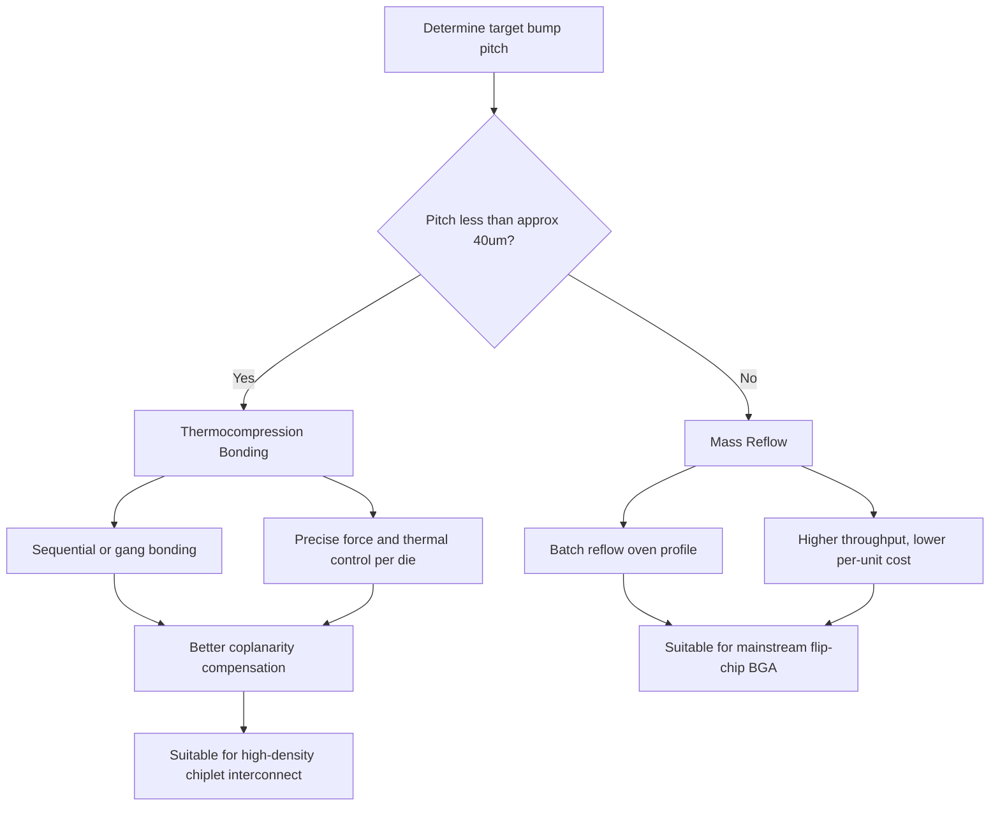

## Copper Pillar Bump Technology

### Overview

Copper pillar bump technology replaces the bulk solder ball of traditional C4 interconnects with an electroplated copper column capped by a thin layer of solder. This architecture was developed to overcome the pitch-scaling and current-density limitations of solder-ball flip chip, becoming the dominant first-level interconnect for fine-pitch flip chip in advanced packaging, including 2.5D interposer and high-density organic substrate applications.

### Structural Architecture

**Key Points**

- The pillar itself is a solid or near-solid electroplated Cu column, typically 15–60 µm tall, sitting directly on the UBM over the die bond pad.
- A thin solder cap (a few microns, commonly SnAg or SAC-based) is plated on top of the pillar and serves as the only material that reflows during die attach.
- Because the reflowed solder volume is confined to the cap rather than the entire joint, the bump height and standoff are lithographically defined by the pillar's plated height rather than by solder surface tension and volume, giving much tighter standoff control across a wafer or panel.

**Typical Layer Stack (die side, bottom to top)**

1. Bond pad (Al or Cu)
2. UBM: Ti or TiW adhesion layer + Cu seed layer
3. Electroplated Cu pillar
4. Ni barrier cap (optional but common, to limit Cu-Sn IMC growth)
5. Solder cap (SnAg, SAC, or eutectic SnPb in legacy/non-RoHS applications)

### Why Cu Pillar Replaced Bulk Solder C4

| Limitation of Bulk Solder C4 | How Cu Pillar Addresses It |
| --- | --- |
| Solder collapse/spreading during reflow causes bridging at fine pitch | Solder confined to a thin cap on a rigid pillar; minimal lateral spread |
| Variable standoff height (volume- and wetting-dependent) | Standoff set by lithographically defined pillar height, highly uniform |
| High solder volume increases current crowding and EM sensitivity | Reduced solder volume shifts most current conduction into low-resistivity solid Cu |
| Bump self-alignment during reflow is volume-dependent and less predictable at fine pitch | More consistent joint geometry supports pitches below ~80 µm and down to ~20–36 µm in advanced processes |

### Fabrication Process Flow

**Key Points**

1. **Wafer preparation** — Passivation opening over bond pads; UBM sputter deposition (Ti/Cu or TiW/Cu seed layer) across the wafer.
2. **Photoresist patterning** — Thick photoresist (often dry film or thick spin-coated resist) is patterned to define pillar openings at the target pitch.
3. **Electroplating** — Cu is electroplated to fill the resist mold, forming the pillar to a controlled height; plating current density and bath chemistry govern uniformity across the wafer.
4. **Barrier and cap plating** — A thin Ni layer (diffusion barrier) is plated on top of the Cu pillar, followed by the solder cap alloy (e.g., SnAg).
5. **Resist strip and seed layer etch** — Photoresist is stripped, and the exposed Cu/Ti seed layer between pillars is etched away to isolate individual bumps.
6. **Reflow (pre-reflow or post-dice)** — The solder cap is reflowed to form a rounded, wettable cap surface, sometimes done before dicing to stabilize bump shape.

### Reflow Bonding: Mass Reflow vs. Thermocompression

Two dominant bonding approaches are used for Cu pillar attach, with the choice driven largely by pitch and joint density.

| Method | Mechanism | Typical Use Case |
| --- | --- | --- |
| Mass Reflow (MR) | Bulk heating melts solder caps across the full die simultaneously; standard convection/IR reflow oven profile | Coarser pitch (>~40 µm), higher throughput, lower cost |
| Thermocompression Bonding (TCB) | Sequential or batch bonding with applied force and localized/precise thermal profile per die (or small die groups) | Fine pitch (<~40 µm), warpage-sensitive stacks, high-density I/O where co-planarity control is critical |

**Key Points**

- TCB allows tighter control of bond-line thickness and reduces the risk of bridging or non-wet opens on high-density arrays, since the bonding force and temperature profile can be tuned per placement rather than relying on a shared reflow oven profile for the whole panel.
- TCB typically has lower throughput than mass reflow due to sequential (die-by-die or small-batch) processing, though throughput has improved with multi-head and gang-bonding tool architectures. [Inference: specific throughput figures are highly tool- and vendor-dependent and should be validated against current equipment specifications.]

### Electrical and Thermal Advantages

**Key Points**

- Copper's bulk resistivity (~1.68 µΩ·cm) is substantially lower than that of Sn-based solder alloys, so replacing most of the solder volume with solid Cu reduces the resistive and IR-drop contribution of the first-level interconnect.
- The reduced solder volume shrinks the region susceptible to electromigration-driven voiding, and current crowding effects are somewhat mitigated by the more uniform, solid conduction path through the pillar compared to a rounded solder ball with a complex internal geometry.
- Cu's thermal conductivity (~385–400 W/m·K) versus Sn-based solder (~50–60 W/m·K) gives Cu pillar joints a secondary benefit as localized heat-conduction paths from the die to the substrate, which can be relevant for hotspot mitigation in high-power dies. [Inference: the magnitude of this thermal benefit depends heavily on bump density, pillar geometry, and package-level thermal design, and is typically evaluated via package-level thermal simulation rather than assumed from bulk material properties alone.]

### Reliability Considerations

**Key Points**

- **Under-Bump Cracking (UBC) / Low-k Dielectric Stress**: Because Cu pillars are rigid compared to solder-collapsed bumps, TCB and mass reflow processes must carefully manage bonding force to avoid cracking brittle low-k interlayer dielectric (ILD) stacks beneath the bond pad, a known failure mode as pillar stiffness transmits more mechanical stress directly to the die than a compliant solder ball would.
- **IMC Growth at the Solder Cap/Ni or Cu Interface**: As with bulk solder joints, Ni3Sn4 or Cu6Sn5 IMC layers form at the cap interface; a Ni barrier is commonly used specifically to slow IMC growth into the bulk Cu pillar, since unmitigated Cu-Sn IMC formation would consume pillar material over time and reduce joint reliability under thermal aging.
- **Electromigration**: Despite improvements over bulk solder, EM remains a design concern at high current densities; current crowding still occurs at the die-side pad-to-pillar transition, and joint design (pillar diameter, pad geometry) is tuned to manage local current density.
- **Coplanarity and Warpage**: At fine pitch, wafer-level and panel-level warpage (from CTE mismatch across the many material layers) becomes a limiting factor for achieving uniform bonding across all pillars simultaneously; this is a primary reason TCB is favored at the finest pitches, since it can compensate for localized non-planarity better than a single mass reflow pass.

### Pitch Scaling Roadmap Context

| Pitch Range | Typical Bump Type | Representative Application |
| --- | --- | --- |
| 130–250 µm | Solder ball C4 | Legacy flip chip, lower-density packages |
| 80–130 µm | Cu pillar, mass reflow | Mainstream flip-chip BGA/organic substrate packages |
| 40–80 µm | Cu pillar, mass reflow or TCB | High-density flip chip, some 2.5D interposer connections |
| <40 µm (down to ~20–36 µm) | Cu pillar, TCB-dominant | Advanced 2.5D/3D packaging, chiplet interconnect |
| <10 µm | Hybrid bonding (Cu-Cu direct, no solder) | Next-generation 3D die stacking beyond pillar limits |

[Inference] Exact pitch boundaries between technology transitions vary across foundries and OSATs (Outsourced Semiconductor Assembly and Test providers); the ranges above reflect general industry positioning rather than a fixed universal standard.

### Illustration: Cu Pillar Bump Cross-Section (svg_diagram)

<svg xmlns="http://www.w3.org/2000/svg" viewBox="0 0 640 440">
<text x="320" y="28" text-anchor="middle" font-size="18" font-weight="bold" fill="#1a1a1a">Cu Pillar Bump Cross-Section (svg_diagram)</text>
<rect x="180" y="50" width="280" height="55" fill="#8899aa" stroke="#333" stroke-width="1.5" />
<text x="320" y="82" text-anchor="middle" font-size="14" fill="#fff">Silicon Die</text>
<rect x="295" y="105" width="50" height="12" fill="#c9a227" stroke="#333" stroke-width="1" />
<text x="320" y="132" text-anchor="middle" font-size="11" fill="#333">Bond Pad</text>
<rect x="290" y="117" width="60" height="7" fill="#7f8c8d" stroke="#333" stroke-width="0.5" />
<text x="450" y="122" font-size="11" fill="#333">Ti/TiW + Cu Seed (UBM)</text>
<line x1="350" y1="120" x2="445" y2="122" stroke="#333" stroke-width="0.75" />

<rect x="285" y="124" width="70" height="140" fill="#cd7f32" stroke="#333" stroke-width="1.5" />
<text x="320" y="200" text-anchor="middle" font-size="13" fill="#fff" transform="rotate(0)">Electroplated</text>
<text x="320" y="216" text-anchor="middle" font-size="13" fill="#fff">Cu Pillar</text>

<rect x="285" y="264" width="70" height="8" fill="#b0b8bd" stroke="#333" stroke-width="0.5" />
<text x="450" y="270" font-size="11" fill="#333">Ni Diffusion Barrier</text>
<line x1="355" y1="268" x2="445" y2="270" stroke="#333" stroke-width="0.75" />

<ellipse cx="320" cy="288" rx="42" ry="18" fill="#dcdde1" stroke="#333" stroke-width="1.5" />
<text x="450" y="292" font-size="11" fill="#333">SnAg Solder Cap</text>
<line x1="360" y1="288" x2="445" y2="292" stroke="#333" stroke-width="0.75" />

<ellipse cx="320" cy="304" rx="40" ry="5" fill="#5d4037" stroke="#333" stroke-width="0.5" />
<text x="450" y="312" font-size="11" fill="#333">Ni3Sn4 / Cu6Sn5 IMC</text>
<line x1="358" y1="304" x2="445" y2="312" stroke="#333" stroke-width="0.75" />

<rect x="285" y="309" width="70" height="10" fill="#c9a227" stroke="#333" stroke-width="0.5" />

<rect x="140" y="319" width="360" height="60" fill="#4a6741" stroke="#333" stroke-width="1.5" />
<text x="320" y="354" text-anchor="middle" font-size="14" fill="#fff">Organic Substrate / Interposer</text>

<line x1="90" y1="124" x2="90" y2="309" stroke="#e74c3c" stroke-width="1.5" />
<line x1="82" y1="124" x2="98" y2="124" stroke="#e74c3c" stroke-width="1.5" />
<line x1="82" y1="309" x2="98" y2="309" stroke="#e74c3c" stroke-width="1.5" />
<text x="70" y="220" text-anchor="middle" font-size="11" fill="#e74c3c" transform="rotate(-90 70 220)">Lithographically-defined standoff</text>

<text x="320" y="410" text-anchor="middle" font-size="11" font-style="italic" fill="#555">Only the thin solder cap reflows — pillar body remains solid, minimizing bridging risk</text>

</svg>

### Illustration: Mass Reflow vs. Thermocompression Decision Flow

### Comparative Summary: Cu Pillar vs. Traditional C4

| Attribute | Traditional C4 | Cu Pillar |
| --- | --- | --- |
| Conduction path | Mostly solder | Mostly solid Cu, thin solder cap |
| Standoff control | Volume/wetting-dependent | Lithographically defined |
| Minimum practical pitch | ~150 µm | ~20–40 µm |
| Bridging risk at fine pitch | High | Low |
| Bonding method | Mass reflow only | Mass reflow or TCB |
| Stiffness / die stress | Lower (compliant solder collapse) | Higher (rigid pillar, requires careful force control) |
| EM resistance | Lower | Higher |

### Next Steps

**Related Topics**

- Thermocompression Bonding (TCB) Equipment and Process Parameter Optimization
- Non-Conductive Film (NCF) and Non-Conductive Paste (NCP) for Fine-Pitch Bonding
- Low-k Dielectric Stress Management in Fine-Pitch Flip Chip
- Redistribution Layer (RDL) Design for Cu Pillar Interconnect
- Hybrid Bonding as the Successor to Cu Pillar at Sub-10µm Pitch
- Warpage Control in Panel-Level and Wafer-Level Cu Pillar Processing
- Electromigration Reliability Testing Methodologies for Fine-Pitch Interconnects