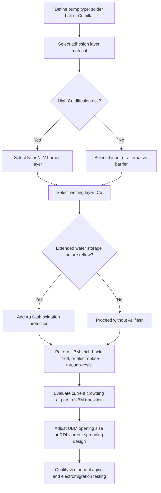

## Under-Bump Metallization Design

### Overview

Under-Bump Metallization (UBM) is the engineered thin-film stack deposited between a die's bond pad and its solder or Cu pillar bump. It provides the mechanical, electrical, and chemical interface required to convert an aluminum or copper bond pad into a solderable, reliable connection point. UBM design directly governs adhesion strength, diffusion control, electromigration resistance, and long-term intermetallic compound (IMC) stability, making it one of the most reliability-critical elements in flip chip and advanced packaging interconnects.

### Functional Requirements of UBM

**Key Points**

- **Adhesion**: Must bond strongly to both the underlying passivation/pad metal and the overlying bump material, resisting delamination under thermal and mechanical stress.
- **Diffusion barrier**: Must prevent uncontrolled interdiffusion between the bump metallurgy (typically Sn-based) and the pad metal (Al or Cu), which would otherwise consume the pad or bump metal via runaway IMC growth.
- **Solderability / wettability**: Must present a surface that solder wets readily and uniformly during reflow, ensuring void-free, well-formed joints.
- **Oxidation resistance**: The outermost UBM layer must resist oxidation during wafer storage and handling prior to bumping or reflow, since oxide layers impede wetting.
- **Current-carrying capacity**: Must sustain the current densities imposed by the interconnect without excessive electromigration-driven degradation over the product's operating life.

### Standard Three-Layer UBM Architecture

Most UBM stacks are conceptually divided into three functional layers, though a single physical layer can sometimes serve more than one function depending on material choice.

| Layer | Function | Common Materials |
| --- | --- | --- |
| Adhesion layer | Bonds to pad/passivation, initiates diffusion barrier behavior | Ti, TiW, Cr, Al |
| Diffusion barrier layer | Blocks Sn/Cu/Al interdiffusion, limits IMC growth rate | Ni, Ni(V), Cr-Cu(phased), electroless Ni-P |
| Wetting / oxidation-protection layer | Provides solderable surface, prevents pre-reflow oxidation | Cu, Au (thin flash) |

**Key Points**

- Ti and TiW are favored adhesion materials due to strong native-oxide-mediated bonding to underlying dielectric/passivation and good barrier behavior against Cu diffusion.
- Ni and Ni(V) barrier layers are widely used because Ni-Sn IMCs (Ni3Sn4) grow considerably more slowly than Cu-Sn IMCs (Cu6Sn5/Cu3Sn) under thermal aging, extending the usable life of the joint before brittle IMC dominates the interface.
- A thin Au flash (typically well under 1 µm) is sometimes added atop the Cu wetting layer purely for anti-oxidation purposes during storage; it dissolves rapidly into the solder during reflow and does not persist as a distinct barrier layer.

### Common UBM Stack Configurations

| Stack | Deposition Method | Typical Application |
| --- | --- | --- |
| Cr/Cu/Au | Evaporation (legacy) | Original high-Pb C4, older wafer-bump processes |
| Ti/Ni(V)/Cu | Sputtering | Widely used modern solder-bump UBM |
| Ti/Cu (seed) + electroplated Cu | Sputtering + electroplating | Cu pillar bump base structure |
| Al/Ni(V)/Cu | Sputtering | Legacy IBM-style C4 stack variant |
| TiW/Cu | Sputtering | General-purpose barrier/seed for electroplated bumps |

[Inference] The specific stack selected by a given foundry or OSAT is proprietary process detail; the configurations above represent commonly documented industry patterns rather than a single universal standard.

### Deposition Methods

**Key Points**

1. **Sputtering (Physical Vapor Deposition)** — The dominant method for adhesion and barrier layers (Ti, TiW, Cr) due to excellent thickness uniformity and adhesion control across the wafer; typically blanket-deposited then patterned via photoresist and etch, or deposited through a lift-off mask.
2. **Electroplating** — Used for thicker layers such as the Cu wetting layer, Cu pillar body, and Ni barrier when greater thickness (several microns) is required; requires a conductive seed layer (usually sputtered Cu) prior to plating.
3. **Electroless plating (e.g., electroless Ni-P/Au, ENIG-style)** — Occasionally used for selective barrier deposition without a full blanket seed layer, more common in substrate-side finishing than die-side UBM but sometimes applied in specific wafer bumping flows.
4. **Evaporation** — Legacy method (historically used with Cr/Cu/Au for original C4), largely superseded by sputtering and electroplating for modern high-volume processes due to lower throughput and less precise thickness control at scale.

### UBM Patterning Approaches

| Method | Process Flow | Notes |
| --- | --- | --- |
| Etch-back | Blanket sputter deposition, then photoresist pattern, then wet or dry etch of exposed UBM | Common for thin barrier/adhesion layers |
| Lift-off | Photoresist patterned first, then metal deposited, then resist (and overlying metal) stripped | Useful for fine features, avoids etch chemistry compatibility issues |
| Electroplate-through-resist | Seed layer blanket deposited, thick photoresist patterned to define openings, metal electroplated into openings, resist stripped, seed layer etched | Standard for Cu pillar and thick Cu/Ni/solder cap structures |

### Diffusion Barrier Design Considerations

**Key Points**

- Barrier layer thickness must be sufficient to remain intact (not fully consumed by IMC formation) over the product's specified thermal aging and thermal cycling life; excessively thin barriers can be fully converted to IMC prematurely, exposing the underlying pad or seed metal to direct solder attack.
- Ni(V) (vanadium-doped nickel) is commonly used over pure Ni in sputtered UBM applications because the vanadium addition helps suppress the formation of a magnetic, less workable pure-Ni phase and modifies grain structure, improving barrier uniformity. [Inference: exact vanadium content and its precise metallurgical effect vary by supplier formulation; general barrier-improvement rationale is well documented, but specific magnetic/grain-structure claims should be validated against the specific UBM vendor's material data.]
- Electroless Ni-P barriers typically contain 5–12 wt% phosphorus, which affects both the barrier's amorphous/crystalline structure and its IMC growth kinetics with Sn-based solders; higher P content generally correlates with more amorphous structure and altered diffusion behavior. [Inference: the relationship between P content and long-term reliability outcomes is process- and alloy-specific and is typically established through qualification testing rather than assumed from composition alone.]

### Failure Modes Related to UBM Design

| Failure Mode | Root Cause | Mitigation |
| --- | --- | --- |
| UBM delamination | Poor adhesion layer bonding, contamination at interface, or excessive thermomechanical stress | Adhesion layer material selection, surface cleaning prior to deposition, stress-reducing die/package design |
| Kirkendall voiding | Unequal diffusion rates of Cu and Sn at Cu3Sn/Cu interface during prolonged thermal aging | Ni barrier insertion to slow Cu-Sn interdiffusion |
| Barrier exhaustion | Diffusion barrier fully consumed by IMC growth over time/temperature | Adequate barrier thickness margin relative to expected aging conditions |
| Non-wet opens | Oxidized or contaminated wetting layer surface prior to reflow | Oxidation-protective outer layer (Au flash), controlled storage/handling, flux selection |
| Electromigration-induced voiding | Current crowding at UBM/pad transition under high current density | UBM geometry redesign, current spreading layer, pillar architecture to reduce solder volume |

### UBM Geometry and Current Crowding

**Key Points**

- Current entering the bump from the narrow on-chip redistribution or pad metal experiences a geometric constriction at the UBM interface, concentrating current density at the edge nearest the incoming trace (commonly the entry corner adjacent to the RDL trace).
- This current crowding accelerates electromigration-driven void nucleation preferentially at the cathode-side UBM/solder interface, making UBM shape and the transition geometry from trace to pad a meaningful lever in EM lifetime.
- Design mitigations include enlarging the UBM opening relative to the incoming trace width, adding a current-spreading redistribution layer (RDL) beneath the UBM, and shaping the UBM footprint to reduce sharp current-density gradients. [Inference: quantitative EM lifetime improvement from specific geometry changes is design- and process-dependent and is typically validated through simulation and accelerated life testing rather than generalized formulas.]

### Illustration: UBM Layer Stack Detail (svg_diagram)

<svg xmlns="http://www.w3.org/2000/svg" viewBox="0 0 640 400">
<text x="320" y="28" text-anchor="middle" font-size="18" font-weight="bold" fill="#1a1a1a">UBM Layer Stack Detail (svg_diagram)</text>
<rect x="180" y="50" width="280" height="50" fill="#8899aa" stroke="#333" stroke-width="1.5" />
<text x="320" y="80" text-anchor="middle" font-size="14" fill="#fff">Silicon Die</text>
<rect x="230" y="100" width="180" height="14" fill="#95a5a6" stroke="#333" stroke-width="1" />
<text x="450" y="110" font-size="11" fill="#333">Passivation (opening over pad)</text>
<line x1="410" y1="107" x2="445" y2="110" stroke="#333" stroke-width="0.75" />
<rect x="270" y="114" width="100" height="14" fill="#c9a227" stroke="#333" stroke-width="1" />
<text x="450" y="124" font-size="11" fill="#333">Al/Cu Bond Pad</text>
<line x1="370" y1="121" x2="445" y2="124" stroke="#333" stroke-width="0.75" />
<rect x="255" y="128" width="130" height="10" fill="#7f8c8d" stroke="#333" stroke-width="0.75" />
<text x="480" y="138" font-size="11" fill="#333">Ti / TiW — Adhesion Layer</text>
<line x1="385" y1="133" x2="475" y2="138" stroke="#333" stroke-width="0.75" />
<rect x="250" y="138" width="140" height="12" fill="#b0b8bd" stroke="#333" stroke-width="0.75" />
<text x="480" y="150" font-size="11" fill="#333">Ni(V) — Diffusion Barrier</text>
<line x1="390" y1="144" x2="475" y2="150" stroke="#333" stroke-width="0.75" />
<rect x="248" y="150" width="144" height="12" fill="#cd7f32" stroke="#333" stroke-width="0.75" />
<text x="480" y="162" font-size="11" fill="#333">Cu — Wetting Layer</text>
<line x1="392" y1="156" x2="475" y2="162" stroke="#333" stroke-width="0.75" />
<rect x="248" y="162" width="144" height="5" fill="#f1c40f" stroke="#333" stroke-width="0.5" />
<text x="480" y="174" font-size="11" fill="#333">Au flash (anti-oxidation)</text>
<line x1="392" y1="165" x2="475" y2="174" stroke="#333" stroke-width="0.75" />
<ellipse cx="320" cy="210" rx="85" ry="55" fill="#dcdde1" stroke="#333" stroke-width="1.5" />
<text x="320" y="215" text-anchor="middle" font-size="13" fill="#2c3e50">Solder Bump</text>

<path d="M 200 105 L 250 130" stroke="#e74c3c" stroke-width="2" marker-end="url(#arrow)" />
<text x="140" y="100" font-size="11" fill="#e74c3c">Current crowding</text>
<text x="140" y="113" font-size="11" fill="#e74c3c">entry point</text>

<text x="320" y="380" text-anchor="middle" font-size="11" font-style="italic" fill="#555">Each layer serves a distinct role: adhesion, diffusion barrier, wetting, and oxidation protection</text>

</svg>

### Illustration: UBM Design Decision Flow

### Design Checklist Summary

**Key Points**

- Confirm barrier layer thickness against projected thermal aging profile and expected IMC growth rate over product lifetime.
- Verify wetting layer thickness is sufficient to survive expected reflow cycles without full IMC conversion.
- Evaluate UBM opening geometry relative to incoming RDL trace width to manage current crowding.
- Select patterning method (etch-back, lift-off, electroplate-through-resist) based on required feature resolution and pitch.
- Validate adhesion performance under thermal cycling and mechanical shear/pull testing prior to high-volume qualification.

### Next Steps

**Related Topics**

- Redistribution Layer (RDL) Design and Current Spreading Techniques
- Electromigration Testing and Black's Equation Application in Bump Interconnects
- Wafer Bumping Process Flows: Sputtering, Electroplating, and Patterning Methods
- Intermetallic Compound (IMC) Growth Kinetics and Aging Behavior
- Copper Pillar Bump Technology (structural comparison and design tradeoffs)
- Passivation and Polyimide Layer Design for Bond Pad Opening
- Bump Shear and Pull Testing Methodologies for Reliability Qualification