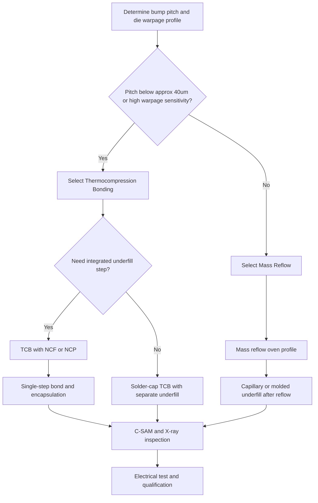

## Flip Chip Assembly and Thermocompression Bonding

### Overview

Flip chip assembly is a die-attach method in which the active face of the die is oriented face-down and directly bonded to a substrate, interposer, or another die via an array of bumps, eliminating the peripheral wire-bond loops required by conventional wire bonding. Thermocompression bonding (TCB) is one of the two dominant bonding methods used to form these interconnections, distinguished from mass reflow by its sequential, force-and-temperature-controlled bonding of individual or small groups of dies. TCB has become increasingly central to fine-pitch and 3D/2.5D heterogeneous integration as pitch scales below the practical limits of mass reflow.

### General Flip Chip Assembly Process Flow

**Key Points**

1. **Die pickup and flip** — Die is picked from the wafer/dicing frame and inverted so the bumped active face points downward toward the substrate.
2. **Fine alignment** — Optical alignment systems register the die's bump pattern against the substrate's corresponding bond pad pattern, typically using fiducial marks on both die and substrate.
3. **Placement** — The die is lowered onto the substrate with the bump array contacting the substrate pads.
4. **Bonding** — Either mass reflow (bulk heating to melt solder) or thermocompression bonding (localized force + heat) is applied to form the metallurgical joint.
5. **Underfill dispense and cure** — An epoxy underfill (capillary-flow, molded, or pre-applied film/paste) is introduced between die and substrate to mechanically couple the assembly and redistribute CTE-mismatch stress away from the bumps.
6. **Inspection and test** — X-ray or acoustic microscopy (C-SAM) inspection for voiding, bridging, and non-wet opens; electrical test for continuity and functionality.

### Mass Reflow vs. Thermocompression Bonding: Process Comparison

| Attribute | Mass Reflow (MR) | Thermocompression Bonding (TCB) |
| --- | --- | --- |
| Heating approach | Bulk oven/convection/IR heating of entire panel or batch | Localized heating via bond head, applied per die or small group |
| Force application | Minimal; primarily gravity and solder surface tension self-alignment | Controlled mechanical force applied during and/or after heating |
| Throughput | Higher (parallel processing of many dies simultaneously) | Lower (sequential or limited-batch processing per bond head cycle) |
| Bond-line thickness control | Governed by solder volume and wetting behavior | Precisely controlled via applied force and mechanical stops |
| Suitability for fine pitch | Degrades below ~40 µm pitch due to bridging/self-alignment limits | Well suited to fine pitch (<40 µm) due to per-die force/thermal control |
| Warpage tolerance | Lower — relies on uniform panel-wide reflow profile | Higher — can adapt per-die force/profile to local warpage |
| Typical equipment | Reflow ovens (convection, vapor phase, IR) | Dedicated TCB bonders (single-head or gang/multi-head) |

### Thermocompression Bonding: Process Mechanics

**Key Points**

- TCB applies a controlled combination of heat and mechanical force to the die-to-substrate (or die-to-die) stack, causing the solder cap (in Cu pillar structures) or the bump material itself to plastically deform and metallurgically bond to the mating pad.
- The bonding profile typically includes discrete phases: initial contact/alignment confirmation, ramp to bonding temperature, dwell at peak temperature under applied force, and controlled cooldown under reduced or held force to stabilize the joint before release.
- Bond force is applied per-die (or per small group in gang-bonding tools), allowing compensation for localized substrate or die warpage that would cause non-wet opens in a mass reflow process relying on uniform panel-scale planarity.

**Key TCB Process Parameters**

| Parameter | Role |
| --- | --- |
| Bond force | Governs joint deformation, void expulsion, and bond-line thickness |
| Peak bonding temperature | Must exceed solder cap liquidus (for solder-cap TCB) or achieve sufficient thermal budget for solid-state diffusion bonding |
| Dwell time at peak temperature | Allows adequate wetting/diffusion while limiting excessive IMC growth |
| Ramp rate | Affects thermal stress on die and avoidance of voiding from rapid solder melt |
| Bond head planarity/parallelism | Ensures uniform force distribution across all bumps on the die |
| Cooldown profile | Affects final joint microstructure and residual stress state |

[Inference] Specific process window values (temperature, force, dwell time) are highly equipment- and material-system-dependent and are established through process qualification (DOE) for each product rather than fixed universal parameters.

### TCB Variants

**Key Points**

1. **Solder-Cap TCB** — Most common variant; bonds Cu pillar bumps with a thin solder cap by melting only the cap under applied force, similar in metallurgical principle to mass reflow but with per-die force/thermal control.
2. **Thermocompression with Non-Conductive Film/Paste (TCB-NCF / TCB-NCP)** — A pre-applied non-conductive film or paste is placed between die and substrate prior to bonding; the bonding force displaces the NCF/NCP material from beneath the bump contact areas while it remains and cures elsewhere, simultaneously forming the electrical joint and the underfill-equivalent encapsulation in a single step, eliminating the separate capillary underfill dispense/cure step.
3. **Hybrid Bonding (Cu-Cu Direct Bonding)** — A related but distinct technique (not strictly TCB in the solder sense) used at sub-10 µm pitch, where planarized Cu pads on both surfaces are directly bonded via diffusion bonding under heat and pressure without any solder intermediary; typically preceded by a dielectric (oxide) bonding step at room temperature followed by anneal to complete Cu-Cu metallic bonding.

### NCF/NCP-Based TCB: Process Flow Detail

**Key Points**

- NCF (Non-Conductive Film) is typically laminated onto the wafer or substrate prior to dicing/placement, while NCP (Non-Conductive Paste) is dispensed onto the substrate immediately before die placement.
- During the TCB bonding step, the applied force squeezes the NCF/NCP material outward from the contact area between mating bumps/pads, allowing direct metallurgical contact while the surrounding polymer material fills the gap and begins curing (typically via a thermosetting reaction accelerated by the bonding temperature).
- This approach reduces total process steps and cycle time compared to separate reflow + capillary underfill flows, and can better control void formation since underfill flow-related voiding (a known capillary underfill defect mode) is avoided.
- A key process risk is incomplete resin outgassing or trapped voids at the bump contact interface if squeeze-out is insufficient, which can result in non-wet or high-resistance joints. [Inference: void formation rates and their electrical/reliability impact are process- and material-specific and are typically characterized via C-SAM inspection and electrical test correlation during qualification.]

### Alignment and Placement Accuracy

**Key Points**

- Fine-pitch flip chip (particularly for TCB at <40 µm pitch) requires high-precision optical alignment systems capable of sub-micron placement accuracy, since misalignment beyond a fraction of the bump pitch risks partial or non-contact at the bond interface.
- Split-field or dual-camera vision systems are commonly used to simultaneously image die-side and substrate-side fiducials, computing the required X-Y-theta correction before the bond head lowers the die into contact.
- Placement accuracy requirements tighten proportionally as pitch scales down, making equipment-level metrology and calibration an increasingly significant cost and throughput factor for advanced packaging lines. [Inference: specific accuracy specifications (e.g., ±1 µm 3-sigma) vary by tool vendor and generation; current figures should be verified against specific bonder equipment documentation.]

### Underfill Integration

**Key Points**

- **Capillary Underfill (CUF)**: Dispensed along one or more edges of the die after bonding/reflow; flows via capillary action beneath the die to fill the gap around the bumps, then thermally cured. Common with mass reflow flows.
- **Molded Underfill (MUF)**: Underfill material is applied as part of a broader molding step, sometimes combined with the overmold encapsulation in a single process, improving throughput for certain package types.
- **Pre-Applied Underfill / Wafer-Level Underfill (WLUF)**: Underfill material applied at the wafer level before dicing, reflowed/cured during the bonding step itself; conceptually related to NCF but sometimes electrically conductive-filler-free versions are used purely as mechanical underfill rather than as the bump-contact interface material.
- **NCF/NCP (TCB-Integrated)**: As described above, combines bump bonding and gap-fill/encapsulation into a single TCB step, distinct from post-bond capillary flow approaches.

### Reliability and Inspection Considerations

| Concern | Description | Typical Detection Method |
| --- | --- | --- |
| Non-wet opens | Bump fails to form metallurgical contact due to oxidation, misalignment, or insufficient bonding force/temperature | Electrical continuity test, X-ray inspection |
| Bridging | Adjacent bumps short together due to excessive solder spread or misalignment | Optical/X-ray inspection, electrical test |
| Voiding at bump interface | Trapped flux residue, outgassing, or incomplete wetting | C-SAM (acoustic microscopy), X-ray |
| Die cracking / low-k damage | Excessive TCB bonding force transmitted through rigid Cu pillar structures to brittle die-side dielectric layers | Cross-section analysis, die-level stress simulation validation |
| Warpage-induced open bumps at die periphery | CTE mismatch causing die or substrate bow during/after bonding | C-SAM, X-ray, electrical test at temperature extremes |

### Illustration: TCB Process Flow (svg_diagram)

<svg xmlns="http://www.w3.org/2000/svg" viewBox="0 0 700 380">
<text x="350" y="28" text-anchor="middle" font-size="18" font-weight="bold" fill="#1a1a1a">Thermocompression Bonding Sequence (svg_diagram)</text>

<rect x="20" y="60" width="150" height="90" fill="#eef2f5" stroke="#333" stroke-width="1" />
<text x="95" y="55" text-anchor="middle" font-size="12" font-weight="bold">1. Alignment</text>
<rect x="50" y="70" width="90" height="20" fill="#8899aa" stroke="#333" />
<circle cx="65" cy="100" r="5" fill="#cd7f32" />
<circle cx="95" cy="100" r="5" fill="#cd7f32" />
<circle cx="125" cy="100" r="5" fill="#cd7f32" />
<rect x="50" y="120" width="90" height="15" fill="#4a6741" stroke="#333" />
<text x="95" y="145" text-anchor="middle" font-size="9">Optical registration</text>
<path d="M 175 105 L 205 105" stroke="#333" stroke-width="2" marker-end="url(#arrow2)" />

<rect x="210" y="60" width="150" height="90" fill="#eef2f5" stroke="#333" stroke-width="1" />
<text x="285" y="55" text-anchor="middle" font-size="12" font-weight="bold">2. Contact + Force</text>
<rect x="240" y="70" width="90" height="20" fill="#8899aa" stroke="#333" />
<circle cx="255" cy="95" r="5" fill="#cd7f32" />
<circle cx="285" cy="95" r="5" fill="#cd7f32" />
<circle cx="315" cy="95" r="5" fill="#cd7f32" />
<rect x="240" y="120" width="90" height="15" fill="#4a6741" stroke="#333" />
<path d="M 285 55 L 285 68" stroke="#e74c3c" stroke-width="2" marker-end="url(#arrow2)" />
<text x="285" y="145" text-anchor="middle" font-size="9">Bond head applies force</text>
<path d="M 365 105 L 395 105" stroke="#333" stroke-width="2" marker-end="url(#arrow2)" />

<rect x="400" y="60" width="150" height="90" fill="#fdebd0" stroke="#333" stroke-width="1" />
<text x="475" y="55" text-anchor="middle" font-size="12" font-weight="bold">3. Heat + Bond</text>
<rect x="430" y="70" width="90" height="20" fill="#8899aa" stroke="#333" />
<ellipse cx="445" cy="97" rx="7" ry="5" fill="#dcdde1" stroke="#333" />
<ellipse cx="475" cy="97" rx="7" ry="5" fill="#dcdde1" stroke="#333" />
<ellipse cx="505" cy="97" rx="7" ry="5" fill="#dcdde1" stroke="#333" />
<rect x="430" y="120" width="90" height="15" fill="#4a6741" stroke="#333" />
<text x="475" y="145" text-anchor="middle" font-size="9">Solder cap reflows under force</text>
<path d="M 555 105 L 585 105" stroke="#333" stroke-width="2" marker-end="url(#arrow2)" />

<rect x="590" y="60" width="100" height="90" fill="#e8f6f3" stroke="#333" stroke-width="1" />
<text x="640" y="55" text-anchor="middle" font-size="12" font-weight="bold">4. Cooldown</text>
<rect x="605" y="70" width="70" height="20" fill="#8899aa" stroke="#333" />
<ellipse cx="620" cy="97" rx="6" ry="4" fill="#b8860b" stroke="#333" />
<ellipse cx="640" cy="97" rx="6" ry="4" fill="#b8860b" stroke="#333" />
<ellipse cx="660" cy="97" rx="6" ry="4" fill="#b8860b" stroke="#333" />
<rect x="605" y="120" width="70" height="15" fill="#4a6741" stroke="#333" />
<text x="640" y="145" text-anchor="middle" font-size="9">Joint solidifies</text>
<text x="350" y="190" text-anchor="middle" font-size="12" fill="#555">Force is maintained through heating and often into cooldown to stabilize the joint</text>

<rect x="150" y="220" width="400" height="70" fill="#f9f9f9" stroke="#999" stroke-dasharray="4,2" />
<text x="350" y="240" text-anchor="middle" font-size="12" font-weight="bold">NCF/NCP Variant</text>
<text x="350" y="260" text-anchor="middle" font-size="11">Non-conductive film/paste is squeezed from bump contact areas</text>
<text x="350" y="276" text-anchor="middle" font-size="11">during force application, curing simultaneously as underfill</text>
</svg>

### Illustration: Bonding Method Selection Logic

### Comparative Summary: Underfill Integration Strategy

| Strategy | Bonding Method | Underfill Timing | Key Advantage |
| --- | --- | --- | --- |
| Reflow + Capillary Underfill | Mass Reflow | Post-bond, separate dispense/cure | Mature, well-characterized, high throughput |
| Reflow + Molded Underfill | Mass Reflow | Combined with mold step | Reduced process steps for certain package types |
| TCB + NCF | Thermocompression | Simultaneous with bonding | Eliminates flow-related voiding, faster cycle for fine pitch |
| TCB + NCP | Thermocompression | Simultaneous with bonding | Similar to NCF, dispensed rather than pre-laminated |

### Next Steps

**Related Topics**

- Copper Pillar Bump Technology (structural prerequisite for most TCB applications)
- Non-Conductive Film (NCF) and Paste (NCP) Material Formulation and Cure Kinetics
- Hybrid Bonding (Cu-Cu Direct Bonding) for Sub-10µm Pitch 3D Integration
- Warpage Characterization and Compensation in Fine-Pitch Die Bonding
- C-SAM and X-Ray Inspection Techniques for Flip Chip Void and Bridging Detection
- Capillary Underfill Flow Simulation and Voiding Mitigation
- Multi-Die Gang Bonding and High-Throughput TCB Equipment Architectures