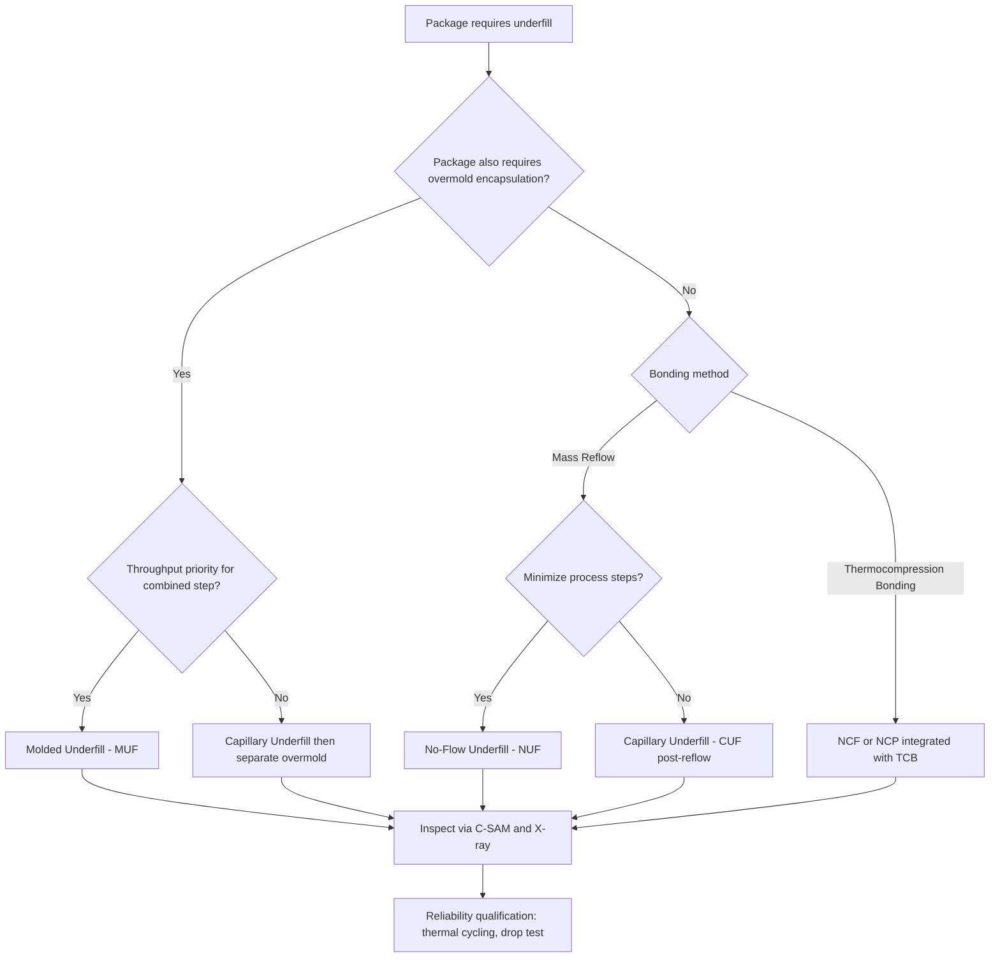

## Underfill Processes: Capillary, Molded, and No-Flow Underfill

### Overview

Underfill is the polymeric encapsulant material introduced into the gap between a flip-chip die and its substrate after (or, in some variants, during) bump bonding. Its primary purpose is mechanical: by filling the standoff gap around the bump array, underfill couples the die and substrate into a composite structure that redistributes thermally induced shear stress away from the fragile solder or Cu pillar joints and into the underfill fillet and bulk material, dramatically improving thermal cycling fatigue life. Three principal underfill process families are used in flip chip and advanced packaging: capillary underfill (CUF), molded underfill (MUF), and no-flow underfill (NUF), each with distinct process integration points, material requirements, and tradeoffs.

### Why Underfill Is Necessary

**Key Points**

- Flip chip bumps alone form a small-area, high-stiffness metallurgical connection between two materials with substantially different coefficients of thermal expansion (CTE) — silicon (~2.6 ppm/°C) versus organic substrate (~15–20 ppm/°C or higher).
- During thermal cycling, this CTE mismatch generates cyclic shear strain concentrated at the bump joints, which are the only mechanical connection points in an unfilled assembly; this shear strain is the dominant driver of solder joint fatigue failure (low-cycle fatigue, characterized by relationships such as Coffin-Manson).
- Underfill distributes this strain across the full die area (via the cured epoxy's mechanical coupling to both surfaces) rather than concentrating it at discrete bump locations, substantially increasing the number of thermal cycles to failure compared to an unfilled joint.
- Underfill also provides moisture and contaminant protection to the bump interface and adds mechanical rigidity that helps the assembly withstand handling, drop, and shock events.

### Capillary Underfill (CUF)

**Process Flow**

1. Die is bump-bonded to the substrate (via mass reflow or TCB) and reflow/bonding is completed and inspected.
2. Low-viscosity liquid epoxy underfill is dispensed along one or more edges of the die (commonly an "L-shape" or single-edge dispense pattern for square/rectangular dies).
3. Capillary action draws the underfill material under the die, flowing through the narrow standoff gap and around the bump array.
4. The assembly is heated (thermal cure oven or in-line cure) to cross-link and fully cure the epoxy, typically at temperatures in the range of 100–165°C depending on the specific formulation. [Inference: exact cure temperature and duration are material-formulation-specific and should be sourced from the underfill vendor's datasheet.]
5. Post-cure inspection (C-SAM/acoustic microscopy) verifies complete fill and absence of voids.

**Key Points**

- CUF materials are engineered with low viscosity and are typically filled with silica particles to tune CTE and reduce shrinkage, though filler particle size must be small enough relative to the bump pitch and standoff gap to avoid filtration effects (particle jamming near the flow front, especially at fine pitch).
- Flow time scales with the die size, standoff height, and material viscosity; larger dies and finer standoff gaps require longer flow times and more careful dispense pattern design to avoid trapped air voids.
- CUF is the most mature and widely characterized underfill approach, historically the default for flip chip on organic substrates using mass reflow bonding.

**Common Failure Modes**

| Defect | Cause |
| --- | --- |
| Voiding | Trapped air during capillary flow, especially at fine pitch or with poor dispense pattern design |
| Incomplete fill | Insufficient flow time, premature gelation, or standoff gap too narrow relative to filler particle size |
| Filler filtration/jamming | Silica filler particles too large relative to bump pitch, causing flow-front segregation and voids |
| Delamination | Poor adhesion to solder mask, passivation, or die backside coating; often surfaces during subsequent thermal cycling |

### Molded Underfill (MUF)

**Process Flow**

1. Die is bump-bonded to the substrate via reflow or TCB.
2. Rather than a separate capillary dispense step, the underfill material (often a filled epoxy molding compound similar in some respects to standard transfer molding compounds, though formulated for finer flow) is introduced during a molding step that simultaneously forms the underfill and, in many implementations, the package-level overmold encapsulation.
3. Transfer molding or compression molding equipment forces the underfill/mold compound into the die-to-substrate gap and over the die in a single operation.
4. Post-mold cure completes cross-linking.

**Key Points**

- MUF combines what would otherwise be two separate process steps (capillary underfill dispense/cure, then separate overmold) into a single molding operation, improving throughput and reducing total cycle time for package types that require both underfill and overmold encapsulation (common in many BGA/flip-chip packages destined for standard SMT assembly).
- MUF materials must be formulated to flow effectively both into the narrow die-to-substrate standoff gap and around/over the die in the same molding shot, which imposes different rheological requirements than a dedicated CUF material optimized purely for capillary flow.
- Because MUF relies on molding equipment (transfer or compression molding presses) rather than a dedicated underfill dispense/cure line, it is generally more attractive where the packaging flow already includes an overmold step, since the incremental process integration cost is lower than adding CUF as an entirely separate operation.
- Void control in MUF requires careful attention to mold compound flow front behavior around the bump array, since the same standoff-gap flow challenges present in CUF apply, compounded by the simultaneous over-die encapsulation flow. [Inference: specific flow simulation and void mitigation techniques are mold-compound- and package-geometry-specific and are typically validated through mold flow simulation software and DOE during process development.]

### No-Flow Underfill (NUF)

**Process Flow**

1. Underfill material (a liquid, no-flow-formulated epoxy, distinct from standard CUF rheology) is dispensed onto the substrate **before** die placement.
2. The die is placed directly into the uncured underfill material; placement force and/or subsequent reflow displaces underfill from beneath the bump contact areas while the majority of the material remains between die and substrate.
3. The bonding step (mass reflow, heating the assembly) simultaneously reflows the bumps and cures (or substantially advances cure of) the underfill material in a single thermal step, rather than requiring separate bonding and underfill cure steps.

**Key Points**

- NUF eliminates the separate capillary flow step entirely, since the material is already in place prior to bonding — this is conceptually similar in outcome to NCF/NCP-based thermocompression bonding (though NUF is historically associated with mass reflow processes while NCF/NCP is more closely associated with TCB), and both approaches aim to reduce total process steps by pre-applying the encapsulant.
- A central process challenge for NUF is ensuring the underfill material does not trap excessively at the bump/pad contact interface, which could result in non-wet opens or high-resistance joints if the material is not adequately displaced during placement and reflow.
- NUF material formulations must balance flux-like activity (to assist solder wetting through any residual material at the bump interface) against final cured mechanical and thermal properties needed for long-term reliability — this dual requirement (facilitating wetting during reflow while also serving as the permanent structural underfill) is a key formulation challenge distinguishing NUF chemistries from standard post-reflow CUF materials.
- Throughput benefits are similar in principle to NCF/NCP TCB approaches: combining bonding and encapsulation into a single thermal step reduces total assembly cycle time compared to sequential reflow + separate CUF dispense/cure.

### Comparative Summary of Underfill Approaches

| Attribute | Capillary Underfill (CUF) | Molded Underfill (MUF) | No-Flow Underfill (NUF) |
| --- | --- | --- | --- |
| Application timing | After bonding/reflow | During dedicated molding step (often combined with overmold) | Before die placement, cured during bonding |
| Bonding method compatibility | Mass reflow or TCB | Mass reflow (typically) | Mass reflow (historically); NCF/NCP fills analogous role for TCB |
| Process step count | Separate dispense + cure step | Combined with overmold in one molding operation | Combined with bonding reflow in one thermal step |
| Primary throughput advantage | None inherent (mature baseline) | Combines underfill + overmold into single operation | Combines bonding + underfill cure into single operation |
| Key process risk | Flow-related voiding, incomplete fill | Mold flow void control around bump array | Trapped material at bump contact causing non-wet opens |
| Material formulation complexity | Moderate (optimized for capillary flow + cure) | Moderate-high (must flow into gap and over die in one shot) | High (must balance flux-like wetting assistance with final cured properties) |

### Underfill Material Property Considerations

**Key Points**

- **CTE matching**: Filler content (typically silica) is tuned to bring the underfill's effective CTE closer to that of the solder joint and surrounding materials, reducing residual stress after cure; higher filler loading generally reduces CTE and increases modulus but can also increase viscosity and impair flow.
- **Modulus**: A stiffer (higher modulus) cured underfill more effectively constrains bump-level strain but transmits more stress to the die and substrate at large; formulation represents a tradeoff optimized per package design rather than a universal "stiffer is always better" relationship. [Inference: the specific optimal modulus range depends on die size, bump pitch, and substrate CTE, and is typically determined via package-level simulation and reliability testing.]
- **Glass transition temperature (Tg)**: Underfill Tg should generally be positioned relative to the product's operating temperature range such that the material remains predominantly in its glassy (stiffer) state during use, since behavior above Tg (rubbery state, higher CTE) significantly changes stress distribution behavior.
- **Adhesion**: Underfill must adhere well to solder mask, die backside (or passivation), and any exposed bump/pad metallization to avoid delamination-initiated fatigue failure.

### Illustration: Three Underfill Process Sequences (svg_diagram)

<svg xmlns="http://www.w3.org/2000/svg" viewBox="0 0 720 480">
<text x="360" y="26" text-anchor="middle" font-size="17" font-weight="bold" fill="#1a1a1a">Underfill Process Sequences Compared (svg_diagram)</text>

<text x="120" y="55" text-anchor="middle" font-size="13" font-weight="bold">Capillary Underfill</text>

<rect x="60" y="65" width="120" height="30" fill="`#8899aa`" stroke="#333" />

<text x="120" y="85" text-anchor="middle" font-size="10" fill="#fff">1. Bond die (reflow)</text>

<rect x="60" y="105" width="120" height="30" fill="`#f1c40f`" stroke="#333" />

<text x="120" y="125" text-anchor="middle" font-size="10">2. Dispense at edge</text>

<rect x="60" y="145" width="120" height="30" fill="`#f1c40f`" fill-opacity="0.5" stroke="#333" />

<text x="120" y="165" text-anchor="middle" font-size="10">3. Capillary flow under die</text>

<rect x="60" y="185" width="120" height="30" fill="`#e67e22`" stroke="#333" />

<text x="120" y="205" text-anchor="middle" font-size="10" fill="#fff">4. Thermal cure</text>

<text x="360" y="55" text-anchor="middle" font-size="13" font-weight="bold">Molded Underfill</text>

<rect x="300" y="65" width="120" height="30" fill="`#8899aa`" stroke="#333" />

<text x="360" y="85" text-anchor="middle" font-size="10" fill="#fff">1. Bond die (reflow)</text>

<rect x="300" y="105" width="120" height="60" fill="`#c0392b`" stroke="#333" />

<text x="360" y="128" text-anchor="middle" font-size="10" fill="#fff">2. Mold: fill gap +</text>

<text x="360" y="142" text-anchor="middle" font-size="10" fill="#fff">encapsulate die</text>

<text x="360" y="156" text-anchor="middle" font-size="9" fill="#fff">(single operation)</text>

<rect x="300" y="175" width="120" height="30" fill="`#e67e22`" stroke="#333" />

<text x="360" y="195" text-anchor="middle" font-size="10" fill="#fff">3. Post-mold cure</text>

<text x="600" y="55" text-anchor="middle" font-size="13" font-weight="bold">No-Flow Underfill</text>

<rect x="540" y="65" width="120" height="30" fill="`#3498db`" stroke="#333" />

<text x="600" y="85" text-anchor="middle" font-size="10" fill="#fff">1. Dispense before placement</text>

<rect x="540" y="105" width="120" height="30" fill="`#95a5a6`" stroke="#333" />

<text x="600" y="125" text-anchor="middle" font-size="10">2. Place die into material</text>

<rect x="540" y="145" width="120" height="30" fill="`#c0392b`" stroke="#333" />

<text x="600" y="165" text-anchor="middle" font-size="10" fill="#fff">3. Reflow + cure</text>

<text x="600" y="180" text-anchor="middle" font-size="9">(single thermal step)</text>

<text x="360" y="240" text-anchor="middle" font-size="11" fill="#555">CUF: separate post-bond step. MUF: combined with overmold. NUF: combined with bonding.</text>

<rect x="200" y="280" width="320" height="45" fill="#8899aa" stroke="#333" stroke-width="1" />
<text x="360" y="306" text-anchor="middle" font-size="12" fill="#fff">Die</text>
<circle cx="240" cy="335" r="8" fill="#cd7f32" stroke="#333" />
<circle cx="300" cy="335" r="8" fill="#cd7f32" stroke="#333" />
<circle cx="360" cy="335" r="8" fill="#cd7f32" stroke="#333" />
<circle cx="420" cy="335" r="8" fill="#cd7f32" stroke="#333" />
<circle cx="480" cy="335" r="8" fill="#cd7f32" stroke="#333" />
<rect x="200" y="325" width="320" height="20" fill="#f1c40f" fill-opacity="0.4" />
<text x="360" y="365" text-anchor="middle" font-size="11" fill="#7d6608">Underfill fills standoff gap around bump array</text>
<rect x="200" y="345" width="320" height="35" fill="#4a6741" stroke="#333" />
<text x="360" y="367" text-anchor="middle" font-size="12" fill="#fff" />
<text x="360" y="400" text-anchor="middle" font-size="12" fill="#fff">Substrate</text>
</svg>

### Illustration: Underfill Process Selection Logic

### Underfill Inspection and Qualification

**Key Points**

- Acoustic microscopy (C-SAM) is the primary non-destructive technique for detecting underfill voids, delamination, and incomplete fill, since voids and delamination interfaces reflect ultrasonic signals differently than fully bonded/filled regions.
- X-ray inspection complements C-SAM for verifying bump integrity (bridging, non-wet opens) but is generally less sensitive to underfill-specific defects such as delamination.
- Cross-sectioning (destructive) remains the definitive method for confirming void location, size, and underfill/bump interface quality during process qualification.
- Reliability qualification typically includes temperature cycling (e.g., -40°C to 125°C or similar per JEDEC-style test conditions), unbiased/biased highly accelerated stress testing (HAST) for moisture-related degradation, and drop/shock testing where mechanical robustness is a product requirement. [Inference: exact qualification test conditions and pass/fail criteria are defined per product specification and applicable JEDEC or customer standards, and should be confirmed against the specific qualification plan in use.]

### Next Steps

**Related Topics**

- Flip Chip Assembly and Thermocompression Bonding (bonding methods preceding underfill)
- Non-Conductive Film (NCF) and Paste (NCP) as TCB-Integrated Underfill Alternatives
- Underfill Material Formulation: Filler Loading, CTE Tuning, and Rheology Design
- C-SAM and X-Ray Inspection Techniques for Void and Delamination Detection
- Thermal Cycling Fatigue and Coffin-Manson Life Prediction for Solder Joints
- Warpage and Standoff Gap Control in Fine-Pitch Flip Chip Assembly
- Package-Level Reliability Qualification Standards (JEDEC Test Methods)