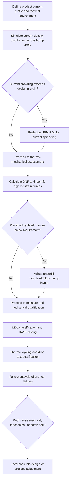

## Flip Chip Electrical and Thermo-Mechanical Reliability

### Overview

Flip chip reliability spans two coupled but analytically distinct domains: electrical reliability, governing degradation mechanisms driven by current flow through the interconnect (primarily electromigration and resistive heating), and thermo-mechanical reliability, governing degradation driven by cyclic or sustained mechanical stress arising from thermal expansion mismatch, moisture-induced stress, and mechanical shock. Both domains interact — Joule heating from electrical current elevates local temperature and accelerates thermo-mechanical degradation mechanisms, while thermo-mechanical damage (cracking, delamination) can alter current paths and worsen electrical degradation — making integrated reliability qualification essential for flip chip packages.

### Electrical Reliability: Electromigration (EM)

**Mechanism**

- Electromigration is the gradual displacement of metal atoms within a conductor caused by momentum transfer from conducting electrons ("electron wind") at sufficiently high current densities, leading to void formation at the cathode end and hillock/extrusion formation at the anode end of the conduction path.
- In flip chip bumps, EM is of particular concern at the UBM/solder interface and within the bulk solder or Cu pillar, where current crowding at pad-to-bump transitions concentrates current density well above the average value implied by simple cross-sectional area calculations.

**Key Points**

- Current crowding occurs because current entering the bump from a narrow on-chip trace or redistribution layer (RDL) must spread into the much larger bump cross-section, concentrating current density at the entry corner nearest the incoming trace — this is the dominant site of EM-induced void nucleation in most flip chip bump geometries.
- EM lifetime is commonly modeled using Black's equation, an empirical relationship relating median time-to-failure to current density and temperature:

$$MTTF = A \cdot J^{-n} \cdot \exp\left(\frac{E_a}{kT}\right)$$

where $MTTF$ is mean time to failure, $A$ is a material/geometry-dependent constant, $J$ is current density, $n$ is the current density exponent (commonly cited in the range of 1–2 for various interconnect systems), $E_a$ is the activation energy for the dominant diffusion mechanism, $k$ is Boltzmann's constant, and $T$ is absolute temperature. [Inference: the specific values of $A$, $n$, and $E_a$ are material-system- and geometry-dependent and must be empirically extracted via accelerated EM testing for the specific bump metallurgy and structure under qualification; they are not universal constants.]

- Cu pillar bumps generally exhibit improved EM resistance relative to bulk solder C4 bumps because a larger fraction of the current path is carried by solid, lower-resistivity Cu rather than Sn-based solder, reducing the volume of material susceptible to solder-phase electromigration (which tends to proceed faster than in pure Cu due to Sn's lower melting point and correspondingly higher homologous temperature at operating conditions).
- Polarity effects are significant: EM damage accumulates asymmetrically, with void formation at the cathode (current entry, from the perspective of electron flow direction) and IMC/hillock growth at the anode, so bump and RDL design must account for expected current direction in high-current applications.

**EM Mitigation Strategies**

| Strategy | Effect |
| --- | --- |
| Enlarge UBM opening relative to incoming trace | Reduces current crowding intensity at entry point |
| Add current-spreading RDL layer | Distributes current more evenly before entry into bump |
| Transition to Cu pillar from bulk solder | Reduces solder volume fraction in current path |
| Increase bump/pillar diameter for high-current nets | Reduces average current density |
| Route highest-current signals through larger or multiple parallel bumps | Distributes current across more conduction paths |

### Electrical Reliability: Resistive/Joule Heating and Self-Heating

**Key Points**

- Current flow through the finite resistance of the bump, UBM, and RDL generates Joule heating, which raises the local temperature above ambient/package temperature; this self-heating directly accelerates EM (via the exponential temperature term in Black's equation) and can accelerate other thermally activated degradation mechanisms such as IMC growth.
- In high-current-density fine-pitch interconnects, self-heating effects become a first-order design consideration, requiring thermal simulation to verify that localized bump/pillar temperature rise remains within acceptable margins for both EM lifetime and general package thermal budget. [Inference: quantitative self-heating magnitudes are highly dependent on package thermal design, bump density, and current profile, and are typically evaluated via coupled electro-thermal simulation rather than generalized estimation.]

### Thermo-Mechanical Reliability: CTE Mismatch and Solder Joint Fatigue

**Mechanism**

- The dominant thermo-mechanical reliability concern in flip chip packages arises from the CTE mismatch between silicon die (~2.6 ppm/°C) and the organic or ceramic substrate/interposer (~15–20 ppm/°C for organic substrates, lower for ceramic), which induces cyclic shear strain at the bump joints during temperature excursions (power cycling, environmental thermal cycling, or ambient temperature swings in the field).
- This cyclic shear strain drives low-cycle fatigue crack initiation and propagation, typically nucleating at the corner or edge bumps furthest from the neutral point (DNP — Distance to Neutral Point), where accumulated thermal expansion mismatch displacement, and therefore strain, is greatest.

**Key Points**

- Solder joint fatigue life is commonly modeled using Coffin-Manson-type relationships relating cycles-to-failure to plastic strain amplitude:

$$N_f = C \cdot (\Delta \gamma_p)^{-n}$$

where $N_f$ is cycles to failure, $\Delta \gamma_p$ is the plastic shear strain range per cycle, and $C$, $n$ are empirically derived material constants specific to the solder alloy and joint geometry. [Inference: $C$ and $n$ values must be derived from accelerated thermal cycling test data for the specific solder alloy, joint geometry, and underfill system in use; generic literature values provide only order-of-magnitude guidance.]

- The Distance-to-Neutral-Point (DNP) relationship means that larger die (with bump arrays extending further from the die center) experience proportionally higher strain at their outermost bumps for a given temperature excursion, making large-die flip chip packages more fatigue-sensitive at their corner/edge bumps than smaller die with otherwise identical bump metallurgy and pitch.
- Underfill is the primary mitigation for CTE-mismatch-driven solder fatigue: by mechanically coupling the die and substrate across their full contact area, underfill redistributes strain from being concentrated at discrete bump locations into the underfill bulk and fillet, substantially extending thermal cycling life relative to an unfilled (bump-only) assembly.

### Thermo-Mechanical Reliability: Warpage

**Key Points**

- Package-level and die-level warpage, arising from CTE mismatch across the many material layers in a flip chip stack (die, underfill, substrate, mold compound where present), can cause non-uniform bump contact during assembly (leading to non-wet opens at the periphery) and can also induce sustained mechanical stress on bumps even without active thermal cycling, if warpage persists in the finished package.
- Warpage behavior changes with temperature (since different material layers expand/contract at different rates), meaning a package that is flat at room temperature may develop significant bow at reflow or extreme operating temperatures — this temperature-dependent warpage behavior is a key design and process verification parameter, often characterized via shadow moiré or digital image correlation techniques across a temperature ramp.
- Warpage mitigation strategies include substrate core material/stack-up selection, symmetric build-up layer design, controlled underfill cure shrinkage, and in some cases stiffener rings or lids to constrain package-level bow. [Inference: the relative effectiveness of specific warpage mitigation techniques is package-design-specific and typically validated through combined simulation and experimental characterization.]

### Thermo-Mechanical Reliability: Low-k Dielectric Cracking

**Key Points**

- Modern die frequently incorporate low-k or ultra-low-k interlayer dielectrics beneath the bond pad to reduce parasitic capacitance in back-end-of-line (BEOL) interconnect; these dielectrics are mechanically more brittle and have lower fracture toughness than traditional silicon dioxide, making them susceptible to cracking under the mechanical stresses transmitted through bumps during both assembly (particularly TCB, where bonding force is directly applied) and subsequent thermal cycling.
- Rigid Cu pillar structures transmit more of the applied bonding force and thermal-cycling-induced stress directly to the die compared to compliant solder-ball bumps, making low-k cracking a heightened concern in Cu pillar / TCB flows relative to legacy solder-ball mass reflow assembly.
- Mitigation approaches include bump/pad layout design (avoiding bond pad placement directly over sensitive low-k structures where possible), UBM and pad stack mechanical buffering, and careful control of TCB bonding force profiles to avoid excessive peak stress. [Inference: the specific stress thresholds for low-k cracking are process-node- and dielectric-material-specific, typically established via finite element modeling combined with mechanical test structures during technology qualification.]

### Moisture-Related Reliability

**Key Points**

- Underfill and mold compound materials are hygroscopic to varying degrees, absorbing ambient moisture during storage; if a moisture-laden package undergoes rapid heating (such as during board-level reflow soldering), trapped moisture can vaporize and generate internal pressure sufficient to cause delamination or "popcorn cracking" — a well-documented failure mode in moisture-sensitive packages.
- Moisture Sensitivity Level (MSL) classification (per industry standards such as J-STD-020) governs the required floor life, storage, and baking conditions for a given package prior to board-level assembly, and flip chip packages with underfill/mold compound are evaluated and rated accordingly.
- Highly Accelerated Stress Testing (HAST) and unbiased/biased autoclave testing are standard qualification methods for evaluating moisture-related degradation of the underfill/bump/UBM interface system under combined humidity, temperature, and (for biased HAST) applied voltage stress. [Inference: specific HAST/autoclave test conditions and durations are defined by applicable JEDEC standards and customer specifications, and should be confirmed against the governing qualification plan.]

### Combined Electrical-Thermomechanical Interactions

**Key Points**

- Elevated current density regions (subject to EM risk) often coincide spatially with regions of elevated mechanical stress (e.g., die corner/edge bumps under high DNP-driven strain), meaning package and bump layout design must jointly consider both electrical current distribution and thermo-mechanical strain distribution rather than optimizing each independently.
- Pre-existing thermo-mechanical damage (microcracking, partial delamination) at a bump or UBM interface can locally increase current density (by reducing effective conduction cross-section), accelerating EM-driven failure at that location — creating a feedback loop between the two reliability domains that is a recognized consideration in root-cause failure analysis of field returns. [Inference: the quantitative extent of this interaction is failure-mode- and location-specific and is typically established through detailed failure analysis (cross-sectioning, SEM/EDX) on a case-by-case basis rather than generalized a priori.]

### Reliability Qualification Test Summary

| Test Category | Representative Test | Primary Failure Mode Targeted |
| --- | --- | --- |
| Thermal cycling | Temperature Cycling (TC), e.g., -40°C to 125°C | Solder/bump fatigue cracking, underfill delamination |
| Electromigration | Constant current stress at elevated temperature | Bump/UBM void formation, resistance drift/open |
| Moisture sensitivity | MSL preconditioning + reflow | Popcorn cracking, delamination |
| Humidity/bias | HAST, biased/unbiased autoclave | Corrosion, electrochemical migration, moisture-driven delamination |
| Mechanical shock | Drop test (e.g., JEDEC JESD22-B111) | Brittle bump fracture, board-level solder joint cracking |
| High-temperature storage | High Temperature Storage Life (HTSL) | IMC over-growth, long-term diffusion-driven degradation |

[Inference] Specific test conditions, durations, and pass/fail criteria referenced above follow common industry practice patterns (e.g., JEDEC JESD standards); exact parameters must be confirmed against the applicable qualification plan and product specification, since acceptable conditions vary by application (automotive, consumer, industrial, etc.).

### Illustration: Reliability Failure Mechanism Map (svg_diagram)

<svg xmlns="http://www.w3.org/2000/svg" viewBox="0 0 700 460">
<text x="350" y="26" text-anchor="middle" font-size="17" font-weight="bold" fill="#1a1a1a">Flip Chip Reliability Failure Mechanism Map (svg_diagram)</text>

<rect x="280" y="180" width="140" height="40" fill="#8899aa" stroke="#333" stroke-width="1.5" />
<text x="350" y="205" text-anchor="middle" font-size="12" fill="#fff">Die</text>
<ellipse cx="350" cy="245" rx="50" ry="30" fill="#dcdde1" stroke="#333" stroke-width="1.5" />
<text x="350" y="250" text-anchor="middle" font-size="11">Bump Joint</text>
<rect x="280" y="290" width="140" height="40" fill="#4a6741" stroke="#333" stroke-width="1.5" />
<text x="350" y="315" text-anchor="middle" font-size="12" fill="#fff">Substrate</text>

<line x1="280" y1="245" x2="150" y2="150" stroke="#e74c3c" stroke-width="1.5" />
<rect x="30" y="100" width="160" height="55" fill="#fdedec" stroke="#e74c3c" stroke-width="1" />
<text x="110" y="118" text-anchor="middle" font-size="11" font-weight="bold" fill="#c0392b">Electrical</text>
<text x="110" y="133" text-anchor="middle" font-size="9" fill="#c0392b">Current crowding to EM</text>
<text x="110" y="146" text-anchor="middle" font-size="9" fill="#c0392b">Joule heating to accel. degradation</text>

<line x1="420" y1="245" x2="550" y2="150" stroke="#2980b9" stroke-width="1.5" />
<rect x="510" y="100" width="170" height="55" fill="#eaf2f8" stroke="#2980b9" stroke-width="1" />
<text x="595" y="118" text-anchor="middle" font-size="11" font-weight="bold" fill="#2471a3">Thermo-Mechanical</text>
<text x="595" y="133" text-anchor="middle" font-size="9" fill="#2471a3">CTE mismatch to shear strain</text>
<text x="595" y="146" text-anchor="middle" font-size="9" fill="#2471a3">DNP-driven fatigue at corner bumps</text>

<line x1="350" y1="330" x2="350" y2="380" stroke="#27ae60" stroke-width="1.5" />
<rect x="255" y="380" width="190" height="55" fill="#eafaf1" stroke="#27ae60" stroke-width="1" />
<text x="350" y="398" text-anchor="middle" font-size="11" font-weight="bold" fill="#1e8449">Moisture / Chemical</text>
<text x="350" y="413" text-anchor="middle" font-size="9" fill="#1e8449">Hygroscopic underfill/mold uptake</text>
<text x="350" y="426" text-anchor="middle" font-size="9" fill="#1e8449">Popcorn cracking at reflow</text>

<path d="M 190 128 Q 350 60 550 128" stroke="#7f8c8d" stroke-width="1.5" fill="none" stroke-dasharray="5,3" marker-end="url(#arrow3)" />
<text x="350" y="65" text-anchor="middle" font-size="10" fill="#7f8c8d">Damage in one domain accelerates the other</text>
</svg>

### Illustration: Reliability Assessment Decision Flow

### Next Steps

**Related Topics**

- Copper Pillar Bump Technology (EM and thermo-mechanical performance comparison to bulk solder)
- Under-Bump Metallization Design (current crowding and IMC-related reliability levers)
- Underfill Processes: Capillary, Molded, and No-Flow Underfill (mechanical strain redistribution)
- Moisture Sensitivity Level (MSL) Classification and Board-Level Reflow Compatibility
- Warpage Characterization Techniques (Shadow Moiré, Digital Image Correlation)
- Failure Analysis Methodologies for Flip Chip Bump and Interconnect Defects
- Finite Element Modeling of Package-Level Thermo-Mechanical Stress