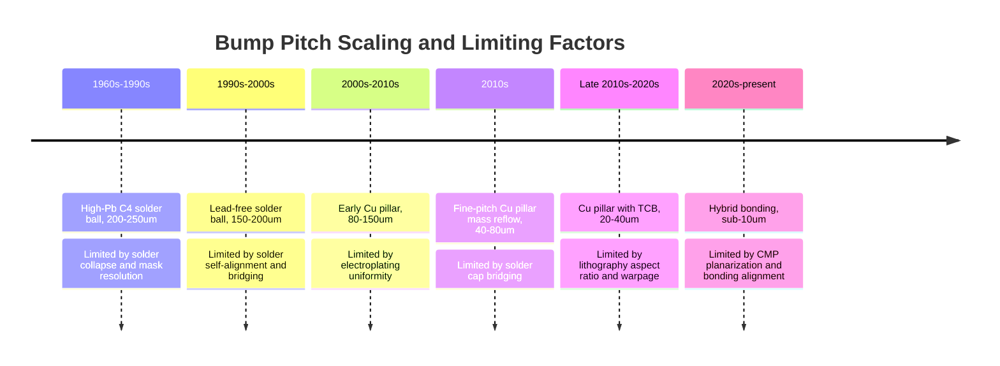
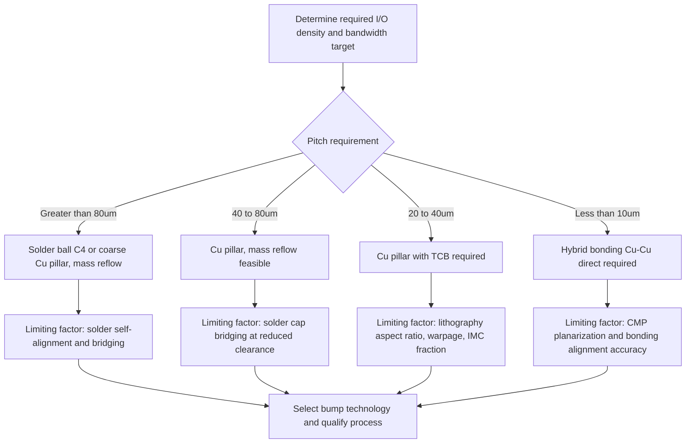

## Bump Pitch Scaling Trends and Physical Limits

### Overview

Bump pitch — the center-to-center spacing between adjacent interconnect bumps — has been the primary scaling metric for flip chip and advanced packaging interconnect density over the past several decades. As I/O count requirements have grown with die complexity while die area growth has slowed relative to transistor scaling, bump pitch has been driven progressively finer, moving through distinct technology generations (solder ball C4, fine-pitch Cu pillar, and ultimately hybrid bonding) each with characteristic physical, materials, and equipment limits that bound achievable pitch.

### Historical Pitch Scaling Trajectory

| Era | Dominant Bump Technology | Typical Pitch Range | Primary Limiting Factor |
| --- | --- | --- | --- |
| 1960s–1990s | High-Pb solder ball C4 | 200–250 µm | Solder volume/collapse control, mask/evaporation resolution |
| 1990s–2000s | Eutectic/lead-free solder ball, mature C4 | 150–200 µm | Solder self-alignment and bridging risk during reflow |
| 2000s–2010s | Cu pillar (early generations) | 80–150 µm | Electroplating uniformity, photoresist aspect ratio |
| 2010s | Fine-pitch Cu pillar, mass reflow/TCB transition | 40–80 µm | Solder cap bridging, RDL routing density, TCB force/thermal uniformity |
| Late 2010s–2020s | Fine-pitch Cu pillar, TCB-dominant | 20–40 µm | Lithography resolution, warpage/coplanarity, IMC volume fraction |
| 2020s–present | Hybrid bonding (Cu-Cu direct) | Sub-10 µm (down to ~1–2 µm in leading-edge implementations) | Surface planarization (CMP), bonding alignment precision, dielectric bonding quality |

[Inference] The pitch values and era boundaries above represent general industry trend patterns synthesized from widely reported roadmap data; exact figures vary by foundry, OSAT, and specific product generation, and should be cross-referenced against current heterogeneous integration roadmaps (e.g., IEEE Heterogeneous Integration Roadmap) for authoritative up-to-date figures.

### Drivers of Pitch Scaling

**Key Points**

- **I/O density requirements**: As die incorporate more functional blocks (compute, memory interfaces, high-speed SerDes) and adopt chiplet-based disaggregation, the number of required interconnects per unit die area has grown substantially, requiring finer pitch to fit the necessary I/O count within available die edge or area.
- **Reticle-limited die and multi-die integration**: Advanced packages increasingly connect multiple dies (chiplets) at die-to-die interfaces where bandwidth density (bits/second per mm of interface edge or per mm² of interface area) is a primary performance metric, directly incentivized by finer pitch.
- **Power delivery**: While power/ground bumps often remain at coarser pitch than signal bumps for current-carrying capacity reasons, the overall trend toward higher current density chips has pushed power delivery network (PDN) co-design considerations alongside pitch scaling.
- **Cost per I/O**: Finer pitch generally reduces the die area (and thus cost) required to accommodate a given I/O count, though this must be balanced against the higher process cost per unit area of finer-pitch bumping and assembly equipment.

### Physical and Materials Limits on Solder-Cap Cu Pillar Scaling

**Key Points**

1. **Solder bridging risk**: Even with pillar-confined solder caps, sufficiently fine pitch reduces the lateral clearance between adjacent solder caps to the point where minor process variation (cap volume, alignment, reflow temperature uniformity) risks solder bridging between neighbors; this is a primary reason the industry transitions toward TCB (tighter force/thermal control) and eventually away from any melted solder phase at the finest pitches.
2. **Photolithography resolution and aspect ratio**: Electroplated Cu pillar height-to-diameter aspect ratio is constrained by achievable photoresist aspect ratio during the plating-mold patterning step; as pitch shrinks, pillar diameter must shrink correspondingly (to maintain adequate inter-pillar spacing), but pillar height often cannot shrink proportionally without compromising standoff and stress-absorption function, pushing aspect ratios higher and straining photoresist process capability.
3. **Electroplating uniformity**: Achieving uniform Cu pillar height and Ni/solder cap thickness across a full wafer or panel becomes progressively more difficult at finer pitch and higher pillar density, since local current density variations during electroplating (influenced by seed layer resistance, pattern density effects) directly translate to height/thickness non-uniformity.
4. **Warpage and coplanarity**: As pitch shrinks, the allowable non-planarity budget across the die (or panel) shrinks correspondingly, since a fixed amount of warpage represents an increasingly large fraction of the standoff gap at finer pitch — this is a major driver of the shift toward TCB, which can compensate for localized non-planarity better than mass reflow.
5. **IMC volume fraction**: At very fine pitch, the solder cap volume shrinks substantially, meaning intermetallic compound formation during reflow/bonding can consume a proportionally larger fraction of the total joint volume, raising concerns about joint embrittlement and long-term reliability margin as pitch scales down.
6. **RDL routing density**: Fine-pitch bumps require correspondingly fine-pitch redistribution layer (RDL) routing on the die or interposer to bring signals from the core circuitry to the bump locations; RDL line/space capability (often requiring advanced lithography and multiple RDL layers) becomes a co-limiting factor alongside the bump technology itself.

### Transition to Hybrid Bonding at Sub-10 µm Pitch

**Key Points**

- Hybrid bonding (Cu-Cu direct bonding, sometimes referred to as Cu-Cu diffusion bonding with dielectric bonding) eliminates the solder phase entirely, directly bonding planarized Cu pads on two surfaces via a combination of room-temperature dielectric (oxide-oxide) bonding followed by thermal annealing that drives Cu-Cu metallic interdiffusion across the interface.
- Because there is no solder to reflow and no risk of solder bridging, hybrid bonding pitch is limited primarily by lithography/patterning resolution, chemical-mechanical polishing (CMP) planarization quality, and bonding alignment accuracy rather than by solder-specific failure modes — enabling pitch scaling into the single-digit-micron range and below, well beyond what any solder-based bump technology can achieve.
- Surface preparation is critical: both bonding surfaces require extremely tight planarity (sub-nanometer to low-nanometer scale roughness) achieved via CMP, since even minor topography variation can prevent adequate contact area for successful dielectric bonding and subsequent Cu diffusion.
- Bonding alignment accuracy requirements scale directly with pitch; achieving reliable electrical contact at sub-10 µm (and especially sub-2 µm) pitch requires wafer-to-wafer or die-to-wafer bonding equipment capable of sub-100 nm (or better) alignment accuracy, representing a substantial equipment capability step beyond conventional flip chip placement tools. [Inference: specific alignment accuracy specifications vary by equipment generation and vendor; current figures should be verified against specific hybrid bonding tool documentation.]

### Comparative Physical Limits by Technology Generation

| Technology | Approximate Pitch Floor | Dominant Limiting Mechanism |
| --- | --- | --- |
| Solder ball C4 (mass reflow) | ~130–150 µm | Solder collapse/self-alignment, bridging |
| Cu pillar, mass reflow | ~40–80 µm | Solder cap bridging at reduced clearance |
| Cu pillar, TCB | ~20–40 µm | Photolithography aspect ratio, warpage/coplanarity, IMC volume fraction |
| Hybrid bonding (Cu-Cu direct) | Sub-10 µm, down to ~1–2 µm in leading implementations | CMP planarization quality, bonding alignment accuracy |

[Inference] These pitch floor values represent commonly cited industry benchmarks synthesized from public roadmap and technical literature; actual achievable pitch in a specific process is qualification-dependent and continues to evolve, so current-generation figures should be verified against up-to-date foundry/OSAT process design kits or published roadmaps.

### Electrical Performance Implications of Finer Pitch

**Key Points**

- Finer pitch generally reduces interconnect parasitic inductance and capacitance per connection (due to shorter effective signal path length from die to substrate/interposer), improving high-speed signal integrity — a significant driver for finer pitch in high-bandwidth die-to-die interfaces such as those used in chiplet-based architectures.
- Reduced solder/bump volume at finer pitch, as discussed in electrical reliability contexts, generally improves electromigration margin per unit current by shifting current conduction toward higher-conductivity Cu, though finer pitch also constrains the maximum current per individual bump, requiring higher bump count (parallel current paths) to deliver a given total current budget.
- Hybrid bonding, by eliminating solder entirely and enabling extremely fine pitch, supports interconnect densities suitable for very-high-bandwidth die-to-die interfaces (relevant to 3D-stacked memory and logic-on-logic integration) that would be impractical to achieve with any solder-based bump approach due to the cumulative bridging, IMC, and alignment constraints discussed above.

### Cost and Equipment Considerations Across the Pitch Scaling Curve

**Key Points**

- Equipment capital cost generally increases as pitch scales finer, since achieving the required lithography resolution, plating uniformity, placement accuracy, and (for hybrid bonding) CMP/bonding alignment capability demands progressively more sophisticated and expensive tooling.
- Process yield sensitivity typically increases at finer pitch, since the margin for defects (bridging, non-wet opens, misalignment) shrinks proportionally with pitch, making defect density control and in-line metrology increasingly critical cost drivers.
- The transition from Cu pillar/TCB to hybrid bonding represents a substantial process and equipment paradigm shift (rather than an incremental scaling step), since hybrid bonding requires fundamentally different surface preparation (CMP), bonding equipment, and process control philosophy compared to solder-based bump technologies — this transition cost is a significant factor in adoption timing decisions across the industry. [Inference: relative cost comparisons between Cu pillar/TCB and hybrid bonding at a given pitch point are highly dependent on volume, equipment amortization, and specific process maturity, and are best assessed via current cost-modeling data from equipment vendors or foundries rather than generalized statements.]

### Illustration: Pitch Scaling Timeline and Limiting Factors

### Illustration: Pitch Scaling Decision and Limiting Factor Flow

### Illustration: Relative Pitch Scale Comparison (svg_diagram)

<svg xmlns="http://www.w3.org/2000/svg" viewBox="0 0 700 320">
<text x="350" y="26" text-anchor="middle" font-size="17" font-weight="bold" fill="#1a1a1a">Relative Bump Pitch Scale Comparison (svg_diagram)</text>

<line x1="60" y1="260" x2="660" y2="260" stroke="#333" stroke-width="1.5" />

<circle cx="100" cy="230" r="26" fill="#dcdde1" stroke="#333" stroke-width="1.5" />
<circle cx="180" cy="230" r="26" fill="#dcdde1" stroke="#333" stroke-width="1.5" />
<text x="140" y="280" text-anchor="middle" font-size="11">C4 Solder Ball</text>
<text x="140" y="294" text-anchor="middle" font-size="10" fill="#555">~150-250um pitch</text>

<circle cx="290" cy="235" r="16" fill="#cd7f32" stroke="#333" stroke-width="1.5" />
<circle cx="335" cy="235" r="16" fill="#cd7f32" stroke="#333" stroke-width="1.5" />
<circle cx="380" cy="235" r="16" fill="#cd7f32" stroke="#333" stroke-width="1.5" />
<text x="335" y="280" text-anchor="middle" font-size="11">Cu Pillar (Mass Reflow)</text>
<text x="335" y="294" text-anchor="middle" font-size="10" fill="#555">~40-80um pitch</text>

<circle cx="460" cy="240" r="9" fill="#cd7f32" stroke="#333" stroke-width="1" />
<circle cx="480" cy="240" r="9" fill="#cd7f32" stroke="#333" stroke-width="1" />
<circle cx="500" cy="240" r="9" fill="#cd7f32" stroke="#333" stroke-width="1" />
<circle cx="520" cy="240" r="9" fill="#cd7f32" stroke="#333" stroke-width="1" />
<text x="490" y="280" text-anchor="middle" font-size="11">Cu Pillar (TCB)</text>
<text x="490" y="294" text-anchor="middle" font-size="10" fill="#555">~20-40um pitch</text>

<rect x="580" y="238" width="4" height="4" fill="#2980b9" />
<rect x="590" y="238" width="4" height="4" fill="#2980b9" />
<rect x="600" y="238" width="4" height="4" fill="#2980b9" />
<rect x="610" y="238" width="4" height="4" fill="#2980b9" />
<rect x="620" y="238" width="4" height="4" fill="#2980b9" />
<rect x="630" y="238" width="4" height="4" fill="#2980b9" />
<text x="605" y="280" text-anchor="middle" font-size="11">Hybrid Bonding</text>
<text x="605" y="294" text-anchor="middle" font-size="10" fill="#555">Sub-10um pitch</text>
</svg>

### Next Steps

**Related Topics**

- Copper Pillar Bump Technology (fabrication detail underlying mid-range pitch scaling)
- Flip Chip Assembly and Thermocompression Bonding (bonding method transition drivers)
- Hybrid Bonding (Cu-Cu Direct Bonding) Process Flow and Equipment Requirements
- Chemical-Mechanical Polishing (CMP) for Hybrid Bonding Surface Preparation
- Redistribution Layer (RDL) Design for Fine-Pitch Signal Routing
- Chiplet Interconnect Bandwidth Density and Die-to-Die Interface Standards
- Heterogeneous Integration Roadmap Trends for Interconnect Pitch Scaling