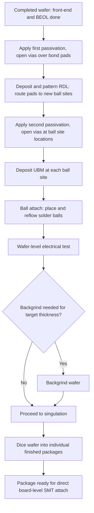
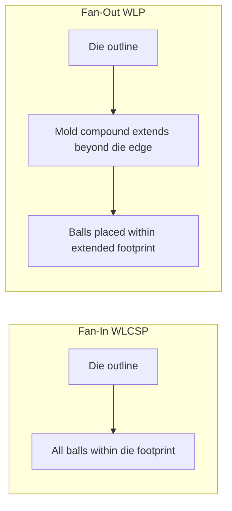

## Fan-In Wafer-Level Chip-Scale Packaging

### Overview

Fan-in wafer-level chip-scale packaging (WLCSP) is a packaging approach in which all package-level processing — redistribution, bumping, and singulation — is performed directly on the wafer, with the final package footprint remaining equal to or only marginally larger than the bare die itself. In fan-in WLCSP, all interconnect terminals (solder balls or bumps) are routed inward and placed within the die's own area boundary, distinguishing it from fan-out WLP where redistribution extends beyond the original die edge into a reconstituted mold compound area. Fan-in WLCSP represents one of the most area-efficient packaging forms available and has been widely adopted for I/O-limited, area-constrained devices such as mobile RF, power management ICs, and sensors.

### Defining Characteristics

**Key Points**

- Package outline is essentially identical to die outline (true chip-scale), typically defined by JEDEC as a package no larger than 1.2 times the die area.
- All processing — redistribution layer (RDL) formation, passivation, UBM deposition, and ball/bump attach — occurs while the device is still in wafer form, prior to dicing.
- Because the final terminal array must fit entirely within the die's original footprint, fan-in WLCSP is inherently I/O-count-limited relative to die size; devices requiring very high I/O density relative to their die area are generally not good candidates for fan-in WLCSP and instead favor fan-out WLP or conventional flip chip on larger substrates.
- No separate substrate or interposer is used — the silicon itself, augmented by a thin RDL and passivation stack, serves as the entire package structure.

### Fan-In WLCSP Process Flow

**Key Points**

1. **Wafer fabrication completion** — Starting point is a fully fabricated wafer with completed front-end and back-end-of-line processing, exposing the original (typically peripheral, area-array, or mixed) bond pads.
2. **First passivation/polyimide layer** — A dielectric layer (commonly polyimide, benzocyclobutene (BCB), or polybenzoxazole (PBO)) is applied and patterned to open vias over the original bond pads while covering and protecting the rest of the wafer surface.
3. **Redistribution Layer (RDL) formation** — A metal layer (typically sputtered and electroplated Cu) is patterned to route signals from the original (often peripheral) bond pad locations to new, area-array bump site locations distributed across the die surface, enabling a more favorable ball layout for board-level assembly than the original pad pattern would allow.
4. **Second passivation layer** — A further dielectric layer is applied over the RDL, patterned to open vias at the new bump site locations while protecting the RDL traces elsewhere.
5. **UBM deposition** — Under-bump metallization is deposited and patterned at each bump site opening, following the same adhesion/barrier/wetting layer principles used in conventional flip chip UBM design.
6. **Ball attach or bump plating** — Solder balls are placed (ball-drop/reflow) or bumps are electroplated at each UBM site, forming the final external terminal array (commonly a ball grid array, BGA-style layout, though at chip-scale dimensions).
7. **Reflow** — Balls are reflowed to form the final rounded solder ball shape and ensure metallurgical bond to the UBM.
8. **Wafer-level test** — Electrical test performed at wafer level prior to singulation, leveraging the fact that all package-level structures are already complete.
9. **Backgrind (if needed)** — Wafer thinning to target final package thickness, performed either before or after RDL/bump processing depending on process flow and wafer handling considerations.
10. **Singulation (dicing)** — Wafer is diced into individual finished packages, each essentially ready for board-level surface mount assembly.

### RDL Design Considerations

**Key Points**

- RDL routing must accommodate the original bond pad locations (often set by die-level circuit layout constraints established at the front-end design stage) while redistributing to a ball layout optimized for board-level assembly, thermal/mechanical reliability, and PCB routing density.
- RDL trace width/spacing and via design must balance electrical performance (resistance, inductance) against the achievable lithography resolution and layer count, since fan-in WLCSP typically uses only one or a small number of RDL layers to keep the process cost-competitive relative to the chip-scale package's inherently low cost point.
- Ball placement pattern (perimeter array, full area array, or partial/staggered array) is chosen based on I/O count, board-level reliability requirements (denser or more centrally located balls generally experience lower thermal cycling strain due to reduced distance to neutral point), and PCB routing/via constraints.

### Board-Level Reliability Considerations

**Key Points**

- Unlike flip chip packages, which are typically mounted onto an organic or ceramic substrate/interposer that itself gets reflow-attached to a PCB, fan-in WLCSP solder balls attach the bare silicon die directly to the PCB, meaning the CTE mismatch is between silicon (~2.6 ppm/°C) and the PCB (~15–17 ppm/°C for typical FR-4), with no intermediate substrate to help absorb strain.
- This direct silicon-to-PCB CTE mismatch, combined with the absence of an underfill in many standard fan-in WLCSP applications (underfill can be added for reliability-critical applications but adds cost and process steps that partially offset the chip-scale package's cost advantage), makes fan-in WLCSP board-level solder joint fatigue a more prominent reliability concern relative to flip chip on a more CTE-matched or underfilled interposer/substrate.
- Distance-to-Neutral-Point (DNP) effects are especially pronounced in fan-in WLCSP given the lack of stress-buffering substrate, meaning corner and edge balls (furthest from the package's neutral point) are typically the first-failing locations under thermal cycling; larger die (with balls extending further from center) are correspondingly more susceptible to board-level fatigue failure than smaller die at the same ball pitch.
- Mitigation approaches include: polymer-based stress buffer layers (sometimes incorporated into the passivation stack) to help absorb some strain before it reaches the solder joint, ball layout optimization to keep the outermost balls as close to center as I/O routing allows, and in some cases the use of larger/underfilled ball designs for higher-reliability applications (sometimes termed "WLCSP with underfill" as a distinct sub-category).

### Comparison: Fan-In WLCSP vs. Fan-Out WLP

| Attribute | Fan-In WLCSP | Fan-Out WLP |
| --- | --- | --- |
| Package footprint | Equal to or near die size | Larger than die (extends into reconstituted mold area) |
| I/O count capability relative to die area | Limited by die area (all terminals within die footprint) | Higher, since terminals can extend beyond original die edge |
| RDL routing space | Constrained to die area | Extended into surrounding mold compound area, more routing freedom |
| Substrate/carrier | None — die itself is the package | Reconstituted wafer/panel (die embedded in mold compound) forms the redistribution carrier |
| Board-level reliability | More CTE-mismatch-sensitive (direct Si-to-PCB) | Can be improved via RDL/mold compound CTE tuning and ball placement flexibility |
| Best-fit applications | I/O-limited, area-constrained devices (RF front-end, PMIC, sensors) | Higher I/O, multi-die, or larger die applications requiring more routing area |
| Process complexity | Generally lower (single-die processing, no die placement/reconstitution step) | Higher (requires die placement into reconstituted wafer/panel prior to RDL) |

### Common Application Domains

**Key Points**

- RF front-end modules and discrete RF components, where I/O count is modest and area efficiency directly benefits the space-constrained mobile device form factors these components typically serve.
- Power management ICs (PMICs), audio codecs, and other analog/mixed-signal devices with moderate I/O counts relative to die area.
- MEMS and sensor devices, where the chip-scale form factor aligns well with space-constrained sensor module integration.
- Memory devices in certain configurations, though high-I/O-density memory more commonly uses fan-out WLP, flip chip BGA, or advanced 2.5D/3D approaches when bandwidth requirements exceed what fan-in WLCSP's inherently limited I/O density can support.

### Illustration: Fan-In WLCSP Cross-Section (svg_diagram)

<svg xmlns="http://www.w3.org/2000/svg" viewBox="0 0 640 400">
<text x="320" y="26" text-anchor="middle" font-size="17" font-weight="bold" fill="#1a1a1a">Fan-In WLCSP Cross-Section (svg_diagram)</text>

<rect x="140" y="60" width="360" height="90" fill="#8899aa" stroke="#333" stroke-width="1.5" />
<text x="320" y="108" text-anchor="middle" font-size="14" fill="#fff">Silicon Die (package = die footprint)</text>

<rect x="200" y="150" width="30" height="10" fill="#c9a227" stroke="#333" stroke-width="1" />
<text x="215" y="175" text-anchor="middle" font-size="9">Original</text>
<text x="215" y="187" text-anchor="middle" font-size="9">bond pad</text>

<rect x="140" y="160" width="360" height="8" fill="#95a5a6" stroke="#333" stroke-width="0.5" />

<path d="M 215 160 L 215 175 L 320 175 L 320 190" stroke="#cd7f32" stroke-width="5" fill="none" />
<text x="400" y="178" text-anchor="middle" font-size="10" fill="#333">RDL trace (Cu)</text>

<rect x="140" y="190" width="360" height="10" fill="#95a5a6" stroke="#333" stroke-width="0.5" />
<text x="530" y="198" font-size="10" fill="#333">2nd passivation</text>

<rect x="300" y="200" width="40" height="8" fill="#b0b8bd" stroke="#333" stroke-width="0.5" />
<text x="380" y="207" font-size="10" fill="#333">UBM</text>

<ellipse cx="320" cy="235" rx="30" ry="28" fill="#dcdde1" stroke="#333" stroke-width="1.5" />
<text x="380" y="240" font-size="10" fill="#333">Solder ball</text>

<rect x="100" y="280" width="440" height="60" fill="#2c5f2d" stroke="#333" stroke-width="1.5" />
<text x="320" y="315" text-anchor="middle" font-size="13" fill="#fff">PCB (direct Si-to-PCB attach, no intermediate substrate)</text>

<line x1="140" y1="360" x2="500" y2="360" stroke="#e74c3c" stroke-width="1.5" />
<line x1="140" y1="352" x2="140" y2="368" stroke="#e74c3c" stroke-width="1.5" />
<line x1="500" y1="352" x2="500" y2="368" stroke="#e74c3c" stroke-width="1.5" />
<text x="320" y="380" text-anchor="middle" font-size="11" fill="#e74c3c">Package width = die width (true chip-scale)</text>
</svg>

### Illustration: Fan-In WLCSP Process Flow

### Illustration: Fan-In vs. Fan-Out Footprint Comparison

### Next Steps

**Related Topics**

- Fan-Out Wafer-Level Packaging (comparison and extended routing capability)
- Redistribution Layer (RDL) Design and Fine-Line Lithography for WLP
- Under-Bump Metallization Design (shared UBM principles across WLCSP and flip chip)
- Board-Level Reliability: Distance-to-Neutral-Point and Solder Joint Fatigue
- Panel-Level Packaging: Scaling WLP Concepts to Rectangular Panel Formats
- Wafer-Level Test Strategies for Chip-Scale Package Qualification
- Polymer Passivation Materials: Polyimide, BCB, and PBO Selection Criteria