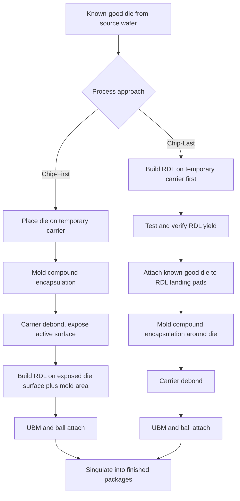

## Fan-Out Wafer-Level Packaging Principles

### Overview

Fan-out wafer-level packaging (FOWLP) extends the wafer-level packaging concept beyond the constraints of fan-in WLCSP by embedding singulated die into a reconstituted wafer or panel of mold compound, allowing the redistribution layer (RDL) to route interconnects beyond the original die edge into the surrounding mold area. This "fan-out" of interconnect terminals decouples the achievable I/O count and ball pitch from the die's native area, enabling higher I/O density, multi-die integration, and improved electrical and thermal performance relative to fan-in approaches, while retaining much of the cost and thinness advantage of wafer-level processing.

### Core Concept: Reconstitution

**Key Points**

- Unlike fan-in WLCSP, which processes an intact, uncut wafer, FOWLP begins with singulated (diced) known-good die that are then placed onto a temporary carrier and embedded in mold compound to form a new "reconstituted wafer" or "reconstituted panel."
- This reconstitution step is the defining architectural difference from fan-in WLP: it creates artificial wafer/panel real estate around each die, into which RDL routing and ball placement can extend, independent of the original die's physical boundary.
- Reconstitution enables side-by-side placement of multiple die (from the same or different wafers, potentially different technology nodes) within a single package footprint, forming the basis for multi-die FOWLP and more advanced heterogeneous integration schemes.

### Two Primary FOWLP Process Approaches

**Chip-First (Die-Face-Down or Die-Face-Up)**

1. Known-good die are picked from their source wafer and placed face-down (or face-up, depending on process variant) onto a temporary carrier at the target reconstituted wafer/panel pitch.
2. Mold compound is dispensed/molded around the placed die, encapsulating them and filling the gaps between die, forming the reconstituted wafer/panel.
3. The temporary carrier is removed (debonded), exposing the die's active surface (in face-down processing, this reveals the original bond pads after mold compound cure and possible backside grinding).
4. RDL layers are built up on the exposed active surface, routing signals from the original die bond pads outward into the surrounding mold compound area.
5. UBM and ball attach proceed as in fan-in WLP, with balls placed across the full extended footprint (both over the die and over the surrounding mold compound region).
6. Singulation into individual finished packages.

**Chip-Last (RDL-First)**

1. RDL layers are built up first on a temporary carrier, independent of die placement, forming the redistribution structure before any die attachment.
2. Known-good die are then placed and bonded (often via a fine-pitch flip-chip-like bump attach) onto the pre-built RDL structure, aligning die bond pads to the corresponding RDL landing pads.
3. Mold compound is applied around the die to complete the reconstituted structure and provide mechanical support.
4. Carrier removal, ball attach, and singulation proceed similarly to the chip-first flow.

**Key Points**

- Chip-last (RDL-first) processing allows RDL line/space and via quality to be verified and yield-tested before die attachment, meaning that RDL-related defects do not risk scrapping already-attached known-good die — a significant yield and cost advantage for expensive or multi-die assemblies, since a known-good die is not put at risk by subsequent RDL processing defects.
- Chip-first processing is generally simpler and has a shorter/more established process history, but couples RDL yield risk directly to already-placed die, meaning RDL defects discovered late in the process can result in scrapping the entire reconstituted panel including already-embedded known-good die.
- The choice between chip-first and chip-last is a significant process architecture decision balancing yield economics, RDL fine-line capability requirements, and equipment/process maturity considerations. [Inference: the relative cost/yield tradeoff between these approaches is highly dependent on die value, RDL layer count/complexity, and achieved process yields, and is typically evaluated via cost modeling specific to the product and volume in question.]

### Die Placement and Reconstitution Accuracy

**Key Points**

- Die placement accuracy during reconstitution directly affects RDL design margin, since the RDL must connect from a physically placed die pad location (subject to some placement tolerance) to the target ball site; excessive placement variation can require wider RDL design rules or cause opens/misalignment.
- "Die shift" — the small positional and rotational deviation of a die from its intended reconstituted location, arising from placement tool tolerance and subsequent mold compound cure shrinkage/warpage — is a well-recognized process challenge in FOWLP, requiring either tight process control, in-line die position metrology with adaptive RDL lithography (sometimes using die-aware/adaptive patterning systems that adjust exposure based on measured actual die position), or sufficiently generous RDL design rules to absorb expected shift.
- Panel-level (rectangular, larger-format) reconstitution, as opposed to round wafer-format reconstitution, introduces additional considerations for warpage and thermal uniformity across a larger, non-circular format, but offers area utilization and throughput advantages by better matching the aspect ratio of typical die layouts and enabling larger-format processing equipment reuse from PCB or display industries. [Inference: the specific area utilization and cost benefits of panel-level versus wafer-level formats are format-size- and equipment-dependent and are typically assessed through detailed cost-per-unit-area modeling.]

### RDL Design in Fan-Out Context

**Key Points**

- Because RDL routing area is no longer constrained to the die footprint, FOWLP can support significantly higher I/O counts (relative to die area) than fan-in WLCSP, since ball sites can be distributed across both the die area and the surrounding mold compound region.
- Multiple RDL layers (commonly two to four or more in advanced FOWLP implementations) may be used to achieve the routing density required for high-I/O or multi-die designs, each layer separated by a dielectric (polyimide, PBO, or similar) with via connections between layers.
- RDL design must account for differing mechanical properties between the region directly over die (higher stiffness silicon substrate beneath) and the region over mold compound (different CTE and stiffness), which can create localized stress concentration at the die-edge/mold-compound boundary — a known reliability-relevant transition zone in FOWLP designs.

### Multi-Die and Heterogeneous Integration Enablement

**Key Points**

- Because reconstitution places die individually before RDL buildup, FOWLP naturally supports embedding multiple die — potentially of different sizes, functions, or even originating from different wafers/process nodes — within a single reconstituted package, enabling system-in-package (SiP) style heterogeneous integration without requiring a separate interposer or substrate.
- This multi-die capability has made FOWLP a foundation technology for high-volume mobile application processor packages (where fan-out is used to integrate application processor die with package-on-package memory interfaces) and has been extended toward more complex multi-die, multi-technology integration schemes as the approach has matured.
- Known-good-die (KGD) testing prior to placement is essential in multi-die FOWLP, since a defective die embedded in the reconstituted panel cannot generally be replaced or reworked after mold compound encapsulation, making pre-placement test yield a critical cost driver.

### Comparison: Fan-Out WLP vs. Fan-In WLCSP vs. Flip Chip on Substrate

| Attribute | Fan-In WLCSP | Fan-Out WLP | Flip Chip on Organic Substrate |
| --- | --- | --- | --- |
| Package footprint | Equal to die size | Larger than die (extends into mold area) | Substrate-defined, typically larger than die |
| I/O count relative to die area | Limited | Higher (routing extends beyond die edge) | High (substrate provides extensive routing layers) |
| Multi-die support | Not applicable (single die per package) | Yes, via reconstitution | Yes, via substrate-level integration |
| Substrate/carrier used | None | Reconstituted mold compound (temporary carrier during process) | Organic (BT, ABF) or ceramic substrate |
| Typical RDL layer count | 1 (sometimes 2) | 2-4+ | N/A (substrate provides multi-layer routing instead of RDL) |

- Thickness | Thinnest (near bare die) | Thin (near bare die + RDL/mold) | Thicker (substrate adds height) |

| Cost driver | Very low per-unit cost, area-limited | Moderate cost, higher I/O flexibility | Higher cost, highest routing/reliability flexibility |

### Reliability Considerations Specific to FOWLP

**Key Points**

- **Mold compound CTE and warpage**: The reconstituted structure's overall CTE behavior is a composite of the die (silicon, ~2.6 ppm/°C) and surrounding mold compound (typically formulated with CTE in a different range, often higher), creating potential for warpage during processing (particularly during high-temperature RDL cure and mold cure steps) that must be managed through careful material selection and process design.
- **Die-shift-induced RDL stress/opens**: As discussed above, die placement variation not only affects RDL design margin but can also create localized stress concentration at the RDL/via interface if actual die position deviates significantly from the position assumed during RDL design/patterning.
- **Interfacial delamination**: The interface between die surface, RDL dielectric, and surrounding mold compound represents multiple dissimilar-material boundaries, each a potential delamination initiation site under thermal cycling or moisture-related stress; adhesion promoter treatments and careful dielectric material selection are used to mitigate this risk.
- **Board-level reliability**: Similar to fan-in WLCSP, FOWLP packages without an underlying rigid substrate can be more sensitive to board-level CTE mismatch with the PCB than substrate-based flip chip packages, though the extended ball pitch/pattern flexibility available in FOWLP (versus the die-area-constrained pattern in fan-in WLCSP) allows some reliability optimization through ball layout design.

### Illustration: Fan-Out WLP Reconstitution and Buildup (svg_diagram)

<svg xmlns="http://www.w3.org/2000/svg" viewBox="0 0 700 420">
<text x="350" y="26" text-anchor="middle" font-size="17" font-weight="bold" fill="#1a1a1a">Fan-Out WLP Reconstitution Structure (svg_diagram)</text>

<rect x="60" y="80" width="580" height="100" fill="#e8dcc8" stroke="#333" stroke-width="1.5" />
<text x="350" y="70" text-anchor="middle" font-size="12">Reconstituted Panel (mold compound)</text>

<rect x="150" y="90" width="140" height="80" fill="#8899aa" stroke="#333" stroke-width="1.5" />
<text x="220" y="135" text-anchor="middle" font-size="12" fill="#fff">Die 1</text>

<rect x="410" y="90" width="140" height="80" fill="#8899aa" stroke="#333" stroke-width="1.5" />
<text x="480" y="135" text-anchor="middle" font-size="12" fill="#fff">Die 2</text>

<text x="350" y="135" text-anchor="middle" font-size="11" fill="`#7d6608`">Mold compound gap-fill</text>

<rect x="60" y="180" width="580" height="18" fill="#95a5a6" stroke="#333" stroke-width="0.5" />
<path d="M 220 180 L 220 195 L 300 195" stroke="#cd7f32" stroke-width="4" fill="none" />
<path d="M 480 180 L 480 195 L 400 195" stroke="#cd7f32" stroke-width="4" fill="none" />
<text x="650" y="192" font-size="10" fill="#333">RDL</text>

<circle cx="120" cy="220" r="12" fill="#dcdde1" stroke="#333" />
<circle cx="220" cy="220" r="12" fill="#dcdde1" stroke="#333" />
<circle cx="300" cy="220" r="12" fill="#dcdde1" stroke="#333" />
<circle cx="400" cy="220" r="12" fill="#dcdde1" stroke="#333" />
<circle cx="480" cy="220" r="12" fill="#dcdde1" stroke="#333" />
<circle cx="580" cy="220" r="12" fill="#dcdde1" stroke="#333" />
<text x="350" y="255" text-anchor="middle" font-size="11" fill="#555">Balls placed both over die AND over surrounding mold compound (fan-out area)</text>

<line x1="150" y1="300" x2="290" y2="300" stroke="#e74c3c" stroke-width="1.5" />
<text x="220" y="315" text-anchor="middle" font-size="10" fill="#e74c3c">Die 1 footprint</text>
<line x1="60" y1="330" x2="640" y2="330" stroke="#2980b9" stroke-width="1.5" />
<text x="350" y="345" text-anchor="middle" font-size="10" fill="#2980b9">Full package footprint (extends beyond both die)</text>
</svg>

### Illustration: Chip-First vs. Chip-Last Process Flow

### Next Steps

**Related Topics**

- Fan-In Wafer-Level Chip-Scale Packaging (comparison baseline)
- Panel-Level Packaging: Scaling to Rectangular Reconstituted Formats
- Multi-Die Reconstitution and Known-Good-Die (KGD) Testing Strategies
- RDL-First (Chip-Last) Process Architecture and Yield Economics
- Mold Compound Material Selection for CTE and Warpage Control
- Package-on-Package (PoP) Integration Using Fan-Out RDL Structures
- Die Shift Metrology and Adaptive Lithography Compensation Techniques