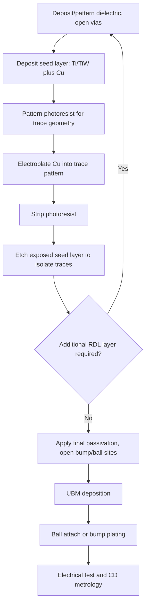

## Redistribution Layer Design and Fabrication

### Overview

The redistribution layer (RDL) is a thin-film metal interconnect structure, insulated by dielectric layers, that reroutes electrical connections from a die's original bond pad locations to a new, more favorable set of terminal locations for packaging purposes. RDLs are foundational to wafer-level packaging (both fan-in WLCSP and fan-out WLP), 2.5D interposer designs, and advanced substrate technologies, functioning as the interconnect fabric that bridges fine-pitch die-side geometry to coarser-pitch package or board-level terminals — or, in fan-out contexts, that extends routing beyond the die's own footprint entirely.

### Core Functions of RDL

**Key Points**

- **Pad relocation**: Routes signals from original (often peripheral or minimum-pitch area-array) bond pad locations to new bump/ball site locations optimized for board-level assembly, thermal/mechanical reliability, or fan-out area utilization.
- **Pitch transformation**: Converts fine on-die pad pitch into the coarser pitch typically required for solder ball or bump attachment, since ball/bump pitch is constrained by solder joint reliability and board-level assembly capability rather than by on-die lithography resolution.
- **Fan-out extension**: In fan-out packaging, extends routing beyond the original die boundary into surrounding mold compound area, enabling higher I/O density relative to die area than would otherwise be achievable.
- **Multi-die interconnect**: In 2.5D and multi-die fan-out contexts, RDL layers can directly interconnect multiple die within a package without routing through a separate substrate, functioning similarly to a fine-pitch interposer.
- **Power/ground distribution**: RDL layers also carry power delivery network (PDN) traces, requiring width and layer allocation sufficient to manage IR drop and current density across the package.

### RDL Layer Stack Architecture

**Key Points**

- A typical RDL structure consists of alternating dielectric and metal layers: a base dielectric (often polyimide, PBO, or similar photodefinable polymer) is patterned with vias, metal (typically sputtered Ti/Cu seed followed by electroplated Cu) is deposited and patterned to form traces, and a subsequent dielectric layer covers the traces while opening new vias for the next metal layer or final bump/ball site.
- Layer count scales with routing complexity: fan-in WLCSP often uses a single RDL layer given its limited I/O count and routing distance requirements, while fan-out WLP and 2.5D interposer applications commonly use two to four or more layers to accommodate higher I/O density, multi-die routing, and dedicated power/ground planes.
- Fine-line RDL (used in advanced fan-out and interposer applications) can achieve line/space geometries in the low single-digit micron range using semiconductor-derived lithography techniques, while coarser RDL (common in cost-sensitive fan-in WLCSP) may use line/space geometries in the 5-15 µm range or coarser, using less expensive patterning equipment.

### RDL Fabrication Process Flow

**Key Points**

1. **Dielectric deposition and patterning**: Photodefinable dielectric (polyimide or PBO) is spin-coated or laminated, then exposed and developed (similar to photoresist processing) to open via locations directly, or a non-photodefinable dielectric is deposited and separately patterned with photoresist and etch.
2. **Seed layer deposition**: A thin adhesion/seed metal layer (commonly Ti or TiW for adhesion, followed by sputtered Cu) is deposited across the wafer/panel surface, including into the via openings, to provide a conductive base for subsequent electroplating.
3. **Photoresist patterning for trace definition**: A photoresist layer is applied and patterned to define the RDL trace geometry, exposing only the areas where copper trace material should be electroplated.
4. **Copper electroplating**: Cu is electroplated into the patterned photoresist openings, building up the trace thickness (typically several microns) needed for the required current-carrying capacity and resistance targets.
5. **Photoresist strip and seed layer etch**: The plating photoresist is stripped, and the now-exposed seed layer (outside the plated trace areas) is etched away (flash etch) to electrically isolate individual traces.
6. **Repeat for additional layers**: Steps 1-5 repeat for each additional RDL layer required, with each new dielectric layer both insulating the previous metal layer and providing via openings down to it for the next layer's connections.
7. **Final passivation and UBM/bump site opening**: A final dielectric layer covers the last RDL metal layer, with openings only at the final bump/ball site locations, where UBM deposition and bump/ball attach subsequently occur.

### Dielectric Material Selection

| Material | Key Properties | Typical Use Case |
| --- | --- | --- |
| Polyimide (PI) | Good thermal stability, well-established process history, moderate CTE | Widely used baseline RDL dielectric across fan-in and fan-out WLP |
| Polybenzoxazole (PBO) | Lower moisture absorption than polyimide, good mechanical properties | Increasingly favored for improved reliability in moisture-sensitive applications |
| Benzocyclobutene (BCB) | Low dielectric constant, good planarization | Used in some RF and high-frequency-sensitive RDL applications |

[Inference] The specific choice among these dielectric materials for a given process involves proprietary formulation details and process integration considerations at the foundry/OSAT level; the general property comparisons above reflect commonly cited industry characteristics rather than a definitive ranking for all applications.

**Key Points**

- Dielectric layer thickness and material properties influence both electrical performance (interlayer capacitance between RDL metal layers) and mechanical/reliability behavior (stress absorption, adhesion to adjacent metal and mold compound surfaces).
- Photodefinable dielectrics (allowing direct expose-and-develop via patterning without a separate photoresist/etch step) are widely favored for RDL processing because they reduce process step count compared to non-photodefinable alternatives requiring separate masking and etching.

### Electrical Design Considerations

**Key Points**

- **Resistance**: RDL trace resistance is governed by trace width, thickness, length, and the resistivity of electroplated Cu (close to bulk Cu resistivity of ~1.68 µΩ·cm when plating quality is well controlled); power/ground traces in particular require adequate width/thickness to manage IR drop across the routing distance.
- **Inductance and signal integrity**: Longer RDL routing distances (particularly relevant in fan-out designs where routing extends into mold compound area) introduce additional parasitic inductance and capacitance relative to the shortest possible path, which becomes an increasingly important design consideration for high-speed signal nets as data rates increase.
- **Current density and electromigration**: RDL traces, particularly those carrying power delivery current, must be sized to keep current density within design limits to avoid RDL-level electromigration degradation, following similar underlying physics to bump-level EM discussed in flip chip reliability, though at the trace level rather than the joint level.
- **Impedance control**: For high-speed signal routing, RDL trace geometry (width, dielectric thickness, reference plane proximity) may need to be controlled to achieve target characteristic impedance, particularly in fan-out and interposer applications supporting high-bandwidth die-to-die or die-to-package interfaces.

### Mechanical and Reliability Design Considerations

**Key Points**

- RDL traces and vias must accommodate the mechanical stress arising from CTE mismatch between the underlying material (silicon in fan-in regions, mold compound in fan-out regions) and the RDL metal/dielectric stack itself; trace routing that avoids sharp corners and abrupt width transitions helps reduce localized stress concentration.
- Via design (aspect ratio, sidewall taper, seed layer step coverage into the via) affects both electrical reliability (via resistance, void-free fill) and mechanical reliability (crack initiation risk at via corners under thermal cycling).
- In fan-out applications, RDL traces crossing the boundary between the region directly over die and the region over surrounding mold compound experience differing mechanical environments (different underlying material stiffness and CTE) on either side of that boundary, making this transition zone a recognized area of elevated reliability attention.
- Adhesion between dielectric layers, and between dielectric and metal, is critical to avoiding delamination-driven RDL failure; surface treatment (plasma treatment, adhesion promoter application) prior to subsequent layer deposition is commonly used to improve interlayer adhesion.

### RDL Design Rule Considerations by Application

| Application Context | Typical Line/Space Capability | Typical Layer Count | Key Design Driver |
| --- | --- | --- | --- |
| Fan-in WLCSP | Coarser (5-15 µm range or greater) | 1 (occasionally 2) | Cost minimization, limited I/O routing distance |
| Fan-out WLP (standard) | Moderate (2-10 µm range) | 2-4 | I/O density, multi-die routing |
| Fan-out WLP (advanced/fine-line) | Fine (sub-2 µm in leading implementations) | 4+ | High-bandwidth die-to-die interconnect, chiplet integration |
| 2.5D Interposer (silicon) | Very fine (comparable to BEOL, sub-micron in some designs) | Multiple (often using damascene Cu processes similar to semiconductor BEOL) | Maximum routing density for high-bandwidth multi-die integration |

[Inference] These design rule ranges represent commonly reported industry patterns synthesized from public technical literature; exact achievable design rules are process- and vendor-specific and evolve over time, so current figures should be verified against specific foundry/OSAT process design kits.

### Inspection and Metrology

**Key Points**

- Critical dimension (CD) metrology (optical or SEM-based) verifies RDL trace width, spacing, and via dimensions against design targets across the wafer/panel to detect lithography or etch process drift.
- Electrical test (continuity, resistance measurement, and in some cases high-speed signal integrity test) verifies RDL functional integrity, typically performed at the wafer/panel level before singulation to enable early yield detection.
- Cross-sectioning and via/trace resistance measurement are used during process development and periodic qualification to verify seed layer step coverage, via fill quality, and overall RDL stack integrity.

### Illustration: RDL Multi-Layer Stack Cross-Section (svg_diagram)

<svg xmlns="http://www.w3.org/2000/svg" viewBox="0 0 640 420">
<text x="320" y="26" text-anchor="middle" font-size="17" font-weight="bold" fill="#1a1a1a">RDL Multi-Layer Stack Cross-Section (svg_diagram)</text>

<rect x="120" y="340" width="400" height="40" fill="#8899aa" stroke="#333" stroke-width="1.5" />
<text x="320" y="365" text-anchor="middle" font-size="12" fill="#fff">Die surface / Mold compound</text>

<rect x="280" y="325" width="30" height="15" fill="#c9a227" stroke="#333" />

<rect x="120" y="310" width="400" height="15" fill="#95a5a6" fill-opacity="0.6" stroke="#333" stroke-width="0.5" />
<text x="560" y="320" font-size="10" fill="#333">Dielectric 1 (PI/PBO)</text>

<path d="M 295 325 L 295 305 L 400 305" stroke="#cd7f32" stroke-width="6" fill="none" />
<text x="480" y="300" font-size="10" fill="#333">RDL Metal 1 (Cu)</text>

<rect x="120" y="270" width="400" height="15" fill="#95a5a6" fill-opacity="0.6" stroke="#333" stroke-width="0.5" />
<text x="560" y="280" font-size="10" fill="#333">Dielectric 2</text>

<path d="M 400 305 L 400 270" stroke="#cd7f32" stroke-width="6" fill="none" />
<path d="M 400 270 L 400 250 L 320 250" stroke="#cd7f32" stroke-width="6" fill="none" />
<text x="230" y="245" font-size="10" fill="#333">RDL Metal 2</text>

<rect x="120" y="230" width="400" height="15" fill="#95a5a6" fill-opacity="0.6" stroke="#333" stroke-width="0.5" />
<text x="560" y="240" font-size="10" fill="#333">Final passivation</text>

<rect x="305" y="215" width="30" height="10" fill="#b0b8bd" stroke="#333" />
<ellipse cx="320" cy="190" rx="28" ry="25" fill="#dcdde1" stroke="#333" stroke-width="1.5" />
<text x="380" y="195" font-size="10" fill="#333">Ball/Bump</text>

<text x="320" y="405" text-anchor="middle" font-size="11" fill="#555">Each metal layer separated by dielectric; vias connect layers and route to final bump site</text>

</svg>

### Illustration: RDL Fabrication Process Loop

### Next Steps

**Related Topics**

- Fan-Out Wafer-Level Packaging Principles (primary application context for multi-layer RDL)
- Fan-In Wafer-Level Chip-Scale Packaging (single-layer RDL application context)
- Under-Bump Metallization Design (interface between RDL and bump/ball structures)
- 2.5D Silicon Interposer Design and Damascene Cu Routing
- Electromigration Reliability in RDL Power Delivery Traces
- Photodefinable Dielectric Material Processing (Polyimide, PBO, BCB)
- Panel-Level RDL Fabrication Equipment and Fine-Line Lithography Scaling