## eWLB and InFO Process Flows

### Overview

eWLB (embedded Wafer Level Ball grid array) and InFO (Integrated Fan-Out) are two of the most commercially significant fan-out wafer-level packaging implementations, each developed by different industry players with distinct process architectures. eWLB, originally developed by Infineon and later commercialized through STATS ChipPAC (now part of JCET Group), established chip-first fan-out as a viable high-volume manufacturing process. InFO, developed by TSMC, became widely known through its adoption in high-volume mobile application processor packaging and introduced chip-last (RDL-first) process variants alongside chip-first approaches, along with panel-level scaling. Both represent concrete, high-volume industrial implementations of the general fan-out WLP principles.

### eWLB Process Flow

**Key Points**

1. **Die pick and place**: Known-good die, singulated from their source wafer, are picked and placed face-down onto a temporary carrier (historically often using a die-attach film or adhesive layer) at the target reconstituted wafer pitch, with active/pad side facing the carrier.
2. **Compression molding**: Mold compound (typically an epoxy molding compound, EMC) is applied over the placed die array using compression molding, encapsulating the die and filling the inter-die gaps to form the reconstituted wafer.
3. **Mold cure**: The molded reconstituted wafer undergoes thermal cure to fully cross-link the epoxy molding compound, after which the temporary carrier is removed (debonded), exposing the die active surface and original bond pads.
4. **RDL formation**: One or more RDL layers are built up on the exposed die surface and surrounding mold compound area, following standard RDL fabrication steps (dielectric deposition/patterning, seed layer, electroplating, seed etch) to route die pads to new ball site locations extending into the fan-out area.
5. **UBM and ball attach**: Under-bump metallization is formed at each ball site, followed by solder ball placement and reflow.
6. **Reconstituted wafer test**: Electrical test performed at the reconstituted wafer level.
7. **Singulation**: The reconstituted wafer is diced into individual finished eWLB packages.

**Key Points**

- eWLB is a chip-first, die-face-down process architecture (in its originally developed and most widely deployed form), meaning RDL yield risk is coupled to already-embedded known-good die, as is generally true of chip-first fan-out approaches.
- The use of compression molding (as opposed to alternative mold application methods) for wafer-level reconstitution was a key process innovation associated with eWLB's original development, enabling void-free, uniform mold compound coverage across the reconstituted wafer.
- eWLB has been widely applied in RF, power management, and other moderate-I/O-count applications, and has also been extended toward package-on-package (PoP) and some multi-die configurations as the technology matured. [Inference: the specific range of current commercial eWLB applications and any process variants beyond the original chip-first architecture reflect ongoing industry development and should be verified against current supplier documentation for the most up-to-date process offerings.]

### InFO Process Flow (Chip-First Variant)

**Key Points**

1. **Die pick and place**: Known-good die are placed onto a temporary carrier, with a key InFO process characteristic being die-face-up placement in several InFO variants (in contrast to eWLB's die-face-down approach), though the exact orientation depends on the specific InFO process generation.
2. **Mold compound encapsulation**: Die are encapsulated in mold compound to form the reconstituted wafer/panel, filling the region around each die.
3. **RDL formation directly over the die active surface and mold compound**: Because certain InFO process flows use face-up die placement with through-mold via (or similar) structures, RDL formation can proceed with different via/interconnect strategies than the face-down chip-first approach used in eWLB; the RDL layers route from die pads (accessed either directly, in face-up configurations, or via through-mold interconnects) to fan-out ball site locations.
4. **UBM and ball attach**: Standard UBM and solder ball attach process, as in other fan-out flows.
5. **Singulation**: Reconstituted wafer diced into individual finished InFO packages.

**Key Points**

- TSMC's InFO technology became particularly well known through its high-volume adoption for mobile application processor packaging, where InFO-PoP (Package-on-Package) variants integrate RDL-based fan-out with a package-on-package interface for stacking memory on top of the logic package, avoiding the need for a separate package substrate between the application processor die and its RDL-based interconnect structure.
- InFO has been extended into several named process variants over its development history, addressing different die count, RDL layer count, and integration requirements (including versions targeting higher-performance computing applications with more complex multi-die and RDL configurations); [Inference: the specific naming, generation history, and current process capabilities of InFO variants are TSMC-proprietary and continue to evolve, so authoritative current details should be sourced directly from TSMC's published technology documentation rather than assumed from general fan-out principles alone.]
- InFO-based packaging has also been used as a platform for integrating multiple die (logic plus other die) side-by-side within a single fan-out reconstituted package, leveraging the same multi-die reconstitution principles general to fan-out WLP.

### Comparative Process Architecture Summary

| Attribute | eWLB | InFO (general characterization) |
| --- | --- | --- |
| Originating organization | Infineon (development), commercialized via STATS ChipPAC/JCET | TSMC |
| Primary process architecture | Chip-first, die-face-down | Chip-first (with face-up variants in several implementations) |
| Mold application method | Compression molding | Compression molding (consistent with general fan-out mold approaches) |
| Notable high-volume application | RF, PMIC, moderate I/O-count devices; PoP extensions | Mobile application processor packaging, InFO-PoP |
| RDL layer count range | Typically 1-2 in standard implementations | Multiple layers in various generations, scaling with application complexity |
| Multi-die support | Extended over time to some multi-die configurations | Well-established multi-die support in several InFO variants |

[Inference] The comparative details above synthesize commonly reported industry and technical literature characterizations of these two named commercial process families; exact current process parameters, layer counts, and application scope are proprietary to each technology owner and evolve with new process generations, so authoritative specifics should be confirmed against current published documentation from the respective companies (STATS ChipPAC/JCET for eWLB, TSMC for InFO).

### Shared Process Challenges Across eWLB and InFO

**Key Points**

- **Die shift during reconstitution**: Both process families face the general fan-out challenge of die positional/rotational shift during die placement and subsequent mold cure, requiring either tight placement/cure process control or RDL design margin/adaptive lithography to accommodate expected shift.
- **Warpage management**: Both must manage warpage arising from CTE mismatch between die, mold compound, and RDL/dielectric layers across the thermal excursions inherent in RDL cure, mold cure, and reflow steps; warpage control approaches include mold compound formulation selection, carrier and process temperature profile optimization, and in some cases symmetric or balanced RDL layer stack-up design.
- **Known-good-die (KGD) testing**: Both process families depend on pre-placement die testing to avoid embedding defective die into a reconstituted panel, since post-encapsulation rework is generally impractical, making pre-test yield an important cost driver common to both architectures.
- **Mold compound and RDL dielectric material co-optimization**: Both require careful selection of mold compound and RDL dielectric material properties (CTE, modulus, adhesion, moisture absorption) to jointly manage warpage, reliability, and process yield across the full RDL buildup and reflow thermal budget.

### Illustration: eWLB vs. InFO Process Flow Comparison

```mermaid
flowchart TD
    subgraph EWLB[eWLB Process Flow]
        A1[Die pick, face-down placement on carrier] --> A2[Compression molding encapsulation]
        A2 --> A3[Mold cure, carrier debond]
        A3 --> A4[RDL formation on exposed die surface plus mold area]
        A4 --> A5[UBM and ball attach]
        A5 --> A6[Reconstituted wafer test]
        A6 --> A7[Singulation]
    end

    subgraph INFO[InFO Process Flow]
        B1[Die pick, placement per InFO variant orientation] --> B2[Mold compound encapsulation]
        B2 --> B3[Carrier processing per variant]
        B3 --> B4[RDL formation, routing to fan-out ball sites]
        B4 --> B5[UBM and ball attach]
        B5 --> B6[Singulation]
    end
```

### Illustration: eWLB Reconstituted Wafer Structure (svg_diagram)

<svg xmlns="http://www.w3.org/2000/svg" viewBox="0 0 640 380">
<text x="320" y="26" text-anchor="middle" font-size="17" font-weight="bold" fill="#1a1a1a">eWLB Reconstituted Wafer Structure (svg_diagram)</text>

<circle cx="320" cy="200" r="150" fill="#e8dcc8" stroke="#333" stroke-width="1.5" />
<text x="320" y="60" text-anchor="middle" font-size="12">Reconstituted Wafer (mold compound)</text>

<rect x="250" y="150" width="60" height="60" fill="#8899aa" stroke="#333" stroke-width="1" />
<rect x="330" y="150" width="60" height="60" fill="#8899aa" stroke="#333" stroke-width="1" />
<rect x="250" y="230" width="60" height="60" fill="#8899aa" stroke="#333" stroke-width="1" />
<rect x="330" y="230" width="60" height="60" fill="#8899aa" stroke="#333" stroke-width="1" />
<rect x="180" y="100" width="50" height="50" fill="#8899aa" stroke="#333" stroke-width="1" />
<rect x="410" y="100" width="50" height="50" fill="#8899aa" stroke="#333" stroke-width="1" />
<rect x="180" y="260" width="50" height="50" fill="#8899aa" stroke="#333" stroke-width="1" />
<rect x="410" y="260" width="50" height="50" fill="#8899aa" stroke="#333" stroke-width="1" />

<text x="320" y="345" text-anchor="middle" font-size="11" fill="#555">Individual known-good die embedded across reconstituted wafer, mold compound fills gaps</text>

</svg>

### Package-on-Package Integration Context

**Key Points**

- Both eWLB and InFO have been extended toward package-on-package (PoP) configurations, where the fan-out package (typically containing an application processor or similar logic die) provides top-side interconnect terminals allowing a separate memory package to be stacked and attached above it, without requiring the intervening organic substrate that conventional PoP-on-substrate architectures use.
- This substrate-free PoP capability, enabled by the fan-out RDL structure providing both bottom-side (board-facing) and top-side (memory-package-facing) interconnect, is a significant driver of both technologies' adoption in mobile application processor packaging, where package height (z-height) is a critical form-factor constraint.

### Next Steps

**Related Topics**

- Fan-Out Wafer-Level Packaging Principles (general architecture underlying both eWLB and InFO)
- Redistribution Layer Design and Fabrication (shared RDL fabrication principles)
- Package-on-Package (PoP) Integration Architectures
- Panel-Level Packaging Scaling for Fan-Out Processes
- Die Shift Metrology and Compensation in Reconstituted Wafer Processing
- Chip-First versus Chip-Last (RDL-First) Process Yield Economics
- Mold Compound Material Selection for Warpage and CTE Control