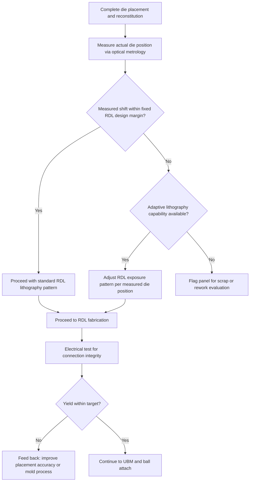

## Die Shift, Warpage, and Known-Good-Die Placement Accuracy

### Overview

Die shift, warpage, and known-good-die (KGD) placement accuracy are interrelated process control challenges central to fan-out wafer-level and panel-level packaging reliability and yield. Because fan-out processes rely on reconstituting individually placed die into a mold compound matrix before building redistribution layers (RDL) on top, any deviation between the assumed (designed) die position and the actual die position after placement, mold cure, and subsequent thermal processing directly threatens RDL connection integrity. These three concerns — where the die actually ends up, how the reconstituted structure physically deforms, and how accurately die are placed to begin with — must be addressed jointly rather than as isolated process steps.

### Die Shift: Definition and Origins

**Key Points**

- Die shift refers to the positional (X-Y translation) and rotational (theta) deviation of a die from its intended location within a reconstituted wafer or panel, measured after all reconstitution-related processing (placement, mold compound application, mold cure, carrier debonding) is complete.
- Die shift arises from multiple contributing sources across the reconstitution process: initial pick-and-place tool placement tolerance, die movement during mold compound flow (particularly in compression or transfer molding, where uncured mold compound flow around the die can nudge it from its as-placed position), and further shift or distortion during mold cure shrinkage as the epoxy molding compound cross-links and contracts.
- Die shift is generally categorized into two components with different characteristic behavior: **global shift** (a systematic, panel-wide or wafer-wide trend, often correlating with thermal gradients or mechanical effects during cure) and **local shift** (die-to-die random variation around the global trend, driven by placement tool repeatability and localized mold flow effects). [Inference: the relative magnitude and correlation structure of global versus local shift components are process- and equipment-specific, typically characterized through statistical analysis of measured die position data across many wafers/panels during process qualification.]

### Impact of Die Shift on RDL Design and Yield

**Key Points**

- RDL traces and vias are patterned based on a designed (nominal) die position; if the actual post-reconstitution die position deviates beyond the RDL design margin, the resulting via or trace connection to the die's original bond pad can be partially or fully misaligned, risking an open circuit or reduced contact area at that connection.
- RDL design margin (the extra via/pad size or keep-out area allocated to accommodate expected die shift) is a direct tradeoff against RDL routing density: larger design margins improve yield robustness to die shift but consume routing area that could otherwise support finer-pitch or higher-density interconnect.
- Two general mitigation strategies address this tradeoff: (1) tightening the reconstitution process itself (better placement tool accuracy, mold compound formulation/cure profile optimization to minimize shift) to reduce the actual shift magnitude requiring accommodation, and (2) adaptive/die-aware lithography, where the actual measured position of each die (via optical metrology performed on the reconstituted wafer/panel prior to RDL patterning) is used to dynamically adjust the RDL exposure pattern for that specific die location, compensating for measured shift rather than relying purely on fixed design margin.

### Warpage: Mechanisms and Process Stages

**Key Points**

- Warpage arises from CTE mismatch and modulus differences among the multiple dissimilar materials present in a reconstituted fan-out structure: silicon die, epoxy molding compound, RDL dielectric layers, and RDL metal (Cu) traces, each expanding and contracting at different rates across the temperature excursions inherent in mold cure, RDL processing (dielectric cure), and reflow steps.
- Warpage is temperature-dependent and can change sign (from concave to convex bow, or vice versa) across a thermal profile, since different material layers dominate the net CTE mismatch behavior at different temperature ranges; a reconstituted wafer/panel that appears acceptably flat at room temperature may develop significant bow at the elevated temperatures experienced during RDL cure or solder reflow.
- Warpage at different process stages creates distinct challenges: warpage during mold cure can contribute to or interact with die shift (since a warping structure can impart lateral forces on embedded die), warpage during RDL lithography can cause focus/exposure issues if the surface is not sufficiently planar for the lithography tool's depth of focus, and warpage at final reflow can cause non-uniform solder ball contact or coplanarity issues at board-level attach.
- Panel-level (larger-format, typically rectangular) reconstitution generally faces a more pronounced absolute warpage challenge than wafer-level (smaller, circular) reconstitution for a given material system, since warpage magnitude tends to scale with the characteristic dimension of the structure, though panel-level formats offer other cost and throughput advantages that motivate continued industry development of panel-level warpage mitigation techniques. [Inference: the specific warpage-versus-format-size relationship is influenced by many factors including panel thickness, material stack symmetry, and process conditions, and is best assessed through structural simulation combined with experimental characterization for a given process.]

### Warpage Measurement Techniques

| Technique | Principle | Typical Application |
| --- | --- | --- |
| Shadow Moiré | Projects a reference grating onto the sample surface and measures interference fringe patterns that correspond to surface height variation | Full-field warpage measurement across a wafer/panel, often across a temperature ramp |
| Digital Image Correlation (DIC) | Tracks surface speckle pattern displacement between images captured at different temperatures/conditions to compute full-field deformation | Warpage and strain mapping, can capture in-plane as well as out-of-plane deformation |
| Laser displacement/profilometry | Point or line-scan laser measurement of surface height across the sample | Localized or line-profile warpage measurement, often used for in-line process monitoring |

**Key Points**

- Warpage characterization is typically performed across a representative temperature ramp (from room temperature through expected process/reflow temperatures) rather than at a single static condition, since, as noted above, warpage magnitude and even direction can change significantly with temperature.
- Warpage data collected during process development informs both material selection (mold compound and dielectric formulation choices that minimize warpage across the relevant temperature range) and process window definition (identifying acceptable process temperature profiles that keep warpage within tool and downstream process tolerance limits).

### Known-Good-Die (KGD) Placement Accuracy

**Key Points**

- KGD refers to die that have been pre-tested (typically via wafer-level electrical test, and in some cases additional burn-in or screening) and confirmed functional prior to being placed into a reconstituted fan-out panel, since post-encapsulation rework or replacement of a defective embedded die is generally impractical or impossible.
- Placement accuracy requirements for KGD placement tools are directly tied to the RDL design margin discussion above: tighter achievable placement accuracy allows finer RDL design rules (higher routing density) for a given target yield, while looser placement accuracy requires correspondingly larger RDL margins or greater reliance on adaptive lithography compensation.
- Placement accuracy is typically specified statistically (e.g., a 3-sigma placement accuracy value across many placement events) rather than as an absolute guarantee, reflecting the inherent variability in high-throughput pick-and-place equipment operation. [Inference: specific placement accuracy specifications (e.g., ±X µm at 3-sigma) are equipment-generation- and vendor-specific; current figures should be verified against specific placement tool documentation rather than assumed from general industry trend statements.]
- Multi-die placement (in packages integrating several die within a single reconstituted structure) compounds placement accuracy considerations, since relative position accuracy between adjacent die (which may need to be interconnected to each other via RDL, not just to the package's external terminals) becomes an additional accuracy dimension beyond each die's absolute position accuracy relative to the panel/carrier reference frame.

### Interaction Between Die Shift, Warpage, and Placement Accuracy

**Key Points**

- These three factors are not independent: initial placement accuracy sets the starting position uncertainty, subsequent mold compound flow and cure-driven warpage can further shift die from their as-placed position, and the resulting combined positional uncertainty (from placement tolerance plus shift during subsequent processing) is what RDL design margin and/or adaptive lithography must ultimately accommodate.
- Process improvements at any one stage (better placement tool accuracy, lower-shrinkage mold compound formulation, more symmetric/balanced material stack-up to reduce warpage) can each independently improve overall yield and/or enable finer RDL design rules, meaning process optimization efforts often address multiple contributing factors in combination rather than a single dominant cause. [Inference: the relative contribution of each factor to total positional uncertainty in a specific process is typically established through statistical decomposition of measured die position data across the full process flow, rather than assumed from general principles alone.]

### Mitigation Strategy Summary

| Challenge | Mitigation Approaches |
| --- | --- |
| Die shift during placement | Improved pick-and-place tool accuracy and calibration; optimized carrier/adhesive selection to reduce die movement during subsequent handling |
| Die shift during mold cure | Mold compound formulation optimization (flow characteristics, cure shrinkage); optimized mold process parameters (pressure, temperature ramp) |
| RDL yield sensitivity to shift | Adaptive/die-aware lithography using post-reconstitution die position metrology; RDL design margin allocation |
| Warpage during RDL processing | Dielectric material selection for CTE/modulus matching; symmetric RDL layer stack-up design; process temperature profile optimization |
| Warpage at reflow/board attach | Package/substrate stiffener design where applicable; ball layout and pitch optimization; verified warpage compliance to JEDEC-style specifications at relevant temperatures |
| KGD placement accuracy limits | Placement tool selection/upgrade; statistical process control on placement accuracy; RDL design margin calibrated to characterized tool capability |

### Illustration: Die Shift and Its Sources (svg_diagram)

<svg xmlns="http://www.w3.org/2000/svg" viewBox="0 0 680 380">
<text x="340" y="26" text-anchor="middle" font-size="17" font-weight="bold" fill="#1a1a1a">Die Shift Accumulation Through Process (svg_diagram)</text>

<text x="120" y="55" text-anchor="middle" font-size="12" font-weight="bold">1. Intended Position</text>

<rect x="80" y="70" width="80" height="80" fill="none" stroke="#999" stroke-width="1" stroke-dasharray="4,2" />

<rect x="80" y="70" width="80" height="80" fill="`#8899aa`" stroke="#333" stroke-width="1.5" />

<text x="120" y="200" text-anchor="middle" font-size="10">Designed die location</text>

<path d="M 175 110 L 210 110" stroke="#333" stroke-width="2" marker-end="url(#arrow4)" />

<text x="320" y="55" text-anchor="middle" font-size="12" font-weight="bold">2. After Placement</text>

<rect x="280" y="70" width="80" height="80" fill="none" stroke="#999" stroke-width="1" stroke-dasharray="4,2" />

<rect x="288" y="76" width="80" height="80" fill="`#8899aa`" stroke="#333" stroke-width="1.5" transform="rotate(2 328 116)" />

<text x="320" y="200" text-anchor="middle" font-size="10">Placement tolerance shift</text>

<path d="M 375 110 L 410 110" stroke="#333" stroke-width="2" marker-end="url(#arrow4)" />

<text x="520" y="55" text-anchor="middle" font-size="12" font-weight="bold">3. After Mold Cure</text>

<rect x="480" y="70" width="80" height="80" fill="none" stroke="#999" stroke-width="1" stroke-dasharray="4,2" />

<rect x="495" y="82" width="80" height="80" fill="`#8899aa`" stroke="#333" stroke-width="1.5" transform="rotate(5 535 122)" />

<text x="520" y="200" text-anchor="middle" font-size="10">Mold flow + cure shrink shift</text>

<text x="340" y="250" text-anchor="middle" font-size="11" fill="#555">Cumulative shift determines required RDL design margin or adaptive lithography compensation</text>

<text x="340" y="290" text-anchor="middle" font-size="12" font-weight="bold">Warpage: Temperature-Dependent Bow</text>

<path d="M 200 340 Q 340 320 480 340" stroke="`#2980b9`" stroke-width="3" fill="none" />

<text x="150" y="345" font-size="10" fill="`#2980b9`">Room temp</text>

<path d="M 200 360 Q 340 380 480 360" stroke="`#e74c3c`" stroke-width="3" fill="none" />

<text x="150" y="375" font-size="10" fill="`#e74c3c`">Reflow temp</text>

</svg>

### Illustration: Die Shift Compensation Decision Flow

### Next Steps

**Related Topics**

- Fan-Out Wafer-Level Packaging Principles (process context where these challenges arise)
- eWLB and InFO Process Flows (specific commercial implementations managing these challenges)
- Redistribution Layer Design and Fabrication (design margin and adaptive lithography interface)
- Mold Compound Material Selection for Warpage and Shrinkage Control
- Panel-Level Packaging Scaling and Format-Dependent Warpage Behavior
- Known-Good-Die Testing and Burn-In Screening Methodologies
- Optical Metrology Systems for Post-Reconstitution Die Position Measurement