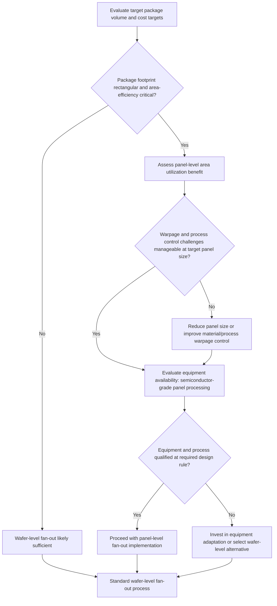

## Panel-Level Packaging Rationale and Rectangular-Panel Economics

### Overview

Panel-level packaging (PLP) extends fan-out wafer-level packaging concepts from circular semiconductor wafers (typically 200mm or 300mm) to larger, rectangular panel formats analogous to those used in the printed circuit board (PCB) and flat-panel display industries. The core rationale for this transition is area utilization and throughput economics: rectangular panels eliminate the geometric waste inherent in fitting rectangular die arrays onto a circular substrate, and larger panel formats amortize fixed per-panel process costs (handling, testing, material application) across substantially more package area per process cycle.

### The Geometric Waste Problem in Round-Wafer Fan-Out

**Key Points**

- Semiconductor wafers are circular, a shape optimized for the crystal growth and epitaxial processes used in front-end wafer fabrication, but package-level die and their reconstituted fan-out footprints are inherently rectangular.
- When rectangular reconstituted packages are arrayed onto a circular wafer format, substantial area near the wafer's circular edge is unusable for full package placement, since a full-size rectangular package footprint cannot be placed where it would extend beyond the circular boundary — this "edge exclusion" or unusable-area effect becomes proportionally significant as reconstituted wafer area is considered relative to a rectangular panel of similar total area.
- This geometric mismatch is the foundational economic argument for PLP: even without any change to unit process cost per unit area, simply changing the substrate shape from round to rectangular improves the fraction of total substrate area that can be populated with usable package footprints, directly increasing the number of good packages obtainable per unit of raw material and per process cycle.

### Panel Format Economics

**Key Points**

- Panel-level formats commonly draw on established rectangular panel sizes and handling infrastructure from the PCB and flat-panel display industries, allowing some leverage of existing equipment platforms, handling automation, and process know-how developed in those adjacent industries, rather than requiring entirely new equipment architectures developed from scratch for semiconductor packaging.
- Total panel area in common PLP formats substantially exceeds that of even 300mm wafers, meaning a single panel-level process cycle (mold, RDL lithography exposure, plating, etc.) can process a proportionally larger number of packages per cycle, directly improving throughput (packages per hour) for process steps whose cycle time does not scale linearly with substrate area (many batch process steps, such as cure ovens or batch plating, exhibit largely fixed cycle times regardless of substrate size within some given equipment envelope).
- [Inference] Specific throughput and cost-per-package improvement figures reported for panel-level versus wafer-level processing vary significantly by source, panel size, process step, and assumed process yield, and are generally presented as illustrative industry estimates rather than universally applicable figures; current quantitative comparisons should be sourced from up-to-date industry roadmap or supplier cost-modeling data for the specific format and process under consideration.

### Process Architecture Similarities to Wafer-Level Fan-Out

**Key Points**

- The fundamental process architecture of panel-level fan-out closely parallels wafer-level fan-out (eWLB, InFO, and similar): known-good die are placed onto a temporary carrier at panel scale, mold compound encapsulation forms a reconstituted panel, RDL layers are built up to route die pads to fan-out ball site locations, and UBM/ball attach and singulation complete the process.
- Both chip-first and chip-last (RDL-first) process architectures, as discussed in general fan-out WLP principles, apply equally to panel-level implementations, with the same yield-economics tradeoffs (RDL yield risk coupling to already-placed die in chip-first, versus pre-verified RDL in chip-last) scaling to the larger panel format.
- Because panel-level processing places substantially more die within a single reconstituted structure compared to wafer-level processing, the economic consequences of yield-limiting defects (a single problematic die, a localized RDL defect, or a warpage-related process excursion) can affect proportionally more finished packages per affected panel, making defect containment and in-line inspection arguably even more economically consequential at panel scale than at wafer scale.

### Distinct Process Challenges at Panel Scale

**Key Points**

- **Warpage magnitude**: As noted in prior discussion of die shift and warpage, warpage magnitude for a given material system tends to scale with the characteristic dimension of the structure being processed; larger rectangular panels are therefore generally more warpage-challenged than smaller circular wafers for equivalent material stacks, requiring correspondingly more attention to mold compound and dielectric material selection, symmetric layer stack-up design, and process temperature profile control to keep panel-level warpage within tool and downstream process tolerance.
- **Non-circular thermal and mechanical uniformity**: Rectangular panels present different thermal gradient and mechanical stress distribution patterns during processing (mold cure, RDL cure, reflow) compared to circular wafers, since corner and edge regions of a rectangular format experience different boundary conditions than the radially symmetric behavior typical of circular wafer processing; process equipment and thermal profile design must account for this non-radially-symmetric behavior.
- **Equipment adaptation**: While panel-level processing can leverage some PCB/display industry equipment heritage, semiconductor-level process control requirements (fine-line lithography resolution, cleanroom particulate control, metrology precision) generally exceed what standard PCB/display equipment was originally designed to achieve, requiring adapted or hybrid equipment platforms that combine large-format handling capability with semiconductor-grade process control — representing a significant equipment development and qualification investment for the industry.
- **Lithography field size and stitching**: Achieving fine-line RDL resolution across a full rectangular panel may require multiple lithography exposure fields (since a single exposure field/reticle size may not cover the entire panel), introducing field-to-field stitching accuracy as an additional consideration not present (or present differently) in single-field or wafer-stepper-based wafer-level processing. [Inference: the specific lithography approach (single large-field exposure, stepped/stitched multi-field exposure, or maskless direct-write) used for a given panel-level process is equipment- and process-generation-specific and continues to evolve; current approaches should be verified against specific process/equipment documentation.]

### Comparative Summary: Wafer-Level vs. Panel-Level Fan-Out

| Attribute | Wafer-Level Fan-Out (Round) | Panel-Level Fan-Out (Rectangular) |
| --- | --- | --- |
| Substrate shape | Circular (200mm, 300mm typical) | Rectangular, larger total area |
| Area utilization for rectangular packages | Reduced due to edge exclusion on circular format | Improved due to shape match to rectangular package footprints |
| Equipment heritage | Semiconductor wafer fab equipment | Blend of semiconductor and PCB/display panel equipment |
| Warpage challenge | Lower (smaller characteristic dimension) | Higher (larger characteristic dimension) |
| Thermal/mechanical uniformity | Radially symmetric behavior | Non-radially-symmetric, corner/edge-sensitive behavior |
| Throughput per process cycle | Lower (smaller total area per cycle) | Higher (larger total area per cycle, for cycle-time-fixed process steps) |
| Process maturity (as of general industry status) | More mature, longer production history | Growing adoption, still maturing relative to wafer-level fan-out |

### Rationale Summary: Why Panel-Level Packaging

**Key Points**

1. **Area utilization**: Eliminates circular-substrate geometric waste for inherently rectangular package footprints.
2. **Throughput scaling**: Larger total area per process cycle improves packages-per-hour for process steps with largely fixed cycle time independent of substrate area.
3. **Cost amortization**: Fixed per-substrate handling, testing, and processing costs are spread across a larger number of packages per panel, potentially improving cost-per-package economics at sufficient volume and yield.
4. **Equipment and infrastructure leverage**: Some ability to draw on established large-format panel handling and processing infrastructure from adjacent industries (PCB, display), though semiconductor-grade process control requirements necessitate significant equipment adaptation rather than direct equipment reuse.

**Key Points (Countervailing Considerations)**

1. **Warpage and process uniformity challenges** scale unfavorably with panel size, requiring material and process engineering investment to manage.
2. **Equipment development and qualification cost** for panel-scale, semiconductor-grade process control represents a substantial upfront investment relative to leveraging existing wafer-level equipment.
3. **Yield risk concentration**: more packages are put at risk per panel-level process excursion or defect event compared to a wafer-level equivalent, raising the economic stakes of in-line process control and defect containment.

### Illustration: Round Wafer vs. Rectangular Panel Area Utilization (svg_diagram)

<svg xmlns="http://www.w3.org/2000/svg" viewBox="0 0 700 380">
<text x="350" y="26" text-anchor="middle" font-size="17" font-weight="bold" fill="#1a1a1a">Area Utilization: Round Wafer vs. Rectangular Panel (svg_diagram)</text>

<text x="170" y="55" text-anchor="middle" font-size="13" font-weight="bold">Round Wafer (300mm)</text>

<circle cx="170" cy="190" r="130" fill="`#e8dcc8`" stroke="#333" stroke-width="1.5" />

<g fill="#8899aa" stroke="#333" stroke-width="0.75">
<rect x="90" y="110" width="40" height="40" />
<rect x="140" y="110" width="40" height="40" />
<rect x="190" y="110" width="40" height="40" />
<rect x="60" y="160" width="40" height="40" />
<rect x="110" y="160" width="40" height="40" />
<rect x="160" y="160" width="40" height="40" />
<rect x="210" y="160" width="40" height="40" />
<rect x="60" y="210" width="40" height="40" />
<rect x="110" y="210" width="40" height="40" />
<rect x="160" y="210" width="40" height="40" />
<rect x="210" y="210" width="40" height="40" />
<rect x="90" y="260" width="40" height="40" />
<rect x="140" y="260" width="40" height="40" />
<rect x="190" y="260" width="40" height="40" />
</g>
<text x="170" y="340" text-anchor="middle" font-size="10" fill="#c0392b">Edge exclusion: unusable crescent area near boundary</text>

<text x="530" y="55" text-anchor="middle" font-size="13" font-weight="bold">Rectangular Panel</text>

<rect x="400" y="70" width="260" height="240" fill="`#e8dcc8`" stroke="#333" stroke-width="1.5" />

<g fill="`#8899aa`" stroke="#333" stroke-width="0.75">

<rect x="410" y="80" width="40" height="40" />

<rect x="460" y="80" width="40" height="40" />

<rect x="510" y="80" width="40" height="40" />

<rect x="560" y="80" width="40" height="40" />

<rect x="610" y="80" width="40" height="40" />

<rect x="410" y="130" width="40" height="40" />

<rect x="460" y="130" width="40" height="40" />

<rect x="510" y="130" width="40" height="40" />

<rect x="560" y="130" width="40" height="40" />

<rect x="610" y="130" width="40" height="40" />

<rect x="410" y="180" width="40" height="40" />

<rect x="460" y="180" width="40" height="40" />

<rect x="510" y="180" width="40" height="40" />

<rect x="560" y="180" width="40" height="40" />

<rect x="610" y="180" width="40" height="40" />

<rect x="410" y="230" width="40" height="40" />

<rect x="460" y="230" width="40" height="40" />

<rect x="510" y="230" width="40" height="40" />

<rect x="560" y="230" width="40" height="40" />

<rect x="610" y="230" width="40" height="40" />

</g>

<text x="530" y="340" text-anchor="middle" font-size="10" fill="`#1e8449`">Full grid utilization: minimal unusable edge area</text>

</svg>

### Illustration: Panel-Level Adoption Decision Flow

### Next Steps

**Related Topics**

- Fan-Out Wafer-Level Packaging Principles (process architecture shared with panel-level implementations)
- eWLB and InFO Process Flows (wafer-level implementations that inform panel-level scaling)
- Die Shift, Warpage, and Known-Good-Die Placement Accuracy (amplified challenges at panel scale)
- Redistribution Layer Design and Fabrication (lithography field size and stitching considerations)
- Equipment Platforms for Large-Format Semiconductor-Grade Panel Processing
- Cost Modeling Methodologies for Panel-Level versus Wafer-Level Packaging Economics
- Mold Compound Formulation for Large-Format Warpage Mitigation