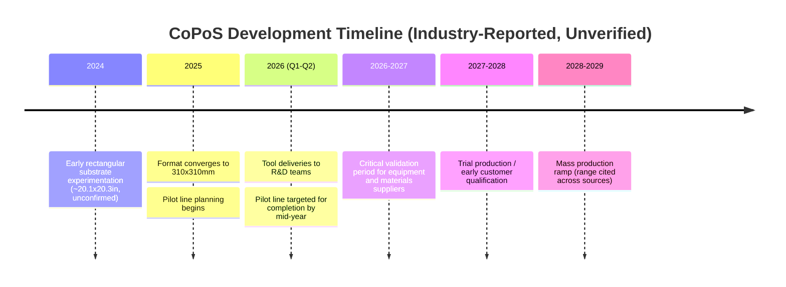
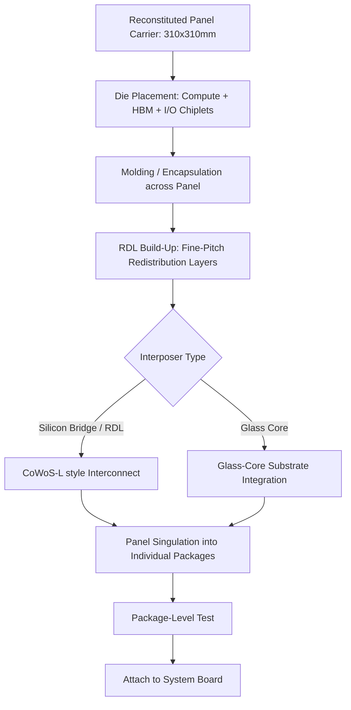

## TSMC CoPoS and Emerging Panel-Based Packaging Platforms

### Overview

**Key Points**

- CoPoS (Chip-on-Panel-on-Substrate) is TSMC's next-generation advanced packaging platform, positioned as the successor to its wafer-based CoWoS (Chip-on-Wafer-on-Substrate) family
- The core innovation is a shift from round 300mm wafers to large rectangular/square panels as the carrier substrate during packaging assembly
- This shift is part of a broader industry transition toward Fan-Out Panel-Level Packaging (FOPLP), driven by the need to accommodate increasingly large AI accelerator packages that already exceed single-reticle and even multi-reticle wafer utilization limits
- CoPoS is being developed alongside, and is expected to eventually incorporate, glass-core substrate technology

[Unverified] This is a fast-evolving, pre-mass-production technology as of the source material reviewed. Specific dimensions, timelines, and process details are drawn from industry trade press (DigiTimes, TrendForce, Commercial Times, and others) and unconfirmed by official TSMC technical disclosures; figures should be treated as best-available industry reporting rather than confirmed specifications, and are subject to revision as TSMC's roadmap matures.

---

### Why Panels: The Economic and Physical Driver

**Key Points**

- Modern AI accelerator packages (GPU/HBM stacks) have grown so large that they now consume a disproportionate share of a round 300mm wafer, with substantial area lost to the wafer's curved edge
- Reports indicate a standard 12-inch wafer can accommodate as few as 7, or in some cases as few as 4, units for the largest current-generation reticle-exceeding GPU packages [TrendForce](https://www.trendforce.com/news/2026/04/13/news-tsmc-advances-panel-level-packaging-copos-pilot-line-reportedly-set-for-june-completion-2028-29-ramp-eyed/)
- Earlier generational comparisons cited that only 16 B200 chipsets could be placed on a round 12-inch silicon wafer, compared to 29 H100 or H200 chipsets, illustrating the accelerating area pressure per generation [all-about-industries](https://www.all-about-industries.com/panel-level-packaging-at-tsmc-first-copos-pilot-line-2026-mass-production-from-2029-a-46222908685203d0c28cea97fcf7557c/)
- Rectangular/square panels eliminate the wasted curved-edge area almost entirely, since the panel geometry can be tiled with minimal loss regardless of die/package size

**Comparative area utilization:**

| Substrate Format | Shape | Typical Dimensions | Edge Waste |
| --- | --- | --- | --- |
| Standard wafer (CoWoS) | Circular | 300mm diameter | High (curved edge) |
| CoPoS panel (TSMC) | Square | 310mm × 310mm | Minimal |
| Alternative panel formats (industry) | Rectangular | 510×515mm, 600×600mm | Minimal |

TSMC's CoPoS panels are reported to offer more than five times the usable area compared to a standard CoWoS wafer cut, enabling integration of additional high-bandwidth memory stacks, multiple I/O chiplets and compute dies in a single package. [TechPowerUp](https://www.techpowerup.com/337960/tsmc-prepares-copos-next-gen-310-x-310-mm-packages)[TechPowerUp](https://www.techpowerup.com/337960/tsmc-prepares-copos-next-gen-310-x-310-mm-packages)

---

### CoPoS Technical Architecture

**Key Points**

- CoPoS is described as an evolution of TSMC's existing CoWoS-L (silicon-bridge/RDL interposer variant used by Nvidia and AMD) and CoWoS-R (RDL-interposer variant used by Broadcom) architectures, adapted to panel-format processing rather than wafer-format
- The naming convention "Chip-on-Panel-on-Substrate" mirrors "Chip-on-Wafer-on-Substrate," reflecting the same three-tier integration logic (die → interposer/RDL layer → package substrate) but executed at panel scale
- TSMC has reportedly standardized on a 310mm × 310mm panel format, distinct from other panel sizes explored elsewhere in the industry (e.g., 510×515mm, 600×600mm)
- [Unverified] Earlier unconfirmed reports (circa 2024) referenced experimentation with a substantially larger rectangular format around 20.1 × 20.3 inches before the industry converged toward the more compact 310×310mm specification

**Reported CoPoS panel specification:**

| Parameter | Value |
| --- | --- |
| Panel format | Square |
| Dimensions | 310mm × 310mm (~12.2 × 12.2 in) |
| Predecessor CoWoS wafer cut | ≤120mm × 150mm |
| Area increase vs. CoWoS cut | ~5× |
| Reported first customer | Nvidia [Unverified] |
| Related in-package technologies | SoIC (3D die stacking), WMCM (Wafer-Level Multi-Chip Module) |

---

### Roadmap and Timeline

**Key Points**

- Timeline estimates have varied across reporting cycles as the program has matured, reflecting the fluid nature of an in-development platform
- Multiple 2026-era reports converge on a pilot line established in 2026 (with tool deliveries reportedly beginning in February 2026), with mass production targeted for the 2028–2029 window
- One TrendForce report specifically cited pilot production targeted for 2027 and mass production slated for the second half of 2028 [TrendForce](https://www.trendforce.com/presscenter/news/20260617-13107.html)
- Other reporting cites a mass-production floor closer to 2029

**Reported milestone progression:**

[Inference] The spread in reported dates (2027 pilot vs. mid-2026 pilot; 2028 vs. 2029 mass production) likely reflects both the rapid pace of program acceleration and differing definitions of "pilot line completion" versus "trial production" across sources, rather than contradictory facts.

Reported candidate manufacturing sites include TSMC's Chiayi facility, potentially integrating CoPoS alongside SoIC and WMCM capabilities, along with reported plans to convert existing 8-inch fabs in Taiwan into advanced packaging facilities. [Unverified] [TrendForce](https://www.trendforce.com/news/2026/04/13/news-tsmc-advances-panel-level-packaging-copos-pilot-line-reportedly-set-for-june-completion-2028-29-ramp-eyed/)

---

### Industry Context: The Broader FOPLP Movement

**Key Points**

- CoPoS is TSMC's specific implementation within a much wider industry shift toward Fan-Out Panel-Level Packaging (FOPLP), which extends the fan-out principles of FOWLP (Fan-Out Wafer-Level Packaging) to panel-scale substrates
- FOWLP itself was established as foundational architecture by STMicroelectronics in 2010 and has been in volume production for applications such as wireless basebands before expanding into automotive and medical use cases [PatSnap](https://www.patsnap.com/resources/blog/rd-blog/fan-out-wafer-panel-level-packaging-2026-patsnap-eureka/)
- FOPLP adapts manufacturing formats and equipment concepts from adjacent panel-based industries — printed circuit board (PCB), LCD display, and solar panel manufacturing — rather than starting from semiconductor wafer tooling alone
- A key current constraint is that no higher-end semiconductor packaging tools currently enable front-end-like processing on panels, meaning PLP for AI/HPC-class packages remains in active development rather than production readiness across the industry [Tom's Hardware](https://www.tomshardware.com/tech-industry/semiconductors/rapidus-explores-panel-level-packaging-on-glass-substrates-for-next-generation-processors-aggressive-plan-would-help-it-leapfrog-rivals)

**Other major players pursuing panel-level and adjacent glass-substrate platforms:**

| Company | Platform / Approach | Status (as reported) |
| --- | --- | --- |
| TSMC | CoPoS (310×310mm), glass-core evaluation | Pilot line 2026; MP 2028–2029 |
| Intel | EMIB + glass-core substrate ("Thick Core") | Sample shown at NEPCON Japan 2026; glass substrate on roadmap since 2023 |
| Samsung | FOPLP / glass substrate development | In development |
| Rapidus | Panel-level packaging on glass substrates | Exploratory, targeting leapfrog positioning |
| Absolics (SKC subsidiary) | Glass substrate high-volume facility (Georgia, US) | Facility completed; targeting AMD/AWS contracts by end of 2026 |

[Unverified] Cross-company comparisons are based on trade press reporting current as of mid-2026 and may not reflect each company's most recent internal roadmap disclosures.

---

### Glass-Core Substrates as a Convergent Technology

**Key Points**

- Both TSMC's CoPoS and Intel's EMIB-based panel efforts are converging on glass as a core substrate material, intended to eventually complement or replace silicon interposers and organic substrates for the largest AI packages
- Glass substrates offer superior flatness and better thermal/mechanical stability, which supports finer redistribution layer (RDL) pitches and reduces warpage at large panel sizes compared to organic materials
- Intel's reported "Thick Core" glass substrate sample paired with EMIB measured 78 × 77mm and supported roughly twice the silicon reticle size, translating to about 1,716 mm² of silicon area, built as a 10-2-10 thick glass-core substrate configuration with 10 build-up redistribution layers on the top side for fine-pitch fan-out routing [[News] Intel Reportedly Presents First Thick-Core Glass Substrate with EMIB, Targeting AI Data Centers +2](https://www.trendforce.com/news/2026/01/26/news-intel-reportedly-presents-first-thick-core-glass-substrate-with-emib-targeting-ai-data-centers/)
- [Unverified] TSMC's own glass-core integration timeline for CoPoS is reported to trail the initial organic-panel CoPoS ramp, with commercial-scale glass substrate production from TSMC not anticipated before 2030 per at least one TrendForce assessment

---

### Market Sizing and Adoption Drivers

**Key Points**

- The FOPLP and glass substrate market is forecast to expand from approximately $650 million (2024) to more than $8.1 billion by 2030, according to Counterpoint Research figures cited in industry reporting
- AI and HPC applications are projected to represent the majority share of this growth, cited at approximately 45.6% of total market value
- A separate Counterpoint/DSCC report cites a narrower FOPLP-plus-glass-substrate-packaging segment growing at a 29% CAGR to $2.9B [Counterpoint](https://counterpointresearch.com/en/insights/dsccs-foplp-and-glass-substrate-packaging-report-reveals-significant-growth-opportunities)

[Inference] The differing total addressable market figures across cited reports ($8.1B vs. $2.9B by comparable end-dates) likely reflect differing scope definitions (e.g., whether glass substrate packaging for display/other markets is included) rather than conflicting market assessments.

---

### Key Technical and Manufacturing Challenges

**Key Points**

- **Warpage control** — Larger panel formats are inherently more susceptible to thermally induced warpage during mold, cure, and RDL build-up steps than smaller wafer-format substrates, requiring new process controls and possibly new mold compound formulations
- **Placement precision** — Production and handling of rectangular panels require high precision, especially in the placement and connection of chips, since panel-scale die-placement equipment must maintain wafer-scale accuracy across a much larger working area [all-about-industries](https://www.all-about-industries.com/panel-level-packaging-at-tsmc-first-copos-pilot-line-2026-mass-production-from-2029-a-46222908685203d0c28cea97fcf7557c/)
- **Format standardization** — As of the most recent reporting, CoPoS panel dimensions are not yet unified across the industry: while TSMC's proprietary format is 310mm × 310mm, other customers are using different panel sizes, creating supply-chain fragmentation that must be resolved for broad multi-customer adoption [Investing.com](https://www.investing.com/news/stock-market-news/tsmc-targets-2029-for-panellevel-copos-packaging-in-ai-chip-push--digitimes-4768582)
- **Tooling maturity** — Existing semiconductor back-end equipment is largely wafer-format-native; panel-scale processing requires either newly developed semiconductor-grade panel tools or adapted PCB/display-industry equipment validated to semiconductor tolerances
- **Supply chain secrecy** — TSMC has reportedly imposed strict non-disclosure and exclusive-supply clauses on CoPoS equipment makers, materials providers, and key component suppliers, slowing the pace of open industry information and standardization relative to prior CoWoS generations [Investing.com](https://www.investing.com/news/stock-market-news/tsmc-targets-2029-for-panellevel-copos-packaging-in-ai-chip-push--digitimes-4768582)

---

### Conceptual Process Flow: CoPoS Assembly (Generalized)

[Inference] This flow is a generalized synthesis based on standard FOPLP/FOWLP process logic combined with reported CoPoS characteristics; it does not represent a confirmed TSMC process disclosure, as TSMC has not published detailed CoPoS process flow documentation publicly as of the sources reviewed.

---

### Relationship to Heterogeneous Integration Strategy

**Key Points**

- CoPoS directly extends the same More-than-Moore/heterogeneous-integration logic underlying CoWoS: combining multiple dies (compute, memory, I/O) manufactured at different or identical process nodes within a single package
- The panel format specifically addresses a scaling bottleneck of the *packaging* tier itself — as reticle-exceeding designs (e.g., next-generation GPUs reported at roughly 5.5x reticle size) outgrow what a circular wafer can economically host, panelization becomes necessary to sustain continued package-level integration density [TrendForce](https://www.trendforce.com/news/2026/04/13/news-tsmc-advances-panel-level-packaging-copos-pilot-line-reportedly-set-for-june-completion-2028-29-ramp-eyed/)
- This reflects the broader industry pattern of packaging technology co-evolving with chip design scale, rather than packaging being a fixed, mature back-end step

---

**Related Topics / Next Steps**

- CoWoS Family Deep Dive (CoWoS-S, CoWoS-L, CoWoS-R)
- Fan-Out Wafer-Level Packaging (FOWLP) Fundamentals
- Glass-Core Substrate Materials and Fabrication
- Intel EMIB and Foveros Architecture Comparison
- Warpage Control Techniques in Large-Format Panel Processing
- Redistribution Layer (RDL) Fine-Pitch Scaling Limits
- TSMC SoIC (System on Integrated Chips) 3D Stacking Roadmap
- Reticle-Limit Chiplet Partitioning Strategies for AI Accelerators
- Supply Chain and Equipment Ecosystem for Panel-Level Processing (PCB/LCD-Derived Tooling)