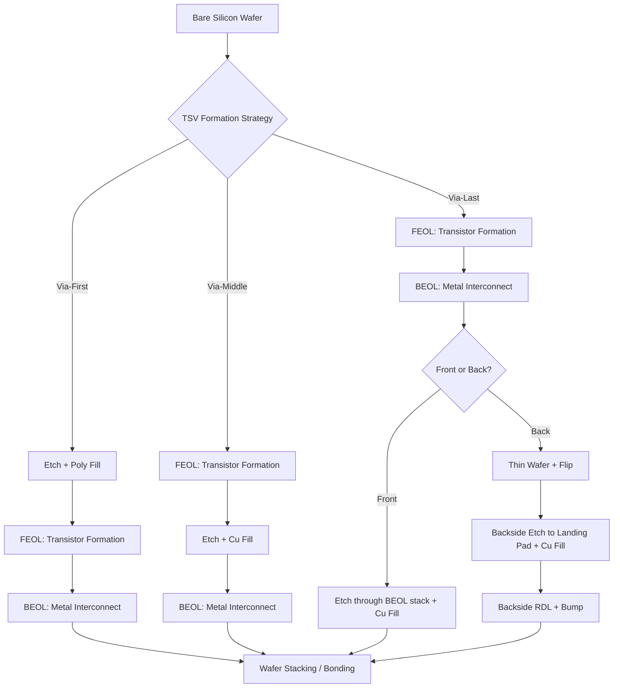

## TSV Formation Approaches: Via-First, Via-Middle, and Via-Last

### Overview

Through-Silicon Via (TSV) formation approach refers to the point in the semiconductor fabrication flow — relative to front-end-of-line (FEOL) transistor processing and back-end-of-line (BEOL) interconnect metallization — at which the via hole is etched and filled with conductive material. This sequencing decision is one of the most consequential architectural choices in 3D IC integration, as it determines thermal budget constraints, achievable via dimensions, keep-out zone (KOZ) requirements, foundry vs. OSAT ownership boundaries, and ultimately the electrical and mechanical performance of the final stacked die.

The three approaches are distinguished by where TSV fabrication is inserted:

- **Via-first**: TSV formed before FEOL transistor fabrication
- **Via-middle**: TSV formed after FEOL, before/during BEOL
- **Via-last**: TSV formed after BEOL is complete (from front or back side)

### Via-First TSV

#### Process Sequence

TSVs are etched and filled into the bare or lightly processed silicon substrate **before** transistors are built.

1. Bare silicon wafer received
2. Deep via etch (typically Bosch process, DRIE)
3. Liner deposition (SiO2 insulator)
4. Barrier/seed deposition
5. Via fill (typically polysilicon or doped poly, since copper cannot survive subsequent high-temperature anneals)
6. CMP planarization
7. Standard FEOL transistor fabrication proceeds on top

#### Key Characteristics

- **Fill material constraint**: Because the via is exposed to FEOL thermal budgets (source/drain anneals, well drives, often >1000°C), copper is generally unusable due to melting point margin and copper diffusion into silicon degrading transistor characteristics. **Doped polysilicon** is the dominant fill material, which carries higher electrical resistivity than copper.
- **Thermal compatibility**: Fully compatible with all subsequent thermal steps since the via is formed first.
- **Ownership**: Typically performed by the foundry as an integrated part of the front-end wafer process, since it precedes transistor formation entirely.
- **Aspect ratio**: Can support very deep, high-aspect-ratio vias since there is no pre-existing metallization or transistor structure to protect from etch damage.

#### Trade-offs

- **[Inference]** Higher resistivity from polysilicon fill makes via-first less attractive for high-current or high-speed signal paths compared to copper-filled alternatives; this is a widely cited industry rationale though exact resistivity penalties are process-node dependent.
- Design flexibility is reduced because the via placement and diameter are locked in before device design finalization in some flows.
- Limited by the fact this couples TSV formation tightly to the foundry's core transistor process, raising integration risk and reducing OSAT/assembly-house involvement options.

### Via-Middle TSV

#### Process Sequence

TSVs are etched and filled **after FEOL transistor formation but before or during BEOL metal interconnect layers.**

1. FEOL complete (transistors formed)
2. Deep via etch through the remaining silicon, stopping short of or into the pre-metal dielectric (PMD)
3. Liner (SiO2) deposition for electrical isolation from silicon
4. Barrier/seed layer (Ta/TaN, Cu seed)
5. **Copper** electroplating fill (thermal budget after this point is now BEOL-compatible, i.e., generally lower than FEOL, permitting Cu)
6. CMP
7. BEOL metal stack (M1 through top metal) processing continues, connecting to the TSV

#### Key Characteristics

- **Fill material**: **Copper** is standard, since via-middle formation occurs after the highest-temperature FEOL anneals, and BEOL thermal budgets (typically <400-450°C) are compatible with copper's properties.
- **Foundry-centric**: This is the most common approach used by leading foundries (e.g., TSMC, GlobalFoundries, Intel foundry flows) for high-performance 3D-IC and 2.5D interposer applications because it balances process control (still inside the foundry line) with copper's superior conductivity.
- **Electrical performance**: Lower resistance and better signal integrity than via-first polysilicon-filled vias, making it preferred for high-speed digital interconnect (e.g., HBM-to-logic interposer connections, chiplet-to-chiplet signaling).
- **Keep-out zone (KOZ)**: A design exclusion zone is required around each TSV due to thermo-mechanical stress (copper's coefficient of thermal expansion (CTE) mismatch with silicon induces localized stress that can affect nearby transistor mobility). KOZ dimensions are a standard input to TSV-aware place-and-route flows.

#### Trade-offs

- Requires tight integration between the foundry's FEOL and BEOL process modules, since TSV etch and fill are inserted mid-flow — increasing foundry process complexity and qualification effort.
- **[Inference]** The KOZ requirement consumes usable silicon area around each via, which becomes a layout density constraint as via pitch scales down; exact KOZ radii vary by node and via geometry and are typically proprietary to each foundry.
- Aspect ratio is somewhat constrained relative to via-first since it must integrate cleanly with existing FEOL structures without damaging nearby active devices during etch.

### Via-Last TSV

#### Process Sequence

TSVs are etched and filled **after full FEOL and BEOL processing is complete** — i.e., after all transistor layers and all metal interconnect layers exist. Via-last is further split into two sub-variants:

**Via-last from the front side:**

1. Full wafer (FEOL + BEOL) complete
2. Via etched from the top, through BEOL dielectric stack and silicon, typically landing on a backside pad or another die's bond pad
3. Liner, barrier/seed, Cu fill, CMP

**Via-last from the backside (most common in practice):**

1. Full wafer (FEOL + BEOL) complete
2. Wafer bonded to a carrier and flipped
3. Backgrinding/thinning of the silicon substrate to the target thickness (often down to tens of microns)
4. Via etched from the backside, stopping on and exposing the BEOL's lowest metal layer or a dedicated via-landing pad
5. Liner, barrier/seed, Cu fill, CMP
6. Backside redistribution layer (RDL) and bump formation

#### Key Characteristics

- **Fill material**: Copper, since via-last occurs entirely after all high-temperature steps.
- **Ownership**: Frequently performed by an OSAT (Outsourced Semiconductor Assembly and Test) provider or a specialized interposer/packaging house rather than the wafer foundry, since it operates on finished wafers and is closer to packaging/assembly than front-end fabrication.
- **Design decoupling**: Because via-last is applied to an already-designed and manufactured die, it allows TSV integration to be added onto existing chip designs (including designs not originally intended for 3D stacking), which is attractive for retrofitting legacy die into 3D-IC or interposer-based systems.
- **Alignment to metal stack**: Precise backside alignment to the existing BEOL landing pads is critical and represents a key process control challenge, since there is no forward visibility into buried structures during backside etch — this typically relies on infrared alignment or pre-registered fiducials.

#### Trade-offs

- **Aspect ratio and via diameter** tend to be less aggressive than via-first because the etch must land accurately on existing (already fixed) metal pads without damaging surrounding BEOL dielectric.
- Wafer thinning to expose the via from the backside introduces significant handling risk (warpage, cracking) and requires temporary bonding to a carrier wafer.
- **[Inference]** Because via-last is typically an OSAT-level process performed on finished die, it generally offers less influence over die-level KOZ and interconnect co-design compared to via-middle, though exact division of design responsibility varies by business model and foundry-OSAT partnership structure.

### Comparative Summary

| Attribute | Via-First | Via-Middle | Via-Last |
| --- | --- | --- | --- |
| Formation timing | Before FEOL | After FEOL, before/during BEOL | After full FEOL+BEOL |
| Typical fill material | Doped polysilicon | Copper | Copper |
| Typical owner | Foundry (front-end) | Foundry (front-end) | OSAT / packaging house |
| Thermal budget exposure | Full FEOL (>1000°C) | BEOL only (<450°C) | None (post-process) |
| Electrical resistance | Higher (poly) | Low (Cu) | Low (Cu) |
| Design flexibility | Low (locked pre-design) | Medium | High (retrofittable) |
| Common application | Early research, foundry-integrated 3D-IC | High-performance 2.5D/3D-IC (HBM, chiplets) | Interposers, legacy die stacking, wafer-level packaging |

### Process Flow Comparison (svg_diagram)

<svg xmlns="http://www.w3.org/2000/svg" viewBox="0 0 900 480">
<text x="450" y="30" text-anchor="middle" font-size="18" font-weight="bold" fill="#1a1a1a">TSV Formation Timing Relative to FEOL/BEOL (svg_diagram)</text>

<text x="20" y="90" font-size="14" font-weight="bold" fill="`#0b5394`">Via-First</text>

<rect x="150" y="65" width="100" height="40" fill="`#c9daf8`" stroke="`#0b5394`" />

<text x="200" y="89" text-anchor="middle" font-size="12">TSV Etch+Fill</text>

<rect x="260" y="65" width="150" height="40" fill="`#d9d2e9`" stroke="`#674ea7`" />

<text x="335" y="89" text-anchor="middle" font-size="12">FEOL (transistors)</text>

<rect x="420" y="65" width="150" height="40" fill="`#fce5cd`" stroke="`#b45f06`" />

<text x="495" y="89" text-anchor="middle" font-size="12">BEOL (metal stack)</text>

<text x="20" y="190" font-size="14" font-weight="bold" fill="`#0b5394`">Via-Middle</text>

<rect x="150" y="165" width="150" height="40" fill="`#d9d2e9`" stroke="`#674ea7`" />

<text x="225" y="189" text-anchor="middle" font-size="12">FEOL (transistors)</text>

<rect x="310" y="165" width="100" height="40" fill="`#c9daf8`" stroke="`#0b5394`" />

<text x="360" y="189" text-anchor="middle" font-size="12">TSV Etch+Fill</text>

<rect x="420" y="165" width="150" height="40" fill="`#fce5cd`" stroke="`#b45f06`" />

<text x="495" y="189" text-anchor="middle" font-size="12">BEOL (metal stack)</text>

<text x="20" y="290" font-size="14" font-weight="bold" fill="`#0b5394`">Via-Last (Front)</text>

<rect x="150" y="265" width="150" height="40" fill="`#d9d2e9`" stroke="`#674ea7`" />

<text x="225" y="289" text-anchor="middle" font-size="12">FEOL (transistors)</text>

<rect x="310" y="265" width="150" height="40" fill="`#fce5cd`" stroke="`#b45f06`" />

<text x="385" y="289" text-anchor="middle" font-size="12">BEOL (metal stack)</text>

<rect x="470" y="265" width="100" height="40" fill="`#c9daf8`" stroke="`#0b5394`" />

<text x="520" y="289" text-anchor="middle" font-size="12">TSV Etch+Fill</text>

<text x="20" y="390" font-size="14" font-weight="bold" fill="`#0b5394`">Via-Last (Back)</text>

<rect x="150" y="365" width="150" height="40" fill="`#d9d2e9`" stroke="`#674ea7`" />

<text x="225" y="389" text-anchor="middle" font-size="12">FEOL (transistors)</text>

<rect x="310" y="365" width="150" height="40" fill="`#fce5cd`" stroke="`#b45f06`" />

<text x="385" y="389" text-anchor="middle" font-size="12">BEOL (metal stack)</text>

<rect x="470" y="365" width="80" height="40" fill="`#d9ead3`" stroke="`#38761d`" />

<text x="510" y="389" text-anchor="middle" font-size="11">Thin+Flip</text>

<rect x="560" y="365" width="100" height="40" fill="`#c9daf8`" stroke="`#0b5394`" />

<text x="610" y="389" text-anchor="middle" font-size="12">Backside TSV</text>

<text x="450" y="450" text-anchor="middle" font-size="12" fill="#666">Left to right = process time progression</text>

</svg>

### Design and Process Interaction Flow

### Selection Criteria in Practice

- **Choose via-first** for research contexts or specialized flows where extreme aspect ratio and full thermal-budget compatibility outweigh the resistance penalty of polysilicon fill.
- **Choose via-middle** for high-performance 2.5D/3D-IC products (e.g., HBM stacks, chiplet interposers) requiring copper's low resistance while remaining within a single foundry's process ownership.
- **Choose via-last** when retrofitting an existing die design for stacking, when OSAT-level integration is preferred over foundry-level integration, or for wafer-level packaging and fan-out applications where post-fab flexibility matters more than achievable via aspect ratio.

**Related Topics**

- TSV liner and barrier deposition (SiO2 isolation, Ta/TaN diffusion barriers)
- Copper electroplating and via fill defect mechanisms (voiding, seams)
- Wafer thinning and temporary bonding/debonding for backside via-last processing
- TSV-induced keep-out zone (KOZ) modeling and stress-aware place-and-route
- TSV electrical modeling (RC parasitics, coupling, signal integrity in dense via arrays)
- Wafer-to-wafer vs. die-to-wafer bonding integration with each TSV approach
- Redistribution layer (RDL) design for via-last backside connections