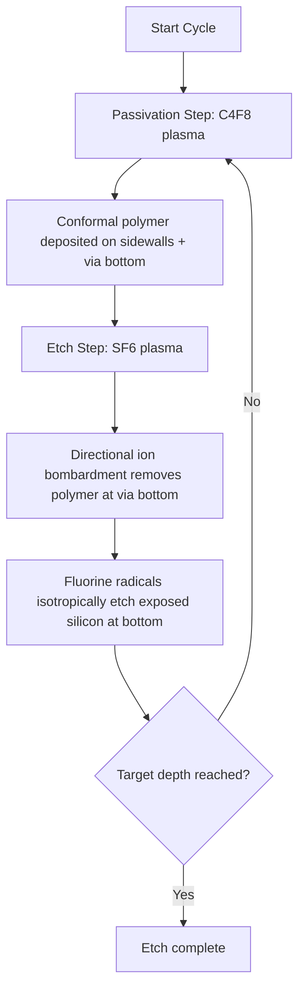

## Deep Reactive Ion Etching and the Bosch Process for TSV

### Overview

Deep Reactive Ion Etching (DRIE) is the dominant plasma etching technique used to form the high-aspect-ratio vertical holes required for Through-Silicon Vias (TSVs). Unlike conventional reactive ion etching optimized for shallow, planar features in transistor fabrication, DRIE must achieve etch depths of tens to hundreds of microns while maintaining near-vertical sidewalls and controlled diameters, typically in the 1–50 µm range with aspect ratios (depth:diameter) commonly between 5:1 and 20:1, sometimes higher. The **Bosch process** (named after Robert Bosch GmbH, which patented it) is the specific time-multiplexed DRIE technique that made practical, manufacturable TSV etching possible.

### Why Standard RIE Is Insufficient

Conventional RIE etches silicon using a continuous mixture of etchant and passivation chemistry, which works well for shallow features but suffers from severe limitations at TSV-relevant depths:

- **Sidewall bowing**: Ion-enhanced etching combined with lateral chemical attack causes the via profile to widen partway down, then narrow again, producing a barrel-shaped or "bowed" sidewall.
- **Aspect ratio dependent etching (ARDE)**: Etch rate drops as the via gets deeper because reactive species and ion flux have increasingly restricted access to the via bottom, and etch byproducts have difficulty escaping — narrower/deeper features etch slower than wider/shallower ones on the same wafer.
- **Insufficient sidewall protection**: Without a separate passivation step, achieving vertical (90°) sidewalls at high aspect ratio is not reliably achievable with a single continuous chemistry.

These limitations make continuous-mode RIE impractical for TSV geometries, which is why the industry converged on the cyclic Bosch approach.

### The Bosch Process: Core Mechanism

The Bosch process solves the sidewall control problem by **time-multiplexing** two chemically distinct plasma steps in rapid alternation, rather than running etch and passivation chemistries simultaneously.

#### Step 1: Etch Cycle (Isotropic Silicon Etch)

- Gas: Sulfur hexafluoride ($SF_6$) plasma
- $SF_6$ dissociates into reactive fluorine radicals that isotropically etch exposed silicon at the via bottom
- Duration: typically a few seconds
- This step etches silicon in **all directions** including laterally, which is why it must be tightly time-limited

#### Step 2: Passivation Cycle (Sidewall Protection)

- Gas: Octafluorocyclobutane ($C_4F_8$)
- $C_4F_8$ plasma deposits a thin, chemically inert fluorocarbon polymer film (similar in nature to PTFE/Teflon) conformally across all exposed surfaces — sidewalls and via bottom alike
- Duration: typically a few seconds
- This polymer layer protects the sidewalls from lateral attack during the next etch cycle

#### Step 3: Cycle Repetition

- The two steps alternate continuously (etch → passivate → etch → passivate...)
- On each etch cycle, directional ion bombardment (accelerated by the plasma's electric field) preferentially strikes and removes the passivation layer **at the via bottom** (where ions arrive nearly normal to the surface) while leaving the **sidewall passivation largely intact** (where ions arrive at a grazing angle and cannot effectively remove the polymer)
- This directional removal is what converts an inherently isotropic chemical etch into a net anisotropic (vertical) etch profile
- Cycle counts for deep TSVs can run from dozens to several hundred, depending on target depth and per-cycle etch increment

### Scalloping: The Bosch Process Signature Artifact

Because etching and passivation are discrete, alternating steps rather than a continuous process, the Bosch process produces a characteristic sidewall texture called **scalloping**: a series of small, periodic horizontal ridges or undulations along the via wall, with each scallop corresponding to one etch cycle's lateral etch increment before the next passivation step arrests it.

- Typical scallop depth: on the order of tens to a few hundred nanometers, depending on per-cycle etch time and gas flow parameters
- **[Inference]** Scallop size generally scales with etch-step duration — shorter etch pulses produce finer scallops at the cost of lower net etch rate, a trade-off that is standard practice for process tuning though optimal parameters are tool- and recipe-specific.
- Scalloping has downstream implications for TSV reliability: the liner (SiO2 insulator) and barrier/seed layers deposited afterward must conformally coat this rough topography, and scallop-induced stress concentration points can become sites for liner cracking or seed-layer discontinuity under thermal cycling.
- Post-etch smoothing treatments (e.g., a brief isotropic $SF_6$-only "smoothing" step, or subsequent thermal oxidation of the sidewall) are common in production to reduce scallop severity before liner deposition.

### Etch Rate, Aspect Ratio Dependence, and ARDE in Bosch Processing

Even with Bosch cycling, aspect-ratio-dependent etching (ARDE) still occurs, though to a lesser degree than in continuous RIE:

- As via depth increases, both reactant transport to the via bottom and byproduct removal from the via bottom become diffusion-limited through the narrow, high-aspect-ratio channel
- This causes etch rate to decrease as the via deepens, and causes **wider vias on the same wafer to etch faster and deeper than narrower vias** given identical cycle counts — a critical consideration when a design mixes multiple TSV diameters
- **[Inference]** Foundries commonly compensate for ARDE through recipe stepping (varying cycle parameters partway through the etch) or by grouping same-diameter vias into separate process zones, though specific compensation strategies are proprietary to each process integration house.

### Key Process Parameters

| Parameter | Typical Role |
| --- | --- |
| $SF_6$ flow rate | Controls etch rate and radical density |
| $C_4F_8$ flow rate | Controls passivation film thickness/robustness |
| Etch step duration | Controls scallop depth and net etch rate |
| Passivation step duration | Controls sidewall protection robustness |
| RF source power | Controls plasma density (radical generation) |
| RF bias power | Controls ion bombardment energy/directionality at via bottom |
| Chamber pressure | Affects radical/ion mean free path and etch profile |
| Wafer/chuck temperature | Affects polymer deposition rate and etch selectivity |

### Etch Mask Considerations

The mask defining the via opening must survive the entire multi-cycle process, since total process time for deep TSVs can extend to tens of minutes to hours:

- **Photoresist** masks are common for shallower/smaller-diameter vias but have limited selectivity (etch resistance relative to silicon) for very deep etches
- **Hard masks** — typically silicon oxide or silicon nitride deposited and patterned before etch — are used for higher-aspect-ratio, deeper TSVs due to their substantially higher $SF_6$-plasma selectivity compared to photoresist
- **[Inference]** Selectivity requirements scale directly with target via depth, so via-first and via-middle deep TSV processes (often 50–150 µm deep) more frequently rely on hard masks than shallower via-last backside etches, though exact mask choice is recipe- and equipment-vendor-dependent.

### DRIE Bosch Process Cross-Section (svg_diagram)

<svg xmlns="http://www.w3.org/2000/svg" viewBox="0 0 700 420">
<text x="350" y="30" text-anchor="middle" font-size="16" font-weight="bold" fill="#1a1a1a">Bosch Process: Scalloped Sidewall Formation (svg_diagram)</text>

<rect x="100" y="60" width="500" height="300" fill="#e8e8e8" stroke="#666" stroke-width="1" />
<text x="350" y="50" text-anchor="middle" font-size="12" fill="#666">Silicon Substrate</text>

<path d="M 300 60 L 300 90 L 290 95 L 300 100 L 290 105 L 300 110 L 290 115 L 300 120 L 290 125 L 300 130 L 290 135 L 300 140 L 290 145 L 300 150 L 290 155 L 300 160 L 290 165 L 300 170 L 290 175 L 300 180 L 290 185 L 300 190 L 290 195 L 300 200 L 290 205 L 300 210 L 290 215 L 300 220 L 290 225 L 300 230 L 290 235 L 300 240 L 290 245 L 300 250 L 290 255 L 300 260 L 290 265 L 300 270 L 290 275 L 300 280 L 290 285 L 300 290 L 290 295 L 300 300 L 290 305 L 300 310 L 290 315 L 300 320 L 290 325 L 300 330 L 300 340" fill="none" stroke="#333" stroke-width="1.5" />

<path d="M 400 60 L 400 90 L 410 95 L 400 100 L 410 105 L 400 110 L 410 115 L 400 120 L 410 125 L 400 130 L 410 135 L 400 140 L 410 145 L 400 150 L 410 155 L 400 160 L 410 165 L 400 170 L 410 175 L 400 180 L 410 185 L 400 190 L 410 195 L 400 200 L 410 205 L 400 210 L 410 215 L 400 220 L 410 225 L 400 230 L 410 235 L 400 240 L 410 245 L 400 250 L 410 255 L 400 260 L 410 265 L 400 270 L 410 275 L 400 280 L 410 285 L 400 290 L 410 295 L 400 300 L 410 305 L 400 310 L 410 315 L 400 320 L 410 325 L 400 330 L 400 340" fill="none" stroke="#333" stroke-width="1.5" />

<line x1="300" y1="340" x2="400" y2="340" stroke="#333" stroke-width="1.5" />

<rect x="303" y="90" width="94" height="250" fill="#ffffff" />

<line x1="410" y1="150" x2="480" y2="130" stroke="#c00" stroke-width="1" />
<text x="485" y="130" font-size="12" fill="#c00">Scallop (single etch-cycle increment)</text>

<line x1="620" y1="90" x2="620" y2="340" stroke="#333" stroke-width="1" />
<line x1="615" y1="90" x2="625" y2="90" stroke="#333" stroke-width="1" />
<line x1="615" y1="340" x2="625" y2="340" stroke="#333" stroke-width="1" />
<text x="630" y="220" font-size="12" fill="#333" transform="rotate(90 630 220)">Via depth (10s–100s µm)</text>

<text x="350" y="400" text-anchor="middle" font-size="11" fill="#666">Each inward/outward step = one etch/passivation cycle</text>

</svg>

### Practical Trade-offs Summary

- **Higher etch step duration** → higher net etch rate, larger scallops, rougher sidewall for subsequent liner deposition
- **Lower etch step duration** → smoother sidewall, finer scallops, lower throughput (more cycles needed for same depth)
- **Higher bias power** → more directional ion bombardment, better anisotropy, but increased risk of mask erosion and via bottom micro-trenching (a localized over-etch artifact at the base corners of the via)
- **[Inference]** Production DRIE recipes for TSV are generally tuned to balance throughput against downstream liner/barrier step coverage requirements, since a rougher sidewall increases the risk of liner discontinuities that can cause TSV-to-substrate electrical leakage; specific tuning targets vary by fab and via aspect ratio.

**Related Topics**

- TSV liner deposition and conformality over scalloped sidewalls (SiO2 via CVD/PECVD)
- Barrier and seed layer deposition (PVD/ALD) for high-aspect-ratio copper fill
- Via-first, via-middle, via-last formation sequencing
- Copper electroplating and via fill defect mechanisms (voiding, seams, keyholing)
- Aspect-ratio-dependent etching (ARDE) compensation strategies
- Cryogenic DRIE as an alternative to Bosch cycling
- Micro-trenching and notching effects at via bottoms
- Post-etch sidewall smoothing and thermal oxidation treatments