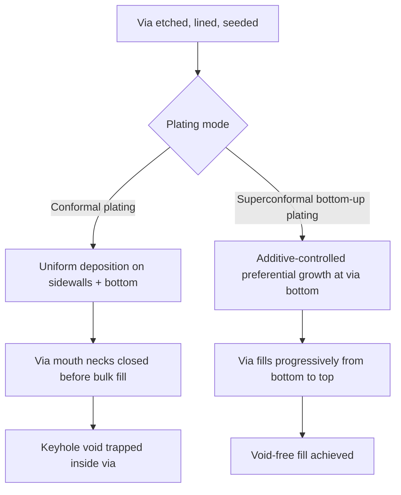

## TSV Copper Fill and Void-Free Electroplating Challenges

### Overview

Copper electroplating (electrochemical deposition, ECD) is the standard method for filling Through-Silicon Vias with conductive metal once the via has been etched (DRIE/Bosch) and lined with an insulating barrier and conductive seed layer. Achieving **void-free, bottom-up fill** in a high-aspect-ratio via (commonly 5:1 to 20:1) is one of the most difficult unit processes in 3D-IC integration, because uncontrolled plating tends to seal the via opening before the interior is fully filled, trapping voids that compromise electrical continuity and mechanical reliability.

### Why TSV Fill Is Difficult: The Bottom-Up Requirement

In a conventional planar copper damascene interconnect, plating uniformity across a shallow trench is comparatively easy to achieve. In a deep TSV, the plating chemistry must instead achieve **superconformal, bottom-up growth** — meaning the via must fill from the bottom toward the top, rather than plating conformally on all surfaces (top field, sidewalls, and bottom) at similar rates.

If plating proceeds conformally rather than bottom-up:

- Copper builds up on the sidewalls near the via opening faster than material can be transported to the via bottom
- The via mouth "pinches off" (necks closed) before the bulk of the via is filled
- This traps a **void or seam** inside the via, often called a **keyhole void**, since the cross-section resembles a keyhole shape with a wide top and narrow, incompletely filled interior

This failure mode is the central engineering problem that TSV plating chemistry and process design must overcome.

### Additive-Controlled Bottom-Up Fill Chemistry

Void-free TSV fill is achieved primarily through the plating bath's **organic additive package**, which modulates local deposition rate as a function of position within the via. Three additive classes work in concert:

#### Accelerators

- Typically sulfur-containing organic compounds (e.g., bis-(3-sulfopropyl) disulfide, SPS, and related derivatives)
- Adsorb onto the copper surface and locally **increase** the deposition rate
- Because of diffusion dynamics, accelerator concentration becomes relatively enriched at the via bottom as the via fills (the accelerator adsorbs and is consumed less quickly relative to its replenishment at the narrow, low-flux bottom region), reinforcing bottom-up growth as filling progresses

#### Suppressors

- Typically polyether-based polymers (e.g., polyethylene glycol, PEG) that often work in combination with a halide (commonly chloride) co-additive
- Adsorb preferentially at the via opening and top field region, where mass transport of the suppressor molecule is highest
- **Suppress** deposition rate at the top, preventing premature sidewall buildup and mouth closure

#### Levelers

- Typically nitrogen-containing organic compounds
- Preferentially adsorb at protruding or high-current-density regions (such as the via corners and any locally advancing "bump" in the fill front)
- Suppress deposition at these protrusions, promoting a flat, uniform fill front and helping planarize the copper surface as filling nears completion, reducing post-plating surface topography ("copper overburden" bumps directly above filled vias)

The net effect of accelerator-suppressor-leveler interaction is a **differential deposition rate gradient** along the via depth: fast growth at the bottom, suppressed growth at the top and sidewalls, and controlled leveling near completion — enabling the via to fill progressively from the bottom without the mouth closing first.

### Key Void and Defect Mechanisms

| Defect | Mechanism | Typical Cause |
| --- | --- | --- |
| Keyhole void | Via mouth necks closed before bulk fill completes | Excess conformal (non-bottom-up) plating; insufficient suppressor action at top |
| Seam/centerline void | Two fill fronts advancing from opposite sidewalls meet without fully coalescing | Non-uniform seed layer thickness on opposing sidewalls; asymmetric additive transport |
| Seed layer discontinuity void | Physical break or thinning in the sputtered seed layer, typically at via sidewall or corner | Poor sidewall step coverage from PVD seed deposition, often worsened by DRIE scalloping |
| Bottom void | Incomplete nucleation or poor seed continuity at the via floor | Seed layer shadowing effects during PVD in high-aspect-ratio vias |
| Surface pit/void after CMP exposure | Subsurface void exposed during post-plating chemical mechanical polishing | Any of the above, revealed rather than caused by CMP |

### Seed Layer Continuity as a Prerequisite

Void-free plating is only achievable if the underlying barrier/seed stack is itself continuous and conformal, since electroplating requires a continuous conductive path to sustain current distribution down the via:

- **Barrier layer** (commonly Ta/TaN or similar): prevents copper diffusion into silicon/dielectric; must be continuous to prevent copper contamination of the substrate
- **Seed layer** (thin sputtered copper, typically via PVD, sometimes supplemented by ALD or electroless seed repair for very high aspect ratios): provides the base conductive layer that plating current initiates from
- **[Inference]** Because physical vapor deposition is inherently line-of-sight, high-aspect-ratio vias are prone to seed layer thinning or discontinuity near the via bottom and along scalloped sidewalls; this is a widely recognized limitation of PVD seeding in industry literature, though the exact aspect ratio threshold at which discontinuity becomes problematic depends on the specific PVD tool geometry and via profile.
- Where PVD step coverage is insufficient, **ALD (atomic layer deposition)** seed or barrier layers, or an electroless copper seed repair step, are used to achieve continuous coverage at higher aspect ratios, at the cost of additional process complexity and cycle time.

### Current Density and Waveform Control

Plating current profile is a critical process lever independent of the additive chemistry:

- **Direct current (DC) plating**: simplest approach, but offers less fine control over the fill front evolution
- **Pulse plating / pulse-reverse plating**: alternates or periodically reverses current direction, allowing brief "de-plating" pulses that can dissolve weakly-bonded, poorly-positioned copper nuclei and redistribute additive concentration gradients, generally improving bottom-up fill uniformity and reducing void incidence
- **[Inference]** Pulse-reverse plating is commonly favored for the most demanding high-aspect-ratio TSV fills specifically because it allows independent control of forward (deposition) and reverse (dissolution) pulse parameters to manage additive replenishment kinetics, though optimal pulse parameters are highly bath- and geometry-specific and are typically proprietary process recipes.

### Void Detection and Metrology

Because internal voids are not visible from the wafer surface after plating, detection relies on specialized inspection techniques:

- **X-ray inspection**: non-destructive, can reveal larger voids in filled vias across the wafer without cross-sectioning
- **Cross-sectional SEM (scanning electron microscopy)**: destructive but provides direct, high-resolution confirmation of fill quality; typically used for process qualification rather than production monitoring
- **Acoustic microscopy (SAM)**: non-destructive technique sensitive to subsurface density discontinuities, usable for void screening
- **Electrical test**: post-fill resistance measurement across the via can indirectly flag major voids or discontinuities through anomalously high resistance, though it does not localize or size the void

### Reliability Implications of Voids

Voids in a filled TSV are not merely a yield-limiting defect at time of manufacture — they also degrade long-term reliability:

- **Electromigration susceptibility**: voids create localized current crowding around the void boundary, accelerating electromigration-driven copper migration and increasing long-term resistance drift or open-circuit failure risk
- **Thermal cycling stress concentration**: a void acts as a stress riser under thermo-mechanical cycling (driven by the CTE mismatch between copper, the SiO2 liner, and silicon), increasing the likelihood of crack initiation at the void boundary
- **[Inference]** Because these reliability effects compound over the operating lifetime of a packaged device rather than showing up immediately at manufacturing test, void-free fill is generally treated as a qualification-critical process parameter rather than a simple yield metric in production TSV flows.

### TSV Fill Cross-Section: Good vs. Void-Prone Fill (svg_diagram)

<svg xmlns="http://www.w3.org/2000/svg" viewBox="0 0 700 350">
<text x="350" y="30" text-anchor="middle" font-size="16" font-weight="bold" fill="#1a1a1a">Bottom-Up Fill vs. Keyhole Void Formation (svg_diagram)</text>

<text x="175" y="60" text-anchor="middle" font-size="13" font-weight="bold" fill="`#38761d`">Void-Free (Bottom-Up)</text>

<rect x="130" y="70" width="90" height="220" fill="none" stroke="#333" stroke-width="1.5" />

<rect x="133" y="73" width="84" height="214" fill="`#e69138`" />

<text x="175" y="310" text-anchor="middle" font-size="11" fill="#333">Fully dense Cu fill</text>

<text x="525" y="60" text-anchor="middle" font-size="13" font-weight="bold" fill="#c00">Keyhole Void</text>

<rect x="480" y="70" width="90" height="220" fill="none" stroke="#333" stroke-width="1.5" />

<rect x="483" y="73" width="15" height="214" fill="#e69138" />
<rect x="552" y="73" width="15" height="214" fill="#e69138" />

<rect x="483" y="73" width="84" height="18" fill="#e69138" />

<rect x="498" y="91" width="54" height="150" fill="#ffffff" stroke="#c00" stroke-width="1" stroke-dasharray="4,2" />
<text x="525" y="170" text-anchor="middle" font-size="10" fill="#c00">Void</text>

<rect x="498" y="241" width="54" height="46" fill="#e69138" />
<text x="525" y="310" text-anchor="middle" font-size="11" fill="#333">Mouth sealed early</text>

<line x1="175" y1="285" x2="175" y2="230" stroke="#38761d" stroke-width="2" marker-end="url(#arrow1)" />
<text x="200" y="255" font-size="9" fill="#38761d">fill</text>
</svg>

**Related Topics**

- Barrier and seed layer deposition techniques (PVD, ALD, electroless repair)
- TSV liner deposition and conformality over DRIE-scalloped sidewalls
- Electromigration and thermo-mechanical reliability in filled TSVs
- CMP (chemical mechanical polishing) of TSV copper overburden
- Pulse-reverse plating waveform optimization
- X-ray and acoustic microscopy void inspection techniques
- TSV keep-out zone (KOZ) and copper CTE-induced stress modeling
- Via-first, via-middle, via-last integration and their respective fill material constraints