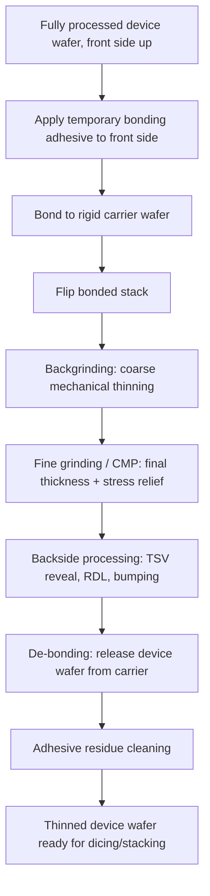

## Wafer Thinning, Temporary Bonding, and De-bonding

### Overview

Wafer thinning, temporary bonding, and de-bonding form an interdependent process sequence required to expose backside TSV structures, enable die stacking, and produce thin die for advanced packaging. Because device wafers are typically thinned from their as-fabricated thickness (roughly 700–775 µm for 200/300 mm wafers) down to tens of microns or less for 3D-IC stacking, the wafer becomes mechanically fragile and prone to warpage, cracking, and handling-induced yield loss. Temporary bonding to a rigid carrier wafer provides the mechanical support needed to survive thinning and subsequent backside processing, and de-bonding is the final step that releases the thinned device wafer from the carrier once processing is complete.

This three-stage sequence is a prerequisite for via-last backside TSV reveal, 3D die stacking, and thin-wafer fan-out packaging.

### Wafer Thinning

#### Backgrinding

The primary bulk material removal step, performed with a rotating diamond grinding wheel against the wafer backside while the wafer (bonded to its carrier, front side down) is held on a vacuum chuck.

- **Coarse grinding**: Removes the majority of excess silicon quickly using a coarser-grit wheel; introduces significant subsurface damage (microcracks, dislocations) into the remaining silicon
- **Fine grinding**: A subsequent pass with a finer-grit wheel reduces surface roughness and subsurface damage depth, bringing the wafer close to final target thickness
- Typical target thicknesses for 3D-IC/TSV reveal applications range from tens of microns down to below 50 µm, substantially thinner than typical single-die packaging (150–300 µm range), depending on application

#### Stress Relief and Damage Removal

Backgrinding alone leaves a damaged subsurface layer that reduces die strength and can serve as a crack initiation site. Additional steps address this:

- **Dry polishing / CMP (chemical mechanical polishing)**: Removes residual subsurface damage from grinding, improving die fracture strength
- **Wet etching (stress relief etch)**: A short isotropic wet chemical etch (commonly using acidic silicon etchants) can remove the final damaged layer and further reduce residual mechanical stress
- **[Inference]** The combination of fine grinding followed by CMP and/or stress-relief etch is generally applied together because grinding-induced subsurface damage is a well-documented driver of die cracking in thin-wafer handling, though exact process sequencing and etch depth are tool- and fab-specific.

#### Thickness Uniformity Requirements

For TSV reveal applications specifically, thickness uniformity across the wafer is critical: the backside etch or grind must expose the via bottom (or a landing pad) consistently across every die on the wafer. Excessive total thickness variation (TTV) risks either failing to expose the via in thicker regions or over-etching/over-grinding into functional structures in thinner regions.

### Temporary Bonding

#### Purpose

Temporary bonding provides the mechanical rigidity a thin, fragile device wafer cannot provide on its own, allowing it to survive:

- Backgrinding forces
- Backside via reveal etch
- Backside RDL (redistribution layer) lithography and metallization
- Backside bump formation
- Wafer handling and transport between process steps

#### Bonding Materials and Approaches

Several temporary bonding adhesive classes are used, each with different trade-offs in thermal stability, de-bond mechanism, and chemical resistance:

| Adhesive Type | De-bond Mechanism | Notes |
| --- | --- | --- |
| Thermoplastic adhesive | Heat-softening / mechanical slide-off | Reworkable via reheating; moderate thermal budget limit |
| UV-curable / UV-release adhesive | UV light exposure to reduce adhesion | Fast, clean release; carrier and/or adhesive must be UV-transparent |
| Laser-release (LDA — laser debonding adhesive) | Laser ablation of a release layer at bond interface | Enables release without significant heat or mechanical stress on the thin wafer; commonly used with glass or transparent carriers |
| Room-temperature mechanical/slide-off adhesive | Mechanical shear force at controlled temperature | Minimizes thermal exposure of the device wafer |

- **[Inference]** Selection among these adhesive types generally depends on the thermal budget of subsequent backside processing steps (e.g., higher-temperature backside RDL anneals favor more thermally stable adhesives) and on whether the carrier is silicon, glass, or another material compatible with the chosen release mechanism; specific adhesive-carrier pairings are process-vendor-dependent.

#### Carrier Wafer Selection

- **Silicon carriers**: CTE-matched to the device wafer, minimizing thermally induced bow/warp during subsequent processing, but opaque (incompatible with UV-release or laser-release schemes requiring optical transmission through the carrier)
- **Glass carriers**: Transparent, enabling UV-release and laser-release de-bonding; CTE mismatch relative to silicon must be managed to avoid warpage during thermal steps
- The carrier must also be mechanically rigid enough to prevent the thin bonded stack from flexing excessively during handling and processing equipment loading

#### Bond Uniformity and Voids

As with copper electroplating, achieving a uniform, void-free adhesive bondline is critical:

- Trapped air bubbles or adhesive thickness non-uniformity at the bond interface can cause localized wafer distortion during grinding, leading to thickness non-uniformity in the ground wafer
- Bond voids can also propagate stress concentration during backside processing steps, increasing crack risk

### De-bonding

Once all backside processing is complete, the thin device wafer must be released from its carrier without damaging the now-fragile device wafer.

#### De-bond Approaches (Matched to Bonding Mechanism)

- **Thermal slide-off**: Reheating the thermoplastic adhesive above its softening point and mechanically sliding the carrier away, typically while supporting the thin device wafer on a secondary support (e.g., a dicing tape frame or a second temporary carrier)
- **UV release**: Exposing the bond interface to UV light through a transparent carrier, degrading adhesion at the interface, followed by gentle mechanical separation
- **Laser release**: Scanning a laser through a transparent (typically glass) carrier to ablate a dedicated release layer at the bond interface, enabling clean separation with minimal mechanical or thermal stress transferred to the device wafer

#### Post-De-bond Handling

Because the device wafer is now unsupported and extremely thin, de-bonding is typically performed with the wafer immediately mounted on a secondary support structure (dicing tape on a frame, or transferred to a second carrier) to maintain handleability through subsequent dicing and die-stacking steps.

#### Adhesive Residue Removal

After mechanical separation, residual adhesive typically remains on the device wafer surface and must be removed:

- Solvent cleaning (wet chemistry matched to the specific adhesive chemistry)
- Plasma ashing/cleaning for residual organic material
- **[Inference]** Residue removal is a yield-sensitive step because incomplete cleaning can interfere with subsequent bump formation or die-attach processes; specific cleaning chemistries are matched to each adhesive vendor's formulation.

### Key Failure Modes Across the Sequence

| Stage | Failure Mode | Contributing Factor |
| --- | --- | --- |
| Bonding | Voids at bond interface | Trapped air, adhesive viscosity/dispense non-uniformity |
| Bonding | Bow/warp | CTE mismatch between carrier and device wafer under thermal steps |
| Thinning | Wafer cracking/chipping | Subsurface grinding damage, edge chipping |
| Thinning | Thickness non-uniformity | Grinding wheel wear, chuck flatness, bond voids |
| Backside processing | Thin wafer breakage during handling | Insufficient carrier rigidity, excessive thermal or mechanical stress |
| De-bonding | Device wafer cracking during release | Excessive mechanical force, incomplete adhesive softening/release |
| De-bonding | Residual adhesive contamination | Incomplete solvent/plasma cleaning |

### Process Flow Cross-Section (svg_diagram)

<svg xmlns="http://www.w3.org/2000/svg" viewBox="0 0 800 400">
<text x="400" y="30" text-anchor="middle" font-size="16" font-weight="bold" fill="#1a1a1a">Temporary Bond / Thin / De-bond Sequence (svg_diagram)</text>

<text x="120" y="65" text-anchor="middle" font-size="12" font-weight="bold">1. Bond to Carrier</text>

<rect x="60" y="80" width="120" height="20" fill="`#c9daf8`" stroke="`#0b5394`" />

<text x="120" y="94" text-anchor="middle" font-size="9">Device wafer (front)</text>

<rect x="60" y="100" width="120" height="10" fill="`#f9cb9c`" stroke="`#b45f06`" />

<rect x="60" y="110" width="120" height="30" fill="`#d9d9d9`" stroke="#666" />

<text x="120" y="128" text-anchor="middle" font-size="9">Carrier wafer</text>

<text x="330" y="65" text-anchor="middle" font-size="12" font-weight="bold">2. Flip + Thin</text>

<rect x="270" y="110" width="120" height="30" fill="`#d9d9d9`" stroke="#666" />

<text x="330" y="128" text-anchor="middle" font-size="9">Carrier wafer</text>

<rect x="270" y="100" width="120" height="10" fill="`#f9cb9c`" stroke="`#b45f06`" />

<rect x="270" y="90" width="120" height="10" fill="`#c9daf8`" stroke="`#0b5394`" />

<text x="330" y="98" text-anchor="middle" font-size="8">Device wafer (thinned)</text>

<line x1="270" y1="80" x2="390" y2="80" stroke="#c00" stroke-width="1" stroke-dasharray="3,2" />

<text x="330" y="76" text-anchor="middle" font-size="8" fill="#c00">Grind direction</text>

<text x="540" y="65" text-anchor="middle" font-size="12" font-weight="bold">3. Backside Process</text>

<rect x="480" y="110" width="120" height="30" fill="`#d9d9d9`" stroke="#666" />

<rect x="480" y="100" width="120" height="10" fill="`#f9cb9c`" stroke="`#b45f06`" />

<rect x="480" y="90" width="120" height="10" fill="`#c9daf8`" stroke="`#0b5394`" />

<rect x="490" y="82" width="10" height="8" fill="`#e69138`" />

<rect x="520" y="82" width="10" height="8" fill="`#e69138`" />

<rect x="550" y="82" width="10" height="8" fill="`#e69138`" />

<text x="540" y="76" text-anchor="middle" font-size="8">TSV reveal + RDL/bumps</text>

<text x="700" y="65" text-anchor="middle" font-size="12" font-weight="bold">4. De-bond</text>

<rect x="670" y="90" width="120" height="10" fill="`#c9daf8`" stroke="`#0b5394`" />

<rect x="670" y="100" width="120" height="5" fill="`#f9cb9c`" stroke="`#b45f06`" stroke-dasharray="2,2" />

<rect x="670" y="120" width="120" height="20" fill="`#d9d9d9`" stroke="#666" opacity="0.4" />

<line x1="670" y1="130" x2="790" y2="130" stroke="#c00" stroke-width="1.5" />

<text x="730" y="150" text-anchor="middle" font-size="8" fill="#c00">Release (thermal/UV/laser)</text>

<text x="400" y="200" text-anchor="middle" font-size="10" fill="#666">Legend: blue = device wafer, orange = adhesive, gray = carrier</text>

</svg>

**Related Topics**

- Via-last backside TSV reveal etch and landing pad alignment
- Backside redistribution layer (RDL) design and metallization
- Die/wafer thinning-induced warpage and stress modeling
- CMP and wet etch subsurface damage removal techniques
- Carrier wafer CTE matching for thin-wafer thermal budget management
- Dicing tape and frame handling for post-de-bond thin wafers
- 3D die stacking and wafer-to-wafer bonding alignment
- Chip-to-wafer and wafer-to-wafer hybrid bonding integration